# 用简单的英语解释 9 个关键的机器学习算法

> 原文：<https://www.freecodecamp.org/news/a-no-code-intro-to-the-9-most-important-machine-learning-algorithms-today/>

[机器学习](https://gum.co/pGjwd)正在改变世界。谷歌使用机器学习向用户建议搜索结果。网飞用它推荐电影给你看。脸书使用机器学习来建议你可能认识的人。

机器学习从未如此重要。同时，理解机器学习也很难。这个领域充满了行话。并且不同的 ML 算法的数量每年都在增长。

本文将向您介绍机器学习领域的基本概念。更具体地说，我们今天将讨论 9 个最重要的机器学习算法背后的基本概念。

# 推荐系统

### 什么是推荐系统？

[推荐系统](https://nickmccullum.com/python-machine-learning/introduction-recommendation-systems/)用于在数据集中寻找相似的条目。

也许现实世界中最常见的推荐例子存在于网飞内部。更具体地说，其视频流媒体服务将根据你已经看过的内容推荐电影和电视节目。

另一个推荐系统是脸书的“你可能认识的人”功能，它根据你现有的朋友列表为你推荐可能的朋友。

完全开发和部署的推荐系统非常复杂。它们也是资源密集型的。

### 推荐系统和线性代数

完全成熟的推荐系统需要深厚的线性代数背景才能从零开始构建。

正因为如此，如果你以前没有学过线性代数，这一节中可能会有你不理解的概念。

不过不要担心——sci kit-learn Python 库使得构建推荐系统变得非常容易。所以你不需要太多的线性代数背景来构建现实世界的推荐系统。

### 推荐系统是如何工作的？

有两种主要类型的推荐系统:

*   基于内容的推荐系统
*   协同过滤推荐系统

基于内容的推荐系统根据你已经使用过的项目的相似性给你推荐。它们的行为完全符合你对推荐系统的预期。

协同过滤推荐系统基于用户与项目交互的知识产生推荐。换句话说，他们利用群众的智慧。(因此其名称中有“协作”一词。)

在现实世界中，协同过滤推荐系统比基于内容的系统更常见。这主要是因为它们通常会给出更好的结果。一些从业者也发现协同过滤推荐系统更容易理解。

协同过滤推荐系统还有一个基于内容的系统所没有的独特功能。也就是说，它们有能力自己学习特征。

这意味着他们甚至可以根据你甚至没有告诉他们要考虑的属性来识别物品之间的相似之处。

协作过滤中有两个子类别:

*   基于记忆的协同过滤
*   基于模型的协同过滤

你不需要知道这两类协同过滤推荐系统的区别，就能在机器学习中取得成功。认识到存在多种类型就足够了。

### 部分总结

下面是我们在本教程中讨论的推荐系统的简要总结:

*   现实世界中推荐系统的例子
*   推荐系统的不同类型，以及协同过滤系统如何比基于内容的推荐系统更常用
*   推荐系统与线性代数的关系

# 线性回归

[线性回归](https://nickmccullum.com/python-machine-learning/linear-regression-python/)用于根据另一组`x`值预测某些`y`值。

### 线性回归的历史

线性回归是由弗朗西斯·高尔顿在 19 世纪创造的。

高尔顿是一位研究父母和孩子之间关系的科学家。更具体地说，高尔顿正在研究父亲的身高和儿子的身高之间的关系。

高尔顿的第一个发现是，儿子往往和父亲差不多高。这并不奇怪。

后来，高尔顿发现了更有趣的东西。儿子的身高 **比他自己的父亲 **更接近所有人的总体平均身高** 。**

高尔顿给这种现象起了个名字: ****回归**** 。具体来说，他说“一个父亲的儿子的身高倾向于回归(或趋向)平均身高”。

这导致了统计学和机器学习中的整个领域，称为回归。

### 线性回归的数学

在创建回归模型时，我们所要做的就是画一条尽可能靠近数据集中每一点的线。

这方面的典型例子是线性回归的“最小二乘法”，它只计算一条线在上下方向的接近程度。

这里有一个例子可以帮助说明这一点:

当您创建回归模型时，您的最终产品是一个可用于预测 x 值的 y 值的方程，而无需事先实际知道 y 值。

# 逻辑回归

[逻辑回归](https://nickmccullum.com/python-machine-learning/logistic-regression-python/)类似于线性回归，除了它不是计算数值`y`值，而是估计数据点属于哪个*类别*。

### 什么是逻辑回归？

逻辑回归是一种用于解决分类问题的机器学习模型。

下面是几个机器学习分类问题的例子:

*   垃圾邮件(垃圾邮件还是非垃圾邮件？)
*   车险理赔(核销还是维修？)
*   疾病诊断

每个分类问题恰好有两个类别，这使得它们成为**二元分类**问题的例子。

逻辑回归非常适合解决**二元分类**问题——我们只需分别给不同的类别分配一个值`0`和`1`。

为什么我们需要逻辑回归？因为不能用线性回归模型做二元分类预测。这不会导致很好的拟合，因为您试图通过只有两个可能值的数据集拟合一条直线。

此图可能有助于您理解为什么线性回归模型不适用于二元分类问题:

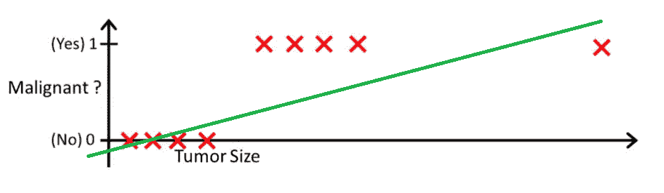

在该图中，`y-axis`代表肿瘤为恶性的可能性。相反，值`1-y`代表肿瘤不是恶性的概率。如您所见，对于数据集中的大多数观察值，线性回归模型在预测这种概率方面表现不佳。

这就是为什么逻辑回归模型是有用的。它们有一个最佳拟合线，这使得它们更适合预测分类数据。

下面是一个使用相同训练数据比较线性回归模型和逻辑回归模型的示例:

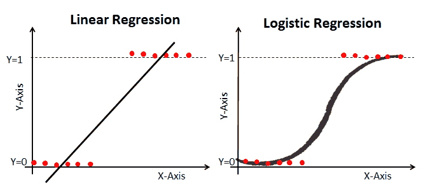

### Sigmoid 函数

逻辑回归模型曲线弯曲的原因是因为它不是使用线性方程计算的。相反，逻辑回归模型是使用 Sigmoid 函数(也称为逻辑函数，因为它用于逻辑回归)构建的。

你不需要记住 [Sigmoid 函数](https://en.wikipedia.org/wiki/Sigmoid_function)就能在机器学习中取得成功。也就是说，对它的外观有一些了解是有用的。

该等式如下所示:

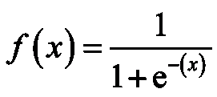

值得理解的 Sigmoid 函数的主要特征是:无论你传递什么值给它，它总是产生一个介于 0 和 1 之间的输出。

### 使用逻辑回归模型进行预测

要使用线性回归模型进行预测，通常需要指定一个截止点。这个截止点通常是`0.5`。

让我们用之前图像中的癌症诊断例子来看看这个原理在实践中的应用。如果逻辑回归模型输出低于 0.5 的值，那么该数据点被分类为非恶性肿瘤。类似地，如果 Sigmoid 函数输出高于 0.5 的值，则肿瘤将被分类为恶性。

### 使用混淆矩阵衡量逻辑回归性能

混淆矩阵可以用作机器学习中比较真阳性、真阴性、假阳性和假阴性的工具。

当用于测量逻辑回归模型的性能时，混淆矩阵特别有用。以下是我们如何使用混淆矩阵的示例:

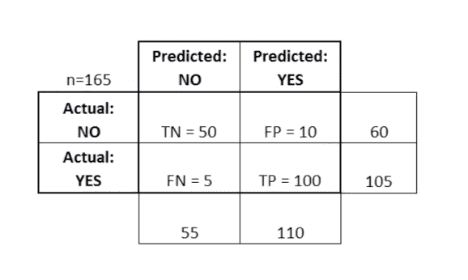

In this diagram TN stands for "True Negative" and FN stands for "False Negative". FP stands for "False Positive" and TP stands for "True Positive".

混淆矩阵有助于评估您的模型在混淆矩阵的特定象限中是否特别弱。例如，它可能有异常高的误报率。

在某些应用程序中，确保您的模型在混乱矩阵的一个特别危险的区域中运行良好也是很有帮助的。

例如，在这个癌症示例中，您需要非常确定您的模型没有非常高的假阴性率，因为这将表明某人患有恶性肿瘤，而您错误地将其归类为非恶性肿瘤。

### 部分总结

在本节中，您将首次接触到逻辑回归机器学习模型。

以下是您对逻辑回归所学内容的简要总结:

*   适合使用逻辑回归模型解决的分类问题的类型
*   逻辑函数(也称为 Sigmoid 函数)总是输出 0 到 1 之间的值
*   如何使用分界点通过逻辑回归机器学习模型进行预测
*   为什么混淆矩阵有助于衡量逻辑回归模型的性能

# k-最近邻

[K-最近邻](https://nickmccullum.com/python-machine-learning/k-nearest-neighbors-python/)算法可以帮助你解决有两个以上类别的分类问题。

### K 近邻算法是什么？

K-最近邻算法是一种基于简单原理的分类算法。其实原理很简单，通过例子最好理解。

假设你有足球运动员和篮球运动员的身高和体重数据。K-最近邻算法可用于预测新运动员是足球运动员还是篮球运动员。

为此，K-最近邻算法识别最接近新观察值的`K`数据点。

下图显示了这一点，K 值为`3`:

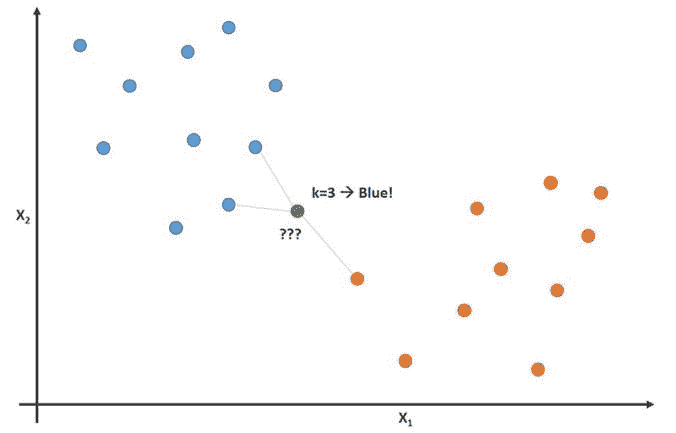

在此图像中，足球运动员被标记为蓝色数据点，篮球运动员被标记为橙色点。我们试图分类的数据点被标记为绿色。

由于与新数据点最接近的数据点中的大多数(3 个中的 2 个)是蓝色足球运动员，那么 K-最近邻算法将预测新数据点也是足球运动员。

### 构建 K-最近邻算法的步骤

构建 K-最近邻算法的一般步骤如下:

1.  存储所有数据
2.  计算从新数据点`x`到数据集中所有其他点的[欧几里德距离](https://en.wikipedia.org/wiki/Euclidean_distance)
3.  从`x`开始，按照距离增加的顺序对数据集中的点进行排序
4.  使用与大多数最接近`x`的`K`数据点相同的类别进行预测

### K-最近邻算法中 K 的重要性

虽然从一开始可能并不明显，但是在 K-最近邻算法中改变`K`的值将会改变新点被分配到的类别。

更具体地说，具有非常低的`K`值将导致您的模型完美地预测您的训练数据，而糟糕地预测您的测试数据。同样，过高的`K`值会使模型变得不必要的复杂。

下面的可视化很好地说明了这一点:

### K-最近邻算法的优缺点

在结束对 K-最近邻算法的介绍之前，我想简要讨论一下使用这种模型的利弊。

以下是 K-最近邻算法的一些主要优势:

*   该算法简单易懂
*   在新的训练数据上训练模型是微不足道的
*   在分类问题中，它可以处理任意数量的类别
*   很容易向数据集添加更多的数据
*   该模型只接受两个参数:`K`和您想要使用的距离度量(通常是欧几里德距离)

同样，这种算法也有一些主要缺点:

*   进行预测的计算成本很高，因为您需要对整个数据集进行排序
*   它不能很好地处理分类特征

### 部分总结

以下是您刚刚了解的 k-最近邻算法的简要总结:

*   K-最近邻算法可以解决的分类问题示例(足球运动员与篮球运动员)
*   K-最近邻如何使用相邻数据点的欧几里德距离来预测新数据点属于哪个类别
*   为什么`K`的值对预测很重要
*   使用 K-最近邻算法的利弊

# 决策树和随机森林

[决策树和随机森林](https://nickmccullum.com/python-machine-learning/decision-trees-random-forests-python/)都是树方法的例子。

更具体地说，决策树是机器学习模型，用于通过逐个循环数据集中的每个特征来进行预测。随机森林是决策树的集合，它使用数据集中特征的随机顺序。

### 什么是树方法？

在我们深入研究机器学习中的树方法的理论基础之前，从一个例子开始是有帮助的。

想象你每周一打篮球。而且，你总是邀请同一个朋友来和你一起玩。

有时候朋友真的会来。有时候不会。

决定是否来取决于许多因素，如天气、温度、风和疲劳。你开始注意到这些特征，并开始跟踪它们以及你的朋友是否玩的决定。

你可以用这些数据来预测你的朋友是否会来打篮球。您可以使用的一种技术是决策树。下面是这个决策树的样子:

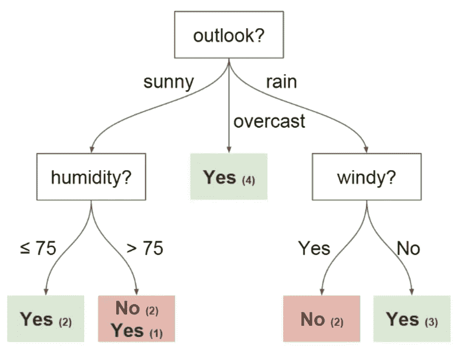

每个决策树都有两种元素:

*   `Nodes`:树根据某个属性值分裂的位置
*   `Edges`:拆分到下一个节点的结果

你可以在上图中看到有`outlook`、`humidity`和`windy`的节点。这些属性的每个潜在值都有一个优势。

在继续之前，您应该了解另外两个决策树术语:

*   `Root`:执行第一次拆分的节点
*   `Leaves`:预测最终结果的终端节点

现在，您对决策树有了基本的了解。我们将在下一节学习如何从头开始构建决策树。

### 如何从零开始构建决策树

构建决策树比你想象的要难。这是因为决定在哪些特征上分割你的数据(这是一个属于[熵](https://en.wikipedia.org/wiki/Entropy)和[信息增益](https://machinelearningmastery.com/information-gain-and-mutual-information/#:~:text=Information%20gain%20is%20the%20reduction,before%20and%20after%20a%20transformation.)领域的话题)是一个数学上复杂的问题。

为了解决这个问题，机器学习实践者通常使用许多决策树，使用随机选择的特征样本作为分裂。

换句话说，在每次分割时，为每棵树选择一个新的随机特征样本。这种技术叫做**随机森林**。

一般来说，从业者通常选择特征随机样本的大小(表示为`m`)作为数据集中特征总数的平方根(表示为`p`)。简单来说，`m`就是`p`的平方根，然后从`m`中随机选取一个具体的特征。

如果现在这还不完全有意义，不要担心。当你最终建立起你的第一个随机森林模型时，这一点会更加清楚。

### 使用随机森林的好处

想象一下，你正在处理的数据集有一个非常强的特征。换句话说，数据集有一个特征比数据集中的其他特征更能预测最终结果。

如果您正在手动构建决策树，那么使用这个特性作为决策树的顶部分割是有意义的。这意味着你会有多棵预测高度相关的树。

我们希望避免这种情况，因为取高度相关变量的平均值不会显著减少方差。通过为随机森林中的每棵树随机选择特征，这些树变得去相关，并且结果模型的方差减小。这种去相关是使用随机森林优于手工决策树的主要优势

### 部分总结

下面是您在本文中学到的决策树和随机森林的简要总结:

*   一个可以用决策树预测的问题的例子
*   决策树的元素:`nodes`、`edges`、`roots`和`leaves`
*   如何随机抽取决策树特征的样本来构建一个随机森林
*   为什么使用随机森林去相关变量有助于减少最终模型的方差

# 支持向量机

[支持向量机](https://nickmccullum.com/python-machine-learning/support-vector-machines-python/)是一种分类算法(尽管从技术上来说，它们也可以用来解决回归问题)，它通过对类别之间最宽的间隙进行切片，将数据集划分为不同的类别。这个概念将在一会儿通过可视化变得更加清晰。

### 什么是支持向量机？

[支持向量机](https://en.wikipedia.org/wiki/Support_vector_machine)——简称 SVMs 是有监督的机器学习模型，具有相关的学习算法，可以分析数据和识别模式。

支持向量机既可以用于分类问题，也可以用于回归问题。在本文中，我们将特别关注使用支持向量机来解决分类问题。

### 支持向量机是如何工作的？

让我们深入了解支持向量机的工作原理。

给定一组训练示例(每个示例都被标记为属于两个类别之一)，支持向量机训练算法会构建一个模型。这个模型将新的例子分配到两个类别中的一个。这使得支持向量机成为非概率二元线性分类器。

SVM 利用几何学进行分类预测。

更具体地说，SVM 模型将数据点映射为空间中的点，并划分单独的类别，以便通过尽可能宽的开放间隙来划分它们。基于新数据点属于间隙的哪一侧，新数据点被预测属于一个类别。

这里有一个可视化示例，可以帮助您理解支持向量机背后的直觉:

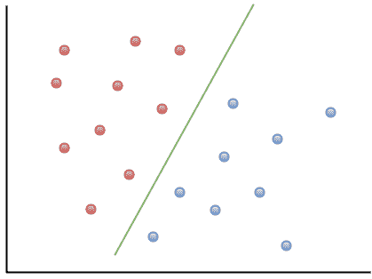

如您所见，如果一个新的数据点落在绿线的左侧，它将被标记为红色类别。类似地，如果一个新的数据点落在绿线的右侧，它将被标记为属于蓝色类别。

这条绿线被称为**超平面**，这是支持向量机算法的一个重要词汇。

让我们来看看支持向量机的一种不同的视觉表示:

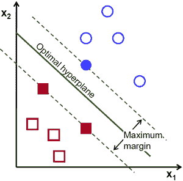

在该图中，超平面被标记为**最优超平面**。支持向量机理论将**最优超平面**定义为最大化每个类别的最近数据点之间的间隔的超平面。

如您所见，边缘线实际上接触了三个数据点——两个来自红色类别，一个来自蓝色类别。这些接触边缘线的数据点被称为**支持向量**，这也是支持向量机得名的原因。

### 部分总结

以下是对您刚刚了解的支持向量机的简要总结:

*   支持向量机是监督机器学习算法的一个例子
*   支持向量机可用于解决分类和回归问题
*   支持向量机如何使用最大化数据集中类别之间的间隔的**超平面**来分类数据点
*   支持向量机中接触边缘线的数据点称为**支持向量**。这些数据点就是支持向量机名称的来源。

# k 均值聚类

[K-means 聚类](https://nickmccullum.com/python-machine-learning/k-means-clustering-python/)是一种机器学习算法，可以让你识别数据集中相似数据的片段。

### 什么是 K-Means 聚类？

K-means 聚类是一种无监督的机器学习算法。

这意味着它会接收未标记的数据，并尝试在您的数据中将相似的观察值聚类在一起。

K-means 聚类算法对于解决现实世界的问题非常有用。以下是这种机器学习模型的几个用例:

*   营销团队的客户细分
*   文件分类
*   亚马逊、UPS 或联邦快递等公司的递送路线优化
*   识别并应对城市中的犯罪中心
*   专业体育分析
*   预测和预防网络犯罪

K 均值聚类算法的主要目标是将数据集分成不同的组，使得每个组内的观察值彼此相似。

下面是这种情况在实践中的直观表现:

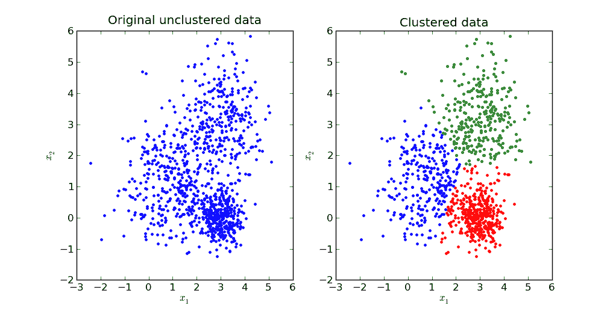

我们将在本教程的下一节探讨 K-means 聚类背后的数学原理。

### K-Means 聚类算法是如何工作的？

运行 K-means 聚类算法的第一步是选择要将数据分成的聚类数。这个聚类数就是算法名称中引用的`K`值。

在 K-means 聚类算法中选择`K`值是一个重要的选择。我们将在本文后面更多地讨论如何选择一个合适的值。

接下来，您必须将数据集中的每个点随机分配给一个随机聚类。这给出了我们的初始赋值，然后对其运行下面的迭代，直到集群停止变化:

*   通过取每个聚类内的点的平均向量来计算该聚类的质心
*   将每个数据点重新分配给质心最近的聚类

下面是一个动画，展示了对于一个具有`3`的`K`值的 K-means 聚类算法，这是如何工作的。你可以看到每个星团的质心由一个黑色的`+`字符代表。

如您所见，这种迭代一直持续到聚类停止变化——这意味着数据点不再被分配给新的聚类。

### 为 K 均值聚类算法选择合适的 K 值

为 K-means 聚类算法选择一个合适的`K`值实际上是相当困难的。选择“最佳”`K`值没有“正确”的答案。

机器学习从业者经常使用的一种方法叫做**肘法**。

要使用 elbow 方法，首先需要为一组`K`值计算 K 均值聚类算法的误差平方和(SSE)。K 均值聚类算法中的 SSE 定义为聚类中每个数据点与该聚类的质心之间的平方距离之和。

作为这个步骤的一个例子，您可以为`2`、`4`、`6`、`8`和`10`的`K`值计算 SSE。

接下来，您将需要针对这些不同的`K`值生成 SSE 图。您将会看到，随着`K`值的增加，误差会减小。

这是有意义的——在一个数据集中创建的类别越多，每个数据点就越有可能接近其特定分类的中心。

也就是说，肘方法背后的想法是选择一个值`K`,在这个值上上证综指突然放缓其下跌速度。这种突然的下降在图中产生了一个`elbow`。

作为一个例子，这里有一个 SSE 对`K`的图表。在这种情况下，肘方法建议使用大约为`6`的`K`值。

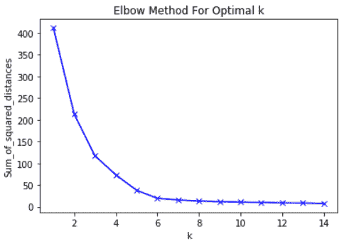

重要的是，`6`只是对`K`的一个估计值。K-means 聚类算法中不存在“最佳”`K`值。正如机器学习领域的许多事情一样，这是一个高度依赖于情况的决定。

### 部分总结

以下是您在本文中学到的内容的简要总结:

*   K-means 聚类算法能够解决的无监督机器学习问题的例子
*   K 均值聚类算法的基本原理是什么
*   K 均值聚类算法的工作原理
*   在 K-means 聚类模型中如何用肘方法选择合适的值

# 主成分分析

[主成分分析](https://nickmccullum.com/python-machine-learning/principal-component-analysis-python/)用于将多特征数据集转换为具有较少特征的转换数据集，其中每个新特征都是先前存在的特征的线性组合。这个转换后的数据集旨在以更简单的方式解释原始数据集的大部分差异。

### 什么是主成分分析？

主成分分析是一种机器学习技术，用于检查变量集之间的相互关系。

换句话说，主成分分析研究多组变量，以确定这些变量的潜在结构。

主成分分析有时也叫 ****因子分析**** 。

基于这种描述，你可能会认为主成分分析与线性回归非常相似。

事实并非如此。事实上，这两种技术有一些重要的区别。

### 线性回归和主成分分析的区别

线性回归通过数据集确定最佳拟合线。主成分分析为数据集确定最佳拟合的几条正交线。

如果你对术语**正交**不熟悉，它仅仅意味着这些线彼此成直角(90 度)——就像地图上的东、南、西、北。

让我们考虑一个例子来帮助您更好地理解这一点。

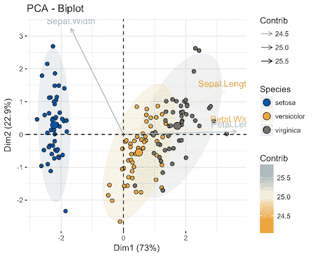

看看这个图像中的轴标签。

在此图像中，x 轴主成分代表数据集中 73%的方差。y 轴主成分解释了数据集中约 23%的方差。

这意味着数据集中有 4%的差异仍然无法解释。您可以通过在分析中添加更多的主成分来进一步减少这个数字。

### 部分总结

以下是您在本教程中学到的主成分分析的简要总结:

*   主成分分析试图找到决定数据组可变性的正交因素
*   主成分分析和线性回归的区别
*   当在数据集内部可视化时，正交主成分看起来像什么
*   添加更多的主成分可以帮助你解释数据集中更多的差异