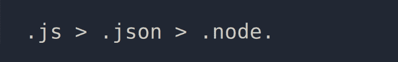
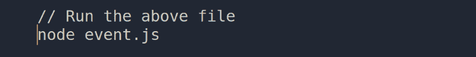

# 如何不使用外部包创建 Node.js web 应用程序

> 原文：<https://www.freecodecamp.org/news/a-no-frills-guide-to-node-js-how-to-create-a-node-js-web-app-without-external-packages-a7b480b966d2/>

阿比纳夫·潘迪

# 如何不使用外部包创建 Node.js web 应用程序

#### 没有框架，没有 NPM，没有 Package.json，没有虚饰

在这篇文章中，我们将**通过创建一个没有任何外部包的 Node.js web 应用程序来深入了解 Node.js 的基础知识**。我们将涵盖核心概念，如**流、事件、异常、HTTP** 等。


A Look Inside Node.js Fundamentals

目前，每当我们说我们将在 Node.js 中实现服务时，大多数时候我们将使用 Express 或其他第三方库来实现我们的功能。我不会说这样做有什么坏处。这些库提供了对冗余概念的必要抽象，使我们变得高效。

但是通过更大的抽象，你的程序的底层逻辑对你是隐藏的。因此，我们无法清楚地了解我们的业务逻辑如何与 Node.js 交互。

但是正如 Node.js 的创始人 Ryan Dahl 所说:

> 你永远无法理解一切。但是，你应该努力去理解这个系统。

我们将推动自己完整地形成这个清晰的画面。

所以，让我们构建一个原始的 HTTP Node.js 应用程序，没有框架，没有 NPM，也没有 Package.json

我们将构建一个应用程序，它将:

1.  **导入**必要的**模块**
2.  创建一个**服务器实例**
3.  **将监听器**附加到服务器对象的`**request**`事件
4.  **解析请求体**和**头**
5.  **向客户端发送响应**。
6.  **处理请求和响应流中的错误事件**。

但是，这里有一个问题；)

我们将从头开始做这一切

1.  **一个终端，**和
2.  一名编辑。

是啊！！我们将使用**nobody others 的框架**、**nobody others 的库**只是**原始 JavaScript** 和核心 **Node.js 运行时**。

让我们开始吧！

在创建 HTTP 服务器之前，让我们先弄清楚 Node.js 中 HTTP 模块的必要概念。

**什么是 HTTP？**

Node.js 是一个内置模块，允许通过 HTTP 协议进行客户端-服务器通信。该模块提供了一个接口，用于创建可以与其他 HTTP 服务器或客户端通信的 HTTP 客户端或 HTTP 服务器。

并且为了使这种通信空间有效，一个`http`模块使用流接口提供数据的**流**。由于 stream 以块的形式传递数据，这意味着 Node.js 不会在内存中一次性缓冲整个请求或响应。我们很快就会来到 **streams** 。

**因此，对于我们的应用程序，我们将使用这个`http`接口来创建一个 HTTP 服务器，该服务器将侦听特定的端口并将数据返回给用户。**

#### 导入 HTTP 模块

要使用`http`服务器或客户端，您必须需要`http`模块。

```
var http = require(“http”);
```

现在让我们看看上面这行代码是如何工作的:

为了在运行时加载特定模块的实例，Node.js 为我们提供了一个全局可访问的`require`变量。我们使用全局定义`require`变量，并告诉节点加载`http`模块(通过将`'http'`作为唯一的参数传递给`require`函数调用)。

有一个其他全局可用的 Node.js 对象的列表，您可以在节点 REPL 中签出(通过按两次<tab>)。</tab>


Globally defined N**ode.js** and **JavaScript** variables

但是对我们来说最重要的两个是:

1.  **需要**模块
2.  **模块**(在下一篇文章中有更深入的解释)

(我们不需要`require(‘require’)`或`require (‘module’)`，因为它们是全局的)。

**`require`如何工作？**

在运行时，当 Node.js 调用一个`require`调用(require('。/path/to/fileName ')，它搜索与 require 函数调用的唯一参数中提供的名称相同的文件。

一旦文件名匹配，Node.js 就会检查 3 种类型的扩展名:

1.  `.js` — Node.js 在指定路径查找“fileName.js”作为 js 脚本加载。
2.  `.json` —如果 Node.js 在指定路径找到“filename.json”文件，它将加载一个文件名对应于 json 文件中“main”键值的文件。
3.  `.node` — Node.js 在指定路径加载名为 fileName.node 的二进制插件。



**The extension are loaded in order of .js > .json >** .node.

#### 创建一个**服务器实例**

现在我们已经包含了`http`模块，我们需要创建一个 HTTP web 服务器对象。这可以通过使用`http`模块上的`createServer`方法来完成。

对于`createServer`方法，我们传递一个回调函数，每次服务器收到请求时都会调用这个函数。

这个`createServer`方法返回一个我们存储在变量`app`中的服务器对象。这个服务器对象是一个事件发射器。

好的，等等，什么是 T0？

让我们深入了解一下名为`event`和`emitter`的对象。

许多 Node.js 核心 API 都是围绕事件驱动的架构构建的。某些类型的对象(称为“发射器”)可以通过发射任何“命名”事件来调用某些函数(“监听器”)。

让我们看一个例子来掌握它的窍门。



输出: `Called namedEvent in myEventObject’s attached listner`

**解释**

在上面的例子中，我们看到`namedEvent`附带了一个监听器(一个函数)。所谓附加，是指侦听器在听到指定的事件后被调用。因此，当发射器对象发出`namedEvent`时，监听器在控制台屏幕上打印输出。

除了附加监听器之外，`eventEmitter`对象还提供了许多其他属性和功能，例如

*   您可以获得附加到命名事件的侦听器的总数，或者
*   您还可以删除附加到事件的侦听器。

关于 Node.js 中事件的更多详细信息，可以参考 [**Node.js 官方文档**](https://nodejs.org/api/events.html#events_eventemitter_defaultmaxlisteners)

**回到我们的例子…**

我们的 web 服务器对象也像所有其他实现事件发射器接口的发射器对象一样。它还发出不同种类的命名事件。

其中一些如下:

1.  `connect` —由 HTTP 客户端的所有“连接”请求引发。
2.  `connection` —建立新的 TCP 流时发出。提供对已建立的套接字的访问。
3.  `request` —为来自客户端的每个请求发出(我们将在这里监听)。
4.  `upgrade` —每次客户端请求升级协议(可以是 HTTP 版本)时发出。

您可以从官方 Node.js 文档中获得我们的 web 服务器发出的事件的完整列表。

#### 侦听请求事件

现在，由于我们的服务器需要监听传入的请求，我们将监听 HTTP 服务器的`request`事件。

代码示例:

在第 3 行中，附加了一个监听器函数来监听我们的服务器对象上的所有`**request**`事件。

`request`事件为监听器函数提供了两个参数，它们是:

1.  **请求**—http . incoming message 对象的实例和
2.  **响应**—http 的一个实例。ServerResponse 对象。

这些`request`和`response`对象具有分别从`http.incomingMessage`和`http.ServerResponse`类继承的属性和方法。

#### **解析请求体**和**头**

既然我们已经可以访问`request`和`response`对象…

关于传入的请求，您可能想知道的前几件事是 **URL、方法和头**。Node.js 通过**将它们作为属性**附加到`request`对象(作为第一个参数传递给`request`事件的监听器)上，使这变得非常容易。

您可以对请求对象进行解结构，以使它们如下所示:

`const {headers, url, method } = request;`

`headers`在请求中作为一个独立的对象出现在`request`对象中(秘密:它们都是小写的)。

在查看了`http`方法之后，对于 PUT 或 POST 请求，我们有兴趣查看在请求体中发送的`data`。

但是要从请求体中提取数据，我们需要知道关于请求对象的几个关键点。

**请求对象——可读流**

传递给处理程序的`request`对象也实现了可读的流接口。这意味着我们的`request`对象是一个流，它可以被**监听**或**通过管道**传送到其他地方以获取流入其中的数据。我们还将通过监听`request`流的`data`和`end`事件，从该流中获取数据。

不同种类的数据可能被传递到我们的服务器，但是为了简单起见，我们将只传递主体中的字符串。

为了使用这些数据，我们需要**解析**它，所以我们将使用可读流的`data`和`end`事件，这是由我们前面提到的`request`对象实现的。

在每个`data`事件中，**可读流将数据作为缓冲块传递。**我们将在一个空数组中追加所有的块。在`end`事件中，我们将**连接并字符串化数组**以获得累积体。

这是到目前为止的代码:

#### **向客户端发送响应。**

从 HTTP 请求中收集数据后，我们需要给客户机一个适当的响应。但是由于`request`对象只实现了一个可读的流，**我们需要一个可写的流，在那里我们可以写出我们的响应。**

**响应对象——可写流**

为此，Node.js 为我们提供了第二个参数，即`request`事件监听器的`response`对象。

通过使用`response`对象，我们可以设置 HTTP 状态代码、设置头，并在响应对象的写流中写入内容。

尽管如果没有显式设置响应代码，Node.js 本身会将其设置为 200。但是随着复杂性的增加，您会想要设置 HTTP 响应的期望的`statusCode`。

**隐式表头设置**

您可以使用`setHeader(name, value)`、`getHeader(name)`和`removeHeader(name)` API 对响应进行**设置、获取**和**移除**报头。

代码示例:

当使用上面的`setHeader()`方法设置头时，我们依赖 Node.js 来在发送响应体之前**隐式地**设置响应头。

为了让**显式地设置标题**和状态码**，**我们有一个`response.writeHead()`方法。

代码示例:

在显式设置头部时，我们应该记住在 HTTP 响应中头部在主体之前。也就是说，在向响应体写入任何内容之前，我们应该更喜欢使用`writeHead()`方法。

现在让我们看看如何将数据写入响应。

由于响应对象是一个可写的流对象，我们只需要使用 **write stream** 方法将数据块写入 HTTP 响应对象。

代码示例:

在写入响应流之后，我们需要**关闭流**，以便 Node.js 知道是时候将响应发送回客户端了。

`.end()`方法允许我们**关闭**在请求到达我们的服务器时建立的 **HTTP** **连接**。`end()`方法还接受在关闭连接之前要写入的最后一个字符串。

**如果我们不使用 end 方法，Node.js 会将数据写入写流并等待…**

…直到服务器对象**中的默认**超时。**也就是说，对于任何请求， **Node.js 在关闭连接**之前只等待固定的时间**(在服务器对象中指定)**。并且一旦连接被关闭(手动使用`end()`或者超时过期)，**节点立即释放所有分配的资源**。**

您可以使用`server.setTimeout([msecs][, callback])`设置或更改超时。

要禁用超时，可以将超时值设置为 0。但是由于超时是在形成新连接时分配的，**超时将只为即将到来的新连接**更新。

现在我们已经写好了我们的响应，我们的服务器应该工作正常。

#### 但是，当我们的服务器遇到异常时会发生什么呢？

我们需要听到`request`和`response`流的`error`事件。每次出现异常时都会引发一个`error`事件。你可以试着避开它，但它们确实来了，我们必须抓住它们并妥善处理。

但是怎么做呢？

我们将通过将错误处理程序附加到`request`和`response`流的`error`事件来处理它们**。**

**解释**

在这里，我们捕获`request`和`response`流的所有`error`事件，并将它们记录到控制台中。您也可以在生产环境中使用`util`代替`console`(尽管在生产环境中建议正确检查错误)。

现在让我们看一下到目前为止我们拥有的代码样本。

好的，我们的服务器现在可以做以下事情:

1.  **导入**必要的**模块**
2.  创建一个**服务器实例**
3.  **将监听器**附加到服务器对象的`**request**`事件
4.  **解析请求体**和**头**
5.  **将响应**写入响应流
6.  **处理请求和响应流中的错误事件**。

到目前为止，我们已经使我们的服务器对象能够接受新的连接，但是我们还没有告诉它在哪里监听新的连接。也就是说，这个服务器对象还需要绑定到一个特定的端口，这样我们的服务器就可以访问该端口上的所有传入请求。

为此，我们将使用 HTTP 服务器对象`.listen(PORT , CB).`的`.listen`方法

@params PORT 是我们希望服务器监听的端口号。

一旦服务器开始监听，就会调用@params 回调。

代码示例:

现在，我们的服务器已经准备好接收请求了。

让我们运行 Node.js 应用程序:

```
node app.js
```

并在终端上使用以下 curl 来访问我们的服务器:

```
curl -d “Hello World” -H “Content-Type: text” -X POST http://localhost:8008
```

呜哇！！恭喜你，你已经创建了一个没有任何外部包的 Node.js app。

你呆了这么久，真是太值得称赞了。

如果你愿意像这样学习更多关于 Node.js 核心的知识，那么请让我知道，把掌声计数增加到 50。

在接下来的文章中，我们将继续在这个基础应用的基础上进行构建，并添加其他关键特性**路由、中间件、错误处理**等。通过在 Medium 上跟随我获得通知。

我已经尽力让这篇文章尽可能的完整。如果你有任何可以使它变得更好的想法，请在你的宝贵意见中提及。

你可以通过 [gmail](http://abhinavpandey.1996@gmail.com) 联系我，或者在这里发微博给我[。](https://twitter.com/Heisabhinav)

非常感谢你的爱！原谅我的错误，你是一个很好的观众。


Congratulations!