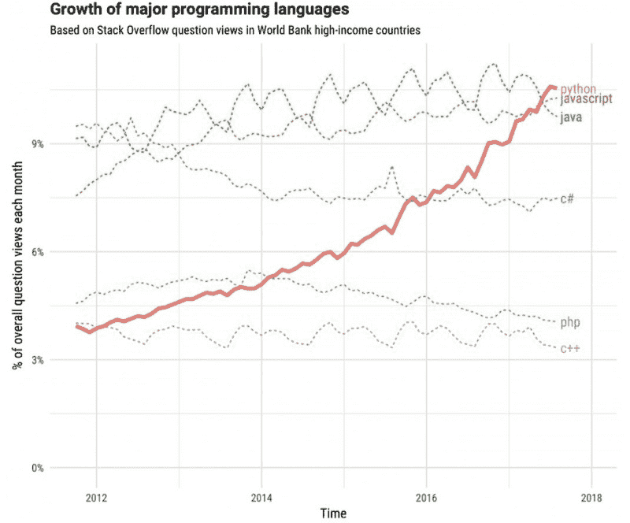
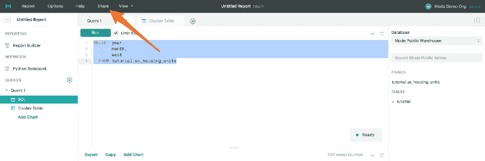
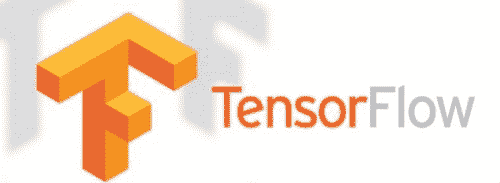
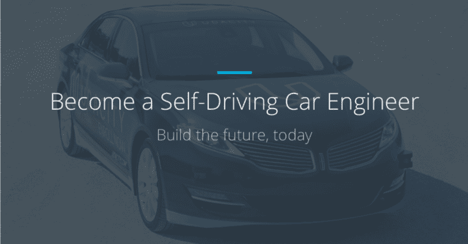
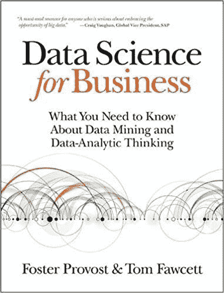

# 自学数据科学:我在 Jet.com 获得一份分析工作的学习途径

> 原文：<https://www.freecodecamp.org/news/a-path-for-you-to-learn-analytics-and-data-skills-bd48ccde7325/>

丹·斯特恩

# 自学数据科学:我在 Jet.com 获得一份分析工作的学习途径

Image courtesy of [Unsplash.com](http://unsplash.com)

你如何从零编程技能到技术或分析领域的工作？

如果你对学习这些技能感兴趣，不管是为了娱乐还是为了改变职业，最好的方法是什么？

存在无数的最佳在线课程列表，但是你如何在这些噪音中打造你自己的学习路径呢？

我个人从未想过我会学到任何编程、数据分析、机器学习或一般技术方面的实用技能。作为一名金融专业的学生，我一直以为自己会是“生意人”然而，不知何故，我自学了 **Python** 和 **SQL、**，并发现自己在[Jet.com、](http://jet.com)从事分析工作，每天都在使用这些语言中的一种。

你可能会问，为什么是 Python 和 SQL？

Python 是发展最快的编程语言，这是有充分理由的。它有数量惊人的库，可以用于机器学习应用程序、数据分析、可视化、web 应用程序、API 集成等等。另外，这是最容易掌握和学习的语言之一。至于 SQL，数据库为技术公司提供动力，SQL 允许您更好地理解、探索和利用收集到的数据。

Courtesy of [Fossbytes.com](https://fossbytes.com/python-fastest-growing-programming-language/)

下面，我概述了我学习这些将我带入分析领域的语言的过程。明确地说，这条道路极具挑战性；我度过了无数个夜晚，感到沮丧和困惑。很多个夜晚，我只想认输，满足于做一个生意人。

但是你的**动力**仍然是推动你穿越不可避免要面对的障碍的关键。无论您是想进入数据分析或数据科学类型的角色，还是只想为了乐趣而更好地掌握编程和技术(这确实很有趣！)，如果你想真正学习这些技能，你必须弄清楚如何保持积极性和纪律性。

对我来说，几乎每天都留出一定的时间(大约 90 分钟到 2 小时)在我下班回家后立即学习或练习，这让我养成了一贯的习惯，并打破了我觉得令人困惑的家庭观念。

这是我走过的路。希望它能帮助你自己开始。

### **核心基础**

1.  [艰难地学习 Python](https://learnpythonthehardway.org/)

这是我上过的最好的课程之一。它是自我导向的，具有挑战性，但是 Zed 为您提供了足够的细节和指导，让您开始真正开始用 Python 编程。他让编程变得触手可及，而且这些材料让你一周又一周地充满信心，感觉自己好像真的能有效地学习 Python。

2.[模式分析:熊猫](https://community.modeanalytics.com/python/tutorial/pandas-dataframe/)

Mode Analytics 提供了关于 Python 的精彩介绍，并包括关于其最强大的数据结构之一的教程:Pandas DataFrame。一旦掌握了 Python 的基础知识，这对于学习数据分析的基础知识来说再好不过了。

3.[模式分析:SQL](https://community.modeanalytics.com/sql/tutorial/introduction-to-sql/)

Courtesy of [Mode Analytics](https://community.modeanalytics.com/sql/tutorial/sql-select-statement/)

关于 SQL 的其他模式分析教程也很棒。您可以在这里学习所有的关键概念，并创建一个强大的 SQL 基础。他们甚至有自己的 SQL 编辑器和数据供您使用。

结合模式分析， [W3 Schools](https://www.w3schools.com/sql/) 可以帮助回答您在学习教程时遇到的任何 SQL 问题。

### **一头扎进机器学习**

在没有完全掌握 Python 之前，我打了一枪，申请了 Udacity 的自动驾驶汽车 nanodegree。我知道这完全超出了我的能力范围，但我想，为什么不试试呢？

当你对实际应用着迷时，更容易激励自己学习 Python 和机器学习。

在开课前我有一个月左右的时间，所以我尽可能多的上了关于数据科学和机器学习的课。

以下是我发现的最棒的**免费** **入门** **课程**，它们非常有用:

*   [Udacity 机器学习简介](https://www.udacity.com/course/intro-to-machine-learning--ud120)
*   [Udacity 统计学简介](https://www.udacity.com/course/intro-to-statistics--st101)
*   [Udacity 数据科学简介](https://www.udacity.com/course/intro-to-data-science--ud359)

是的，你可以看到我对 Udacity 的评价很高。

虽然不是免费的，但我也强烈推荐看看[探索深度学习](https://www.manning.com/books/grokking-deep-learning)这本书。它在机器学习的基础上提供了非常清晰和相关的例子。

Courtesy of [KDNuggets](https://www.kdnuggets.com/2016/03/distributed-tensorflow-arrived.html)

[TensorFlow](https://www.tensorflow.org/) ，由 Google 开发，是一个可以用 Python 编写的机器学习开源库。它非常强大，绝对值得熟悉。

查看 [MNIST 练习](https://www.tensorflow.org/get_started/mnist/beginners)以获得对该框架的精彩介绍。

我发现斯坦福 CS231 课程也是一个有用的资源；它广泛地涵盖了卷积神经网络(我们用于图像或面部识别软件的网络)，我认为它对自动驾驶汽车的纳米度非常有帮助。如果你对使用图像或视频的机器学习感兴趣，你不会找到比这个课程更好的了。

最后，在利用这些资源建立了坚实的基础之后，我开始了 [Udacity 自动驾驶汽车 Nanodegree](https://www.udacity.com/course/self-driving-car-engineer-nanodegree--nd013) 。

Courtesy of [Udacity](http://Udacity.com)

我不会谈论太多，因为已经有很多关于这门课程的文章[这里](https://techcrunch.com/2017/09/19/udacity-adds-a-new-intro-to-self-driving-cars-nanodegree/)和[这里](https://medium.com/@dhruvp/self-driving-car-students-in-their-own-words-ace90d66f369)。我要说的是，令我自己震惊的是，尽管这是我上过的最有挑战性的课程，我还是能够理解大部分内容。有了正确的基础知识，你会惊讶于自己对复杂主题的理解有多深刻。

### **继续分析和数据科学学习**

在深入机器学习几个月后，退一步加强我对实用分析和数据科学原理的理解是有帮助的。

我从[数据科学、深度学习、&用 Python 进行机器学习](https://www.udemy.com/data-science-deep-learning-in-python/)开始，这是一门关于 **Udemy** 的奇妙课程。虽然触及了机器学习，但它完全涵盖了分析学、数据科学和统计学的原理，特别是围绕不同的数据挖掘技术和部署它们的实际场景。

Courtesy of [Amazon.com](https://www.amazon.com/Data-Science-Business-Data-Analytic-Thinking/dp/1449361323)

《商业数据科学》*这本书也非常好地解释了在特定环境下解决问题时，某些模型是如何以及为什么起作用的；它向你灌输了一种分析框架和思维方式，可以应用于任何围绕数据问题的情况。这是我发现的最好的资源，它将不同的分析方法与特定的商业情况和问题联系起来。*

*当然，如果你有兴趣从事分析或数据科学方面的职业，你应该一直磨练旧技能或向你的工具包中添加新技能。 [**FreeCodeCamp**](https://medium.freecodecamp.org/) 和[**Hackernoon**](https://hackernoon.com/)**发布关于数据科学和软件工程的内容丰富的文章和教程。我最近最喜欢的文章是一篇写得很好的关于写你自己的区块链的教程。***

***你想知道继续学习的最佳方式吗？***

> ***建造一些东西。任何事。浏览数据集。找到一个你或你的公司面临的实际问题，并努力解决它。***

***即使你无法在你的公司获得高质量的数据，也有大量的[开源数据集](https://www.kaggle.com/datasets)供你使用和实践。我敢打赌，与参加任何课程或阅读任何书籍相比，从事您自己的数据项目，您将学到同样多的东西，如果不是更多的话。***

***

Courtesy of [Unsplash.com](http://Unsplash.com)*** 

***最后，与拥有你想要获得的技能的人会面并向他们学习是非常有益的。我强烈推荐使用 [**Meetup**](https://www.meetup.com/) 来寻找你所在地区的分析或软件专业人士群体。许多这样的小组都有免费的辅导或学习课程，你会遇到很多聪明得让人发疯的人，他们可以提供一些技巧和窍门来加速你的学习。***

***在纽约市，对我帮助很大的一些团体是:***

*   ***[机器学习学会](https://www.meetup.com/Machine-Learning-Society-NY/)***
*   ***[谷歌开发团队](https://www.meetup.com/gdgnyc/)***
*   ***【T0 的时代】T1***
*   ***[纽约数据科学](https://www.meetup.com/NYDataScientists/)***

### ***祝你学习愉快，并让我知道你自己的旅程如何！***

***— — — — — — — — — — — — — — — — — — — — — — — — — — — — — — —***

> *****更新** : Udacity 刚刚发布了一个新的[数据科学家纳米学位项目](https://www.udacity.com/course/data-scientist-nanodegree--nd025)。我浏览了这些资料，看起来这是一个非常有用的资源！这些项目包括用 IBM 数据建立一个推荐引擎，并对客户进行分类。我还没有参加过，但是在这里看看:[数据科学家纳米学位项目](https://www.udacity.com/course/data-scientist-nanodegree--nd025)。***