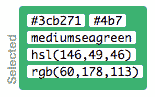
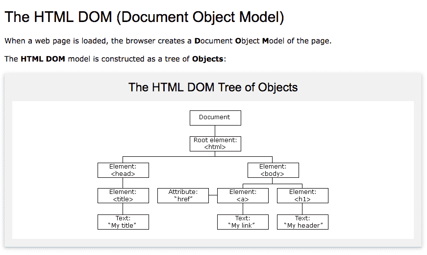
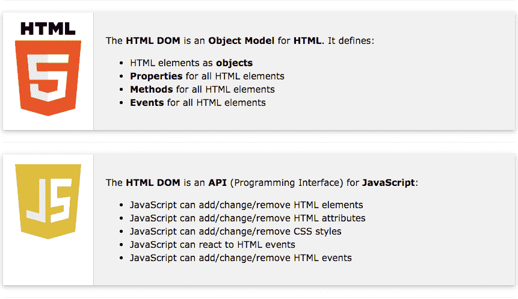

# 一个诗人对网络开发的介绍

> 原文：<https://www.freecodecamp.org/news/a-poets-introduction-to-web-development/>

老实说，我觉得除了烤面包之外，编码是最好的事情。它所提供的自由——经济上的和其他方面的——是一个很大的激励因素，并给人一种受欢迎的感觉，使大多数人选择学习编码。

我们开始吧。

* * *

### 什么是 web 开发？

对于大多数人来说，这涉及到静态 web 开发，有 **HTML** 、 **CSS** 、 **JavaScript** 。这通常意味着，没有 UI 库或框架(如 React、Angular 或 Vue)开销的 web 开发。

那么，是什么组成了一个网站。通常，下表以简单明了的方式对此进行了解释:

| 元素 | 使用 |
| --- | --- |
| 超文本标记语言 | 结构 |
| 半铸钢ˌ钢性铸铁(Cast Semi-Steel) | 式样 |
| 射流研究… | 交互性 |

HTML 代表超文本标记语言，它负责网站的结构。把它想象成某种骨架。

CSS 代表**层叠样式表**，并完成网站的大部分样式和设计工作。CSS 为 web 开发增加了额外的美学元素，并为网站增添了必要的调味元素。把它想象成一种皮肤。

JS 代表 **JavaScript** ，这为网络上的一切增加了必不可少的交互层。把它想象成一个网站的神经。JavaScript 让事物弹跳、旋转，以及做其他有趣的事情。这是一个非常保守的说法——但是，你会明白的。？

这是一个基本的网页，上面所有的元素。然而，这远远达不到生产级别。

```
<!-- HTML -->

<!DOCTYPE html>
<html lang="en">
<head>
  <meta charset="UTF-8">
  <meta name="viewport" content="width=device-width, initial-scale=1.0">
  <meta http-equiv="X-UA-Compatible" content="ie=edge">
  <title>Poets Web Intro</title>

  <!-- CSS -->
  <style>
    h1 {
      color: #3cb271;
    }
  </style>
  <!-- End of CSS -->

</head>
<body>

  <h1>Hi there :)</h1>

  <p></p>

  <!-- JavaScript -->
  <script>
    var text = document.querySelector("p");

    text.innerHTML = "Hello Readers!";
  </script>
  <!-- End of JavaScript -->

</body>
</html>
<!-- End of HTML -->
```

这里，样式是内联的，附加到 HTML 文档的头部分。HTML 文档的`<head></head>`部分包含了关于网站最重要的信息。

接下来的部分`<body></body>`包含将在浏览器窗口中显示的信息。在这种情况下，一个简单的`<h1>`标签(或 **header 1** 元素)向用户显示一条大的欢迎消息。

下面是上面代码的[现场演示](https://codepen.io/usheninte/full/KjxJVb)。

内联 CSS 在这里没有太多作用。它只将`h1`元素的颜色改为绿色:



#3cb271 - GREEN

如果你回头看代码，有一个空的段落标记。这是开始和结束的`<p></p>`标记，中间没有任何东西。然而，正文**读者们好！**可以在演示浏览器窗口中显示。这是 JavaScript 强大力量的一个小展示。

段落标记首先以`document.querySelector("p")`为目标，它用标记`<p>`选取 HTML 文档中的元素。然后用`var text`保存成变量，这里的**第二个字**是**变量名**。

标签中的第二行，也就是 JavaScript 在这个 HTML 文档中的位置，做了一些漂亮的事情。它使用 **innerHTML** 的 HTML DOM 属性定位新创建的变量`text`，代码如下:

```
text.innerHTML = "Hello Readers!";
```

然后用文本“ **Hello Readers”填充**文本**变量！**”，然后通过这样做，使`<p></p>`具有相同的文字内容。

```
var text = document.querySelector("p");

text.innerHTML = "Hello Readers!";
```

Remember this? ?

* * *

### DOM 文档对象模型



Source: ([https://www.w3schools.com/whatis/whatis_htmldom.asp](https://www.w3schools.com/whatis/whatis_htmldom.asp))

我们在上面的例子中所做的，是在 DOM 中找到一个 HTML 元素，并使用 Vanilla JS 更新其内容。纯 JavaScript(或 *Vanilla JS* )是一个术语，用来指没有任何框架或库干扰的自然 JavaScript 语法和功能。

**HTML DOM** 以两种方式工作——既作为 HTML 的**对象模型**，又作为 JavaScript 的 **API** 。它通常负责网站内的交互性。



Source: ([https://www.w3schools.com/whatis/whatis_htmldom.asp](https://www.w3schools.com/whatis/whatis_htmldom.asp))

DOM 的操作是 web 开发的一个重要部分，因为它有助于开发人员创建更具动态性和视觉吸引力的网站。

* * *

我真的希望你在阅读这篇文章的时候过得愉快。这是一个非常入门的 web 开发概述。你可以跟随 **freeCodeCamp** [响应式网页设计课程](https://learn.freecodecamp.org/)，更牢固地掌握网页开发理念。

> 记得也做一些项目！？