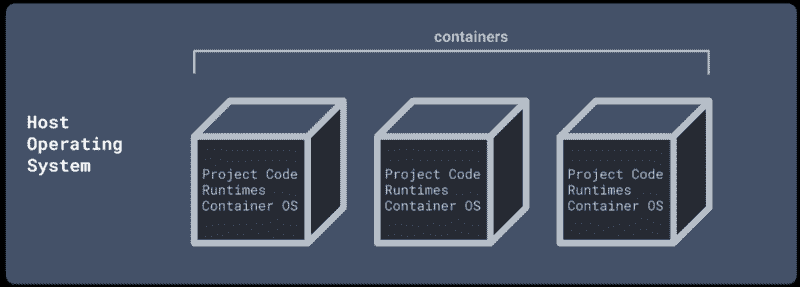
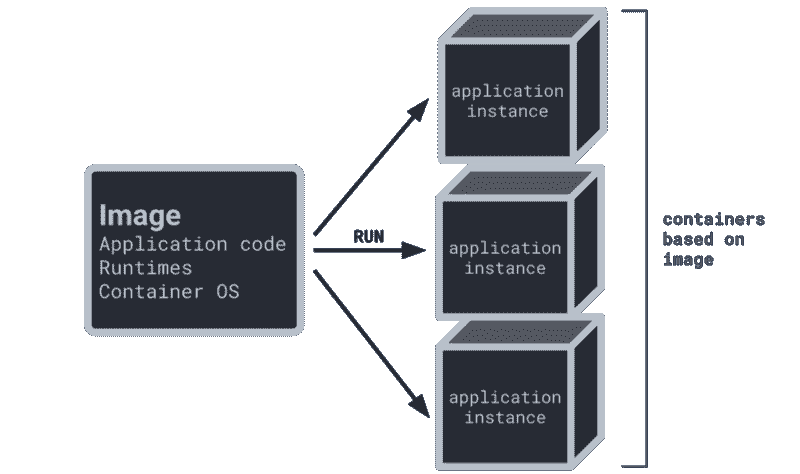
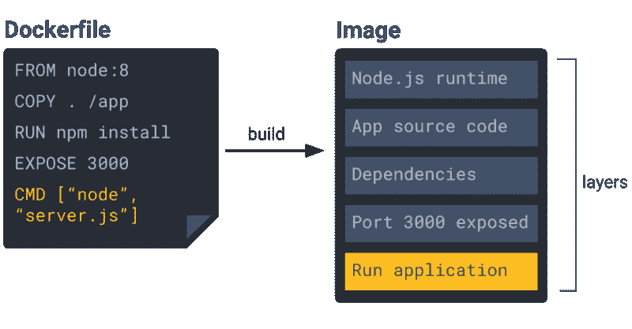
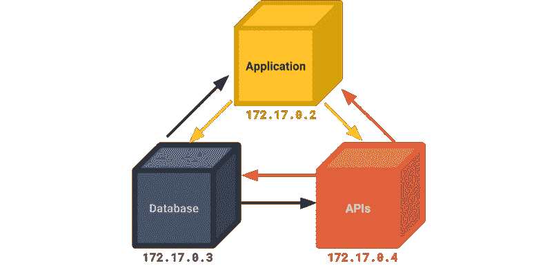
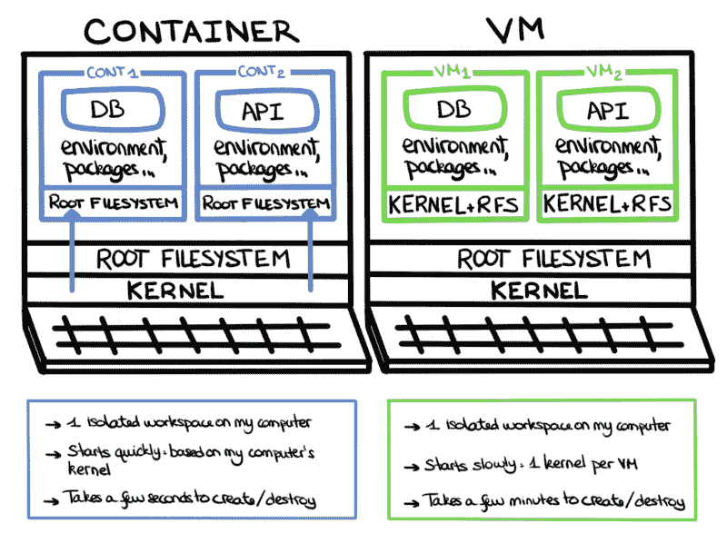
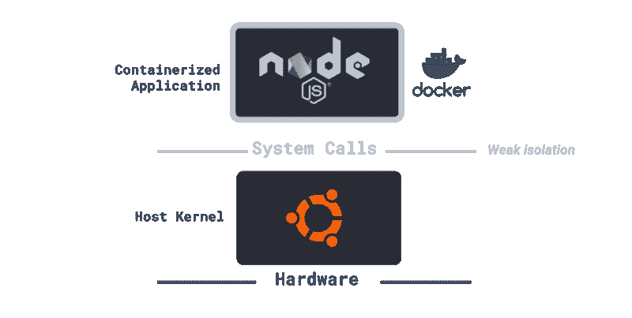

# 集装箱实用指南

> 原文：<https://www.freecodecamp.org/news/a-practical-guide-to-containers-dfa66d37ac30/>

朱利叶斯·泽威克

# 集装箱实用指南

Photo credit: [Antoine Petitteville](https://unsplash.com/@ant0ine) on Unsplash

容器已经像风暴一样占领了软件世界——这是有充分理由的。

事实证明，它们对于开发运维及部署至关重要，并且对于开发人员来说有多种用途。这不仅适用于大公司，也适用于独立开发者。事实上，容器在我们的项目[航天器](https://spacecraft-repl.com)的开发和部署中发挥了至关重要的作用。

在本文中，我们将介绍容器并解释它们的核心特性。然后，我们将展示它们在软件开发中的用途，并涵盖一些关于安全性和资源管理的重要主题。一路上，我们将一窥[容器是如何在航天器](https://spacecraft-repl.com/whitepaper#5-security--resource-management-with-containers)中使用的。让我们开始吧！

### 什么是容器？

那么到底什么是容器呢？

就其核心而言，容器可以被描述为封装软件的单个单元。它本质上是一个盒子，您可以在其中放置所有的项目依赖项，并运行单个服务或整个开发环境，同时将盒子中的所有内容与主机系统隔离开来。

举个例子，假设你需要处理一个新项目，并且知道所有需要的依赖关系。但是其中一些依赖项可能会与您已经安装在计算机上的内容相冲突，例如语言版本号。

如果您要在您的计算机上处理这个项目，您将不得不经历管理您的依赖项和停用版本的繁琐过程，同时激活您需要的版本。

当整个开发团队从事同一个项目，并且没有两个开发人员在他们的计算机上有相同的配置时，这个问题就变得复杂了。

使用容器，您可以简单地将所有需要的依赖项放入其中，然后在容器中处理您的项目。这通过消除依赖性管理问题，而不是为我们提供一个隔离的工作区域，节省了大量的麻烦。

### 容器是如何制造的？

所以我们现在知道什么是容器了。但是我们到底是如何创造它们的呢？

首先，我们需要创建一个图像。这是一个简单的包，包含了我们容器中应该存在的所有依赖项。它是我们运行容器时应该包含的所有内容的快照。

形象化这一点的一个简单方法是将图像视为一个类，将容器视为从该类实例化的对象。因此，我们的映像将作为创建容器的蓝图，我们可以从同一个映像创建任意数量的相同容器。

### 图像是如何构建的？

图像是通过[执行一组命令](https://www.aquasec.com/wiki/display/containers/Docker+Images+101)构建的。在 Docker 中，命令集写在一个名为 Dockerfile 的文本文件中。

当图像构建过程开始时，每个命令[形成一个层](https://docs.docker.com/storage/storagedriver/#images-and-layers)，该层包含最终图像。最后一层指定当容器启动时在容器中运行什么命令。

An example Dockerfile that builds into an image. Each layer represents an instruction from the Dockerfile.

在[飞船](https://spacecraft-repl.com)中，我们将一个[修改版的 Ubuntu](https://hub.docker.com/r/phusion/baseimage/) ，我们的语言运行时，以及我们的应用程序代码的副本捆绑到一个映像中，以启动多个容器，每个容器运行我们应用程序的一个实例。

图像不一定只需要存储或构建在本地机器上。容器意味着可以在任何地方部署，因此我们应该能够从任何物理机器访问我们的映像。这是通过[注册中心](https://docs.docker.com/registry/introduction/#understanding-image-naming)完成的，注册中心本质上是一个远程存储和访问图像的地方。

### 为什么要用容器？

现在我们可以深入研究容器的许多用例。

还记得我们说过容器可以为我们提供一个独立的盒子来容纳一个具有特定依赖集的开发环境吗？每个开发人员都可以简单地将所需的映像从注册表下载到他们的本地计算机上，然后根据该映像创建一个容器。

这样，他们可以很快开始为现有的项目做出贡献。

#### 易于部署

正如您所看到的，容器的最大优势之一是，由于它们的隔离性，它们很容易部署在各种系统上。这允许开发人员将他们的软件从他们的物理机器上解耦，并从任何地方启动容器。

#### 在一台机器上运行多个服务

另一个用例涉及将单个服务放在容器中，然后与该服务进行通信。

在这种情况下，您可以构建一个系统，在单独的容器中存放单独的服务。这允许您隔离系统架构的每个部分，并在同一台主机上运行多个服务，同时根据需要轻松地在系统内外交换服务。

为了演示这是如何工作的，每个服务可以通过它们的 IP 地址通过 [Docker 容器网络](https://docs.docker.com/v17.09/engine/userguide/networking/)相互通信。这样，容器就可以发送 HTTP 请求，并将目的容器的 IP 地址作为 URL 的一部分。

Containers can communicate with each another via their IP addresses.

事实上，我们在[飞船](https://spacecraft-repl.com)中使用了这种技术。我们已经构建了一个[反向代理服务器](https://www.incapsula.com/cdn-guide/glossary/reverse-proxy.html)，它将客户端的请求转发到适当的容器。为了实现反向代理服务器和容器之间的通信，我们在初始化期间检索容器的 IP 地址，并将它们用作代理的目的地。

#### 安全隔离

另一个重要的用例是容器化的应用程序与主机系统相隔离。这可以防止不必要的用户访问主机的文件系统。这一点很重要，尤其是对于像[航天器](http://repl.space)这样的应用程序，它给用户提供了执行代码的能力。

我们还可以添加安全措施来加强隔离，进一步防止恶意活动到达我们的主机系统。我们将在下一节探讨这些策略。

### 容器与虚拟机

此时，我们希望明确容器和虚拟机之间的区别，因为这可能会严重影响您决定使用哪个。

虚拟机先于容器出现，用于解决与容器相同的棘手问题。本质上，它们为服务和开发提供了一个隔离的环境，并且可以部署在多个系统上。

但是，它们和容器之间有一些显著的区别。

#### 容器重量更轻，旋转速度更快

首先，容器在内存需求方面比虚拟机更轻量级。根据您在容器中放置的内容，它们的内存大小通常在几十到几百 MB 之间。

虚拟机要重得多，会跑进千兆位。这主要是由于一个大的包容性:操作系统内核。

Source: [I am a Developer: why should I use Docker?](https://blog.octo.com/en/i-am-a-developer-why-should-i-use-docker)

虚拟机不仅包含服务或环境的所有依赖项，还包含运行所有依赖项的操作系统内核的完整副本。这种添加会给虚拟机实例增加大量内存。

另一方面，容器不包含内核，而是对主机系统内核进行系统调用。这大大降低了他们的内存占用。它允许在一个系统上创建和使用更多的容器，而不是您可以在同一系统上运行的虚拟机数量。

除了更小的内存占用，容器中缺少内核使得它们的启动时间更快。容器启动可以在几秒钟内完成，而虚拟机需要更长的时间。

#### 默认情况下，虚拟机更安全

然而，总会有权衡。当谈到虚拟机与容器时，最大的权衡是安全性。

因为容器需要访问主机系统内核来进行系统调用，所以它们在安全性上不像虚拟机那样无懈可击。

事实上，足智多谋的恶意用户可以找到方法利用这一安全缺陷来突破容器并获得对主机系统的访问权。

对于虚拟机，这种风险得到了缓解，因为虚拟机的每个实例都包含一个用于其系统调用的内核。因此，虚拟机和主机系统之间的隔离比容器更强。

然而，集装箱的安全风险可以通过实施一些安全措施来解决，我们将在[飞船](https://spacecraft-repl.com)中实施这些安全措施，我们现在就来看看。

### 安全措施

您应该知道的一个巨大的安全问题是，默认情况下，用户通常作为 root 用户在容器中运行。

这意味着在容器中工作的任何人，无论是您团队中的开发人员还是使用后端容器中的应用程序的用户，都将拥有访问容器文件系统的特权。

如果您担心将这种级别的控制权交给容器用户，那么您应该考虑限制他们权限的方法。

这个问题可以通过在容器文件系统中创建一个非特权用户配置文件，并让用户在容器中以该用户配置文件运行来解决。

这将限制他们访问容器文件系统和运行可能损害您的容器环境和其中运行的任何服务的命令的能力。

另一个潜在的安全问题是用户突破容器访问主机系统文件系统的能力。

正如我们之前提到的，为了运行进程，容器对主机系统内核进行系统调用。这为恶意用户突破容器并连接主机系统打开了方便之门。

Containerization alone provides weak isolation, where all system calls made by our application are accepted by the host kernel. Source: [gVisor Github](https://github.com/google/gvisor)

我们用来防止这种情况的方法之一是使用容器运行时沙箱来拦截容器发出的系统调用。沙箱充当访客内核，并在容器和主机内核之间创建了一个强大的隔离级别。这可以防止恶意用户攻击我们的主机系统。

如果你对使用容器运行时沙箱感兴趣，请查看一下 Google 提供的开源解决方案 [gVisor](https://github.com/google/gvisor) ，我们在[飞船](https://spacecraft-repl.com)中使用了它。

### 集装箱资源控制

我们想要解决的另一个问题与容器资源的潜在滥用有关。

由于容器在主机系统上运行并使用主机内核，因此它实质上消耗主机系统的 CPU 和内存资源来完成其进程和任务。

虽然对于使用容器的开发人员来说，这通常不是个人层面的问题，但一旦我们使用容器来部署供外部用户使用的应用程序，这就成了一个更大的问题。

假设您的系统架构包括使用容器来运行用户可以访问的应用程序的单独实例。其中一个容器化实例需要比预期更多的主机系统 CPU 和内存。

这可能会导致一个实例占用其他实例的系统资源，从而导致它们的性能下降，并造成糟糕的用户体验。

显然，这是我们希望尽可能避免的情况。谢天谢地，我们可以用 cgroups 做到这一点，cgroups 是“控制组”的缩写。

使用 cgroups，您可以限制容器使用的系统资源量，从而防止我们刚刚描述的情况。

例如，您可以将容器上的 cgroups 设置为最大 100MB 内存和 20%的 CPU。有了这些限制，该容器在其生命周期内将永远不能使用超过 100MB 的内存或使用超过 20%的主机系统 CPU。您可以高枕无忧，因为您知道其他容器化的应用程序实例的性能不会下降。

在航天器中，我们利用 cgroups 来限制单个会话可以消耗的内存和 CPU 的最大数量。如果某个会话碰巧运行了一个开销很大的计算，并消耗了该容器中的所有可用资源，那么只有该会话会受到影响。

With each session isolated and controlled through cgroups, a single spike in resource consumption will only affect that session, while leaving others unaffected.

### 我可以从哪里开始？

有许多容器服务可供选择。我们为[飞船](https://spacecraft-repl.com)使用 Docker 是因为它的易用性和优秀的文档。我们强烈推荐你的下一个项目使用它。

其他选项包括:

*   Redhat OpenShift
*   亚马逊 EC2 容器服务
*   AWS 弹性容器注册
*   谷歌云容器注册中心
*   蓝色库伯内特斯
*   哈希公司
*   码头

#### 与 Node.js 集成

如果您主要在开发中使用 Node.js， [Dockerode](https://github.com/apocas/dockerode) 可以帮助您在 Node.js 环境中与 Docker 进行交互。我们利用 Dockerode 帮助我们执行一些重要的容器操作，包括:

*   启动和销毁容器
*   读取容器的 IP 地址
*   对容器的内存和 CPU 使用进行限制

这些操作对于帮助我们处理多个会话和扩展应用程序非常重要。

### 结论

对于软件开发人员来说，容器是一个非常有用的工具，可以简化和加速项目部署。

无论是为构建项目创建一个隔离的开发环境，建立一个微服务架构，还是帮助一个新的团队成员加入，容器的效用都会随着时间的推移而不断增长。在你的下一个项目中尝试一下，看看它们能给你带来什么好处！

如果你喜欢读这篇文章，我们也写了一个详细的案例研究，关于我们如何建造航天器以及我们面临的挑战。你可以 **[在这里](https://spacecraft-repl.com/whitepaper)阅读。**

由[宇宙飞船团队](https://spacecraft-repl.com/team)的朱利叶斯、古伊和尼克共同撰写。

### 参考

- [什么是容器](https://www.docker.com/resources/what-container)
- [我是开发人员:为什么要用 Docker？](https://blog.octo.com/en/i-am-a-developer-why-should-i-use-docker/)
- [Docker 安全最佳实践](https://dev.to/petermbenjamin/docker-security-best-practices-45ih)
- [开源 gVisor，一个沙盒容器运行时](https://cloud.google.com/blog/products/gcp/open-sourcing-gvisor-a-sandboxed-container-runtime)-
-[为什么建议在一个容器中只运行一个进程？](https://devops.stackexchange.com/questions/447/why-it-is-recommended-to-run-only-one-process-in-a-container)
- [容器中的进程不应作为根](https://medium.com/@mccode/processes-in-containers-should-not-run-as-root-2feae3f0df3b)-
-[安全和虚拟机](https://pubs.vmware.com/vsphere-4-esx-vcenter/index.jsp?topic=/com.vmware.vsphere.server_configclassic.doc_40/esx_server_config/security_for_esx_systems/c_security_and_virtual_machines.html)运行