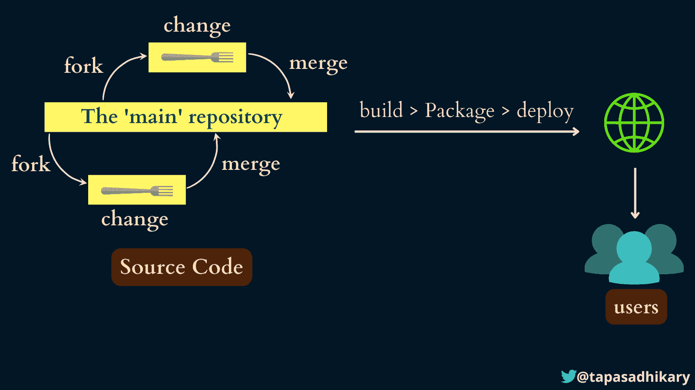

# 面向开发者的开源——帮助你开始贡献的初学者手册

> 原文：<https://www.freecodecamp.org/news/a-practical-guide-to-start-opensource-contributions/>

当你听到`Open Source`这个词时，你会想到什么？在编程界，开源是开源软件(OSS)的通称。开源软件是建立在源代码的基础上的，所有人都可以查看、修改、扩展和分发源代码。

在本文中，我们将深入探讨开源软件及其生态系统的许多方面。我们将讨论你开始为开源做贡献需要什么，你需要的技能，如何维护开源项目，挑战，资源，以及一些令人兴奋的项目。

在我们开始之前，先简单介绍一下我和我对开源世界的兴趣。

我每天都在使用开源项目、产品和服务，并尽我所能为其中一些做出贡献。我还维护了许多开源项目来教育 web 编程的初学者。

你可以在我的 [GitHub 简介](https://github.com/atapas)上查看我维护的开源项目。

这篇文章是关于与你分享我的经验，以帮助你开始使用开源，如果你还没有做出贡献的话。

## 开源是如何工作的？

开源项目由以下人员和元素组成:

`Project Maintainer(s)`:维护人员是一个或几个人，他们启动开源项目，管理它，做决策，集思广益，并与贡献者、用户和营销平台密切合作。

项目维护人员将有额外的访问权限和特权来控制项目的各个方面。

当维护人员开始一个开源项目时，他们是早期的贡献者。随着项目的发展，越来越多的人了解它，为它做贡献的意愿也在增长。

随着它的发展，项目得到了更多的贡献者。任何人都可以查看项目代码，修改它，请求评审，并将更改加入到项目中。

`Source Code and Documentation Repository`:维护者将项目源代码保存在一个集中的源代码库中(例如 GitHub)。它有助于所有贡献者获得所需的代码访问权来做出贡献。

每一个开源项目都必须指定一个发布许可，让它的用户/消费者明白。

存在各种许可类型，维护人员可以根据适合项目的情况选择一种。一些广泛发行的许可证有 MIT、Apache 许可证 2.0、GNU 通用公共许可证(GPL) 3.0 等。

OSS 项目的维护者创建了一个贡献指南，帮助贡献者理解拉请求过程、标准、范围等等。

`Code of Conduct Guide`:行为准则指南讨论了各种准则、协作、参与者的行为期望，以及如何上报和解决问题。

项目文化随着项目社区的发展而发展。虽然维护者在其中有很大的利益，但是贡献者同样有责任维护健康的学习、共享和成长文化。

随着项目的发展，社区也随之建立起来。像 GitHub Discussions 和 Discord 这样的工具以组织基于社区的互动而闻名。

开源项目应该有一种到达最终用户和消费者的方式。应该有一个分发模型来帮助代码翻译成交付的最终产品。

用户或顾客是开源团队使用源代码构建的产品的消费者。

现在我们来看看下图。这里我们看到一个开源项目社区，包括维护者和贡献者。

源代码在中央存储库中。贡献者`fork`(一个我们很快会学到的术语)和贡献者`upstream repository`。一旦贡献结束，项目维护者`merges`就将它与主分支联系起来。

A High-Level View of Open Source Working Model

如果您不熟悉诸如 fork、branch、merge 等术语，也不用担心。我们将在本文中很快了解它们。继续读下去。

现在让我们来理解开源软件是如何交付给用户/客户的。

下图显示了许多可能性中的一种。开源项目应该有一个使用持续集成和持续部署(CI/CD)过程的构建-打包-部署机制。

每当`main branch`中有代码变更时，CI/CD 工作流就会自动启动。它构建源代码，将其打包，并部署到最终用户和目标客户可以访问的地方。

A High-Level View of the SOURCE CODE Gets Into the Hands of the USERS

请注意:CI/CD 或任何其他部署机制都不是开源软件开发的一部分。然而，了解它有助于理解 OSS 端到端的工作模式。

## 开源贡献是什么意思？

`Open Source`贡献是指通过任何方式改进开源项目。关于贡献，你可能会有一个误解，那就是，你只需要贡献源代码。嗯，这还不是全部。

为开源项目的源代码做贡献只是你所能做的一种贡献。然而，你也可以为其他领域做出贡献，

*   项目的文档。改进它，让更多的贡献者和用户发现它很容易处理。
*   测试应用程序，发现问题，并在问题管理系统中创建它们。
*   参与代码评审，帮助项目实现更好的编码标准。
*   写单元测试，端到端测试，让应用质量更好。
*   创建文章和视频等内容来传播项目意识。
*   帮助建立感兴趣的人的社区。

以上都是至关重要的开源项目贡献。

## 开源贡献的好处

开源贡献给开发者带来了许多好处。一些主要优势包括:

*   获得提升自己技能的机会。
*   用代码和文档使软件/应用程序更好。
*   结识志同道合的人，建立关系网和社区。
*   了解应用程序开发和维护周期。
*   从拉动式请求反馈中学习。
*   了解如何以开源方式管理您的代码。

## 开源神话

所以，我们现在知道了开源模式及其好处。我们想学习的下一件事是如何从开源贡献开始，作为项目的`maintainer`和`contributor`。

在此之前，让我们澄清一些关于开源的神话。

❌:我不知道如何编码。开源不是我喜欢的。

✅:事实:开源不仅仅是编码！您有很多机会为改进文档、测试、创建媒体、创建内容等做出贡献。所以不要退缩，认为缺乏编码会阻止你为 OSS 做贡献。

❌:我知道如何编码，但是我不熟悉这个开源项目中使用的技术。我不能贡献。

✅:事实:相反，这是一个学习你不知道的东西的好机会！开源生态系统有足够的耐心为您提供时间，以便您可以学习和做出贡献。

❌ **神话**:开源没有维护企业级标准。

✅:事实:一点也不真实。事实上，今天很多企业软件都是由开源软件驱动的。认为开源项目不关心质量和标准是不正确的。

❌ **神话**:开源项目不容易维护。

✅ **事实:**开源项目是由贡献者支持的。对于维护者来说，一个重要的方面是奠定基础，创建路线图，建立社区，并保持更高的动力。

对于很多开源项目，维护人员甚至不用编码。如果维护者提供必要的支持，贡献者可以运行这个节目。

❌ **神话**:开源软件总是免费的。

✅:事实:大部分是免费的，但不是所有的开放源码软件都是免费的。它由项目使用的许可类型决定。有些许可证是限制性的，允许以任何方式自由使用和分发代码。你需要特别注意一个项目的许可信息，以了解 OSS 将会有“多少”免费。

❌:开源是为初学者准备的。

✅:事实:许多开发者认为 OSS 是为初学者和学生准备的。事实是，欢迎每个人都来投稿。对于一个主题专家来说，用他们的知识和经验来增强一个开源项目是有意义的。

## 了解开源入门知识

开发人员需要知道一些基本的事情，以便快速开始开源项目。这些是可选的先决条件，但是如果你让自己意识到，你会更喜欢为开源做贡献。

### 了解 Git 基础知识

如果您已经了解 Git 的概念及其主要用途，那么您已经增加了里程。Git 在开源世界中无处不在，你不能忽视它。

你至少需要了解这些话题，

*   什么是 Git，它是如何工作的？
*   什么是存储库？
*   如何克隆存储库？
*   如何准备/取消准备变更？
*   如何提交您的更改？
*   如何写出更好的提交消息？
*   如何解决合并冲突？
*   如何将您的更改推送到远程存储库？
*   如何从远程存储库中提取变更？

如果你是 Git 新手，我推荐这个视频帮助你学习 Git 概念和上面提到的所有用法:[为新手揭秘 Git](https://www.youtube.com/watch?v=vWtu4mzUgQo)。

### 熟悉 GitHub

GitHub 上有超过 1.28 亿个公共存储库。这些存储库的很大一部分是开源项目。你想贡献的开源项目可能也在 GitHub 上。所以，你要学会如何在 GitHub 上处理事情。

作为开源项目的贡献者，您必须知道:

*   如何派生一个存储库？
*   如何找到克隆存储库的 URL？
*   如何创建拉式请求？
*   如何审核拉式请求？

作为项目维护人员，您必须知道，

*   如何创建存储库？
*   如何将许可信息添加到项目中？
*   如何创建投稿指南和行为准则指南？
*   如何设定创建问题和拉式请求的标准？
*   如何合并拉取请求？

你可以关注下面的 Twitter 帖子。它一步一步地为你解释一切，

> 你有公共的 GitHub 库吗？
> 
> 这里有 10 个小技巧可以帮你，
> 
> 🤝获得更多的约定
> 💻代码贡献
> ⭐作品致谢(比如明星，也许是赞助商)
> 🔥在 GitHub 上建立追随者
> 
> 一个兆线程
> 
> 🧵👇
> 
> — Tapas Adhikary (@tapasadhikary) [September 21, 2021](https://twitter.com/tapasadhikary/status/1440296182396309513?ref_src=twsrc%5Etfw)