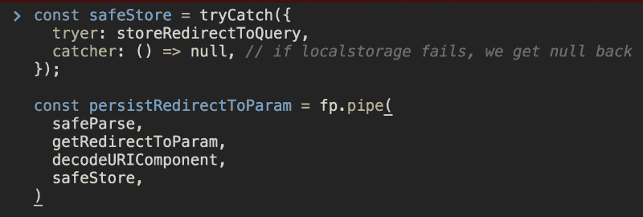

# 编写更多函数式 JavaScript 的实用指南

> 原文：<https://www.freecodecamp.org/news/a-practical-guide-to-writing-more-functional-javascript-db49409f71/>

作者 Nadeesha Cabral

# 编写更多函数式 JavaScript 的实用指南

Everything as a function

函数式编程很棒。随着 React 的引入，越来越多的 JavaScript 前端代码是按照 FP 原则编写的。但是我们如何开始在我们写的日常代码中使用 FP 思维呢？我将尝试使用一个日常代码块，并一步一步地重构它。

**我们的问题:**来到我们的`/login`页面的用户将可选地拥有一个`redirect_to`查询参数。比如`/login?redirect_to=%2Fmy-page`。注意，当被编码为 URL 的一部分时，`%2Fmy-page`实际上是`/my-page`。我们需要提取这个查询字符串，并将其存储在本地存储中，这样一旦登录完成，用户就可以被重定向到`my-page`。

### 第 0 步:命令式方法

如果我们必须用发出一列命令的最简单形式来表达解决方案，我们会怎么写呢？我们需要

1.  解析查询字符串。
2.  获取`redirect_to`值。
3.  解码该值。
4.  将解码值存储在 localStorage 中。

我们还必须在“不安全”的函数周围放置 try catch 块。有了所有这些，我们的代码块将看起来像这样:

### 步骤 1:将每一步都写成一个函数

现在，让我们忘记 try catch 块，试着在这里把一切都表示为一个函数。

当我们开始将所有的“结果”表达为函数的结果时，我们看到了我们可以从主函数体中重构出什么。当这种情况发生时，我们的函数变得更容易理解，也更容易测试。

在更早的时候，我们会对主函数进行整体测试。但是现在，我们有了 4 个更小的函数，其中一些只是代理其他函数，所以需要测试的内存空间要小得多。

让我们确定这些代理函数，并删除代理，这样我们的代码就少了一些。

### 步骤 2:尝试组合函数

好吧。现在，`persistRedirectToParams`函数似乎是 4 个其他函数的“组合”。让我们看看是否可以将这个函数写成一个组合，从而消除我们存储为`const` s 的中间结果。

这很好。但是我同情阅读这个嵌套函数调用的人。如果有办法解开这团乱麻，那就太棒了。

### 第三步:可读性更强的作文

如果你做了一些还原或重组，你会遇到`compose`。Compose 是一个效用函数，它接受多个函数，并返回一个逐个调用底层函数的函数。还有其他[优秀的来源](https://medium.com/front-end-weekly/pipe-and-compose-in-javascript-5b04004ac937)来学习作曲，所以我在这里就不赘述了。

使用 compose，我们的代码将看起来像这样:

compose 的一个特点是它从右向左减少功能。因此，`compose`链中第一个被调用的函数是最后一个函数。

如果你是数学家，并且熟悉这个概念，这不是问题，所以你自然会从右向左读。但是对于我们这些熟悉命令式代码的人来说，我们更愿意从左向右阅读。

### 第四步:装管道和展平

幸运的是，还有`pipe`。`pipe`与`compose`做同样的事情，但方向相反。因此，链中的第一个函数是处理结果的第一个函数。

而且，看起来我们的`persistRedirectToParams`函数已经变成了另一个我们称为`op`的函数的包装器。换句话说，它所做的只是执行`op`。我们可以去掉包装器，将函数“扁平化”。

快到了。请记住，我们方便地留下了我们的`try-catch`块，以使其达到当前状态。好吧，我们需要一些方法把它引回来。`qs.parse`和`storeRedirectToQuery`一样不安全。一种选择是让它们成为包装函数，并将它们放在`try-catch`块中。另一种函数式方法是将`try-catch`表示为一个函数。

### 第 5 步:作为函数的异常处理

有一些实用程序可以做到这一点，但是让我们自己写点东西试试。

这里我们的函数期望一个包含`tryer`和`catcher`函数的`opts`对象。它将返回一个函数，当用参数调用时，用所述参数调用`tryer`，如果失败，调用`catcher`。现在，当我们有不安全的操作时，我们可以将它们放在`tryer`部分，如果它们失败了，从 catcher 部分拯救并给出一个安全的结果(甚至记录错误)。

### 第六步:把所有东西放在一起

考虑到这一点，我们最终的代码看起来像这样:

这或多或少是我们想要的。但是，为了确保代码的可读性和可测试性得到提高，我们也可以将“安全”函数分解出来。

现在，我们得到的是一个更大的函数的实现，由 4 个独立的函数组成，它们高度内聚，松散耦合，可以独立测试，可以独立重用，考虑异常情况，并且是高度声明性的。(在我看来，它们读起来更好一点。)

有一些 FP 语法糖使这更好，但这是另一天。