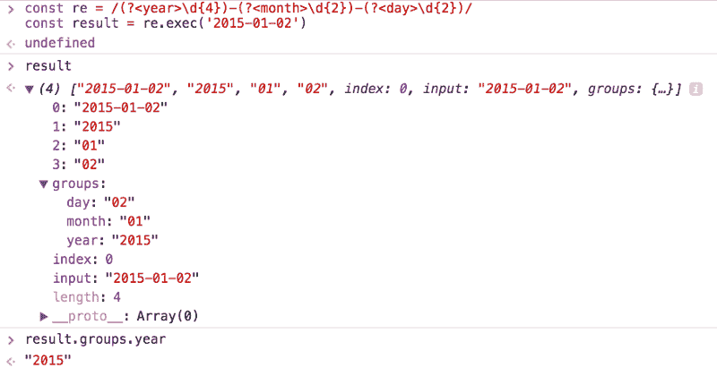

# JavaScript 正则表达式快速简单指南

> 原文：<https://www.freecodecamp.org/news/a-quick-and-simple-guide-to-javascript-regular-expressions-48b46a68df29/>

> 对学习 JavaScript 感兴趣？在 jshandbook.com 获得我的电子书

### 正则表达式简介

正则表达式(也简称为 **regex** )是处理文本字符串的一种快速方式。

通过用特殊的语法制定正则表达式，您可以:

*   **在字符串中搜索文本**
*   **替换字符串中的子字符串**
*   和**从字符串提取信息**

几乎每种编程语言都有一些正则表达式的实现。每个实现之间有一些小的差异，但是一般的概念几乎适用于任何地方。

正则表达式可以追溯到 20 世纪 50 年代，当时它们被形式化为字符串处理算法的概念搜索模式。

在像 grep、sed 这样的 UNIX 工具和流行的文本编辑器中实现，正则表达式变得越来越流行。它们被引入到 Perl 编程语言中，后来也被引入到许多其他语言中。

JavaScript 和 Perl 是支持直接内置正则表达式的编程语言之一。

### 艰苦但有用

如果您没有投入必要的时间去理解正则表达式，那么对于初学者来说，它可能看起来完全是一派胡言，对于专业开发人员来说也是如此。

隐晦的正则表达式有**难写**、**难读**、**难维护/修改**。

但是有时候正则表达式是执行一些字符串操作的唯一合理的方式，所以它是你口袋里非常有价值的工具。

本教程旨在以简单的方式向您介绍 JavaScript 正则表达式，并为您提供阅读和创建正则表达式的所有信息。

经验之谈是，**简单的正则表达式简单的读** **写**，而**复杂的正则表达式如果不深入掌握基础知识，很快就会变成一团乱麻**。

### 正则表达式是什么样子的？

在 JavaScript 中，正则表达式是一个**对象**，可以用两种方式定义。

第一种方法是使用构造函数实例化一个新的 RegExp 对象:

```
const re1 = new RegExp('hey')
```

第二种是使用**正则表达式文字**形式:

```
const re1 = /hey/
```

你知道 JavaScript 有**对象文字**和**数组文字**？它也有**正则表达式文字**。

在上面的例子中，`hey`被称为**模式**。在文字形式中，它由正斜杠分隔，而在对象构造函数中，它不是。

这是两种形式之间的第一个重要区别，但我们稍后会看到其他区别。

### 它是如何工作的？

我们在上面定义为`re1`的正则表达式非常简单。它搜索字符串`hey`，没有任何限制。字符串可以包含很多文本，中间是`hey`，正则表达式就满足了。它也可以只包含`hey`，正则表达式也会满意。

这很简单。

您可以使用`RegExp.test(String)`测试正则表达式，它返回一个布尔值:

```
re1.test('hey') //✅ re1.test('blablabla hey blablabla') //✅ re1.test('he') //❌ re1.test('blablabla') //❌
```

在上面的例子中，我们只是检查了`"hey"`是否满足存储在`re1`中的正则表达式模式。

这是最简单的，但是现在你已经知道了很多关于正则表达式的概念。

### 锚定

```
/hey/
```

匹配`hey`在字符串中的位置。

如果你想匹配以**开头的字符串**和`hey`，使用`^`操作符:

```
/^hey/.test('hey') //✅ /^hey/.test('bla hey') //❌
```

如果你想匹配以**结尾**和`hey`的字符串，使用`$`操作符:

```
/hey$/.test('hey') //✅ /hey$/.test('bla hey') //✅ /hey$/.test('hey you') //❌
```

将它们组合起来，匹配与`hey`完全匹配的字符串，并且只匹配该字符串:

```
/^hey$/.test('hey') //✅
```

要匹配以一个子字符串开始并以另一个子字符串结束的字符串，可以使用`**.***`，它匹配任何重复 0 次或更多次的字符:

```
/^hey.*joe$/.test('hey joe') //✅ /^hey.*joe$/.test('heyjoe') //✅ /^hey.*joe$/.test('hey how are you joe') //✅ /^hey.*joe$/.test('hey joe!') //❌
```

### 匹配范围内的项目

您可以选择匹配某个范围内的任何字符，而不是匹配特定的字符串，例如:

```
/[a-z]/ //a, b, c, ... , x, y, z /[A-Z]/ //A, B, C, ... , X, Y, Z /[a-c]/ //a, b, c /[0-9]/ //0, 1, 2, 3, ... , 8, 9
```

这些正则表达式匹配至少包含下列范围中的一个字符的字符串:

```
/[a-z]/.test('a') //✅ /[a-z]/.test('1') //❌ /[a-z]/.test('A') //❌ /[a-c]/.test('d') //❌ /[a-c]/.test('dc') //✅
```

范围可以组合:

```
/[A-Za-z0-9]/
```

```
/[A-Za-z0-9]/.test('a') //✅ /[A-Za-z0-9]/.test('1') //✅ /[A-Za-z0-9]/.test('A') //✅
```

### 多次匹配范围项目

您可以使用`-` char 来检查一个字符串是否在一个范围内只包含一个字符:

```
/^[A-Za-z0-9]$/ 
```

```
/^[A-Za-z0-9]$/.test('A') //✅ /^[A-Za-z0-9]$/.test('Ab') //❌
```

### 否定一种模式

模式开头的`^`字符将其锚定在字符串的开头。

在一个范围内使用，它**否定**它，所以:

```
/[^A-Za-z0-9]/.test('a') //❌ /[^A-Za-z0-9]/.test('1') //❌ /[^A-Za-z0-9]/.test('A') //❌ /[^A-Za-z0-9]/.test('@') //✅
```

*   `**\d**`匹配任意数字，相当于`[0-9]`
*   `**\D**`匹配任何不是数字的字符，相当于`[^0-9]`
*   `**\w**`匹配任何字母数字字符，相当于`[A-Za-z0-9]`
*   `**\W**`匹配任何非字母数字字符，相当于`[^A-Za-z0-9]`
*   `**\s**`匹配任何空白字符:空格、制表符、换行符和 Unicode 空格
*   `**\S**`匹配任何非空白字符
*   `**\0**`匹配空值
*   `**\n**`匹配换行符
*   `**\t**`匹配一个制表符
*   `**\uXXXX**`匹配代码为 XXXX 的 unicode 字符(需要`u`标志)
*   `**.**`匹配任何不是换行符的字符(例如`\n`)(除非你使用`s`标志，稍后解释)
*   `**[^]**`匹配任何字符，包括换行符。这对多行字符串很有用。

### 正则表达式选择

如果你想搜索一个字符串**或者另一个**，使用`|`操作符。

```
/hey|ho/.test('hey') //✅ /hey|ho/.test('ho') //✅
```

### 量词

假设您有这样一个正则表达式，它检查一个字符串中是否只有一个数字，而没有其他内容:

```
/^\d$/
```

您可以使用**`?`量词**使其可选，因此需要零个或一个:

```
/^\d?$/
```

但是如果要匹配多个数字呢？

你可以用四种方法来做，分别是`+`、`*`、`{n}`和`{n,m}`。我们一个一个来看这些。

### `+`

匹配一个或多个(> =1)项目

```
/^\d+$/ 
```

```
/^\d+$/.test('12') //✅ /^\d+$/.test('14') //✅ /^\d+$/.test('144343') //✅ /^\d+$/.test('') //❌ /^\d+$/.test('1a') //❌
```

### `*`

匹配 0 个或更多(> = 0)项

```
/^\d+$/ 
```

```
/^\d*$/.test('12') //✅ /^\d*$/.test('14') //✅ /^\d*$/.test('144343') //✅ /^\d*$/.test('') //✅ /^\d*$/.test('1a') //❌
```

### `{n}`

精确匹配`n`个项目

```
/^\d{3}$/ 
```

```
/^\d{3}$/.test('123') //✅ /^\d{3}$/.test('12') //❌ /^\d{3}$/.test('1234') //❌ /^[A-Za-z0-9]{3}$/.test('Abc') //✅
```

### `{n,m}`

`n`和`m`时间的匹配:

```
/^\d{3,5}$/ 
```

```
/^\d{3,5}$/.test('123') //✅ /^\d{3,5}$/.test('1234') //✅ /^\d{3,5}$/.test('12345') //✅ /^\d{3,5}$/.test('123456') //❌
```

`m`可以省略，这样就有了一个开放式的结尾，所以你至少有`n`个条目:

```
/^\d{3,}$/ 
```

```
/^\d{3,}$/.test('12') //❌ /^\d{3,}$/.test('123') //✅ /^\d{3,}$/.test('12345') //✅ /^\d{3,}$/.test('123456789') //✅
```

### 可选项目

在项目后加上`?`使其成为可选项目:

```
/^\d{3}\w?$/ 
```

```
/^\d{3}\w?$/.test('123') //✅ /^\d{3}\w?$/.test('123a') //✅ /^\d{3}\w?$/.test('123ab') //❌
```

### 组

使用括号，您可以创建字符组:`(...)`

此示例恰好匹配后面跟有一个或多个字母数字字符的 3 个数字:

```
/^(\d{3})(\w+)$/ 
```

```
/^(\d{3})(\w+)$/.test('123') //❌ /^(\d{3})(\w+)$/.test('123s') //✅ /^(\d{3})(\w+)$/.test('123something') //✅ /^(\d{3})(\w+)$/.test('1234') //✅
```

放在组右括号后的重复字符表示整个组:

```
/^(\d{2})+$/ 
```

```
/^(\d{2})+$/.test('12') //✅ /^(\d{2})+$/.test('123') //❌ /^(\d{2})+$/.test('1234') //✅
```

### 捕获组

到目前为止，我们已经看到了如何测试字符串并检查它们是否包含某种模式。

正则表达式的一个非常酷的特性是能够**捕获字符串**的一部分，并将它们放入一个数组中。

您可以使用组，特别是**捕获组**来实现。

默认情况下，一个组是一个捕获组。现在，我们使用`String.match(RegExp)`或`RegExp.exec(String)`，而不是使用`RegExp.test(String)`，如果满足模式，它将返回一个布尔值。

它们完全相同，都返回一个数组，第一项是整个匹配的字符串，然后是每个匹配的组内容。

如果不匹配，则返回`null`:

```
'123s'.match(/^(\d{3})(\w+)$/) //Array [ "123s", "123", "s" ] 
```

```
/^(\d{3})(\w+)$/.exec('123s') //Array [ "123s", "123", "s" ] 
```

```
'hey'.match(/(hey|ho)/) //Array [ "hey", "hey" ] 
```

```
/(hey|ho)/.exec('hey') //Array [ "hey", "hey" ] 
```

```
/(hey|ho)/.exec('ha!') //null
```

当一个组被多次匹配时，只有最后一次匹配被放入结果数组:

```
'123456789'.match(/(\d)+/) //Array [ "123456789", "9" ]
```

### 可选组

通过使用`(...)?`，可以选择一个捕获组。如果没有找到，得到的数组槽将包含`undefined`:

```
/^(\d{3})(\s)?(\w+)$/.exec('123 s') //Array [ "123 s", "123", " ", "s" ] 
```

```
/^(\d{3})(\s)?(\w+)$/.exec('123s') //Array [ "123s", "123", undefined, "s" ]
```

### 参考匹配组

匹配的每组都有一个号码。`$1`指第一个，`$2`指第二个，以此类推。这在我们稍后讨论替换字符串的一部分时会很有用。

### 命名捕获组

这是 ES2018 新增的[功能。](https://flaviocopes.com/ecmascript/)

可以为一个组指定一个名称，而不仅仅是在生成的数组中指定一个位置:

```
const re = /(?<year>\d{4})-(?<month>\d{2})-(?<day>\d{2})/ const result = re.exec('2015-01-02') 
```

```
// result.groups.year === '2015'; // result.groups.month === '01'; // result.groups.day === '02';
```



### 使用不带组的 match 和 exec

不分组使用`match`和`exec`是有区别的:数组中的第一项不是整个匹配的字符串，而是直接匹配:

```
/hey|ho/.exec('hey') // [ "hey" ] 
```

```
/(hey).(ho)/.exec('hey ho') // [ "hey ho", "hey", "ho" ]
```

### 非捕获组

因为默认情况下组是捕获组，所以您需要一种方法来忽略结果数组中的一些组。这可以通过使用以`(?:...)`开头的**非捕获组**来实现

```
'123s'.match(/^(\d{3})(?:\s)(\w+)$/)//null 
```

```
'123 s'.match(/^(\d{3})(?:\s)(\w+)$/) //Array [ "123 s", "123", "s" ]
```

### 旗帜

您可以在任何正则表达式上使用以下标志:

*   `g`:多次匹配模式
*   `i`:使正则表达式不区分大小写
*   `m`:启用多线模式。在这种模式下，`^`和`$`匹配整个字符串的开始和结束。如果没有这个，对于多行字符串，它们匹配每一行的开始和结束。
*   `u`:支持 unicode(在 ES6/ES2015 中引入)
*   `s`:(在 [ES2018](https://flaviocopes.com/ecmascript/) 中新增)是**单行**的简称，它导致`.`也匹配新的行字符。

标志可以组合在一起，并在 regex 文本中添加到字符串的末尾:

```
/hey/ig.test('HEy') //✅
```

或者作为 RegExp 对象构造函数的第二个参数:

```
new RegExp('hey', 'ig').test('HEy') //✅
```

### 检查正则表达式

给定一个正则表达式，您可以检查它的属性:

*   `source`模式字符串
*   `multiline`真，带`m`标志
*   `global`真，带`g`标志
*   `ignoreCase`真，带`i`标志
*   `lastIndex`

```
/^(\w{3})$/i.source //"^(\\d{3})(\\w+)$" /^(\w{3})$/i.multiline //false /^(\w{3})$/i.lastIndex //0 /^(\w{3})$/i.ignoreCase //true /^(\w{3})$/i.global //false
```

### 逃避

这些字符是特殊的:

*   `\`
*   `/`
*   `[ ]`
*   `( )`
*   `{ }`
*   `?`
*   `+`
*   `*`
*   `|`
*   `.`
*   `^`
*   `$`

它们很特殊，因为它们是在正则表达式模式中有意义的控制字符。如果您想在模式中使用它们作为匹配字符，您需要通过在前面加一个反斜杠来对它们进行转义:

```
/^\\$/ /^\^$/ // /^\^$/.test('^') ✅ /^\$/ // /^\$/.test('

### 字符串边界

`\b`和`\B`让您检查字符串是在单词的开头还是结尾:

*   `**\b**`匹配单词开头或结尾的一组字符
*   `**\B**`匹配不在单词开头或结尾的一组字符

示例:

```
'I saw a bear'.match(/\bbear/) //Array ["bear"] 'I saw a beard'.match(/\bbear/) //Array ["bear"] 'I saw a beard'.match(/\bbear\b/) //null 'cool_bear'.match(/\bbear\b/) //null
```

### 替换，使用正则表达式

我们已经看到了如何检查一个字符串是否包含模式。

我们还看到了如何将字符串的一部分提取到一个数组中，匹配一个模式。

让我们看看如何基于模式来替换字符串的一部分。

JavaScript 中的`String`对象有一个 replace()方法，可以在没有正则表达式的情况下使用该方法对字符串执行**单次替换**:

```
"Hello world!".replace('world', 'dog') //Hello dog! 
```

```
"My dog is a good dog!".replace('dog', 'cat') //My cat is a good dog!
```

此方法也接受正则表达式作为参数:

```
"Hello world!".replace(/world/, 'dog') //Hello dog!
```

使用`g`标志是**在普通 JavaScript 中替换字符串中多次出现的唯一方式**:

```
"My dog is a good dog!".replace(/dog/g, 'cat') //My cat is a good cat!
```

群体让我们做更多新奇的事情，比如移动绳子的各个部分:

```
"Hello, world!".replace(/(\w+), (\w+)!/, '$2: $1!!!') // "world: Hello!!!"
```

除了使用字符串，你还可以使用一个函数来做更有趣的事情。它将接收许多类似于由`String.match(RegExp)`或`RegExp.exec(String)`返回的参数，其中许多参数取决于组的数量:

```
"Hello, world!".replace(/(\w+), (\w+)!/, (matchedString, first, second) => {   console.log(first);   console.log(second); 
```

```
 return `${second.toUpperCase()}: ${first}!!!` }) 
```

```
//"WORLD: Hello!!!"
```

### 贪欲

正则表达式默认说是**贪心**。

这是什么意思？

以这个正则表达式为例:

```
/\$(.+)\s?/
```

它应该从字符串中提取美元金额:

```
/\$(.+)\s?/.exec('This costs $100')[1] //100
```

但是如果我们在数字后面有更多的单词，它会变得奇怪:

```
/\$(.+)\s?/.exec('This costs $100 and it is less than $200')[1] //100 and it is less than $200
```

为什么？因为$符号后面的正则表达式匹配任何带有`.+`的字符，并且直到到达字符串末尾才会停止。然后，它结束，因为`\s?`使结束空格可选。

要解决这个问题，我们需要让正则表达式变得懒惰，尽可能执行最少的匹配。我们可以在量词后面使用`?`符号:

```
/\$(.+?)\s/.exec('This costs $100 and it is less than $200')[1] //100
```

> *我去掉了`\s`后面的`?`。否则它只匹配第一个数字，因为空格是可选的*

所以，`?`根据它的位置表示不同的东西，因为它既可以是量词，也可以是懒人模式指示器。

### Lookaheads:根据后面的内容匹配字符串

使用`?=`匹配后跟特定子字符串的字符串:

```
/Roger(?=Waters)/ 
```

```
/Roger(?= Waters)/.test('Roger is my dog') //false /Roger(?= Waters)/.test('Roger is my dog and Roger Waters is a famous musician') //true
```

`?!`执行相反的操作，如果字符串是**而不是**后跟特定子字符串，则进行匹配:

```
/Roger(?!Waters)/ 
```

```
/Roger(?! Waters)/.test('Roger is my dog') //true /Roger(?! Waters)/.test('Roger Waters is a famous musician') //false
```

### Lookbehinds:根据前面的内容匹配字符串

这是 [ES2018](https://flaviocopes.com/ecmascript/) 的一个功能。

前视头使用`?=`符号。Lookbehinds 使用`?&l`t；=.

```
/(?<=Roger) Waters/ 
```

```
/(?<=Roger) Waters/.test('Pink Waters is my dog') //false 
```

```
/(?<=Roger) Waters/.test('Roger is my dog and Roger Waters is a famous musician') //true
```

使用`?&l` t 否定后视；！：

```
/(?<!Roger) Waters/ 
```

```
/(?<!Roger) Waters/.test('Pink Waters is my dog') //true 
```

```
/(?<!Roger) Waters/.test('Roger is my dog and Roger Waters is a famous musician') //false
```

### 正则表达式和 Unicode

使用 Unicode 字符串时，`u`标志是强制的。特别是，这适用于你可能需要处理星体层中的字符(那些不包括在前 1600 个 Unicode 字符中的字符)。

表情符号是一个很好的例子，但它们不是唯一的例子。

如果不添加这个标志，这个应该匹配一个字符的简单正则表达式将不起作用，因为对于 JavaScript，表情符号在内部由两个字符表示(参见 JavaScript 中的 [Unicode):](https://flaviocopes.com/javascript-unicode/)

```
/^.$/.test('a') //✅ /^.$/.test('?') //❌ /^.$/u.test('?') //✅ 
```

`So, always use the `u`标志`t

`Unicode, just like normal characters, handle ranges:`

```
/[a-z]/.test('a') //✅ /[1-9]/.test('1') //✅ /[?-?]/u.test('?') //✅ /[?-?]/u.test('?') //❌ 
```

``JavaScript checks the internal code representation, so ? < ? < ? becau`se \u1F`436 `< \`u1F`43A <`；\u1F98A。C [检查完整的 E](https://unicode.org/emoji/charts/full-emoji-list.html) 莫吉列表以获得那些代码，并找出顺序(提示:macOS 表情符号选择器有一些混合顺序的表情符号，所以不要指望它)。``

### ``Unicode property escapes``

``As we saw above, in a regular expression pattern you can use `\d`匹配任何数字，`\s`匹配任何非空格字符，`\w`匹配任何字母数字字符，等等。``

``The Unicode property escapes is an [ES2018](https://flaviocopes.com/ecmascript/) feature that introduces a very cool feature, extending this concept to all Unicode characters introducing `\p{}`及其否定`\P{}`。``

``Any Unicode character has a set of properties. For example `Script`决定了语系，`ASCII`是一个布尔值，对于 ASCII 字符也是如此，以此类推。您可以将这个属性放在图括号中，正则表达式将检查它是否为真:``

```
/^\p{ASCII}+$/u.test('abc') //✅ /^\p{ASCII}+$/u.test('ABC@') //✅ /^\p{ASCII}+$/u.test('ABC?') //❌ 
```

``ASCII_Hex_Digit`是另一个布尔属性，它检查字符串是否只包含有效的十六进制数字:`

```
/^\p{ASCII_Hex_Digit}+$/u.test('0123456789ABCDEF') //✅ /^\p{ASCII_Hex_Digit}+$/u.test('h') //❌
```

`There are many other boolean properties, which you just check by adding their name in the graph parentheses, including `Uppercase`、`Lowercase`、`White_Space`、`Alphabetic`、`Emoji`等等:`

```
/^\p{Lowercase}$/u.test('h') //✅ /^\p{Uppercase}$/u.test('H') //✅ 
```

```
/^\p{Emoji}+$/u.test('H') //❌ /^\p{Emoji}+$/u.test('??') //✅ 
```

``In addition to those binary properties, you can check any of the unicode character properties to match a specific value. In this example, I check if the string is written in the Greek or Latin alphabet:``

```
/^\p{Script=Greek}+$/u.test('ελληνικά') //✅ /^\p{Script=Latin}+$/u.test('hey') //✅
```

`Read more about all the properties you can use [directly on the proposal](https://github.com/tc39/proposal-regexp-unicode-property-escapes).`

### `Examples`

`Supposing a string has only one number you need to extract, `/\d+/`应该做的:`

```
'Test 123123329'.match(/\d+/) // Array [ "123123329" ]
```

#### `Match an email address`

`A simplistic approach is to check non-space characters before and after the `@`符号，使用`\S` :`

```
/(\S+)@(\S+)\.(\S+)/ 
```

```
/(\S+)@(\S+)\.(\S+)/.exec('copesc@gmail.com') //["copesc@gmail.com", "copesc", "gmail", "com"]
```

`This is a simplistic example, however, as many invalid emails are still satisfied by this regex.`

#### `Capture text between double quotes`

`Suppose you have a string that contains something in double quotes, and you want to extract that content.`

我们可以很容易地定位它，但是我们也想从我们的结果中删除那些引用。

`We’ll find what we need in `result[1]` :`

```
const hello = 'Hello "nice flower"' const result = /"([^']*)"/.exec(hello) //Array [ "\"nice flower\"", "nice flower" ]
```

#### `Get the content inside an HTML tag`

`For example get the content inside a span tag, allowing any number of arguments inside the tag:`

```
/<span\b[^>]*>(.*?)&lt;\/span>/ 
```

```
/<span\b[^>]*>(.*?)<\/span>/.exec('test')// null 
```

```
/<span\b[^>]*>(.*?)<\/span>/.exec('<span>test</span>') // ["&lt;span>test</span>", "test"] 
```

```
/<span\b[^>]*>(.*?)<\/span>/.exec('<span class="x">test</span>') // ["<span class="x">test</span>", "test"]
```

> `Interested in learning JavaScript? Get my ebook at [jshandbook.com](https://jshandbook.com/)`) ✅
```

### 字符串边界

`\b`和`\B`让您检查字符串是在单词的开头还是结尾:

*   `**\b**`匹配单词开头或结尾的一组字符
*   `**\B**`匹配不在单词开头或结尾的一组字符

示例:

[PRE52]

### 替换，使用正则表达式

我们已经看到了如何检查一个字符串是否包含模式。

我们还看到了如何将字符串的一部分提取到一个数组中，匹配一个模式。

让我们看看如何基于模式来替换字符串的一部分。

JavaScript 中的`String`对象有一个 replace()方法，可以在没有正则表达式的情况下使用该方法对字符串执行**单次替换**:

[PRE53]

[PRE54]

此方法也接受正则表达式作为参数:

[PRE55]

使用`g`标志是**在普通 JavaScript 中替换字符串中多次出现的唯一方式**:

[PRE56]

群体让我们做更多新奇的事情，比如移动绳子的各个部分:

[PRE57]

除了使用字符串，你还可以使用一个函数来做更有趣的事情。它将接收许多类似于由`String.match(RegExp)`或`RegExp.exec(String)`返回的参数，其中许多参数取决于组的数量:

[PRE58]

[PRE59]

[PRE60]

### 贪欲

正则表达式默认说是**贪心**。

这是什么意思？

以这个正则表达式为例:

[PRE61]

它应该从字符串中提取美元金额:

[PRE62]

但是如果我们在数字后面有更多的单词，它会变得奇怪:

[PRE63]

为什么？因为$符号后面的正则表达式匹配任何带有`.+`的字符，并且直到到达字符串末尾才会停止。然后，它结束，因为`\s?`使结束空格可选。

要解决这个问题，我们需要让正则表达式变得懒惰，尽可能执行最少的匹配。我们可以在量词后面使用`?`符号:

[PRE64]

> *我去掉了`\s`后面的`?`。否则它只匹配第一个数字，因为空格是可选的*

所以，`?`根据它的位置表示不同的东西，因为它既可以是量词，也可以是懒人模式指示器。

### Lookaheads:根据后面的内容匹配字符串

使用`?=`匹配后跟特定子字符串的字符串:

[PRE65]

[PRE66]

`?!`执行相反的操作，如果字符串是**而不是**后跟特定子字符串，则进行匹配:

[PRE67]

[PRE68]

### Lookbehinds:根据前面的内容匹配字符串

这是 [ES2018](https://flaviocopes.com/ecmascript/) 的一个功能。

前视头使用`?=`符号。Lookbehinds 使用`?&l`t；=.

[PRE69]

[PRE70]

[PRE71]

使用`?&l` t 否定后视；！：

[PRE72]

[PRE73]

[PRE74]

### 正则表达式和 Unicode

使用 Unicode 字符串时，`u`标志是强制的。特别是，这适用于你可能需要处理星体层中的字符(那些不包括在前 1600 个 Unicode 字符中的字符)。

表情符号是一个很好的例子，但它们不是唯一的例子。

如果不添加这个标志，这个应该匹配一个字符的简单正则表达式将不起作用，因为对于 JavaScript，表情符号在内部由两个字符表示(参见 JavaScript 中的 [Unicode):](https://flaviocopes.com/javascript-unicode/)

[PRE75]

`So, always use the `u`标志`t

`Unicode, just like normal characters, handle ranges:`

[PRE76]

``JavaScript checks the internal code representation, so ? < ? < ? becau`se \u1F`436 `< \`u1F`43A <`；\u1F98A。C [检查完整的 E](https://unicode.org/emoji/charts/full-emoji-list.html) 莫吉列表以获得那些代码，并找出顺序(提示:macOS 表情符号选择器有一些混合顺序的表情符号，所以不要指望它)。``

### ``Unicode property escapes``

``As we saw above, in a regular expression pattern you can use `\d`匹配任何数字，`\s`匹配任何非空格字符，`\w`匹配任何字母数字字符，等等。``

``The Unicode property escapes is an [ES2018](https://flaviocopes.com/ecmascript/) feature that introduces a very cool feature, extending this concept to all Unicode characters introducing `\p{}`及其否定`\P{}`。``

``Any Unicode character has a set of properties. For example `Script`决定了语系，`ASCII`是一个布尔值，对于 ASCII 字符也是如此，以此类推。您可以将这个属性放在图括号中，正则表达式将检查它是否为真:``

[PRE77]

``ASCII_Hex_Digit`是另一个布尔属性，它检查字符串是否只包含有效的十六进制数字:`

[PRE78]

`There are many other boolean properties, which you just check by adding their name in the graph parentheses, including `Uppercase`、`Lowercase`、`White_Space`、`Alphabetic`、`Emoji`等等:`

[PRE79]

[PRE80]

``In addition to those binary properties, you can check any of the unicode character properties to match a specific value. In this example, I check if the string is written in the Greek or Latin alphabet:``

[PRE81]

`Read more about all the properties you can use [directly on the proposal](https://github.com/tc39/proposal-regexp-unicode-property-escapes).`

### `Examples`

`Supposing a string has only one number you need to extract, `/\d+/`应该做的:`

[PRE82]

#### `Match an email address`

`A simplistic approach is to check non-space characters before and after the `@`符号，使用`\S` :`

[PRE83]

[PRE84]

`This is a simplistic example, however, as many invalid emails are still satisfied by this regex.`

#### `Capture text between double quotes`

`Suppose you have a string that contains something in double quotes, and you want to extract that content.`

我们可以很容易地定位它，但是我们也想从我们的结果中删除那些引用。

`We’ll find what we need in `result[1]` :`

[PRE85]

#### `Get the content inside an HTML tag`

`For example get the content inside a span tag, allowing any number of arguments inside the tag:`

[PRE86]

[PRE87]

[PRE88]

[PRE89]

> `Interested in learning JavaScript? Get my ebook at [jshandbook.com](https://jshandbook.com/)`