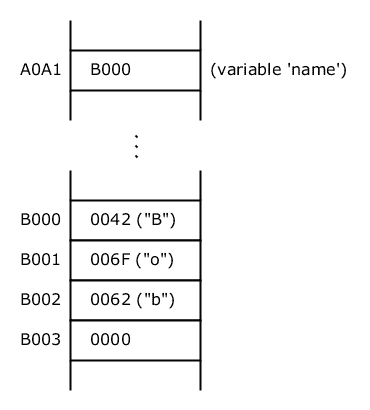
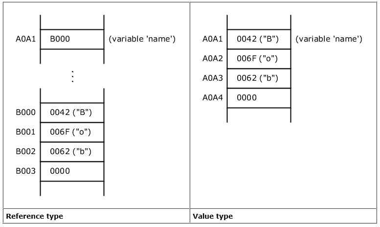

# 快速而全面的“空值”指南:它是什么，以及你应该如何使用它

> 原文：<https://www.freecodecamp.org/news/a-quick-and-thorough-guide-to-null-what-it-is-and-how-you-should-use-it-d170cea62840/>

克里斯蒂安·纽曼

# 快速而全面的'`null`'指南:它是什么，你应该如何使用它

`null`是什么意思？`null`是如何实现的？什么时候你应该在你的源代码中使用`null`，什么时候你应该*而不是*使用它？


### 介绍

`null`是许多编程语言中的一个基本概念。在用这些语言编写的各种源代码中，它无处不在。所以全面掌握`null`的思想是必不可少的。我们必须理解它的语义和实现，我们需要知道如何在我们的源代码中使用`null`。

程序员论坛上的评论有时会透露出一点与`null`的混淆。有些程序员甚至试图完全避免`null`。因为他们认为这是“百万美元错误”，这个词是由`null`的发明者东尼·霍尔创造的。

下面举个简单的例子:假设爱丽丝的`email_address`指向`null`。这是什么意思？这是否意味着爱丽丝没有电子邮件地址？或者她的电子邮件地址是未知的？或者这是秘密？还是仅仅意味着`email_address`是‘未定义的’或者‘未初始化的’？让我们看看。看完这篇文章后，每个人都应该能够毫不犹豫地回答这样的问题。

**注意:**本文尽可能与编程语言无关。解释是一般性的，并不局限于特定的语言。有关`null`的具体建议，请查阅您的编程语言手册。然而，本文包含一些用 Java 展示的简单源代码示例。但是把它们翻译成你喜欢的语言并不难。

### 运行时实现

在讨论`null`的含义之前，我们需要了解`null`在运行时是如何在内存中实现的。

**注:**我们来看看一个*典型*对`null`的实现。给定环境中的实际实现取决于编程语言和目标环境，可能与这里显示的实现不同。

假设我们有下面的源代码指令:

```
String name = "Bob";
```

这里我们声明了一个类型为`String`的变量，它的标识符`name`指向字符串`"Bob"`。

在这个上下文中说“指向”是很重要的，因为我们假设我们使用的是**引用类型**(而不是**值类型**)。稍后将详细介绍。

为简单起见，我们将做如下假设:

*   上述指令在一个 16 位的 CPU 上执行，具有 16 位的地址空间。
*   字符串编码为 UTF-16。它们以 0 结束(如在 C 或 C++中)。

下图是执行上述指令后的内存摘录:



**Figure 1: Variable `name` points to "Bob"**

上图中的内存地址是任意选择的，与我们的讨论无关。

我们可以看到，字符串`"Bob"`存储在地址 B000，占用 4 个存储单元。

变量`name`位于地址 A0A1。A0A1 的内容是 B000，是字符串`"Bob"`的起始内存位置。所以我们说:变量`name` *指向* `"Bob"`。

到目前为止一切顺利。

现在假设，在执行了上述指令之后，您执行了以下内容:

```
name = null;
```

现在`name`指向`null`。

这是内存中的新状态:


**Figure 2: Variable `name` points to `null`**

我们可以看到，字符串`"Bob"`没有任何变化，仍然存储在内存中。

注意:如果有一个垃圾收集器并且没有其他指向`"Bob"`的引用，那么存储字符串`"Bob"`所需的内存稍后可能会被释放，但是这与我们的讨论无关。

重要的是 A0A1(代表变量`name`的值)的内容现在是 0000。所以，变量`name`不再指向`"Bob"`。值 0(所有位为零)是存储器中用来表示`null`的典型值。这意味着*没有与`name`T6 相关联的值。你也可以把它想象成*没有数据*或者简单地说*没有数据*。*

注意:用于表示`null`的实际内存值是特定于实现的。例如， [Java 虚拟机规范](https://docs.oracle.com/javase/specs/jvms/se7/html/jvms-2.html#jvms-2.4)在第 *2.4 节的结尾陈述。*引用类型和值:"

> *Java 虚拟机规范没有强制要求具体的值编码`null`。*

**记住:**

如果一个引用指向`null`，这仅仅意味着有 **没有与它关联的值*。***

从技术上讲，分配给引用的内存位置包含值 0(所有位为零)，或者在给定环境中表示`null`的任何其他值。

### 表演

正如我们在上一节中了解到的，涉及到`null`的操作在运行时非常快并且容易执行。

只有两种操作:

*   初始化或设置对`null`(例如`name = null`)的引用:唯一要做的是改变一个存储单元的内容(例如将其设置为 0)。
*   检查引用是否指向`null`(例如`if name == null`):唯一要做的就是检查引用的存储单元是否保存值 0。

**记住:**

**在`null`上的操作非常快速和便宜。**

### 引用与值类型

到目前为止，我们假设使用**引用类型**。原因很简单:`null`对于**值类型**是不存在的。

为什么？

正如我们之前看到的，引用是指向存储值(例如字符串、日期、客户等等)的内存地址的**指针**。如果一个引用指向`null`，那么没有值与之相关联。

另一方面，根据定义，价值就是价值本身。不涉及指针。值类型存储为值本身。因此，`null`的概念对于值类型来说是不存在的。

下图展示了两者的区别。在左侧，您可以再次看到变量`name`是指向“Bob”的引用时的内存。右侧显示变量`name`为值类型时的内存。



我们可以看到，在值类型的情况下，值本身直接存储在与变量`name`相关联的地址 A0A1 中。

关于引用类型和值类型还有很多要说的，但是这超出了本文的范围。请注意，有些编程语言只支持引用类型，有些只支持值类型，有些(例如 C#和 Java)两者都支持。

**记住:**

`null`的概念只对**引用**类型存在。对于**值类型**，它不存在。

### 意义

假设我们有一个带有字段`emailAddress`的类型`person`。还假设，对于给定的人，我们称之为爱丽丝，`emailAddress`指向`null`。

这是什么意思？这是否意味着爱丽丝没有电子邮件地址？不一定。

正如我们已经看到的，我们可以断言的是*没有值与 emailAddress* 相关联。

但是*为什么*没有价值呢？`emailAddress`指向`null`的原因是什么？如果不知道来龙去脉，不知道历史，那就只能推测。`null`T5 的原因可能是:

爱丽丝没有电子邮件地址。或者…

爱丽丝有一个电子邮件地址，但是:

*   它还没有被输入数据库
*   这是秘密的(出于安全原因未透露)
*   在一个例程中有一个错误，它创建一个人对象而没有设置字段`emailAddress`
*   诸如此类。

在实践中，我们通常知道应用程序和上下文。我们直觉地将精确的含义与`null`联系起来。在一个简单而完美的世界里，`null`仅仅意味着爱丽丝实际上没有电子邮件地址。

当我们写代码的时候，为什么引用指向`null`的原因*通常是不相关的。我们只是检查`null`并采取适当的行动。例如，假设我们必须编写一个循环，为人员列表发送电子邮件。代码(Java)可能如下所示:*

```
for ( Person person: persons ) {    if ( person.getEmailAddress() != null ) {        // code to send email    } else {        logger.warning("No email address for " + person.getName());    }}
```

在上面的循环中，我们不关心`null`的原因。我们只是承认没有电子邮件地址的事实，记录一个警告，然后继续。

**记住:**

如果一个引用指向`null`，那么它总是意味着有 **没有与它关联的值*。***

在大多数情况下，`null`有一个**更具体的含义，这取决于上下文**。

### 为什么是`null`？

有时候*对*很重要，知道*为什么*一个引用指向`null`。

考虑医疗应用中的以下函数签名:

```
List<Allergy> getAllergiesOfPatient ( String patientId )
```

在这种情况下，返回`null`(或空列表)是不明确的。是说明患者没有过敏，还是说明还没有做过敏试验？这是两种语义上非常不同的情况，必须以不同的方式处理。否则结果可能会危及生命。

假设病人有过敏症，但过敏测试尚未完成，软件告诉医生“没有过敏症”。因此，我们需要更多的信息。我们需要知道*为什么*函数返回`null`。

人们可能会说:为了区分，如果还没有进行过敏测试，我们返回`null`,如果没有过敏，我们返回一个空列表。

不要这样！

由于多种原因，这是一个糟糕的数据设计。

返回`null`和返回空列表的不同语义需要很好地记录下来。众所周知，注释可能是错误的(即与代码不一致)，过时的，或者甚至是不可访问的。

对于调用该函数的客户端代码中的误用，没有保护措施。例如，下面的代码是错误的，但它编译时没有错误。此外，人类读者很难发现这个错误。不考虑`getAllergiesOfPatient:`的注释，只看代码是看不出错误的

```
List<Allergy> allergies = getAllergiesOfPatient ( "123" );				if ( allergies == null ) {    System.out.println ( "No allergies" );             // <-- WRONG!} else if ( allergies.isEmpty() ) {    System.out.println ( "Test not done yet" );        // <-- WRONG!} else {    System.out.println ( "There are allergies" );}
```

下面的代码也是错误的:

```
List<Allergy> allergies = getAllergiesOfPatient ( "123" );if ( allergies == null || allergies.isEmpty() ) {    System.out.println ( "No allergies" );             // <-- WRONG!} else {    System.out.println ( "There are allergies" );}
```

如果`getAllergiesOfPatient`的`null` /empty-logic 在未来发生变化，那么注释需要更新，所有客户端代码也需要更新。并且没有保护措施来防止忘记这些变化中的任何一个。

如果稍后有另一个病例需要区分(例如，过敏试验正在进行中—结果还没有出来)，或者如果我们想要为每个病例添加特定的数据，那么我们就陷入了困境。

所以函数需要返回更多的信息，而不仅仅是一个列表。

根据我们使用的编程语言，有不同的方法可以做到这一点。让我们来看看 Java 中一个*可能的*解决方案。

为了区分案例，我们定义了一个父类型`AllergyTestResult`，以及代表三个案例的三个子类型(`NotDone`、`Pending`和`Done`):

```
interface AllergyTestResult {}
```

```
interface NotDoneAllergyTestResult extends AllergyTestResult {}
```

```
interface PendingAllergyTestResult extends AllergyTestResult {    public Date getDateStarted();}
```

```
interface DoneAllergyTestResult extends AllergyTestResult {    public Date getDateDone();    public List<Allergy> getAllergies(); // null if no allergies                                         // non-empty if there are                                         // allergies}
```

正如我们所看到的，对于每个案例，我们都可以有与之相关的特定数据。

现在，`getAllergiesOfPatient`不是简单地返回一个列表，而是返回一个`AllergyTestResult`对象:

```
AllergyTestResult getAllergiesOfPatient ( String patientId )
```

客户端代码现在不太容易出错，如下所示:

```
AllergyTestResult allergyTestResult = getAllergiesOfPatient("123");
```

```
if (allergyTestResult instanceof NotDoneAllergyTestResult) {    System.out.println ( "Test not done yet" );   } else if (allergyTestResult instanceof PendingAllergyTestResult) {    System.out.println ( "Test pending" );   } else if (allergyTestResult instanceof DoneAllergyTestResult) {    List<Allergy> list = ((DoneAllergyTestResult)         allergyTestResult).getAllergies();    if (list == null) {        System.out.println ( "No allergies" );    } else if (list.isEmpty()) {        assert false;    } else {        System.out.println ( "There are allergies" );    }} else {    assert false;}
```

注意:如果你认为上面的代码相当冗长，有点难写，那么你不是一个人。一些现代语言允许我们更简洁地编写概念上相似的代码。空安全语言在编译时以可靠的方式区分可空值和不可空值——不需要注释引用的可空性，也不需要检查声明为非空的引用是否意外地被设置为`null`。

**记住:**

如果我们需要知道为什么没有与引用相关联的值，那么必须提供**附加数据来区分可能的情况**。

### 初始化

请考虑以下说明:

```
String s1 = "foo";String s2 = null;String s3;
```

第一条指令声明了一个`String`变量`s1`，并给它赋值`"foo"`。

第二条指令将`null`赋值给`s2`。

更有趣的指令是最后一条。没有值被明确分配给`s3`。因此，有理由问:在声明之后，`s3`的状态是什么？如果我们把`s3`写到 OS 输出设备会怎么样？

原来，在没有赋值的情况下声明的变量(或类字段)的状态取决于编程语言。此外，每种编程语言可能有针对不同情况的特定规则。例如，不同的规则适用于引用类型和值类型、类的静态和非静态成员、全局和局部变量等等。

据我所知，以下规则是遇到的典型变化:

*   声明变量而不赋值是非法的
*   `s3`中存储了一个任意值，这取决于执行时的内存内容——没有默认值
*   对于引用类型，默认值自动赋给`s3\.` ，对于值类型，默认值为`null.`，默认值取决于变量的类型。例如，`0`代表整数，`false`代表布尔值，等等。
*   `s3`的状态为“未定义”
*   `s3`的状态是‘未初始化’,任何使用`s3`的尝试都会导致编译时错误。

最好的选择是最后一个。所有其他选项都容易出错和/或不切实际——原因我们在这里不讨论，因为本文关注的是`null`。

例如，Java 对局部变量应用了最后一个选项。因此，以下代码会在第二行导致编译时错误:

```
String s3;System.out.println ( s3 );
```

编译器输出:

```
error: variable s3 might not have been initialized
```

**记住:**

如果声明了一个变量，但没有给它赋值，那么它的状态取决于几个因素，这些因素在不同的编程语言中是不同的。

在某些语言中，`null`是引用类型的默认值。

### 何时使用`null`(以及何时不使用)

基本规则很简单:`null`应该只在对象引用“没有关联值”时才被允许。(注意:对象引用可以是变量、常量、属性(类字段)、输入/输出参数等。)

例如，假设键入带有字段`name`和`dateOfFirstMarriage`的`person`:

```
interface Person {    public String getName();    public Date getDateOfFirstMarriage();}
```

每个人都有名字。因此，字段`name`没有“相关联的值”是没有意义的。字段`name`为*不可空*。将`null`分配给它是非法的。

另一方面，字段`dateOfFirstMarriage`不代表所需的值。不是每个人都结婚了。因此，`dateOfFirstMarriage`具有“无关联值”是有意义的。因此`dateOfFirstMarriage`是一个*可空的*字段。如果一个人的`dateOfFirstMarriage`字段指向`null`，那么这仅仅意味着这个人从未结过婚。

注意:不幸的是，大多数流行的编程语言没有区分可空类型和不可空类型。没有办法可靠地声明`null`永远不能被赋给给定的对象引用。在某些语言中，可以使用注释，比如 Java 中的非标准注释@Nullable 和@NonNullable。这里有一个例子:

```
interface Person {    public @Nonnull String getName();    public @Nullable Date getDateOfFirstMarriage();}
```

然而，编译器不使用这样的注释来确保空安全。尽管如此，它们对人类读者还是很有用的，ide 和静态代码分析器之类的工具也可以使用它们。

需要注意的是`null`不应用于表示错误情况。

考虑一个从文件读取配置数据的函数。如果文件不存在或为空，那么应该返回默认配置。以下是该函数的签名:

```
public Config readConfigFromFile ( File file )
```

在文件读取错误的情况下会发生什么？

干脆返回`null`？

不要！

每种语言都有自己的标准方式来通知错误情况并提供有关错误的数据，如描述、类型、堆栈跟踪等。多种语言(C#、Java 等。)使用异常机制，在这些语言中应该使用异常来表示运行时错误。`readConfigFromFile`不应该返回`null`来表示错误。相反，应该更改函数的签名，以便清楚地表明函数可能会失败:

```
public Config readConfigFromFile ( File file ) throws IOException
```

**记住:**

仅当对象引用有意义时，才允许`null`‘没有与之关联的值’。

不要使用`null`来表示错误情况。

### 零安全

考虑以下代码:

```
String name = null;int l = name.length();
```

在运行时，上面的代码导致了臭名昭著的**空指针错误**，因为我们试图执行一个指向`null`的引用方法。例如，在 C#中，抛出一个`NullReferenceException`，在 Java 中它是一个`NullPointerException`。

空指针错误非常严重。

它是许多软件应用程序中最常见的错误，也是软件开发史上无数麻烦的原因。`null`的发明者东尼·霍尔称之为“十亿美元的错误”。

但是东尼·霍尔(1980 年图灵奖获得者，快速排序算法的发明者)，也在他的演讲中暗示了一个解决方案:

> 最近的编程语言…已经引入了非空引用的声明。这就是我在 1965 年拒绝的解决方案。

与一些普遍的看法相反，罪魁祸首本身并不存在。问题是在许多编程语言中，*缺乏对`null`处理*的支持。例如，在撰写本文时(2018 年 5 月)， [Tiobe 索引](https://www.tiobe.com/tiobe-index/)中的前十种语言都没有对可空类型和不可空类型进行本机区分。

因此，一些新语言提供了编译时空安全和特定的语法，以便在源代码中方便地处理`null`。在这些语言中，上述代码会导致编译时错误。软件质量和可靠性显著提高，因为空指针错误令人高兴地消失了。

零安全是一个有趣的话题，值得单独写一篇文章。

**记住:**

只要有可能，使用一种支持编译时空安全的语言。

注意:有些编程语言(大多是 Haskell 这样的函数式编程语言)不支持`null`的概念。相反，他们使用**也许/可选模式** 来表示“缺少值”。编译器确保显式处理“无值”情况。因此，不会出现空指针错误。

### 摘要

以下是需要记住的要点总结:

*   如果一个引用指向`null`，它总是意味着没有*与*相关联。
*   在大多数情况下，`null`有更具体的含义，这取决于上下文。
*   如果我们需要知道*为什么*没有与引用相关联的值，那么必须提供额外的数据来区分可能的情况。
*   仅当对象引用有意义时，才允许`null`‘没有与之关联的值’。
*   不要使用`null`来表示错误情况。
*   `null`的概念只存在于引用类型。值类型不存在。
*   在某些语言中,`null`是引用类型的默认值。
*   手术非常快速而且便宜。
*   尽可能使用支持编译时空安全的语言。