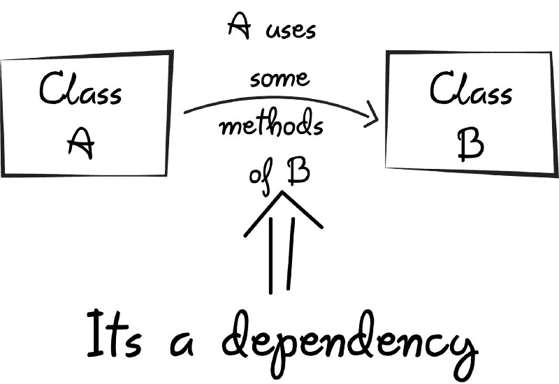
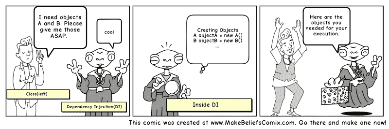

# 依赖注入快速介绍:什么是依赖注入，何时使用依赖注入

> 原文：<https://www.freecodecamp.org/news/a-quick-intro-to-dependency-injection-what-it-is-and-when-to-use-it-7578c84fa88f/>

作者:Bhavya Karia

### 介绍

> 在[软件工程](https://en.wikipedia.org/wiki/Software_engineering)、**依赖注入**中，一个对象(或静态方法)提供另一个对象的依赖的技术。依赖是一个可以被使用的对象(一个[服务](https://en.wikipedia.org/wiki/Service_(systems_architecture)))。

这是维基百科的定义，但还是不太容易理解。所以让我们更好地理解它。

在理解它在编程中的含义之前，让我们先看看它的一般含义，因为这将有助于我们更好地理解这个概念。

依赖或被依赖的意思是依靠某物来支持。就像如果我说我们过于依赖手机，这并不意味着我们依赖手机。

所以在开始 [**依赖注入**](https://en.wikipedia.org/wiki/Dependency_injection) 之前，首先让我们了解一下编程中的依赖是什么意思。

当类 A 使用类 B 的一些功能时，那么就说类 A 依赖于类 B。

Showing dependencies between classes

在 Java 中，在我们可以使用其他类的方法之前，我们首先需要创建该类的对象(即类 A 需要创建类 B 的实例)。

**所以，把创建对象的任务转移给别人，直接使用依赖，就叫依赖注入。**

What if code could speak?

### 为什么我应该使用依赖注入？

假设我们有一个汽车类，它包含各种对象，如车轮、发动机等。

在这里，car 类负责创建所有的依赖对象。现在，如果我们决定在未来放弃 **MRFWheels** 并想使用**横滨**车轮呢？

我们将需要重新创建一个新的横滨从属汽车对象。但是在使用依赖注入(DI)时，我们可以在运行时改变轮子(因为依赖可以在运行时注入，而不是在编译时)。

您可以将 DI 视为我们代码中的中间人，他负责创建首选的 wheels 对象并将其提供给 Car 类。

它使我们的汽车类独立于创建轮子、电池等对象。

#### 基本上有三种类型的依赖注入:

1.  **构造函数注入:**通过类构造函数提供依赖关系。
2.  **setter 注入:**客户端公开一个 setter 方法，注入器用它来注入依赖。
3.  **接口注入:**依赖项提供了一个注入器方法，将依赖项注入到传递给它的任何客户端。客户端必须实现一个接口，该接口公开一个接受依赖关系的 [setter 方法](https://en.wikipedia.org/wiki/Setter_method)。

**所以现在依赖注入的职责是:**

1.  创建对象
2.  知道哪些类需要这些对象
3.  给他们提供所有这些东西

如果对象中有任何变化，那么 DI 会检查它，它不应该涉及使用这些对象的类。这样，如果对象在将来发生变化，那么 DI 就有责任向类提供适当的对象。

#### 控制反转——DI 背后的概念

这表明一个类不应该静态地配置它的依赖项，而应该由外部的其他类来配置。

是 **S.O.L.I.D** 的第五个原则——由[**Bob**](https://en.wikipedia.org/wiki/Robert_C._Martin)大叔提出的面向对象编程和设计的五个基本原则——声明一个类应该依赖于抽象而不是依赖于具体(简单来说，硬编码)。

根据这些原则，一个类应该专注于完成它的职责，而不是创建它需要完成这些职责的对象。这就是**依赖注入**发挥作用的地方:它为类提供所需的对象。

*注:如果你想了解鲍勃大叔的**坚实的**原理，那么你可以点击这个[链接](https://scotch.io/bar-talk/s-o-l-i-d-the-first-five-principles-of-object-oriented-design#toc-single-responsibility-principle)。*

#### 使用 DI 的好处

1.  有助于单元测试。
2.  减少了锅炉板代码，因为依赖关系的初始化是由注入器组件完成的。
3.  扩展应用程序变得更加容易。
4.  有助于实现松散耦合，这在应用程序编程中非常重要。

#### DI 的缺点

1.  学习起来有点复杂，如果过度使用会导致管理问题和其他问题。
2.  许多编译时错误被推到运行时。
3.  依赖注入框架是通过反射或动态编程实现的。这可能会妨碍 IDE 自动化的使用，例如“查找引用”、“显示调用层次结构”和安全重构。

你可以自己实现依赖注入(纯香草)或者使用第三方库或框架。

#### **实现 DI 的库和框架**

*   [春天](https://www.tutorialspoint.com/spring/spring_dependency_injection.htm) (Java)
*   [谷歌指南](https://github.com/google/guice) (Java)
*   [匕首](http://square.github.io/dagger/) (Java 和 Android)
*   [温莎城堡](https://github.com/castleproject/Windsor)(。网)
*   [团结](https://www.microsoft.com/en-us/download/details.aspx?id=39944)(。网)

**要了解更多关于依赖注入的知识，您可以查看下面的资源:**

[**Java 依赖注入— DI 设计模式示例教程— JournalDev**](https://www.journaldev.com/2394/java-dependency-injection-design-pattern-example-tutorial)

[**在 Java 中使用依赖注入—简介—教程—沃盖拉**](http://www.vogella.com/tutorials/DependencyInjection/article.html)

[**反转控制容器和依赖注入模式—马丁·福勒**](https://www.martinfowler.com/articles/injection.html)

希望有帮助！

如果你喜欢这篇文章，并想阅读更多精彩的文章，那么请在这里关注我( [Bhavya Karia](https://medium.com/@bhavyankaria) )，并表示你的支持，因为它激励我写更多。

如果你有任何问题或反馈给我，让我们在 [LinkedIn、](https://www.linkedin.com/in/bhavya-karia-1b115a93/) [、Twitter、](https://twitter.com/thebhavyakaria)上联系。

#### 编辑 1:

***感谢 [Sergey Ufocoder](https://www.freecodecamp.org/news/a-quick-intro-to-dependency-injection-what-it-is-and-when-to-use-it-7578c84fa88f/undefined) 现在这篇文章已经被转换成俄语。我的俄罗斯朋友和所有能看懂俄语的人都来读一读吧。***

[链接到文章](https://medium.com/@xufocoder/a-quick-intro-to-dependency-injection-what-it-is-and-when-to-use-it-de1367295ba8)

另外，如果你想在 JavaScript 中应用 DI 并且正在寻找一个库，那么 [Jo Surikat](https://www.freecodecamp.org/news/a-quick-intro-to-dependency-injection-what-it-is-and-when-to-use-it-7578c84fa88f/undefined) 建议你试试他的库。

[Di-Ninja](https://di-ninja.github.io/di-ninja/)

***由 [Nicolas Froidure](https://www.freecodecamp.org/news/a-quick-intro-to-dependency-injection-what-it-is-and-when-to-use-it-7578c84fa88f/undefined) 提出了一个更棒的 JavaScript DI 库。***

[刀割](https://github.com/nfroidure/knifecycle)

#### 编辑 2:

如果你是一名 PHP 开发人员，那么不要担心，我会为你提供一切。[戈登·福赛思](https://www.freecodecamp.org/news/a-quick-intro-to-dependency-injection-what-it-is-and-when-to-use-it-7578c84fa88f/undefined)推荐了这个神奇的图书馆，你们可能都想去试试。

[太阳](https://github.com/rdlowrey/auryn)

感谢我收到的所有善意的话语。请分享这篇文章，让越来越多的人受益。

如果你学到了一些东西，请分享这个故事！