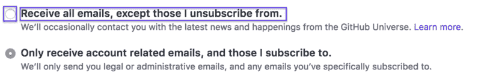
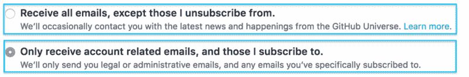

# 块元素修改器(BEM)快速介绍

> 原文：<https://www.freecodecamp.org/news/a-quick-introduction-to-block-element-modifiers-bem-9df46d29b64c/>

迈克尔·奥祖梅纳

# 块元素修改器(BEM)快速介绍

Block Element Modifier

你好。所以你想更好地了解 BEM？我猜如果你正在读这篇文章，你可能不知道 BEM 代表什么。以防不知道，它是 [**B** 锁 **E** 元素和 **M** 修饰符](http://getbem.com/)的缩写。

#### **什么是 BEM？**

> BEM 是一种设计方法，帮助你在前端开发中创建可重用的组件和代码共享。—getbem.com

这意味着 BEM 是一个帮助你编写 HTML 和 CSS 代码的方法系统，这样就可以很容易地重用和与代码的其他部分共享。

### **贝姆在行动。**

现在你知道了边界元法的定义，但是你可能不知道它是什么样子或者它是如何工作的。正如我前面提到的，BEM 是一个缩写，所以让我们来看看每个单词以及它们的意思。

#### **块**

“块”是指可以独立存在并且仍然有意义的任何实体。块的例子有`header`、`input`和`checkbox`。**非**块的例子有标题、列表中的一项或复选框的标签。

如果我们应该删除标记无线电输入的文本，并把它放在自己的位置上，它将不再有意义。

看看这个:

如果概述的部分被分割成单独的块，它们对用户来说将不再有任何意义。

这是真正的分块:

如果我移除其中的任何一块并扔掉，另一块对用户来说仍然有意义。但是，在这种情况下，它对用户没有什么用处，因为它是单选按钮而不是复选框。

将一个块看作几个元素(或其他块)的任意组合(或单个 HTML 标签)是很重要的，当它单独放置时对用户来说是有意义的。

#### **元素**

一个元素现在应该更容易理解了，因为我在谈论**块**时解释过它。块中在块外没有语义意义的那些部分是元素。

让我们再来看看这个:

突出显示的部分是元素，因为它们有助于定义块是什么。

上面屏幕截图的代码类似于:

我们有三个元素组成了`option`块:`option__text`、`option__radio-button`、`option__note`。然而，我们可以将这些元素中的一个变成它自己的块:

元素`option__note`现在是块`note`。这意味着我们可以以一种对用户有用的方式在`option`块之外找到`note`。

#### 修改

修改器是改变块或元素的外观或行为的标志。例如:

这两个按钮是同一块，但它们看起来不同。BEM 给我们的能力是让我们使用同一块积木两次，并且仍然让它们看起来非常不同。

让我们看看它的代码是怎样的:

默认情况下，按钮是白底蓝字。为了得到一个变体，我们添加了一个`button--green`标志，它会使按钮变成绿色并带有白色文本。

根据 BEM 规则，我们的标志`button--green`有一个“副作用”,可能会导致混淆，这就是`box-shadow`属性。我们的旗帜做了一些它的名字没有告诉我们的事情。但是没关系，因为在我们的小项目中，我们永远不会有一个带`box-shadow`的绿色按钮。如果我们真的这么做了，我们可以拆散这面旗帜:

现在，当我们需要一个带有方框阴影的绿色按钮时，我们将只添加`button--green`标志。同样的事情也适用于`color`属性。

### **结论**

BEM 是编写和组织 HTML 和 CSS 代码的一种非常好的方式。本指南并没有涵盖 BEM 的所有内容，但它应该足以让您对该方法有一个坚实的理解。你可以在这里阅读更多关于 BEM 的内容。

我希望你从中学到了一些东西，并且对 BEM 以及它在现实世界中的样子有了更好的理解。如果你这样做了，不要犹豫留下评论和一些掌声。

有什么问题吗？可以在 twitter [@THEozmic](https://twitter.com/THEozmic) 给我发个 DM。