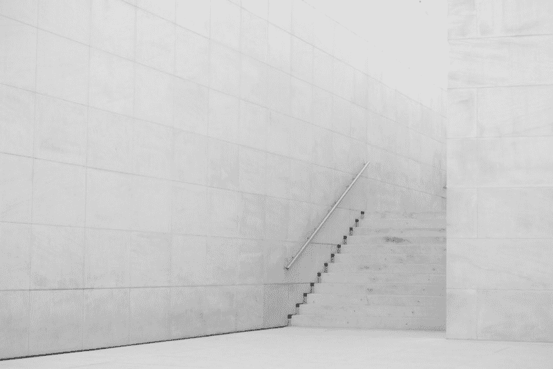
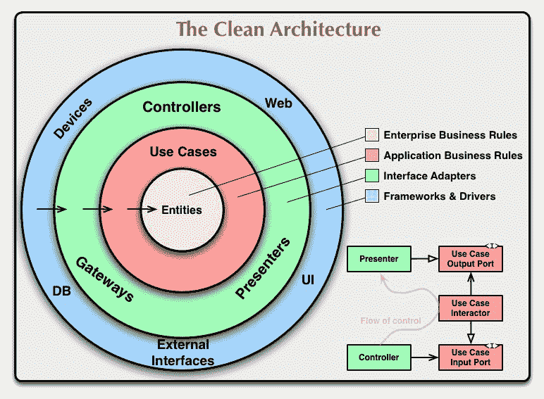
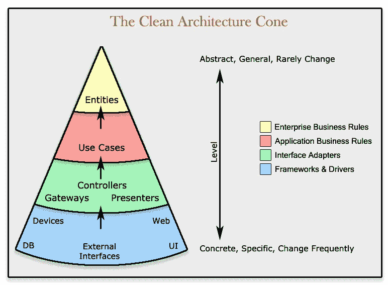
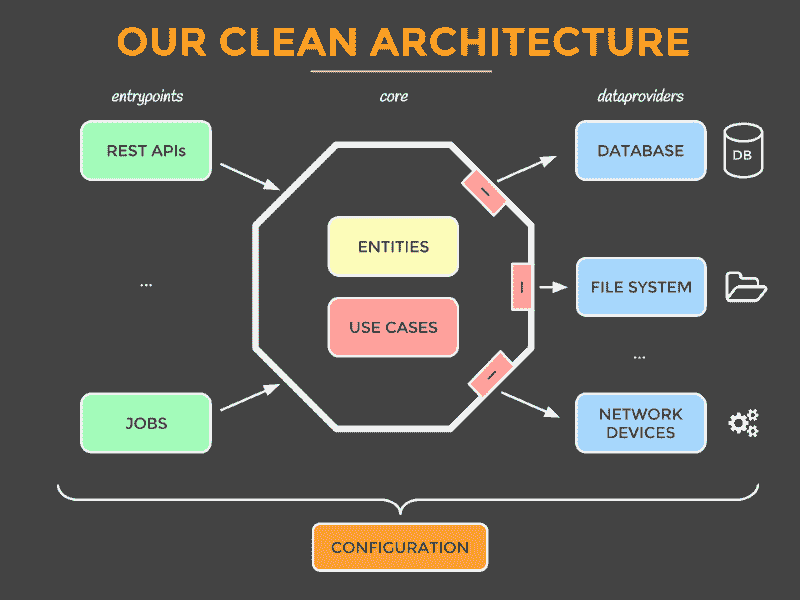
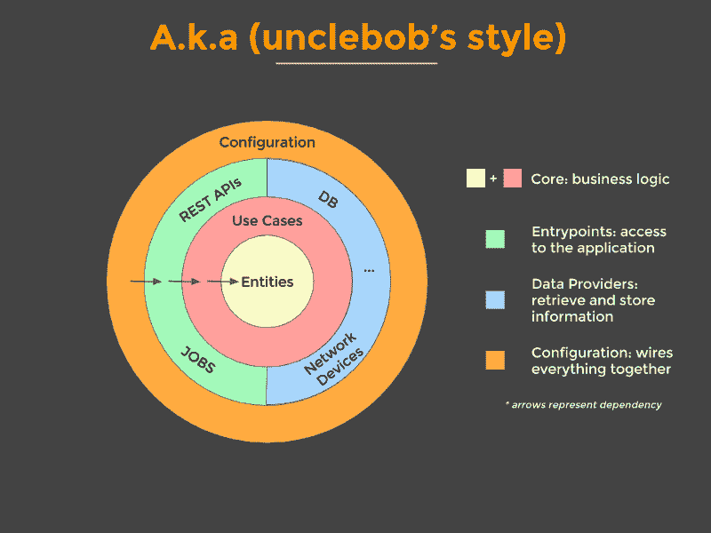
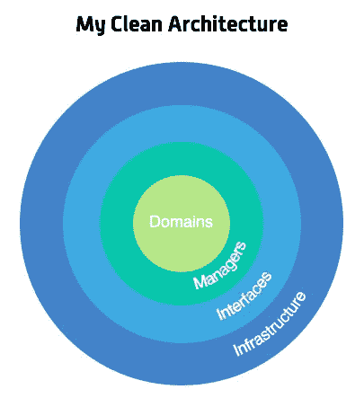
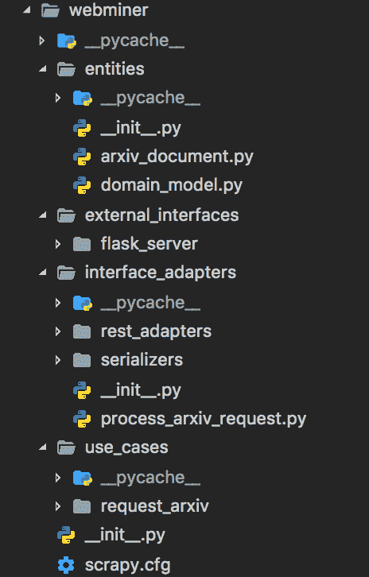

# 清洁建筑的快速介绍

> 原文：<https://www.freecodecamp.org/news/a-quick-introduction-to-clean-architecture-990c014448d2/>

丹尼尔·多伊奇

# 清洁建筑的快速介绍

Photo by Rubén García on Unsplash — [https://unsplash.com/photos/R-wQExeiGrc](https://unsplash.com/photos/R-wQExeiGrc)

在我开始参与的一个开源项目中,“干净架构”的概念带给了我。

首先，这是相当压倒性的，但在一些阅读之后，它是有意义的。我想如果我把我的想法写下来，可能会对别人有帮助。

### 目录

*   [视觉表现](https://github.com/Createdd/Writing/blob/master/2018/articles/CleanA.md#visual-representations)
*   [概念——以要点形式呈现](https://github.com/Createdd/Writing/blob/master/2018/articles/CleanA.md#the-concept---presented-in-bullet-points)
*   [代码示例](https://github.com/Createdd/Writing/blob/master/2018/articles/CleanA.md#code-example)
*   [资源](https://github.com/Createdd/Writing/blob/master/2018/articles/CleanA.md#resources)

### 视觉表现

我认为从一些想象开始总是好的。

以下是这个概念最常见的图片。

Source and credit: [https://8thlight.com/blog/uncle-bob/2012/08/13/the-clean-architecture.html](https://8thlight.com/blog/uncle-bob/2012/08/13/the-clean-architecture.html) .[https://www.codingblocks.net/podcast/clean-architecture-make-your-architecture-scream/](https://www.codingblocks.net/podcast/clean-architecture-make-your-architecture-scream/)

Source and credit: Mattia Battiston, under CC BY 4.0, [https://github.com/mattia-battiston/clean-architecture-example](https://github.com/mattia-battiston/clean-architecture-example)

Source and credit: [https://marconijr.com/posts/clean-architecture-practice/](https://marconijr.com/posts/clean-architecture-practice/)

### 概念——以要点形式呈现

从来源和信用扩展:[马蒂亚·巴蒂斯顿，根据 CC 由 4.0](https://github.com/mattia-battiston/clean-architecture-example)

#### 它能提供的价值

*   遵循测试金字塔的有效测试策略
*   框架被隔离在单独的模块中。当(不是如果)我们改变主意的时候，我们只需要在一个地方做出改变。该应用程序有用例，而不是绑定到一个 CRUD 系统
*   尖叫的建筑也叫尖叫的预期用途。当您查看包结构时，您会对应用程序的功能有一个感觉，而不是看到技术细节
*   所有的业务逻辑都在一个用例中，所以很容易找到，不会在其他地方重复
*   很难做错误的事情，因为模块强制编译依赖。如果你试图使用你不应该使用的东西，应用程序就不会编译
*   它总是准备好部署，将对象的连线留到最后。或者通过使用特性标志，所以我们得到了持续集成的所有好处
*   多个作品的故事，以便不同的对可以很容易地在同一时间工作在同一故事，以更快地完成它
*   一旦你对微服务有了更多的了解，你就可以在以后的微服务中拆分出清晰的用例

#### 实体

*   表示您的域对象
*   仅应用通常适用于整个实体的逻辑(例如，验证主机名的格式)
*   简单对象:没有框架，没有注释

#### 用例

*   代表您的业务行为:这是您可以用应用程序做的事情。期望每个业务行为有一个用例
*   纯业务逻辑，普通代码(除了一些实用程序库)
*   用例不知道谁触发了它，也不知道结果将如何呈现(例如，可能在网页上，或者—作为 JSON 返回，或者简单地记录，等等)。)
*   抛出业务异常

#### 接口/适配器

*   从多个来源(数据库、网络设备、文件系统、第三方等)检索数据并向其存储数据。)
*   为他们需要的数据定义接口，以便应用一些逻辑。一个或多个数据提供者将实现接口，但是用例不知道数据来自哪里
*   实现用例定义的接口
*   有许多与应用程序交互的方法，通常涉及交付机制(例如，REST APIs、调度作业、GUI 和其他系统)
*   触发一个用例，并将结果转换成交付机制的适当格式
*   MVC 的控制器

#### 外部接口

*   使用任何最合适的框架(无论如何，它们在这里都是孤立的)

### 代码示例

参见 [GitHub](https://github.com/Createdd/web-miner/tree/master/webminer) 上的结构。

首先，理解干净的架构是一套组织原则是很重要的。因此，只要核心思想保持不变，一切都可以进行个人调整。链接存储库是最初项目的一个分支，它给我带来了这个架构设计的想法。也可以随意检查原始项目，因为它反映了进一步的改进。

webminer 文件夹分为几个基本层:

1.  实体
2.  使用案例
3.  接口 _ 适配器
4.  外部接口

Structure of the webminer folder

它应该反映设计模式的最基本的方法。

*   从`entities`开始，你可以看到这个项目的核心型号是`arxiv_document`
*   下一个文件夹`use_cases`显示了我们的用例，即请求 arxiv 页面
*   之后，我们浏览为 REST 应用程序中的流程请求或序列化提供适配器的`interface_adapters`文件夹
*   最后也是最后一层是`external_interfaces`。这是我们使用 flask 服务器实现 REST 功能的地方

所有这些层都依赖于核心层，而不是相反。

**一个重要的注意事项:这在存储库中没有 100%正确地实现。**

为什么？因为用例实际上是不同的。实际上，主要的用例是提供结构化数据。另一个用例是从 arxiv 页面获取数据。

你发现架构中的这个错误了吗？如果是，恭喜你！你不仅给这篇文章带来了足够的好奇心，而且你可能很好地理解了这些原则，足以构建你自己的案例并在现实中应用这些概念！

你同意吗？如果没有，为什么？感谢阅读我的文章！欢迎留下任何反馈！

### 资源

以下是我发现的一些有助于理解“干净架构”概念的文章:

*   [https://8 thlight . com/blog/uncle-bob/2012/08/13/the-clean-architecture . html](https://8thlight.com/blog/uncle-bob/2012/08/13/the-clean-architecture.html)
*   [https://www . coding blocks . net/podcast/clean-architecture-make-your-architecture-scream/](https://www.codingblocks.net/podcast/clean-architecture-make-your-architecture-scream/)
*   [https://github . com/mattia-bat tiston/clean-architecture-example](https://github.com/mattia-battiston/clean-architecture-example)
*   [https://medium . com/@ tiagoflores _ 23976/how-choose-the-appropriate-IOs-architecture-MVC-MVP-mvvm-viper-or-clean-architecture-2d1e 9 b 87d 48](https://medium.com/@tiagoflores_23976/how-choose-the-appropriate-ios-architecture-mvc-mvp-mvvm-viper-or-clean-architecture-2d1e9b87d48)
*   [https://de . slide share . net/himanshuudhat 1/MVP-clean-architecture](https://de.slideshare.net/HimanshuDudhat1/mvp-clean-architecture)
*   [https://software engineering . stack exchange . com/questions/336677/MVP-and-clean-architecture 的区别是什么](https://softwareengineering.stackexchange.com/questions/336677/what-is-the-difference-between-mvp-and-clean-architecture)
*   [https://engineering . 21 buttons . com/clean-architecture-in-django-d 326 a4 ab 86 a 9](https://engineering.21buttons.com/clean-architecture-in-django-d326a4ab86a9)
*   [https://gist . github . com/ygrenzinger/14812 a 56 b 9221 c 9 feca 0 b 3621518635 b](https://gist.github.com/ygrenzinger/14812a56b9221c9feca0b3621518635b)
*   [https://medium . freecodecamp . org/how-to-write-robust-apps-consistently-with-the-clean-architecture-9 bdca 93 e 17 b](https://medium.freecodecamp.org/how-to-write-robust-apps-consistently-with-the-clean-architecture-9bdca93e17b)
*   [https://marconijr.com/posts/clean-architecture-practice/](https://marconijr.com/posts/clean-architecture-practice/)

丹尼尔是一名商业法的法学硕士学生，在维也纳担任软件工程师和技术相关活动的组织者。他目前的个人学习努力集中在机器学习上。

关系

*   [LinkedIn](https://www.linkedin.com/in/createdd)
*   [Github](https://github.com/Createdd)
*   [中等](https://medium.com/@ddcreationstudi)
*   [推特](https://twitter.com/_createdd)
*   [Steemit](https://steemit.com/@createdd)
*   [哈希节点](https://hashnode.com/@DDCreationStudio)