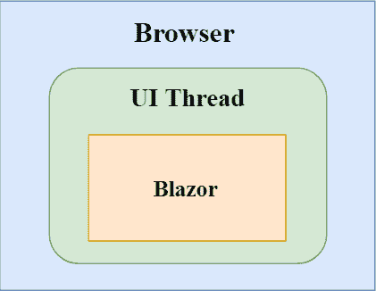
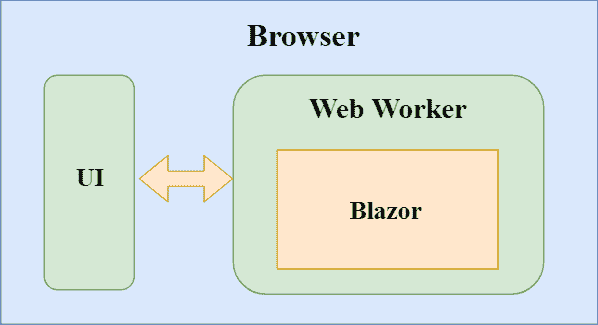
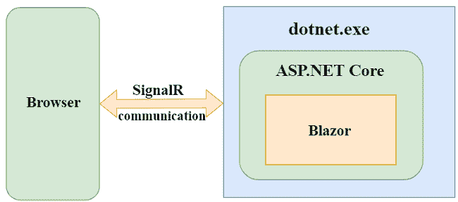
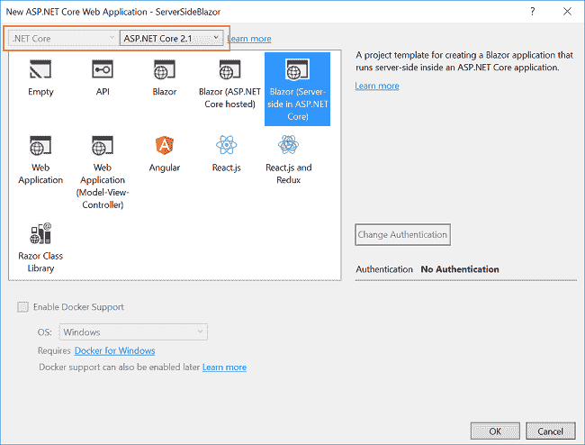
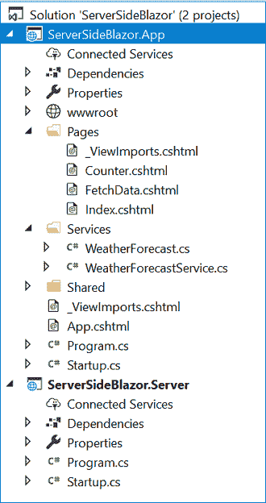
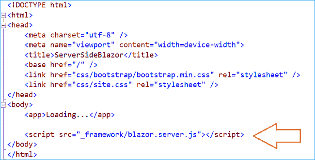
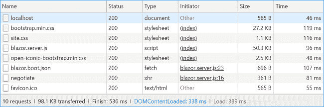

# 服务器端 Blazor 应用快速介绍

> 原文：<https://www.freecodecamp.org/news/a-quick-introduction-to-server-side-blazor-apps-c991e59c90de/>

### 介绍

我们都知道 Blazor 框架是一个客户端 web 框架。但是有没有可能运行一个独立于 UI 线程的 Blazor 应用程序呢？Blazor 的最新版本 0.5.0 为我们提供了在渲染过程之外的独立过程中运行它的灵活性。在本文中，我们将探讨服务器端 Blazor。

### 什么是服务器端 Blazor？

由于 Blazor 是一个客户端 web 框架，组件逻辑和 DOM 交互都发生在同一个过程中。



然而，Blazor 框架的设计足够智能和灵活，可以独立于渲染过程运行应用程序。例如，我们可以在独立于 UI 线程的 web worker 线程中运行 Blazor。

在这个场景中，UI 线程会将事件推送到 Blazor 工作线程，Blazor 会根据需要将 UI 更新推送到 UI 线程。虽然 Blazor 还不支持这种功能，但是 Blazor 框架是为处理这种情况而设计的，并且有望在未来的版本中支持它。



从 Blazor 0.5.0 开始，我们可以在服务器上运行 Blazor 应用程序。这意味着我们可以在。NET 核心，而其他功能，如用户界面，更新。事件处理和 JavaScript 互操作调用由网络上的 SignalR 连接处理。的。NET 部件运行在 CoreCLR 下而不是 WebAssembly 下，这为我们提供了访问完整。NET 生态系统，调试，JIT 编译，等等。这增加了 Blazor 框架的可扩展性，因为服务器端 Blazor 使用与运行客户端 Blazor 应用程序相同的组件模型。



让我们创建我们的第一个服务器端 Blazor 应用程序，并探索它以更好地理解这个新特性。

### 先决条件

*   安装。NET Core 2.1 以上 SDK 从[这里](https://www.microsoft.com/net/learn/get-started-with-dotnet-tutorial#windowscmd)
*   从此处[安装 Visual Studio 2017 v15.7 或以上版本](https://visualstudio.microsoft.com/downloads/)
*   从[这里](https://marketplace.visualstudio.com/items?itemName=aspnet.blazor)安装 ASP.NET 核心 Blazor 语言服务扩展

v15.7 以下的 Visual Studio 2017 版本不支持 Blazor 框架。

### 创建服务器端 Blazor 应用程序

打开 Visual Studio 并选择文件>>新建>>项目。

选择项目后，将会打开一个“新项目”对话框。选择。NET Core 内的 Visual C#菜单从左侧面板。然后，选择“ASP。NET Core Web Application”从可用的项目类型。将项目命名为 **ServerSideBlazor** 并按 OK。


单击 OK 后，将打开一个新对话框，要求您选择项目模板。您可以在模板窗口的左上角看到两个下拉菜单。选择”。NET Core”和“ASP。NET Core 2.1 英寸。然后，选择“Blazor(ASP.NET 核心中的服务器端)”模板并按 OK。



这将创建我们的服务器端 Blazor 解决方案。您可以在解决方案资源管理器中看到文件夹结构，如下图所示:



该解决方案有两个项目文件:

1.  ServerSideBlazor。App:这是我们的 ASP.NET 核心托管项目。
2.  ServerSideBlazor。服务器:这包含我们的服务器端 Blazor 应用程序。

我们所有的组件逻辑都在服务器端的 Blazor 应用程序中。然而，该逻辑并不在浏览器的客户端运行，而是在 ASP.NET 核心主机应用程序的服务器端运行。该应用程序使用 **blazor.server.js** 进行引导，而不是普通 blazor 应用程序使用的 blazor.webassembly.js。这允许应用程序通过网络建立 SignalR 连接，以处理 UI 更新和事件转发。**blazor . server . js***出现在“\ServerSideBlazor。app \ bin \ Debug \ net standard 2.0 \ dist \ _ framework "文件夹，并且将它包含在项目中的<脚本>标记出现在 wwwroot/Index.html 文件中。*



**blazor.server.js** 是唯一将服务器端 blazor 应用与客户端 Blazor 应用分开的组件。如果我们在 index.html 文件中提供一个对 **blazor.webassembly.js** 的引用，而不是 **blazor.server.js** ，那么这个应用程序将表现得像一个客户端 blazor 应用程序。

Blazor 应用程序由 ASP.NET 核心应用程序托管，该应用程序还设置了 SignalR 端点。由于 Blazor 应用程序运行在服务器上，事件处理逻辑可以直接访问服务器资源和服务。

例如，如果我们想获取任何数据，我们不再需要发出 HTTP 请求。相反，我们可以在服务器上配置一个服务，并使用它来检索数据。

在我们已经创建的示例应用程序中， **WeatherForecastService** 是在“ServerSideBlazor”中定义的。应用程序/服务”文件夹。

```
using System;using System.Linq;using System.Threading.Tasks;namespace ServerSideBlazor.App.Services{    public class WeatherForecastService    {        private static string[] Summaries = new[]        {            "Freezing", "Bracing", "Chilly", "Cool", "Mild", "Warm", "Balmy", "Hot", "Sweltering", "Scorching"        };        public Task<WeatherForecast[]> GetForecastAsync(DateTime startDate)        {            var rng = new Random();            return Task.FromResult(Enumerable.Range(1, 5).Select(index => new WeatherForecast            {                Date = startDate.AddDays(index),                TemperatureC = rng.Next(-20, 55),                Summary = Summaries[rng.Next(Summaries.Length)]            }).ToArray());        }    }}
```

此外，我们需要在 ServerSideBlazor.App/startup.cs"文件的 **ConfigureServices** 方法中配置服务。

```
public void ConfigureServices(IServiceCollection services){    services.AddSingleton<WeatherForecastService>();}
```

然后，我们将服务注入到 **FetchData.cshtml** 视图页面中，在这里调用方法 **GetForecastAsync** 来获取数据。

```
@using ServerSideBlazor.App.Services@page "/fetchdata"@inject WeatherForecastService ForecastService// HTML DOM here.@functions {    WeatherForecast[] forecasts;    protected override async Task OnInitAsync()    {        forecasts = await ForecastService.GetForecastAsync(DateTime.Now);    }}
```

继续在谷歌浏览器中启动应用程序。它将打开一个浏览器窗口，该应用程序将看起来像一个正常的 Blazor 应用程序。打开 Chrome DevTools。导航到“网络”选项卡，您可以看到该应用程序没有下载任何。NET 运行库或应用程序程序集。



这是因为应用程序是在服务器端运行的。网芯。由于应用程序启动时不下载依赖项，因此应用程序的大小较小。与普通的 Blazor 应用程序相比，它的加载速度也更快。

### 服务器端 Blazor 的优势

服务器端 Blazor 应用程序为我们提供了许多好处:

1.  因为 UI 更新是通过 SignalR 连接处理的，所以我们可以避免不必要的页面刷新。
2.  应用程序下载大小更小，初始应用程序加载更快。
3.  Blazor 组件可以充分利用服务器功能，比如使用。NET Core 兼容的 API。
4.  它还将支持现有的。NET 工具，如调试应用程序和 JIT 编译。
5.  因为服务器端 Blazor 运行在一个本地。NET 核心进程，并且不在 Mono WebAssembly 下，它在不支持 WebAssembly 的浏览器上也受支持。

但是服务器端 blazor 应用也有一些缺点:

1.  由于 UI 交互涉及信号通信，它在网络调用中增加了一个额外的步骤，导致了一些延迟。
2.  应用程序的可扩展性(处理多个客户端连接)也是一个挑战。

### 结论

我们已经了解了 Blazor 0.5.0 版本中引入的最新服务器端 Blazor 应用程序，并且我们现在了解了它与普通客户端 Blazor 应用程序的不同之处。我们还讨论了使用服务器端 blazor 应用程序优于客户端 Blazor 应用程序的优缺点。

获取我的书 [Blazor 快速入门指南](https://www.amazon.com/Blazor-Quick-Start-Guide-applications/dp/178934414X/ref=sr_1_1?ie=UTF8&qid=1542438251&sr=8-1&keywords=Blazor-Quick-Start-Guide)以了解更多关于 Blazor 的信息。

你可以在这里查看我在 Blazor 上的其他文章。

准备面试？阅读我关于技术面试的 C#编码问题的文章

### 请参见

*   [ASP.NET 核心 Blazor 入门](http://ankitsharmablogs.com/asp-net-core-getting-started-with-blazor/)
*   [ASP.NET 核心—使用 Blazor 的 CRUD 和实体框架核心](http://ankitsharmablogs.com/asp-net-core-crud-using-blazor-and-entity-framework-core/)
*   [使用 EF 核心在 Blazor 中级联 DropDownList](http://ankitsharmablogs.com/cascading-dropdownlist-in-blazor-using-ef-core/)
*   [使用 Blazor 的 Razor 页面创建 SPA](http://ankitsharmablogs.com/creating-a-spa-using-razor-pages-with-blazor/)
*   [在 IIS 上部署 Blazor 应用程序](http://ankitsharmablogs.com/deploying-a-blazor-application-on-iis/)
*   [Blazor 中的 JavaScript 互操作](http://ankitsharmablogs.com/javascript-interop-in-blazor/)

最初发表于[https://ankitsharmablogs.com/](https://ankitsharmablogs.com/)