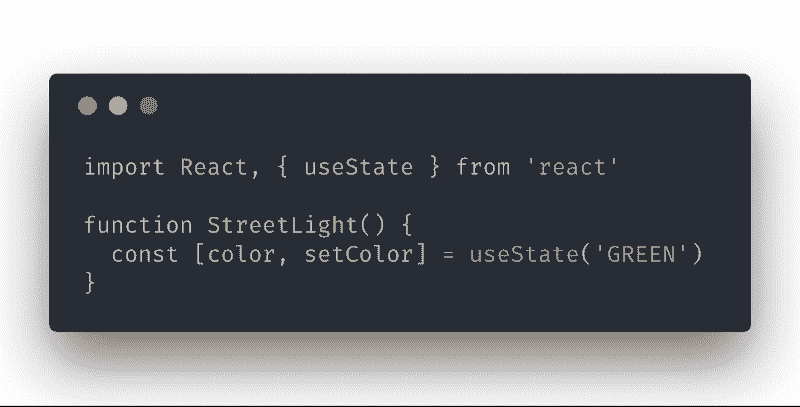
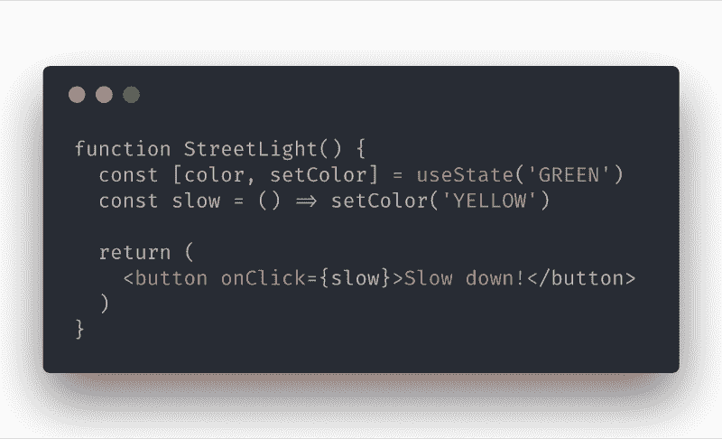
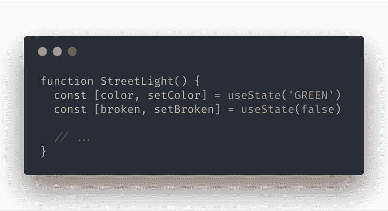

# React 状态钩子的快速介绍

> 原文：<https://www.freecodecamp.org/news/a-quick-introduction-to-the-react-state-hook-9910f298eefb/>

杰克·威斯勒

# React 状态钩子的快速介绍

“time lapse photography of tunnel” by [Mathew Schwartz](https://unsplash.com/@cadop?utm_source=medium&utm_medium=referral) on [Unsplash](https://unsplash.com?utm_source=medium&utm_medium=referral)

[React Hooks](https://reactjs.org/docs/hooks-intro.html) 提案附带了一些[内置钩子](https://reactjs.org/docs/hooks-reference.html)，它们专注于做一件事，比如为一个功能组件提供状态或上下文。你也可以用这些作为构建模块来创建你自己的[。](https://reactjs.org/docs/hooks-custom.html)

在最近的一篇帖子中，我分享了一些关于 hooks 提议的个人想法。这篇文章将更具技术性，因为我将进一步详细阐述我认为最重要的钩子:`useState`。

在写这篇文章的时候，钩子仍然是一个实验性的提议。这篇文章中的任何内容都不应该被认为是最终的。请记住这一点。目前有一个[开放 RFC](https://github.com/reactjs/rfcs/pull/68) ，在这里你可以了解最新的提议，甚至可以说出你的担忧。

React 的`v16.7.0-alpha`中有钩子。我已经建立了一个[代码沙箱](https://codesandbox.io/s/1z16jj9y24)，如果你想跟随这篇文章中的例子，它会让你很快上手。

### 今日反应状态

如果您想要 React 中有状态的组件，目前您唯一的选择就是将该组件编写为一个类。这是我感到沮丧的一个原因。我经常会发现自己花费了大量的精力考虑是否要将一个完全可以接受的*函数组件重构为一个类，仅仅是为了保持某种状态。*

我会说服自己避免这样的重构对我最有利。最终我会发现自己掉进了状态管理策略、库和*“其他解决方案”*的兔子洞里。

如果事情*真的*变糟了，我会开始问这个组件甚至*是否首先需要*状态，好像这是应该避免的事情。

这听起来很过分，而且可能确实如此。但是已经发生了。如果你花了大量的时间使用 React，你可能会发现自己也陷入了这种徒劳无功的境地(或者可能只是我？).

给组件添加状态应该感觉很自然，但是当我在写一个类的时候很难感觉到自然。

### 进入`useState`钩

使用`useState`钩子，功能组件现在可以保持本地状态。

Made with [carbon.now.sh](https://carbon.now.sh)

`useState`是一个接受初始状态并返回包含两项的数组的函数:

1.  当前状态
2.  可以被调用来更新状态的函数

由于数组析构的工作方式，我们可以随意命名由`useState`返回的项。API 对我们没有任何约束。按照惯例，React 生态系统似乎正在采用`[value, setValue]`语法。

在上面的例子中，`color`是状态值，并被初始化为`'GREEN'`。可以调用`setColor`函数来更新该值。

注意，与类组件不同，函数组件**中的状态**不需要成为对象。这里只是一个字符串。

另一个重要的注意事项是，更新功能，在本例中为`setColor`，不*将新状态与当前状态合并*，而是*完全覆盖它*。这与`this.setState`在类组件中的工作方式不同。

### 更新状态

除非用新的值调用`setColor`函数，否则`color`的值将在*的重新渲染之间被保留(下面将对此进行详细描述):*

Made with [carbon.now.sh](https://carbon.now.sh)

当点击按钮时，函数`slow`将调用值为`'YELLOW'`的`setColor`。这将导致`StreetLight`组件重新渲染。当它出现时，`color`变量将被更新为`'YELLOW'`。

#### 等等，什么？

乍一看，你会认为每次`StreetLight`渲染时，它都用值`'GREEN'`调用`useState`。那么`color`怎么可能不是*而是*绿色呢？

一个逻辑问题。这里有几行来自于 [React 文档](https://reactjs.org/docs/hooks-state.html#declaring-a-state-variable)的文字，可以帮助*让*你更容易理解这个概念:

> "正常情况下，当函数退出时，变量会“消失”,但是状态变量会被 React 保留下来."

> " React 将在重新渲染之间记住它的当前值，并向我们的函数提供最近的值."

> “你可能会奇怪:为什么不把`*useState*`命名为`*createState*`？“Create”不太准确，因为状态仅在组件第一次呈现时创建。在接下来的渲染中，`*useState*`给了我们当前的状态

#### 但是怎么做呢？

**不是魔术，是 JavaScript！**

简而言之，React [在内部跟踪每个组件对`useState`的调用的](https://reactjs.org/docs/hooks-faq.html#how-does-react-associate-hook-calls-with-components)。它还将在更新函数和它所更新的状态值之间创建一个映射。

传递给`useState`的初始值会在第一次渲染时返回，但是 React 会根据映射返回正确的值。当更新函数被调用时，它还使用映射来知道哪个状态片段发生了变异。

这可能会让你感到困惑，而且你并不孤单。我对这怎么也能起作用感到困惑。当我发现在同一个组件中[可以有多个](https://reactjs.org/docs/hooks-overview.html#declaring-multiple-state-variables)到`useState`的调用时，我更加困惑了:

Made with [carbon.now.sh](https://carbon.now.sh)

是的，你可以尽情地这样做。

### React 如何跟踪状态？

为了让所有这些工作正常进行，React 希望你遵守一些规则:

1.  只在函数的顶层调用钩子
2.  只调用函数组件的钩子和[自定义钩子](https://www.jakewiesler.com/blog/the-react-state-hook/#writing-a-custom-hook)

React 强加了这些规则，因为它[依赖钩子](https://reactjs.org/docs/hooks-rules.html#explanation)的调用顺序来正确管理数据。乍一看，这似乎很不稳定，但是这些规则并不难遵循。坦率地说，我想不出你会想要打破它们的场景。

为了内化 React 如何管理你的组件中的钩子，我*强烈*推荐阅读[这个由](https://medium.com/@ryardley/react-hooks-not-magic-just-arrays-cd4f1857236e)[鲁迪·亚德利](https://medium.com/@ryardley)撰写的中等帖子。这在我的学习过程中至关重要。？

这里有一个 React 如何管理钩子的虚拟实现，最初由 T2 在 Twitter 上发布。

### 包扎

我认为`useState`是一块积木。您可以使用它*原样*为您的功能组件提供状态，或者您可以使用它将有状态逻辑抽象到[自定义钩子](https://reactjs.org/docs/hooks-custom.html)！

我相信当`v16.7`登陆的时候，定制钩子将会是开发者获得的最大的超能力，而`useState`是基础。社区已经在用定制钩子分享一些[很棒的东西](https://github.com/rehooks/awesome-react-hooks)，这种模式只会呈指数级增长。

我希望这篇文章对你有所帮助。如果您有任何问题，请在 Twitter 上联系我，一如既往，祝您编码愉快！

*最初发表于[www.jakewiesler.com](https://www.jakewiesler.com/blog/the-react-state-hook/)。*

嘿，朋友，感谢你的阅读！名字是杰克·T2。我喜欢构建用户界面，并且[每周都写关于它的文章](https://www.jakewiesler.com/)。我还经营一个叫 [**原创**](https://www.jakewiesler.com/mail) **的小通迅。这是一件轻松随意的事情。如果这听起来像你的茶，考虑订阅！**