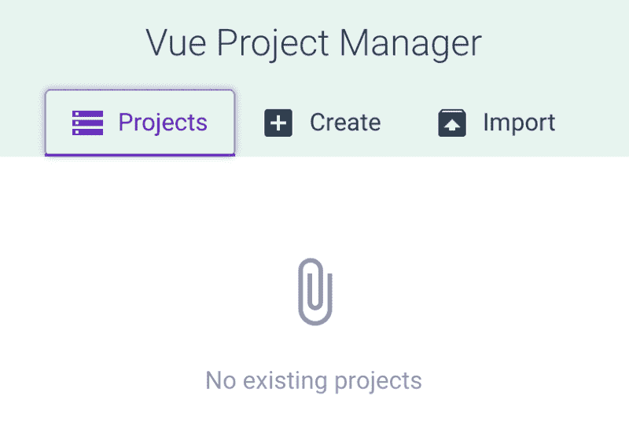
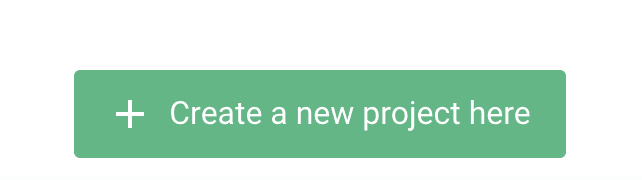
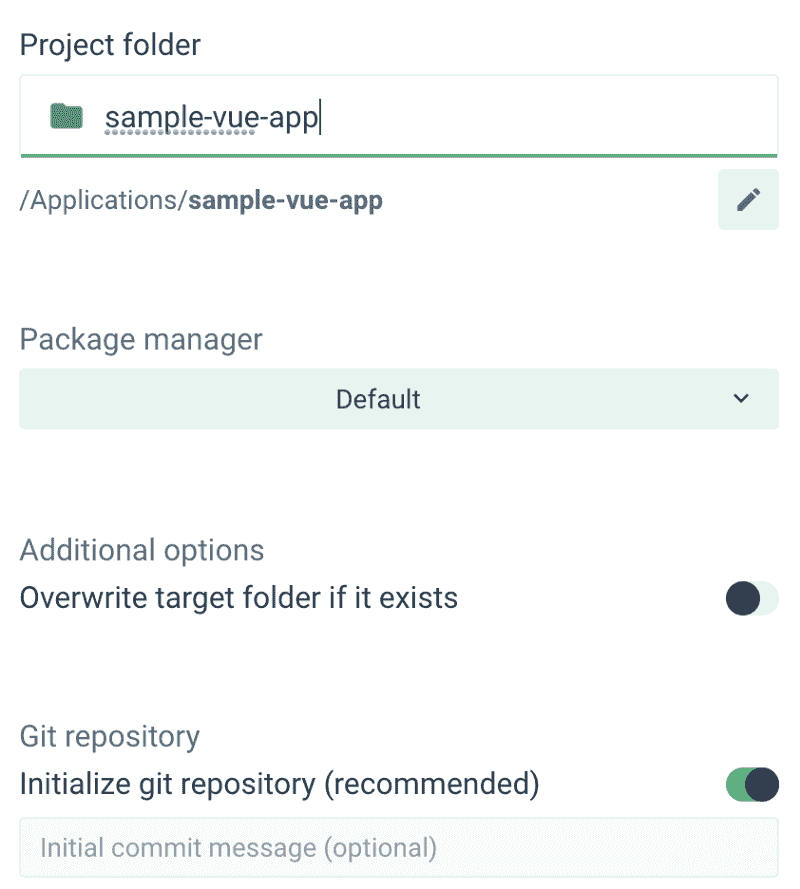
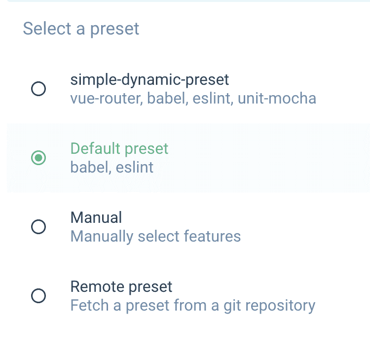
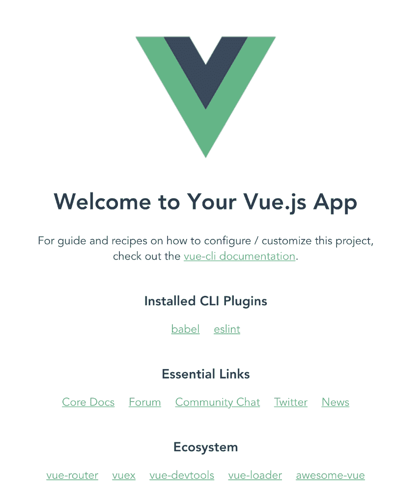
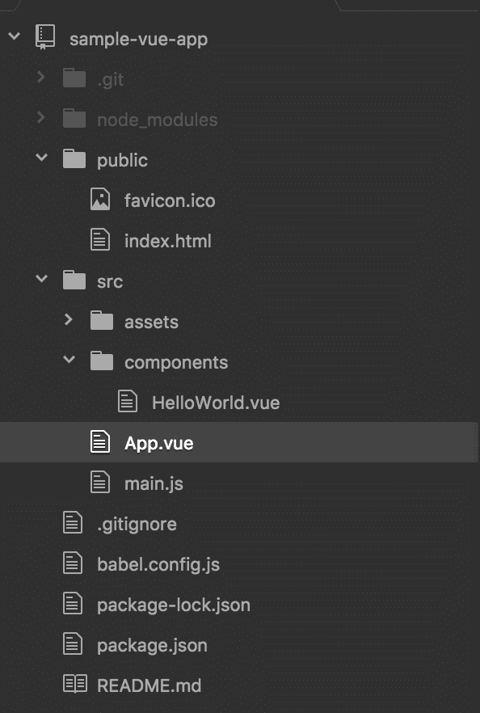
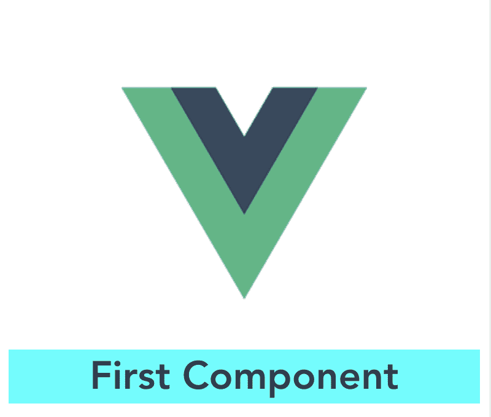

# Vue.js 快速介绍

> 原文：<https://www.freecodecamp.org/news/a-quick-introduction-to-vue-js-72937ee8880d/>

你对前端开发感兴趣吗？

如果是这样，那么这篇文章是给你的！

要开始使用 Vue.js，你需要了解 HTML、CSS、JavaScript、火箭科学、核物理、量子理论等…

嗯？…

不完全是。仅仅是 **HTML，CSS 和 JavaScript** 就足够好上手 Vue.js 了。

这篇文章将介绍如何轻松创建一个简单的 Vue.js 应用程序，并解释创建的应用程序的文件夹结构。此外，我们将创建一个简单的 Vue.js 组件。

所以让我们开始吧。

### 先决条件

#### 如果 Node.js 不存在，请安装它

您需要 Node.js，因为 Vue 所需的库是使用节点包管理器(npm)下载的。参考[https://nodejs.org/en/](https://nodejs.org/en/)安装 Node.js

#### 安装 CLI 视图

使用以下命令安装 Vue CLI:

```
npm install -g @vue/cli
```

Vue CLI 有助于轻松创建 Vue.js 项目。虽然它被称为 CLI，但它也有一个 UI 来创建我将在下面介绍的项目。

### 创建项目

在命令提示符下键入以下命令:

```
vue ui
```

这将在浏览器中打开以下屏幕:



点击**创建。**然后输入创建项目的目的地。


然后点击**在这里创建一个新项目。**



这将打开以下屏幕:



进入项目文件夹 **sample-vue-app** ，点击**下一步。**

在下一个屏幕中，选择**默认预设，**如下图所示。对于这个帖子，**默认预设**是最简单的开始。



最后，点击**创建项目**

为了测试项目是否设置良好，进入项目文件夹并使用以下命令启动应用程序:

```
cd sample-vue-app
npm run serve
```

应用程序在本地主机 8080 上运行。下图显示了应用程序在浏览器中的外观:



恭喜你，你已经创建了你的第一个 Vue.js 项目！

但是等一下，这个项目有很多自动创建的文件和文件夹。

**真的有必要知道这些文件是什么意思吗？**

当代码以奇怪的方式运行时，了解它们肯定会有所帮助，这在开发人员的世界中经常发生。

### 应用程序文件夹结构



1.  **package.json:** 这个文件拥有所有的节点依赖关系。
2.  **public/index.html:** 这是应用程序启动时加载的第一个文件。此外，这个文件有下面的代码片段`<div id=”app”></div>`。所有的组件都加载在这个 **div** 内，带有 id app。
3.  **src/main.js** :这是创建 Vue 实例的文件。这个文件有下面的代码片段`new Vue({ render: h => h(App)}).$mount(‘#app’)`。这个代码片段告诉在的**App 组件需要被加载到一个 id 为**App 的元素中(它是 div 元素)。****
4.  **src/App.vue:** 该文件对应于 **App** 组件，该组件充当所有其他组件的容器。它有一个用于 **HTML** 代码的**模板**，有一个用于 J **avaScript** 代码的**脚本**，还有一个用于 **CSS 的**样式**。**
5.  src/components :这是你开发的所有组件的存放地。所有组件都有一个模板、脚本和样式标签，分别用于 HTML、JavaScript 和 CSS 代码。
6.  **dist** :这是存储构建文件的文件夹。要获得这个文件夹，运行命令`npm run build`。当这个命令运行时，代码被缩小、打包并存储在 dist 文件夹中。该文件夹中的代码通常会部署到生产环境中。

### 创建您的第一个组件

在 **src/components 中创建一个名为 **First.vue** 的文件。**该文件将包含 HTML、JavaScript 和 CSS。我们一个一个来补充。该段下的所有代码都属于 **First.vue** 文件。 **First.vue** 将是我们的 **Vue 组件**

#### 半铸钢ˌ钢性铸铁(Cast Semi-Steel)

```
<style scoped>
.demo {
    background-color: cyan;
}
</style>
```

这是基本的 CSS。`<style scoped>`中的参数**作用域**意味着 CSS 仅适用于该组件。

#### Java Script 语言

```
<script>
export default {
    name: 'First',
    props: {
    msg: String
    }
}
</script>
```

**name** 参数表示第一个为**的组件的名称。**

**props** 参数表示该部件的**输入**。这里我们将有一个称为 **msg** 的输入，它属于类型 **String。**

#### 超文本标记语言

```
<template>
    <div class="demo">
    <h1>{{ msg }}</h1>
    </div>
</template>
```

`{{msg}}`是在 **HTML** 代码中访问 **Vue** 组件的输入参数的方式。

#### 第一个组件的完整代码

首先是文件**的内容，vue:**

```
<template>
    <div class="demo">
    <h1>{{ msg }}</h1>
    </div>
</template>

<script>
export default {
    name: 'First',
    props: {
    msg: String
    }
}
</script>

<style scoped>
.demo {
    background-color: cyan;
}
</style>
```

太好了，组件现在已经创建好了！？

现在使用`npm run serve`运行应用程序，您将看到以下屏幕:


等一下，这不是和之前的输出一样吗。我们刚刚创建的组件在哪里？

问题是，我们创建了组件，但我们从未在任何地方使用它。现在让我们使用这个组件。

### 使用组件

让我们将这个组件添加到主 **App** 组件中。以下是 **App.vue:** 的更新代码

```
<template>
  <div id="app">
    
    <First msg="First Component"/>
  </div>
</template>
<script>
import HelloWorld from './components/HelloWorld.vue'
import First from './components/First.vue'
export default {
  name: 'app',
  components: {
    First
  }
}
</script>
<style>
#app {
  font-family: 'Avenir', Helvetica, Arial, sans-serif;
  -webkit-font-smoothing: antialiased;
  -moz-osx-font-smoothing: grayscale;
  text-align: center;
  color: #2c3e50;
  margin-top: 60px;
}
</style>
```

1.  **首先**组件需要导入到 **App** 组件中。这是通过命令`import First from ‘./components/First.vue’`完成的
2.  接下来，在 JavaScript 中，我们需要提到**应用**组件将使用**第一个**组件。这是由代码片段`components: {First}`完成的
3.  最后，我们需要使用 **App** 组件中的**第一个**组件。这是在 HTML 模板中使用代码片段`<First msg=”First Component”/>`完成的
4.  这里 **msg** 是**第一个**组件的输入参数，msg 的**值从 **App** 组件发送**

现在使用`npm run serve`运行应用程序，您将看到下面的输出:



### 密码

[点击此处](https://github.com/aditya-sridhar/vuejs-blog-demo-part1)从 GitHub 库获取此处显示的代码。GitHub repo 有关于克隆和运行代码的说明。

[点击此处](https://aditya-sridhar.github.io/vuejs-blog-demo-part1/)查看应用程序的外观。它是使用 Github 页面部署的。

### 恭喜？

现在你已经成功构建了你的第一个 Vue.js App。您还学习了如何创建一个非常简单的组件。在我的下一篇关于 Vue.js 的文章中，我将介绍更多的概念。敬请期待！

### **参考文献**

view . js:[https://vuej . org/v2/guide/](https://vuejs.org/v2/guide/)

CLI 视图:https://CLI . vuej . org/guide/

### 关于作者

我热爱科技，关注科技的进步。我也喜欢用我在技术领域的知识帮助别人。

请随时通过我的 LinkedIn 账户与我联系[https://www.linkedin.com/in/aditya1811/](https://www.linkedin.com/in/aditya1811/)

你也可以在推特上关注我[https://twitter.com/adityasridhar18](https://twitter.com/adityasridhar18)

我的网站:[https://adityasridhar.com/](https://adityasridhar.com/)

### 我的其他帖子

[帮助你理解和创建 Angular 6 应用的快速指南](https://medium.freecodecamp.org/quick-guide-to-understanding-and-creating-angular-6-apps-2f491dffca1c)

[帮助您理解和创建 ReactJS 应用的快速指南](https://medium.freecodecamp.org/quick-guide-to-understanding-and-creating-reactjs-apps-8457ee8f7123)