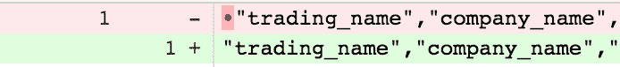
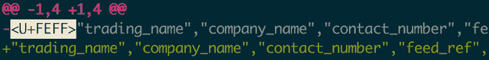

# 一个关于 FEFF 的小故事，一个破坏了我们的 CSV 文件的隐形 UTF-8 人物

> 原文：<https://www.freecodecamp.org/news/a-quick-tale-about-feff-the-invisible-character-cd25cd4630e7/>

今天，我们在试图从 CSV 创建一些数据库种子时遇到了一个错误。这个 CSV 文件最初是由我使用 Ruby 脚本生成的，该脚本将输出通过管道传输到一个文件并保存为 CSV 文件。

CSV 被签入 Git 并使用了一段时间，直到我们不得不通过添加一个新列和修改一些值来更新它的一些部分。

虽然我们还不知道确切的原因，但我的理论是，即使在将文件保存为 CSV 格式后，Excel for Mac(我们都在使用 Mac)还是添加了一些额外的元数据。

这反过来使任何使用种子的人收到以下错误:

```
CSV::MalformedCSVError: Illegal quoting in line 1.
```

我打开了 CSV 文件，没有任何可疑之处。我的第一个想法是一些左/右引号不知何故混合到文件中，而不仅仅是“正常的”双引号:`"`。但经过进一步调查，没有什么异常。这导致我删除了整个文件，并再次输入了第一行。

我再次保存该文件并运行迁移:

```
CSV::MalformedCSVError: Illegal quoting in line 1.
```

什么？！

好吧，这快把我逼疯了。我打开一个新文件，再次输入精确的单行代码，然后运行迁移。成功了。那文件里有什么？！

只有一个方法可以知道:

```
cat companies.csv | pbcopy | pbpaste > temp.csv
rm companies.csv
mv temp.csv companies.csv
git diff
```

所以 OSX 有两个非常有用的函数:`pbcopy`和`pbpaste`。基本上任何通过管道传送到`pbcopy`的东西都会进入你的剪贴板，`pbpaste`会把你剪贴板上的东西放到标准输出(stdout)中。但是它会删除所有格式。

当你想从某个地方复制一些文本，并想把它粘贴到一个 WYSIWYG 编辑器中，而不需要所有的格式时，这非常有用。比如从 Gmail 写邮件。

然后，我删除了原始文件，并用相同的文件名保存了新的“未格式化”文件，这样我就可以看到不同之处。

我们终于看到了隐形人:



The invisible character showing in Atlassian’s Bitbucket.



The invisible character’s actual name!

谷歌快速搜索告诉我们，我们的朋友`U+FEFF`叫做`ZERO WIDTH NO-BREAK SPACE`。此外，快速浏览维基百科告诉我们`U+FEFF`的实际用途，通常被称为`Byte order mark`或`BOM`。

我们的朋友`FEFF`有不同的意思，但它基本上是一个程序如何阅读文本的信号。可以是`UTF-8`(比较常见)`UTF-16`，甚至是`UTF-32`。

`FEFF`本身就是`UTF-16`的意思——在`UTF-8`更俗称`0xEF,0xBB, or 0xBF`。

从我的理解来说，在 Excel 中打开 CSV 文件并保存时，Excel 为我们的隐形偷渡者创建了一个空间，`U+FEFF`。并且在文件引导前！

Excel 施了点魔法，很可能保存在了`UTF-16`而不是`UTF-8`。`UTF-8`不理解`BOM`，只是把它当作一个非字符，所以在视觉上，这个文件是没问题的。但是 Ruby 的`CSV`认为有问题，因为它假设它正在读取的文件是`UTF-8`，它不能忽略`U+FEFF`先生。

所以经验教训:不要打开(和保存！)一个 Excel 格式的 CSV 文件，如果你想把它提供给 Ruby 的`CSV`解析器的话。

如果您确实遇到过类似的错误，请确保查找编辑器中没有显示的隐藏字符。如果你仍然看不到它，并且正在使用 OSX，那么`pbcopy`和`pbpaste`将会帮助你——除了复制和粘贴之外，它们还会去除文本中的任何格式或隐藏字符。