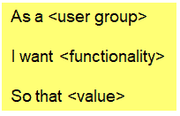
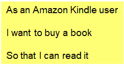
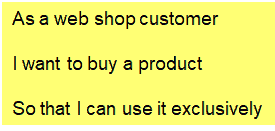
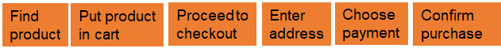
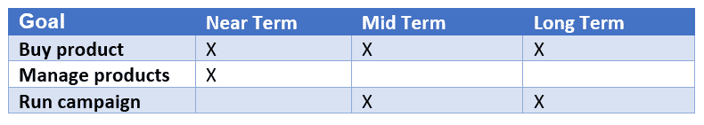
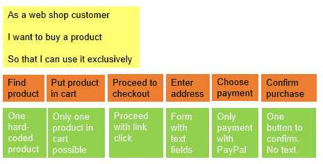

# 一种非常简单的用户故事方法

> 原文：<https://www.freecodecamp.org/news/a-radical-simple-approach-to-user-stories/>

用户故事是规划开发工作的好方法。理论上。但是在实践中如何避免引火烧身呢？我提出一个非常简单的方法。

这里有一个描述用户故事的流行模板:

下面是一个用户案例:

用户故事从用户价值的角度看软件。在实现一个故事之后，开发人员可以从用户那里得到反馈，无论他们是否满意，或者是否有他们想要改变的地方。这是敏捷开发的核心思想。

好的用户故事遵循三个 c:**卡**、**对话**、**确认**【1】。

**卡** 表示:用户故事短。他们关注的是提供给用户的价值。你可以把它们写在索引卡或便利贴上。当然，一个 Post-it 并不包含开发所需的所有信息。

所以开发软件的团队有关于故事的**对话** 。来自用户和商业利益相关者的输入是必要的，但是开发者也要把他们的想法带到桌面上。在这些讨论中，每个人都保持开放的心态是很重要的。

团队记录对话的结果作为验收标准。稍后检查验收标准作为**确认** 团队已经正确地实现了故事。

## 验收标准和投资

验收标准应回答以下问题:

*   什么是可能的用户输入？
    例如:“支付选项有万事达卡、维萨卡、[...] PayPal *。”*
*   系统如何对用户输入或业务相关事件做出反应？在什么条件下？
    例如:“当用户输入错误的信用卡号时，系统显示如下错误信息:[...]"

有许多方法来记录验收标准。要点，草图，例子，表格。发展在关于故事的谈话几天后开始。因此开发人员只需要足够的文档来记住对话。

团队如何检查一个故事是否有足够好的质量来开始实现它？**投资** 标准为每个故事定义了一个质量检查表[2]:

*   **I** 为**独立**。这个故事可以独立于其他故事实现。这有利于优先级的改变。
*   **N** 为**谈妥**。开发人员和利益相关者之间关于故事细节的对话已经发生。
*   **V** 为**值钱**。故事为用户提供了可见的价值。例如，与查询数据库这样的实现任务相反。
*   **E** 为**可估**。开发者可以估计故事。
*   **S** 为**小**。故事可以很快实现。在 Scrum 中，例如在 Sprint 中。
*   **T** 为**可测试**。这个故事如此具体，以至于团队可以衍生出测试用例。

## 实践中的问题

我喜欢用户故事。在产品规划中，他们将重点从技术细节转移到用户及其需求上。那很好。

然而，在我作为敏捷方法的敏捷教练和培训师的工作中，我已经开始质疑人们处理它们的常见方式。

我见过积压的数百个故事变得非常难以管理。我曾目睹人们使用“特性”、“史诗”和“业务需求”这些术语，却不理解它们到底是什么意思。我听到了关于详细的验收标准以及如何根据这些标准来划分故事的无尽的讨论。令人沮丧。

我声称有一个替代方案。避免所有这些陷阱的简单方法。首先，你需要理解用户故事有两个基本层次。

## 目标带来价值，但无法实现

在我的一门课程中，我问了类似这样的问题:“你可以用网络商店做什么？ *典型的答案是:“购买产品”，或者“订购产品”。*

*参与者谈论的是目标。如果我们是一个开发网上商店的团队，我们可能会想出下面的用户故事:*

**

*这个目标层次的故事对用户有价值吗？是啊！它反映了网上商店顾客的需求。*

*可以直接实现这个目标吗？不要！为了实现一个目标，你需要先推导出达到目标的步骤。对于“购买产品”这个故事，步骤可能如下所示:*

**

*每一步都可以用用户故事模板来记录:“作为一个网上商店的顾客，我想输入地址，这样产品就可以寄给我了。”*

*你能直接实现这个步骤级别的故事吗？是啊！一旦你明确了验收标准。但是对用户来说有价值吗？没有其他步骤，不行。*

*只有当目标达成时，价值才会显现。每一步都代表着向目标前进。但是独立地，这个步骤没有价值。那么使用故事模板有意义吗？*

## *极其简单的方法*

*目标层的故事是粗粒度的。它们可用于长期规划，无需在细节上浪费精力:*

**

*你经常可以在目标层独立地实现好的用户故事。他们传递价值。他们是独立的， **N** 谈判的， **V** 有价值的。但它们不是轻易就能预测和建立的。因为你不能在不谈论步骤的情况下为它们定义验收标准。*

*步骤级别的故事有 **N** 交涉、 **E** 可估计、 **S** 商城、 **T** 可建立。然而，它们并不独立，也不单独提供值。*

*你如何将两种类型的故事结合成一种简单的方法？这是我的提议。*

*团队挑选一个目标，说“购买产品”。然后团队反思:“达到目标最简单的方法是什么？以及如何及早降低架构风险？”*

*让我们假设团队在与 PayPal 的沟通中看到了最大的风险，因为他们以前从未实现过与 PayPal 的接口。*

*那么，达到“购买产品”目标的简单方法是什么样的呢？团队将目标层次的故事、步骤层次的故事和验收标准作为便笺依次放在下面:*

**

*以下是验收标准(绿色胶粘物)。只能订购一种固定产品。没有搜索，没有选择。用户界面是基本的，只允许用户用贝宝支付。*

*这些是开发人员实施的第一步。一旦开发人员实现了一个步骤，他们就向公司内部的利益相关者展示它。至少当目标达成时，团队会让用户参与进来。获得反馈并为进一步的迭代获得洞察力是至关重要的。*

*在以后的迭代中，团队添加和更改故事。例子包括:更多的产品、搜索功能和新的支付方式。或者团队选择另一个故事作为目标。在特定的时间点上最有价值、最有意义的事情。*

## *摘要*

*你专注于几个目标，看得更远。但是您只讨论了您将在几天后实现的步骤的验收标准。您实施这些步骤并收集反馈。你利用反馈来告知你将来要发展什么。*

*这样，每个人都清楚地知道开发过程中发生了什么。你避免无谓的讨论。并且将积压管理保持在最低限度。*

*我多次遵循这种方法。当每个人都参与进来时，效果会很好。它使发展成为一种乐趣。*

*仅此而已。*

*来源:*

*[1]罗恩·杰弗里斯 3Cs:[https://ronjeffries.com/articles/019-01ff/3cs-revisited/](https://ronjeffries.com/articles/019-01ff/3cs-revisited/)*

*[2]比尔唤醒投资标准:[https://XP 123 . com/articles/INVEST-in-good-stories-and-smart-tasks/](https://xp123.com/articles/invest-in-good-stories-and-smart-tasks/)*

**到[掌握敏捷软件开发的基础知识](https://skl.sh/2Cq497P)，请访问我的在线课程。如果你想了解我正在做的事情或给我留言，请在[开发到](https://dev.to/bertilmuth)、 [LinkedIn](https://www.linkedin.com/in/bertilmuth/) 或 [Twitter](https://twitter.com/BertilMuth) 上关注我。或者访问我的 [GitHub 项目](https://github.com/bertilmuth/requirementsascode)。**