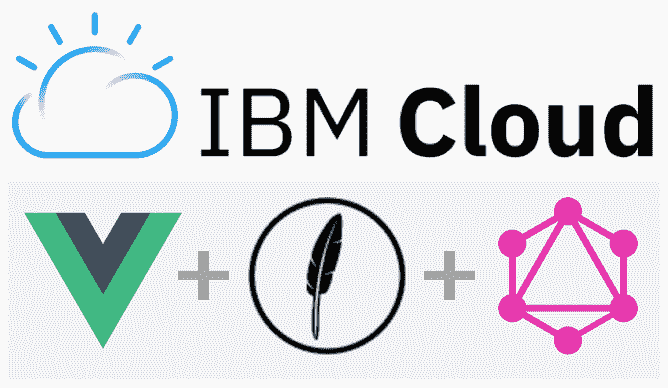
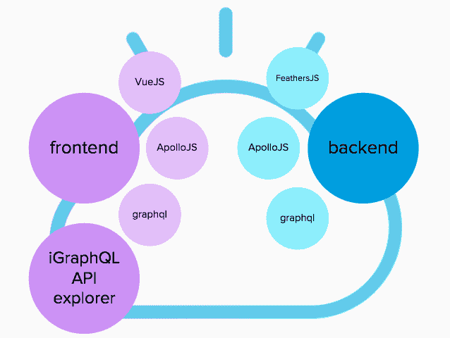
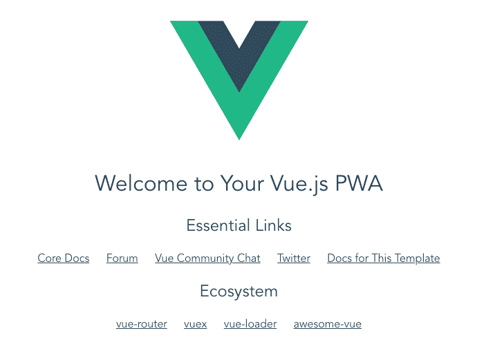
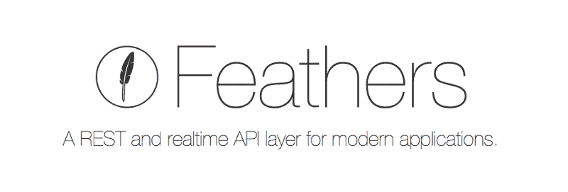
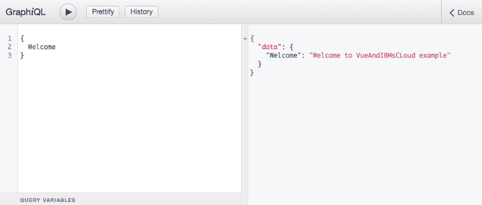
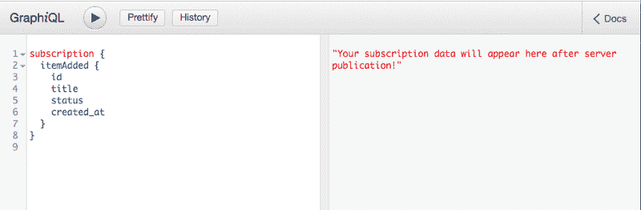
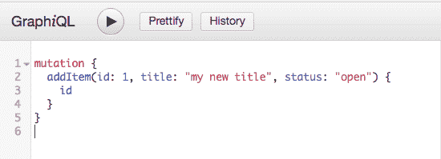
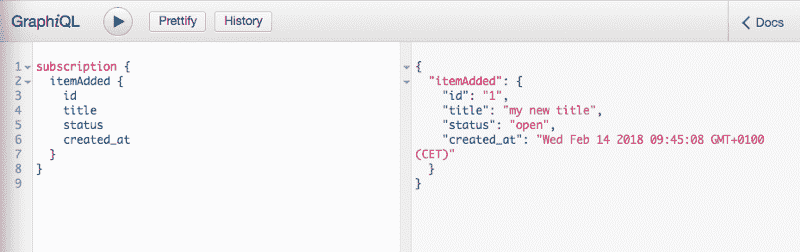
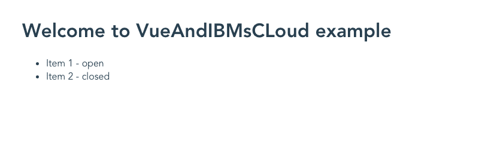

# 使用 VueJS、FeathersJS 和 GraphQL 快速了解 IBM Cloud

> 原文：<https://www.freecodecamp.org/news/a-rapid-start-on-ibm-cloud-with-vuejs-feathersjs-graphql-1-2-cd2b76606d66/>

托马斯·赖内克

# 使用 VueJS、FeathersJS 和 GraphQL 快速了解 IBM Cloud

您是否正在寻找快速开始使用 IBMs Cloud 的机会？抓住这个机会，将它与 Web VueJS、FeathersJS 和 GraphQL 的一些最新和最伟大的技术结合起来，怎么样？那么这是你一小时内起飞的必读书目。



**我们要做的:**

*   应用程序概述
*   在 GitHub 上创建一个新的 git 仓库
*   基于 Vue CLI 初始化前端应用程序
*   基于 FeathersJS CLI 初始化后端应用程序
*   向后端添加 GraphQL 功能
*   测试 GraphQL API 并发布/订阅
*   向现有前端应用程序添加依赖项
*   创建一个调用 GraphQL 后端的简单 SPA
*   部署到 IBM 的云

### 应用程序概述



### 在 GitHub 上创建一个新的 git 仓库

如果你还没有 GitHub 账户，去 github.com 创建一个。为自己创建一个名为“VueAndIBMsCloud”的新存储库。假设您能够很好地使用控制台，使用以下代码创建您的第一个项目提交:

```
mkdir VueAndIBMsCloud
cd VueAndIBMsCloud
echo "# VueAndIBMsCloud" >> README.md
git init
git add README.md
git commit -m "first commit"
git remote add origin https://github.com/<yourRepo>/VueAndIBMsCloud.git
git push -u origin master
```

### 基于 vue cli 初始化前端应用程序

如果您需要安装 Vue CLI 的更多细节，请通读这篇文章，然后回来。

[**安装-vue . js**](https://vuejs.org/v2/guide/installation.html)
[*vue . js-渐进式 JavaScript 框架*](https://vuejs.org/v2/guide/installation.html)
[vuejs.org](https://vuejs.org/v2/guide/installation.html)

使用 vue-cli 初始化基于渐进式 Web 应用程序(PWA)的“前端”项目:

```
npm install -g vue-cli
vue init pwa frontend

? Project name frontend
? Project short name: fewer than 12 characters to not be truncated on homescreens (default: same as name)
? Project description A Vue.js project
? Author thomasreinecke <thomas.reinecke@de.ibm.com>
? Vue build runtime
? Install vue-router? Yes
? Use ESLint to lint your code? No
? Setup unit tests with Karma + Mocha? No
? Setup e2e tests with Nightwatch? No
```

现在编译项目并第一次运行它(我建议使用“yarn”而不是“npm”):

```
cd frontend
yarn
yarn dev
```

您的前端应用程序运行在 [http://localhost:8080](http://localhost:8080)



恭喜你，你已经创建了基于 VueJs 的前端应用。

### 基于 feathersJS CLI 初始化后端应用程序



使用 FeathersJS CLI 初始化后端项目。如果您需要更多关于 FeatherJS CLI 的详细信息，请使用以下链接并返回:

[**feathersjs/CLI**](https://github.com/feathersjs/cli)
[*CLI-脚手架羽毛应用的命令行界面*](https://github.com/feathersjs/cli)
[【github.com】](https://github.com/feathersjs/cli)

```
npm install -g @feathersjs/cli
mkdir backend
cd backend
feathers generate app

? Project name backend
? Description
? What folder should the source files live in? src
? Which package manager are you using (has to be installed globally)? Yarn
? What type of API are you making? REST, Realtime via Socket.io

yarn start
```

您的后端应用程序运行在 [http://localhost:3030/](http://localhost:3030/)

### 向后端添加 GraphQL 功能

打开 Visual Studio 代码(或您首选的 IDE)>打开…>将它指向 f **旧的 VueAndIBMs** 云。

打开 backend/src/index.html，用以下代码替换那里的内容:

```
/* eslint-disable no-console */
const logger = require('winston');
const app = require('./app');
const port = app.get('port');

const createSubscriptionServer = app.get('createSubscriptionServer');

// create subscription server and associate it to the server
const server = app.listen(port, () => createSubscriptionServer(server));

process.on('unhandledRejection', (reason, p) =>
  logger.error('Unhandled Rejection at: Promise ', p, reason)
);

server.on('listening', () =>
  logger.info('Feathers application started on http://%s:%d',  
  app.get('host'), port)
);
```

在 **backend/package.json** 中，为 GraphQL 添加以下附加依赖项:

```
"express-session": "1.15.6",
"graphql": "0.12.3",
"graphql-subscriptions": "0.5.6",
"graphql-tools": "2.18.0",
"subscriptions-transport-ws": "0.9.5",
"apollo-server-express": "1.3.2",
```

在命令行上运行" **yarn"** ,将额外的库拉入您的后端项目。现在，我们准备在 feather CLI 的更多帮助下创建 Graphql 服务:

```
feathers generate service

? What kind of service is it? A custom service
? What is the name of the service? graphql
? Which path should the service be registered on? /graphql
```

您将意识到创建了一个新目录:services/graphql。

我们将创建与 featherJS 服务模板略有不同的 GraphQL 服务。继续删除 **graphql.hooks.js** 和**graph QL . class . js**

```
rm services/graphql/graphql.hooks.js
rm services/graphql/graphql.class.js
```

使用以下代码更新**services/graph QL/graph QL . service . js**:

```
const { graphqlExpress, graphiqlExpress } = require('apollo-server-express');
const { execute, subscribe } = require('graphql');
const { SubscriptionServer } = require('subscriptions-transport-ws');
const { makeExecutableSchema } = require('graphql-tools');
const TypeDefinitions = require('./graphql.typeDefs');
const Resolvers = require('./graphql.resolvers');

module.exports = function () {
  const app = this;
  const port = app.get('port');
  const schema = makeExecutableSchema({
    typeDefs: TypeDefinitions,
    resolvers: Resolvers.call(app)
  });

  // provide endpoint to graphql for the apollo graphql client lib
  app.use('/graphql', graphqlExpress((req) => {
    return {
      schema,
      context: {}
    };
  }));

  // provide endpoint to graphiql : the API explorer module
  app.use('/graphiql', graphiqlExpress({
    endpointURL: '/graphql',
    subscriptionsEndpoint: `ws://localhost:${port}/subscriptions`
  }));

  // define the API server here
  app.set('createSubscriptionServer', function
    createSubscriptionServer(server) {
    return new SubscriptionServer({
      execute, subscribe, schema,
      onConnect: () => { console.log('Client Connected'); },
      onDisconnect: () => { console.log('Client Disconnected'); }
    },
    {
      server, path: '/subscriptions',
    });
  });
};
```

现在创建 GraphQL typedef 和 resolvers:在**services/graph QL**:**graph QL . typedef s . js**和 **graphql.resolvers.js** 下创建两个新文件，并向其中添加以下代码:

#### graphql . resolvers . js 图形 SQL .解析器. js

```
const { PubSub } = require('graphql-subscriptions');
const pubsub = new PubSub();
const ITEM_ADDED = 'ITEM_ADDED';

module.exports = function () {
  return {
    Query: {
      Welcome (root, { id }, context) {
        return 'Welcome to VueAndIBMsCLoud example';
      },
      Items (root, { id }, context) {
        return [
          {
            id: 1,
            title: 'Item 1',
            status: 'open',
            created_at: new Date()
          },
          {
            id: 2,
            title: 'Item 2',
            status: 'closed',
            created_at: new Date()
          }
        ];
      }
    },
    Mutation: {
      addItem(root, { id, title, status }, context) {
        const item = {
          id,
          title,
          status,
          created_at: new Date()
        };
        pubsub.publish(ITEM_ADDED, { itemAdded: item });
        return item;
      },
    },
    Subscription: {
      itemAdded: {
        subscribe: () => pubsub.asyncIterator(ITEM_ADDED),
      }
    }
  };
};
```

#### graphql.typeDefs.js

```
const typeDefinitions = `
  type Item {
    id: ID!
    title: String
    status: String
    created_at: String
  }

  type Query {
    Welcome: String,
    Items: [Item]
  }

  type Mutation {
    addItem(id: ID!, title: String!, status: String): Item
  }

  type Subscription {
    itemAdded: Item
  }

  schema {
    query: Query
    mutation: Mutation
    subscription: Subscription
  }
`;

module.exports = typeDefinitions;
```

快到了。让我们将一个启动脚本添加到“脚本”部分的 **package.json** 中:

```
"dev": "NODE_ENV=development node src/",
```

现在运行“纱线开发”。您应该会看到这样的消息:
*信息:Feathers 应用程序开始于[http://localhost:3030](http://localhost:3030)*

### 测试 GraphQL API 并发布/订阅

尝试将 graphiQL 作为 API explorer 模块[http://localhost:3030/graphiq](http://localhost:3030/graphiql)并运行第一个测试，如下所示:



恭喜你，你已经在你的项目中包含了一个 GraphQL API！

现在让我们测试一些更复杂的数据获取:


现在让我们测试订阅。在第二个浏览器窗口打开 graphiql，像这样设置订阅，然后按“播放”按钮:



现在回到第一个 graphiql 浏览器窗口，输入下面的变化，允许您向 Items 数组添加一个条目。由于我们已经设置了发布/订阅，我们希望将对项目数组的更改推送给所有订阅者:



将两个浏览器窗口并排放置，并在第一个窗口上按“播放”。您将意识到后端服务器将把数据更改推送到您的第二个 graphiql 窗口:



多酷啊。恭喜你，你已经在你的项目中设置了基于 graphiql 的发布/订阅。

### 向前端应用程序添加依赖关系

在 **frontend/package.json** 中，添加以下附加依赖项，以包括 Graphql、ApolloJS 和订阅支持(通过 Websockets):

```
"dependencies": {
  "apollo-cache-inmemory": "1.1.5",
  "apollo-client": "2.2.0",
  "apollo-link": "1.0.7",
  "apollo-link-http": "1.3.2",
  "apollo-link-ws": "1.0.4",
  "apollo-utilities": "1.0.4",
  "graphql": "0.12.3",
  "graphql-tag": "2.6.1",
  "subscriptions-transport-ws": "0.9.5",
  "vue": "^2.5.2",
  "vue-apollo": "3.0.0-alpha.3",
  "vue-router": "^3.0.1"
}
```

运行" **yarn"** 将依赖项拉入您的前端项目。

```
cd frontend
yarn
```

编辑 **frontend/main.js** 并用以下代码替换:

```
import Vue from 'vue'
import App from './App'
import router from './router'

import { ApolloClient } from 'apollo-client'
import { HttpLink } from 'apollo-link-http'
import { InMemoryCache } from 'apollo-cache-inmemory'
import { split } from 'apollo-link'
import { WebSocketLink } from 'apollo-link-ws'
import { getMainDefinition } from 'apollo-utilities'

import VueApollo from 'vue-apollo'

// add unified ressource identifiers for Dev and Prod (IBM Cloud)
const uris = {
  dev: 'localhost:3030',
  prod: 'VueAndIBMsCloud.mybluemix.net'
}

// setup httpLink depending on environment
const httpLink = new HttpLink({
  uri: (window.location.hostname === 'localhost') ? `http://${uris.dev}/graphql` : `https://${uris.prod}/graphql`
  })

// setup web socket link depending on environment
const wsLink = new WebSocketLink({
  uri: (window.location.hostname === 'localhost') ? `ws://${uris.dev}/subscriptions` : `wss://${uris.prod}/subscriptions`,
  options: {
    reconnect: true
  }
})

const link = split(
  ({ query }) => {
    const { kind, operation } = getMainDefinition(query)
    return kind === 'OperationDefinition' && operation === 'subscription'
  },
  wsLink,
  httpLink
)

// define the apolloClient
const apolloClient = new ApolloClient({
  link,
  cache: new InMemoryCache(),
  connectToDevTools: true
})

Vue.use(VueApollo)

const apolloProvider = new VueApollo({
  defaultClient: apolloClient
})

Vue.config.productionTip = false

/* eslint-disable no-new */
new Vue({
  el: '#app',
  apolloProvider,
  router,
  render: h => h(App)
})
```

这将使您的前端应用程序准备好使用 ApolloClient 作为库来提供 GraphQL 查询、变异和订阅支持。在**uri**对象上，用后端应用程序的生产部署目标替换【VueAndIBMsCloud.mybluemix.net】T2。

### 添加调用 GraphQL 后端的 UI

在您的前端源代码中，打开 **src/App.vue** 并用以下代码替换它:

```
<template>
  <div id="app">
    <h1>{{ welcome }}</h1>
    <ul>
      <li v-for="(item) of items" v-bind:key="item.id">{{item.title + ' - ' + item.status}}</li>
    </ul>
  </div>
</template>

<script>
import gql from 'graphql-tag'

export default {
  name: 'app',
  data () {
    return {
      welcome: '',
      items: []
    }
  },
  mounted () {
    this.$apollo.query({
      query: gql`query {
        Welcome
        Items {
          id
          title
          status
        }
      }`
    }).then(({data}) => {
      this.welcome = data.Welcome
      this.items = data.Items
    }).catch((error) => {
      console.error(error)
    })
  },
}
</script>

<style>
body {
  margin: 50px;
}

#app {
  font-family: 'Avenir', Helvetica, Arial, sans-serif;
  -webkit-font-smoothing: antialiased;
  -moz-osx-font-smoothing: grayscale;
  color: #2c3e50;
}

main {
  text-align: center;
  margin-top: 40px;
}

header {
  margin: 0;
  height: 56px;
  padding: 0 16px 0 24px;
  background-color: #35495E;
  color: #ffffff;
}

header span {
  display: block;
  position: relative;
  font-size: 20px;
  line-height: 1;
  letter-spacing: .02em;
  font-weight: 400;
  box-sizing: border-box;
  padding-top: 16px;
}
</style>
```

保存并运行**纱线开发**启动。你现在应该看到你的前端应用程序的新的登陆页面(它看起来还不是非常令人兴奋，但这是我们第一次在你的前端看到来自你的 graphQL 后端的数据——是不是很酷？)



现在，既然我们在前端和 graphQL 后端之间有了 e2e 集成，让我们把它推到 IBMs cloud 并在那里运行。

### 为部署准备 IBM Cloud

*   在桌面上设置 Bluemix CLI:[https://console . Bluemix . net/docs/CLI/reference/Bluemix _ CLI/get _ started . html #入门](https://console.bluemix.net/docs/cli/reference/bluemix_cli/get_started.html#getting-started)
*   登录 IBM 的云: **bx 登录**
*   在 IBMs Cloud 中交互设置目标和空间上下文(转到[https://console.bluemix.net/dashboard/apps/](https://console.bluemix.net/dashboard/apps/)检查您的选项): **bx 目标— cf**

您现在应该看到这个:

```
API endpoint:     <your endpoint> (<API version>)
Region:           <your region>
User:             <your username>
Account:          <your account>
Resource group:   default
Org:              <your org>
Space:            <your space>
```

现在，您已经为两个应用程序设置了部署范围。

### 将后端部署到 Bluemix

在后端项目上，创建一个新的 manifest.yml 文件，并在其中输入以下内容:

```
applications:
  - path: .
    memory: 1024M
    instances: 1
    domain: eu-de.mybluemix.net
    name: vueAndIbmsCloud-api
    host: vueAndIbmsCloud-api
    disk_quota: 1024M
```

将以下 package.json 部署脚本添加到“脚本”部分:

```
"deploy": "bx cf push vueAndIbmsCloud-api"
```

(您必须更改该应用程序名称以使其唯一，例如，在 manifest.yml 和 package.json 上附加您选择的一些索引。)

#### **安装 BlueMix CLI**

[https://console.bluemix.net/docs/cli/index.html](https://console.bluemix.net/docs/cli/index.html)T2[https://developer . IBM . com/courses/labs/1-install-bluemix-command-line-interface-CLI-DWC 020/](https://developer.ibm.com/courses/labs/1-install-bluemix-command-line-interface-cli-dwc020/)

运行 **yarn deploy** ，这会将您的后端应用程序部署到 IBM Cloud。

### 蓝色混合前端的部署

我们基于 nginx 服务器部署前端应用程序，这提供了比节点服务器更好的性能(在响应时间和吞吐量方面)。

根据您选择作为后端部署目标的名称，让我们确保它正确地反映在 **frontend/src/main.js** 中。在**uri**对象中，用后端服务器所在的 URL 替换‘vueandibmcloud-API . eu-de . mybluemix . net’。你可以在 Bluemix 控制台>中查看网址，点击进入你的应用>查看应用网址。

在前端应用程序根文件夹中，创建 manifest.yml 并包含以下内容:

```
applications:
  - path: .
    memory: 1024M
    instances: 1
    domain: mybluemix.net
    name: vueAndIbmsCloud
    host: vueAndIbmsCloud
    disk_quota: 1024M
    buildpack: staticfile_buildpack
```

将以下 package.json 部署脚本添加到“脚本”部分:

```
"deploy": "npm run build; cp manifest.yml dist/manifest.yml; cd dist; bx cf push vueAndIbmsCloud"
```

(您必须更改该应用程序名称以使其唯一，例如，在 manifest.yml 和 package.json 上附加您选择的一些索引。)

运行 **yarn deploy** ，这会将您的前端应用程序部署到 IBM Cloud。

恭喜:)你现在可以在 IBM 的云上使用你的前端应用了。

在 GitHub 找到来源:[https://github.com/thomasreinecke/VueAndIBMsCloud](https://github.com/thomasreinecke/VueAndIBMsCloud)