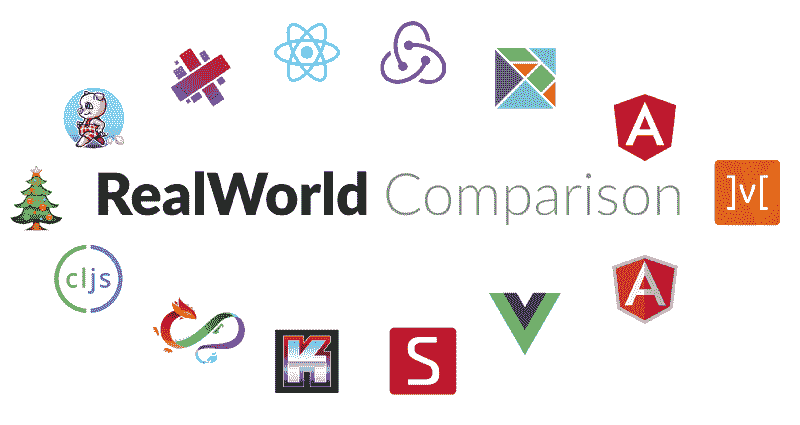
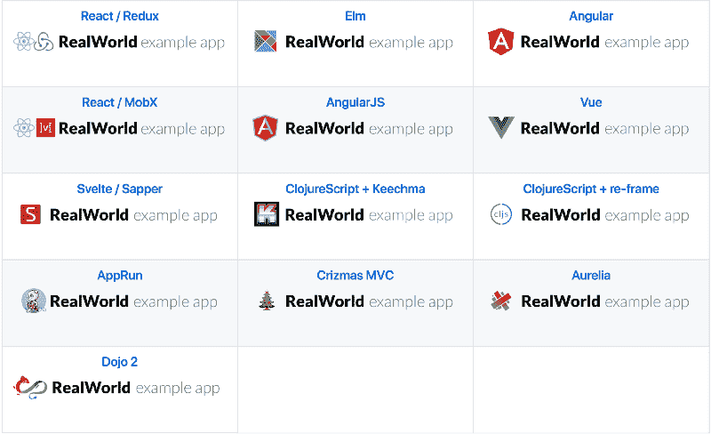
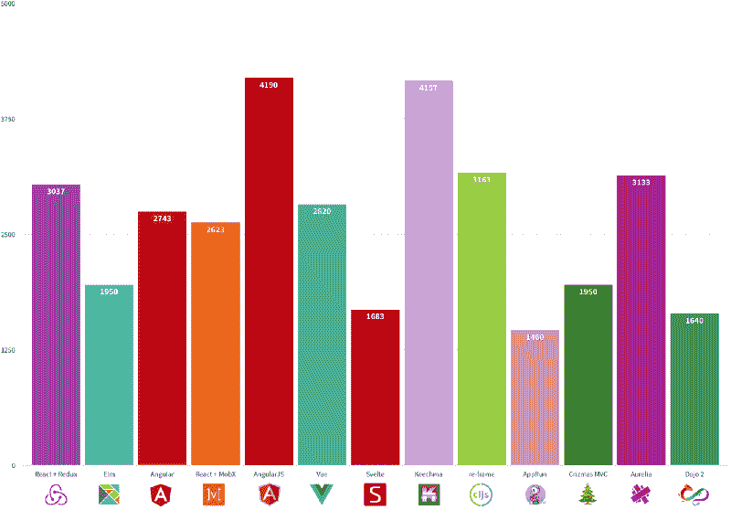
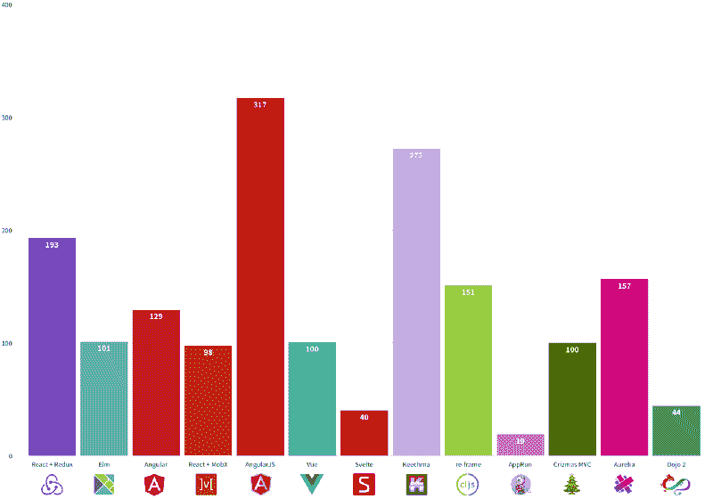
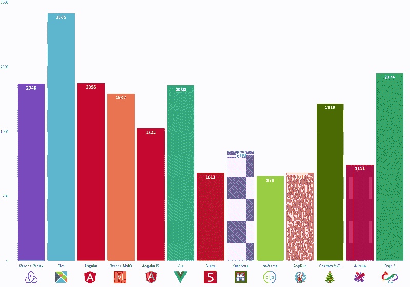

# 前端框架与基准测试的真实对比(2018 年更新)

> 原文：<https://www.freecodecamp.org/news/a-real-world-comparison-of-front-end-frameworks-with-benchmarks-2018-update-e5760fb4a962/>

作者亚采克·沙

# 前端框架与基准测试的真实对比(2018 年更新)

本文是对 2017 年 12 月发布的前端框架与基准测试的真实对比[的更新。](https://medium.freecodecamp.org/a-real-world-comparison-of-front-end-frameworks-with-benchmarks-e1cb62fd526c)

在这个比较中，我们将展示几乎相同的[现实世界示例应用](https://github.com/gothinkster/realworld)的不同实现如何相互比较。

真实世界示例应用程序给了我们:

1.  真实世界应用程序——不仅仅是“待办事项”。通常“todos”不会传达足够的知识和观点来实际构建*真正的*应用。
2.  **标准化** —符合一定规则的项目。提供后端 API、静态标记、样式和规范。
3.  由专家编写或评审的 —一个一致的、真实的项目，理想情况下，该技术的专家会构建或评审该项目。

#### 对上一版本的批评(2017 年 12 月)

✅️·安格尔没有参与制作。RealWorld repo 上列出的演示应用程序使用的是开发版本，但多亏了乔纳森·费尔布(Jonathan fair cloth),它现在是生产版本了！

✅ Vue 没有被列入真实世界回购，因此不包括在内。可以想象，在前端世界，这引起了很大的热度。怎么没加 Vue？你怎么搞的?这一次 Vue.js 进来了！感谢伊曼纽尔·维尔斯博尔 **。**

#### 我们在比较哪些库/框架？

与 2017 年 12 月的文章一样，我们包括了 RealWorld repo 中列出的所有实现。有没有大粉丝并不重要。唯一的限制是它出现在真实世界回购页面上。

Frontends at [https://github.com/gothinkster/realworld](https://github.com/gothinkster/realworld) (April 2018)

### 我们看什么指标？

1.  **性能:**这款 App 需要多长时间才能显示内容并变得可用？
2.  **大小:**App 有多大？我们将只比较编译后的 JavaScript 文件的大小。CSS 对于所有变体都是通用的，并且是从 CDN(内容交付网络)下载的。HTML 对所有变体也是通用的。所有的技术都可以编译或转换成 JavaScript，因此我们只需要调整这个文件的大小。
3.  **代码行:**作者需要多少行代码来创建基于 spec 的现实世界应用程序？公平地说，一些应用程序有更多的功能，但应该不会有太大的影响。我们唯一量化的文件夹是每个应用中的`src/`。

### 指标#1: **性能**

查看 Chrome 附带的[灯塔审计](https://developers.google.com/web/tools/lighthouse/)的[第一个有意义的油漆](https://developers.google.com/web/tools/lighthouse/audits/first-meaningful-paint)测试。

你画得越早，用户的体验就越好。Lighthouse 还测量了第一次互动的时间，但这对于大多数应用来说几乎是一样的，而且它还处于测试阶段。

First meaningful paint (ms) — lower is better

在性能方面，你可能看不到太大的区别。

### 衡量标准 2:规模

传输大小来自 Chrome 网络选项卡。GZIPed 响应头加上响应体，由服务器交付。

文件越小，下载速度越快(需要解析的内容也越少)。

这取决于您的框架的大小，以及您添加的任何额外的依赖项，以及您的构建工具能够在多大程度上生成一个小的包。

Transfer size (KB) — lower is better

你可以看到 Svelte、Dojo 2 和 AppRun 做得相当不错。关于 Elm，我说的再多也不为过——尤其是当你看下一张图表的时候。我想看看 [Hyperapp](https://hyperapp.js.org/) 相比如何……也许下次， [Jorge Bucaran](https://www.freecodecamp.org/news/a-real-world-comparison-of-front-end-frameworks-with-benchmarks-2018-update-e5760fb4a962/undefined) ？

### 指标 3:代码行

使用 [cloc](https://github.com/AlDanial/cloc) 我们计算每个回购的 src 文件夹中的代码行数。空白和注释行是**而不是**计算的一部分。这为什么有意义？

> 如果调试是去除软件缺陷的过程，那么编程就必须是把缺陷放进去的过程

# lines of code — fewer is better

代码行数越少，发现错误的可能性就越小。您还需要维护较小的代码库。

### 最后

我想说非常感谢 [Eric Simons](https://www.freecodecamp.org/news/a-real-world-comparison-of-front-end-frameworks-with-benchmarks-2018-update-e5760fb4a962/undefined) 创建了[现实世界示例应用](https://github.com/gothinkster/realworld) repo，以及许多编写了不同实现的贡献者。

**更新:**感谢 [Jonathan Faircloth](https://www.freecodecamp.org/news/a-real-world-comparison-of-front-end-frameworks-with-benchmarks-2018-update-e5760fb4a962/undefined) 提供 Angular 的量产版。

> 如果你觉得这篇文章有趣，你应该在 Twitter 和 Medium 上关注我。