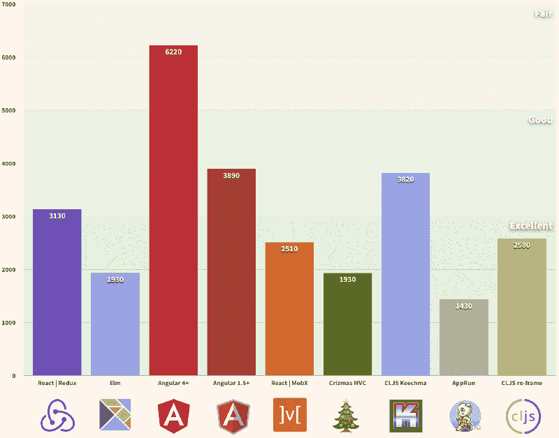
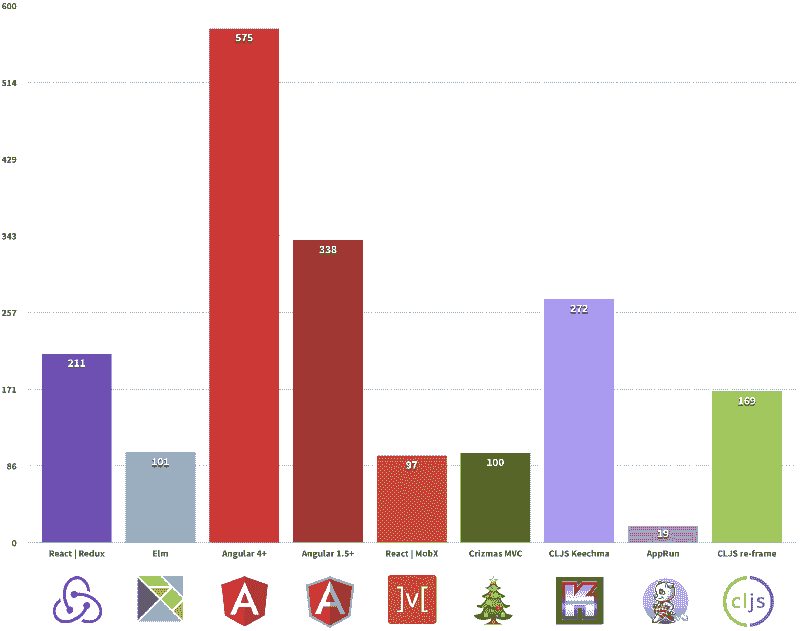
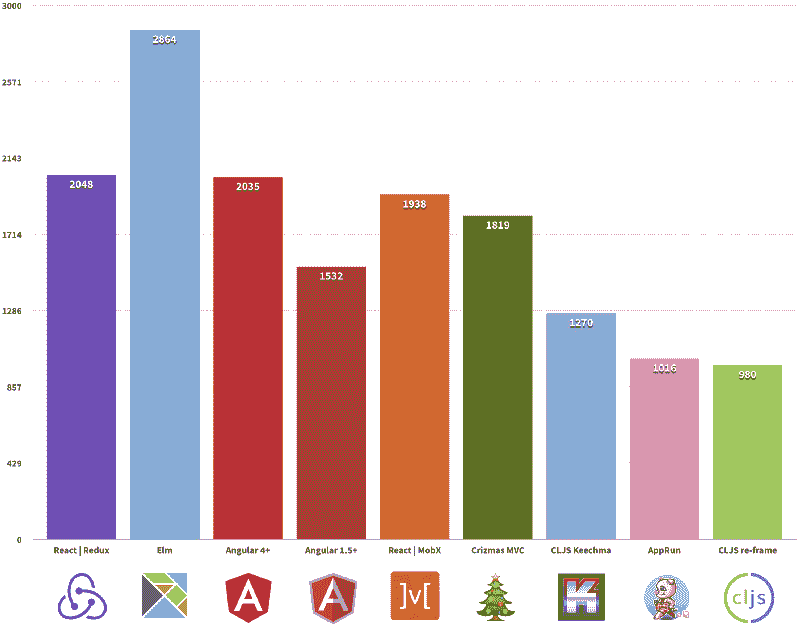

# 前端框架与基准测试的真实对比

> 原文：<https://www.freecodecamp.org/news/a-real-world-comparison-of-front-end-frameworks-with-benchmarks-e1cb62fd526c/>

作者亚采克·沙

# 前端框架与基准测试的真实对比

Photo by [delfi de la Rua](https://unsplash.com/photos/vfzfavUZmfc?utm_source=unsplash&utm_medium=referral&utm_content=creditCopyText) on [Unsplash](https://unsplash.com/?utm_source=unsplash&utm_medium=referral&utm_content=creditCopyText)

**更新:**这篇文章有了新版本

[**前端框架与基准测试的真实对比(2018 年更新)**](https://medium.freecodecamp.org/a-real-world-comparison-of-front-end-frameworks-with-benchmarks-2018-update-e5760fb4a962)
[*本文刷新了 2017 年 12 月以来前端框架与基准测试的真实对比。*medium.freecodecamp.org](https://medium.freecodecamp.org/a-real-world-comparison-of-front-end-frameworks-with-benchmarks-2018-update-e5760fb4a962)

在过去的几年里，我们看到了前端框架的爆炸式增长。他们中的每一个人都有能力构建优秀的 web 应用程序。那么如何比较并决定下一个项目使用哪一个呢？

首先，为了进行有意义的比较，我们需要几样东西:

1.  真实世界应用 -不仅仅是“待办事项”。通常“todos”并不传达知识&视角来实际构建*真正的*应用。
2.  **标准化**——符合一定规则的项目。托管在同一个地方，提供后端 API、静态标记、样式和规范。
3.  由专家编写的一个一致的、真实的项目，理想情况下是由该技术领域的专家完成的。这是真的，至少在大多数时候是真的(见下文)。

那么我们如何得到这样一个项目呢？好消息是埃里克·西蒙斯已经创建了一个[现实世界](https://github.com/gothinkster/realworld)项目。它是媒体博客平台的克隆。这个项目的每个实现都使用相同的 HTML 结构、CSS 和 API 规范，但是使用不同的库/框架。说到专业知识，大多数时候都是对的。我用 ClojureScript 和[重新构建](https://github.com/Day8/re-frame)写了一个实现，我不认为自己是专家。在我的辩护中，一位专家审查了我的代码——感谢丹尼尔·康普顿。

现在我们有了一个基线规范，我们需要一套标准的测试/度量来比较它们。

1.  **性能。**这个应用程序需要多长时间才能显示内容并变得可用？
2.  **大小。**App 有多大？我们只比较编译后的 JavaScript 的大小。CSS 对于所有变体都是通用的，并且是从 CDN(内容交付网络)下载的。HTML 对所有变体也是通用的。所有的技术都可以编译或转换成 JavaScript，因此我们只需要调整这个文件的大小。
3.  **行代码。**作者根据 spec 创建 RealWorld app 需要多少行代码？公平地说，一些应用程序有更多的功能，但应该不会有太大的影响。我们唯一量化的文件夹是每个 app 里的 src/。

在撰写本文时(2017 年 12 月)，RealWorld 项目在以下框架中可用:

*   [反应/还原](https://github.com/gothinkster/react-redux-realworld-example-app)
*   [榆树](https://github.com/rtfeldman/elm-spa-example)
*   [角度 4+](https://github.com/gothinkster/angular-realworld-example-app)
*   [角度 1.5+](https://github.com/gothinkster/angularjs-realworld-example-app)
*   [试剂/ MobX](https://github.com/gothinkster/react-mobx-realworld-example-app)
*   [Crizmas MVC](https://github.com/gothinkster/crizmas-mvc-realworld-example-app)
*   CLSJ·基希马
*   学习
*   [CLJS 重框](https://github.com/jacekschae/conduit)(这个是我做的。它还没有在 RealWorld 项目中列出)。

### 衡量标准#1:性能

第一次有意义的油漆测试与 Chrome 附带的[灯塔审核](https://developers.google.com/web/tools/lighthouse/)。

你画得越早，用户的体验就越好。Lighthouse 还测量了第一次互动的时间，但这对于大多数应用来说几乎是一样的。

First meaningful paint (ms) - lower is better

### 衡量标准 2:规模

传输大小来自 Chrome 网络选项卡。GZIPed 响应头加上响应体，由服务器交付。

文件越小=下载越快，解析越少。

这取决于你的框架的大小，你添加的任何额外的依赖项，以及你的构建工具能做一个小的包有多好。

Transfer size (KB) - lower is better

### 指标 3:代码行

使用 [cloc](https://github.com/AlDanial/cloc) 我们计算每个回购的 src 文件夹中的代码行数。空白和注释行是**而不是**计算的一部分。这为什么有意义？

> 如果调试是去除软件错误的过程，那么编程就必须是把它们放进去的过程

代码行越少，出错的可能性就越小，需要维护的代码也就越少。

# Lines of code - fewer is better

### 结论

#### 表演

这是真实世界的比较，而不是真空中的基准。测试在欧洲(瑞士)之外进行。所有应用都托管在 Github 上。价值观可能会因你而异，这没什么。每个应用程序都要进行几次测试，然后进行平均和四舍五入。全天比较的结果非常线性。大多数库/框架都在优秀和良好的范围内。在性能方面，你不会看到太大的差别。

#### 大小

每个应用程序的包大小总是相同的。我们正在比较类似的实现，看看包的大小有什么不同。AppRun 疯了！我看了几次，因为我无法相信。Elm 在包的大小方面做得非常出色，尤其是当您查看代码行时。

AppRun bundle size 18.7KB

#### **行代码**

这对作为软件开发人员的你影响最大。代码行越多，需要输入的代码就越多，需要维护的代码就越多。这里有一些权衡。尤其是当涉及到类型语言和动态语言时。打字给你更多的安全感，但也有代价——更多的东西需要打字。

#### 类型化与动态化

**键入**:榆树，角 4+和 AppRun。

**动态** : React | Redux，Angular 1.5，React | MobX，Crizmas MVC，CLJS Keechma，CLJS re-frame。

那么哪个更好呢？不是更好更坏，是不一样。像 TDD(测试驱动开发)，有人爱，有人恨。不管有没有它，你都可以开发出优秀的软件——挑一个更适合你的吧。

#### Vue，Preact，Ember，Svelte，Aurelia 等人呢？

他们似乎迟到了，但不用担心。当我们有他们的时候我会再做一轮。已经有[个未决问题](https://github.com/gothinkster/realworld/issues) -考虑投稿吧！或者从头开始，开一期新的。

#### 一锤定音

这个对比正是它所说的。比较现实世界中相似的 web 应用程序的不同实现。我知道，这并不完美。它根据服务器负载、网络流量和现实世界中发生的许多其他事情而有所不同。

感谢丹尼尔·康普顿的校对。

*如果你喜欢这篇文章，并且希望在我发布类似文章时得到通知，请考虑通过媒体和 [twitter](https://twitter.com/jacekschae) 关注我。*