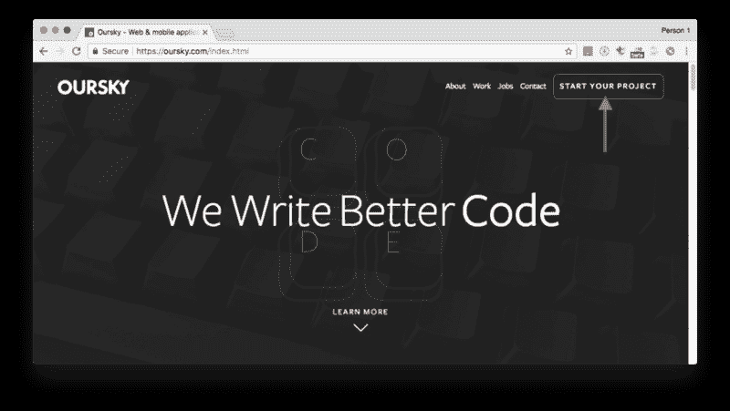
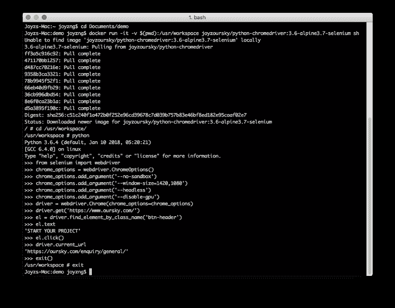

# Docker 中使用 Python Selenium 和 Headless Chrome 进行网站自动化测试的诀窍

> 原文：<https://www.freecodecamp.org/news/a-recipe-for-website-automated-tests-with-python-selenium-headless-chrome-in-docker-8d344a97afb5/>

作者 Joyz

# Docker 中使用 Python Selenium 和 Headless Chrome 进行网站自动化测试的诀窍


Photo from the [Oursky](https://oursky.com) Hong Kong office

QA 团队负责捕获 bug，但是当您的公司承担更多项目时，手动测试是不可扩展的。由于我的公司每两周发送一次构建，QA 团队希望在我们将它们传递给客户之前测试每一个构建。

为了提高质量保证，作为质量保证工程师，我帮助修改了项目管理过程，招募了一组探索性测试人员，并为持续集成开发了自动化测试工具。我构建的大多数工具都使用开源或免费库。

下面是我的开源 [Github repo](https://hub.docker.com/r/joyzoursky/python-chromedriver/) 的指南，有 100，000+ docker 图片拉，帮助开发团队和自由开发者建立他们自己的自动化测试。

### 我们的任务

我们将一步一步地介绍这个过程，看看如何用 [Selenium](https://www.seleniumhq.org/) 设置一个测试，它自动让浏览器执行测试。在这个例子中，我们将使用 headless Chrome 来加载我们的网站，并在我们想要在网站上测试的按钮上执行一个简单的点击。

### 设置无头浏览器

在 Docker 中启动 Chrome 浏览器运行 Selenium 测试只需一分钟。一旦成功，它就可以与任何自动化的 CI 构建一起工作。

下面举个例子:

首先打开你的终端，进入你的工作目录。

```
$ cd [your working directory]
```

然后从[joyzoursky/python-chrome driver](https://hub.docker.com/r/joyzoursky/python-chromedriver/)中拉出并运行这个 docker 映像。我们将在 Docker 容器中运行 Selenium 测试。

```
$ docker run -it -v $(pwd):/usr/workspace joyzoursky/python-chromedriver:3.6-alpine3.7-selenium shUnable to find image 'joyzoursky/python-chromedriver:3.6-alpine3.7-selenium' locally3.6-alpine3.7-selenium: Pulling from joyzoursky/python-chromedriverff3a5c916c92: Pull complete471170bb1257: Pull completed487cc70216e: Pull complete9358b3ca3321: Pull complete78b9945f52f1: Pull complete66eb40d9fb29: Pull complete36cb996dbd54: Pull complete8e6f0ca23b1a: Pull completed5a3895f190c: Pull completeDigest: sha256:c51c240f1a472b0f252e96cd39678c7d039b757b83e46bf8ed182e95caaf02e7Status: Downloaded newer image for joyzoursky/python-chromedriver:3.6-alpine3.7-selenium
```

现在容器准备好了。让我们转到工作区，尝试一下代码。

```
/ # cd /usr/workspace/
```

### 现在，我们可以编写测试脚本了

先说 Python 吧。

```
/usr/workspace # pythonPython 3.6.4 (default, Jan 10 2018, 05:20:21)[GCC 6.4.0] on linuxType "help", "copyright", "credits" or "license" for more information.>>>
```

在尝试代码之前，从预安装包中导入 Selenium webdriver。

```
>>> from selenium import webdriver
```

那我们就开始无头 Chrome 吧。需要将一些选项传递给驱动程序，以避免启动时崩溃。

```
>>> chrome_options = webdriver.ChromeOptions()>>> chrome_options.add_argument('--no-sandbox')>>> chrome_options.add_argument('--window-size=1420,1080')>>> chrome_options.add_argument('--headless')>>> chrome_options.add_argument('--disable-gpu')>>> driver = webdriver.Chrome(chrome_options=chrome_options)
```

现在浏览器已经在容器中打开了，但是我们看不到它。让我们试着去这个网站，检查右上角按钮的内部文本。



```
>>> driver.get('https://www.oursky.com/')>>> el = driver.find_element_by_class_name('btn-header')>>> el.text'START YOUR PROJECT'
```

让我们找到希望与之交互的元素，例如标题“btn-header”中的按钮。

明白了！现在，让我们试着在按钮上触发一次点击。

```
>>> el.click()>>> driver.current_url'https://oursky.com/enquiry/general/'
```

成功！点击按钮后，驱动程序会转到预期的 URL。

您现在可以在容器中运行您的脚本，或者在 CI 构建脚本中使用映像。您也可以安装更多的 pip 包来构建您自己的映像，这样您就可以自动化更强大的测试。

尽情享受吧！

你可以在这里找到 docker 镜像的 [GitHub 库，测试环境已经设置好了。](https://github.com/joyzoursky/docker-python-chromedriver)

还可以看看完整的 [Python Selenium 脚本示例](https://github.com/joyzoursky/selenium-template)，这样您就可以将它定制到您自己的测试中。



我在港台软件开发公司 [Oursky](https://oursky.com) 工作。我们为客户和[开发者工具](https://oursky.com/products/)构建数字产品，如我们的开源 BaaS、 [*Skygear、*](http://skygear.io/) *帮助开发者更快地构建应用。*