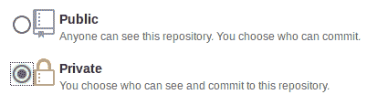
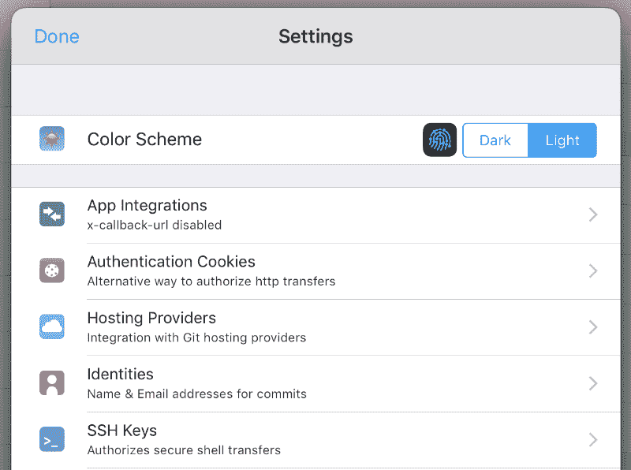
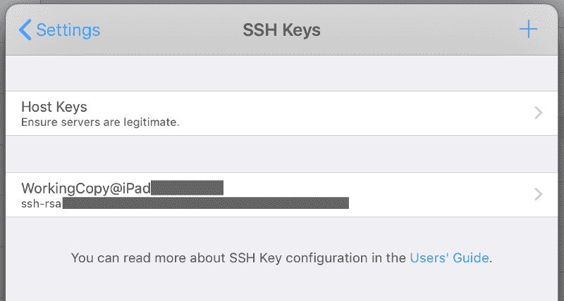
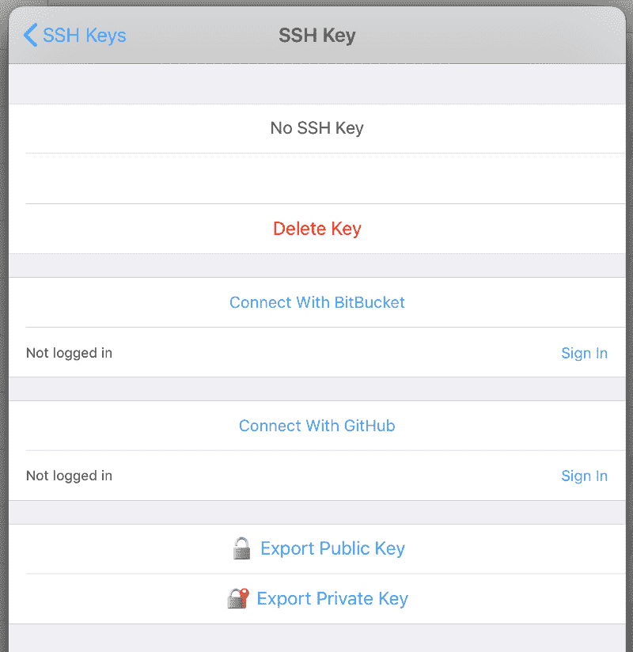
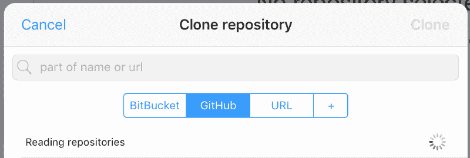
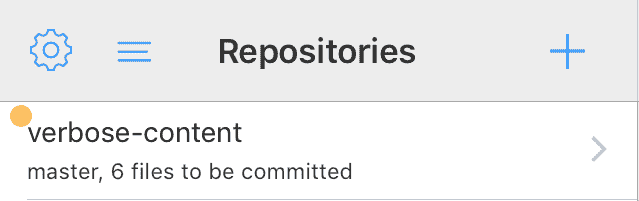
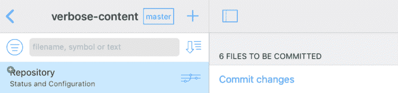
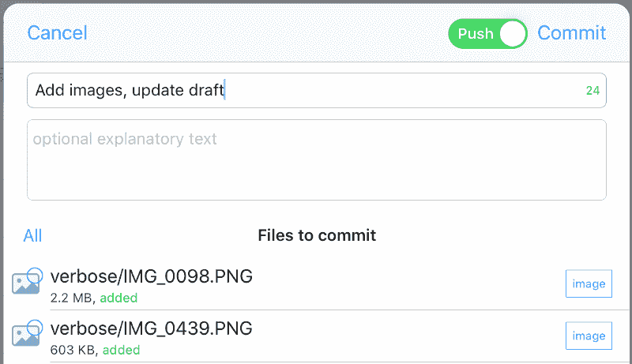
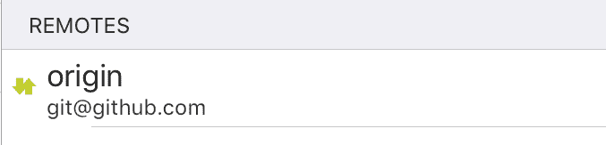

# iOS 和 Linux 的远程同步解决方案:Git 和工作副本

> 原文：<https://www.freecodecamp.org/news/a-remote-sync-solution-for-ios-and-linux-git-and-working-copy-1aba488b3547/>

#### 如何设置跨平台的云同步解决方案，以便在 iOS 上使用 Git 在任何地方工作。

我之前写过一篇关于在双启动 Windows 和 Linux 机器上使用[单个 Dropbox 文件夹的(黑客式)方法。从那以后，我觉得 Ubuntu 18.04 LTS 版已经完全是 Linux 了，但是 Dropbox 似乎已经不再是一个选项了。幸运的是，我已经找到了一种更好的(更简单的)跨不同文件系统远程同步文件的方法。反映我目前的设置，我说的是 iOS (iPad 和 iPhone)和我的 Linux 机器。](https://victoria.dev/verbose/how-i-set-up-a-single-dropbox-folder-on-my-dual-boot-windows-and-linux-system/)

新的同步系统是基于 Git 的，非常可定制，并且可方便地扩展。除了文本文件，你还可以同步 Git 能同步的任何东西(几乎是所有东西——如果你想随时编辑你的`.gitignore` d 文件，我不确定我能不能帮上忙)。如果您已经熟悉 Git，那么设置起来就像在公园散步一样简单。如果您对 Git 不熟悉，我认为这些工具有助于让 Git 克隆、拉取和推送的概念更容易理解。

### 成分

*   [工作副本应用](https://workingcopy.app)(15.99 美元一次性 pro-unlock，物超所值，仅限 iOS)
*   [iA Writer 应用](https://ia.net/writer)(iOS 一次性购买 8.99 美元，也可在 Mac、Windows 和 Android 上使用)
*   GitHub 库([私有](https://github.blog/2019-01-07-new-year-new-github/)或公共，都是免费的)

这篇文章和[这篇文章](http://blog.joncairns.com/2011/10/how-to-use-git-submodules/)给了我灵感。

### 准备好

下面是设置的步骤，我将在本文中向您介绍。

1.  创建远程存储库
2.  使用工作副本将存储库克隆到 iPad
3.  使用 iA Writer 打开和编辑文件
4.  将更改推回到远程
5.  从您计算机上的存储库中提取更改

无论您是命令行高手还是刚刚接触 Git，这个系统都很容易设置。我们开始吧！

#### 创建远程存储库

GitHub 现在为最多三个合作者提供免费的私有库。在 GitHub 的存储库创建页面选择“私有”:



创建存储库。如果你愿意，你可以按照 GitHub 的指示从你的电脑向它推送一些文件，或者你可以稍后从你的 iPad 添加文件。

#### 使用工作副本将存储库克隆到 iPad

从 App Store 下载[工作副本](https://workingcopy.app)。这是我购买的较贵的应用程序之一，但我认为它非常值得。开发者[安德斯·博伦](https://twitter.com/palmin)拥有频繁更新和整合 iOS 应用最新功能的稳定记录，比如 iPad 上的[拖放](https://workingcopy.app/manual/dragdrop)。我认为，考虑到他在维护和改进产品方面所做的工作，他为自己的产品定价是合理的。

在工作副本中，找到左上角的齿轮图标，然后触摸打开设置。



点击 SSH 键，您将看到以下屏幕:



SSH 密钥或安全 Shell 密钥是在 [SSH 协议](https://en.wikipedia.org/wiki/Secure_Shell)中使用的访问凭证。您的密钥是一个密码，您的设备将使用它安全地连接到您的远程存储库主机——在我们的例子中是 GitHub。因为任何拥有您的 SSH 密钥的人都有可能伪装成您并获得对您文件的访问权限，所以不要意外地共享它们非常重要，就像博客文章中的截图一样。

点击看起来像“WorkingCopy@iPad-xxxxxxxx”的第二行以获得此屏幕:



工作副本支持轻松连接 BitBucket 和 GitHub。点击“与 GitHub 连接”或 BitBucket，调出一些熟悉的登录屏幕，授权工作副本访问您的帐户。

连接后，点击侧边栏右上角的“+”号添加新的存储库。选择“克隆存储库”以显示此屏幕:



在这里，您可以手动输入远程 URL，或者简单地从 Working Copy 从您连接的帐户获取的存储库列表中选择。当你做出选择时，应用程序会将存储库克隆到你的 iPad 上，并显示在侧边栏中。你接通了！

#### 使用 iA Writer 打开和编辑文件

我喜欢 iA Writer[的(许多)原因之一是它能够选择新克隆的远程库作为库位置。要在 iA Writer 应用程序中执行此操作:](https://ia.net/writer)

1.  从主库列表中，在侧边栏的右上角，点击“编辑”
2.  轻按“添加位置…”
3.  出现一个有用的弹出窗口。点击确定。
4.  从工作副本位置，点击右上角的“选择”，然后选择存储库文件夹。
5.  点击“打开”，然后点击“完成”

您的远程存储库现在显示为侧栏中的一个位置。点击它在这个目录内工作。

在此位置中，您创建的新文件(通过点击右上角的纸笔图标)将保存到本地的此文件夹中。当你工作时，iA Writer 会自动保存你的进度。接下来，我们将看看如何将这些文件和更改推回到您的遥控器。

#### 将更改推回到远程

对文件进行更改后，再次打开工作副本。您应该在更改后的存储库上看到一个黄点。



点击你的存储库名称，然后点击侧边栏顶部的“存储库状态和配置”。您更改的文件将由黄色圆点或绿色“+”符号表示。这意味着您已经分别修改或添加了文件。

Working Copy 是一个可爱的 iOS Git 客户端，你可以点击你的文件来查看额外的信息，包括变更比较(“diff”)以及状态和 Git 历史。你甚至可以在应用中编辑文件，用[语法高亮显示](https://workingcopyapp.com/manual/edit)的许多支持的语言。现在，我们将看看如何将您更改的工作推送到您的远程存储库。



在“Repository Status and Configuration”页面上，您会在顶部看到有一些要提交的更改。如果您是 Git 新手，这就像是将您的更改“保存”到您的 Git 历史中，这通常是用终端命令`[git commit](https://git-scm.com/docs/git-commit)`来完成的。你可以认为这是保存我们要发送到 GitHub 库的文件。轻按“提交更改”



输入提交消息，并选择要添加的文件。当您提交文件时，打开“推送”开关将所有内容发送到您的远程存储库。然后点击“提交”

上传文件时，您会看到一个进度条，然后在状态屏幕上显示一条确认消息。


恭喜你！您的更改现在出现在 GitHub 上的远程存储库中。您已成功远程同步了您的文件！

#### 从您计算机上的存储库中提取更改

要将更新的文件完整地保存到您的计算机上，您可以从 GitHub 存储库中取出它们。我更喜欢使用终端来完成这项工作，因为它既快速又简单，但是如果终端命令现在看起来有点陌生，GitHub 也提供了一个[图形客户端](https://help.github.com/en/desktop/getting-started-with-github-desktop)。

如果你是从 GitHub 库开始的，你可以按照这些指令将它克隆到你电脑上的一个文件夹中。

#### 保持同步

当您在计算机上更新您的工作时，您将使用 Git 将您的更改推送到远程存储库。为此，你可以使用 GitHub 的[图形客户端](https://help.github.com/en/desktop/getting-started-with-github-desktop)，或者按照[这些指令](https://help.github.com/en/articles/adding-an-existing-project-to-github-using-the-command-line)。

在你的 iOS 设备上，Working Copy 让推拉变得像点一下一样简单。在“存储库状态和配置”页面上，点击“远程”下的远程名称。



然后点击“同步”。工作副本将负责推送您提交的变更和/或从远程存储库中提取任何新变更的细节。

### 不错吧？

对于像我这样的基于 Git 的开发人员和随处工作的爱好者来说，这种设置再方便不过了。工作副本真的让我与我的远程存储库保持无缝同步，更不用说在旅途中与我的任何 GitHub 存储库一起工作的能力了。

对于移动编辑，这里有一个有用的提示。如果您不需要随身携带大文件，如图像，请在同步存储库中使用`.gitignore`。这将阻止被忽略的文件被推送到 GitHub 和拉到你的 iOS 设备上——它们只会保留在你电脑的大硬盘上。我的一个同步存储库的`.gitignore`文件如下所示:

```
*.png
*.jpeg
*.jpg
*.mp4
*.gif
```

这意味着所有的媒体文件都留在我的电脑上，我可以在外出时从 GitHub 将文本文件内容下载到我的 iPad 上进行处理。

最近，我在华盛顿 DC 国家肖像画廊的中庭闲逛时，用这个装置写了些东西，这个画廊非常上镜。


我很想听听这个设置如何为你工作，以及你如何使用它。同时，工作愉快！