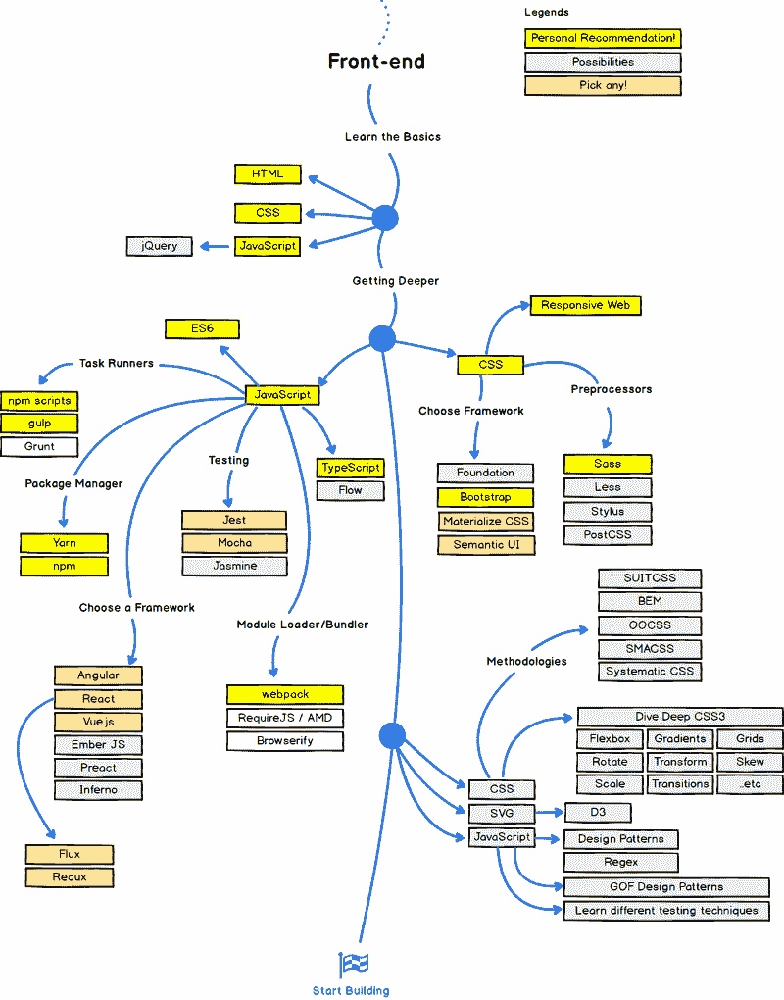
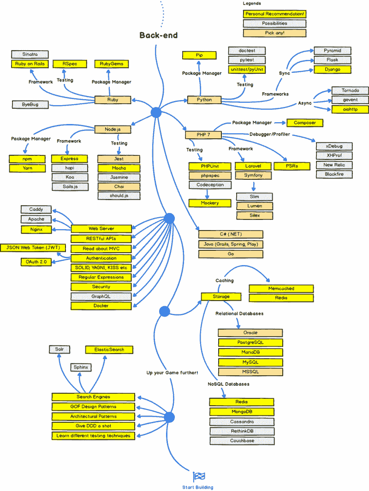
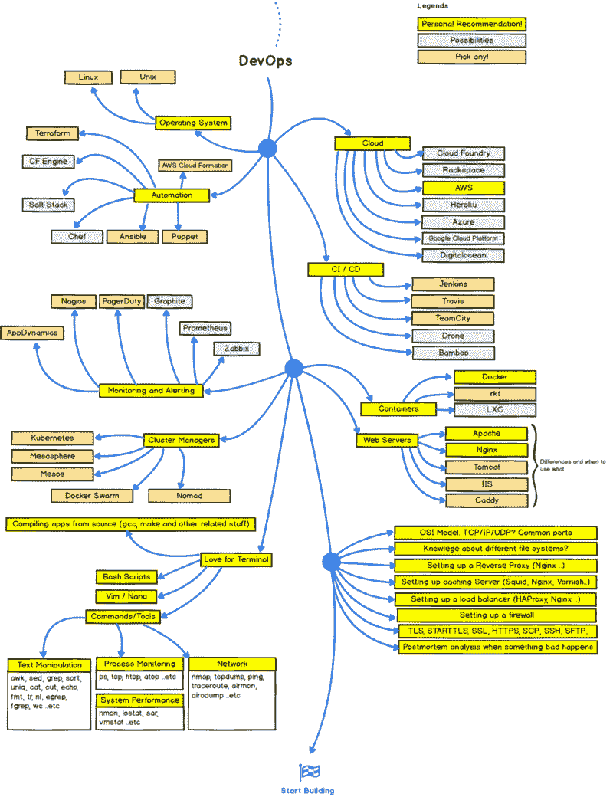

# 2017 年成为网页开发者的路线图

> 原文：<https://www.freecodecamp.org/news/a-roadmap-to-becoming-a-web-developer-in-2017-b6ac3dddd0cf/>

这些图表是由 [Kamranahmedse](https://twitter.com/kamranahmedse) 制作的。他们设想了成为网页开发者的三个路线图。

即使我不同意他的一些建议(我建议你几乎立即开始构建项目——你会有 [freeCodeCamp 的课程](http://bit.ly/2onlMic))，我仍然认为这值得一读。它将让你鸟瞰 web 开发人员使用的现代工具。

这是他的前端开发图表:

对于后端开发:

对于 DevOps，他认为这是后端开发的延伸:

不要被这一切吓倒。免费代码营将免费教你许多这样的网络开发工具。在这个过程中，你将构建几十个项目，并为开源做出贡献。

我鼓励你利用互联网上所有令人敬畏的免费资源。如果你正在寻找一个坚实的核心课程，[我们已经为你准备好了](https://www.freecodecamp.com)。

我只写编程和技术。如果你在推特上关注我，我不会浪费你的时间。？