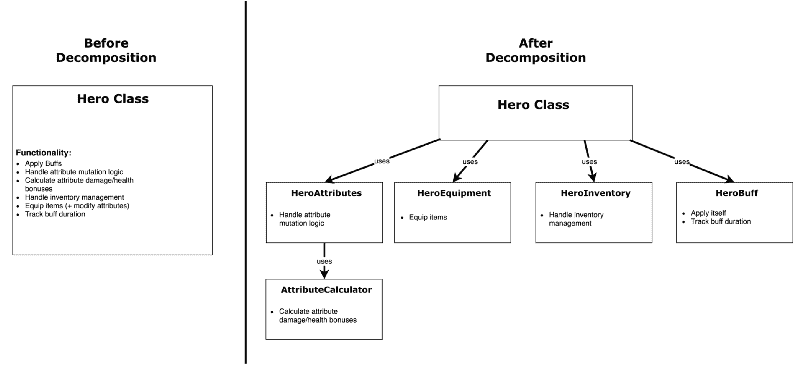

# 面向对象软件设计概述

> 原文：<https://www.freecodecamp.org/news/a-short-overview-of-object-oriented-software-design-c7aa0a622c83/>

斯坦尼斯拉夫·科兹洛夫斯基

# 面向对象软件设计概述

#### 通过实现角色扮演游戏的类来演示

[Zeppelin by Richard Wright](https://www.artstation.com/artwork/rO8e6)

### 介绍

大多数现代编程语言支持并鼓励面向对象编程(OOP)。尽管最近我们似乎看到了这种轻微的转变，因为人们开始使用不受 OOP 影响的语言(如 Go、Rust、Elixir、Elm、Scala ),但大多数语言仍然有对象。我们将在这里概述的设计原则也适用于非 OOP 语言。

为了成功地编写清晰、高质量、可维护和可扩展的代码，你需要了解那些已经被几十年的经验证明有效的设计原则。

**披露:**我们将要经历的例子将在 **Python 中。**例子是用来证明一个观点的，在其他明显的方面可能是草率的。

### 对象类型

因为我们将围绕对象来建模我们的代码，区分它们不同的职责和变化将是有用的。

有三种类型对象:

#### 1.实体对象

这个对象通常对应于问题空间中的某个真实世界的实体。假设我们正在构建一个角色扮演游戏(RPG)，一个实体对象将是我们简单的`Hero`类:

这些对象通常包含关于它们自身的属性(例如`health`或`mana`)，并且可以通过某些规则进行修改。

#### 2.控制对象

控制对象(有时也称为**管理对象**)负责其他对象的协调。这些是**控制** 并利用其他对象的对象。在我们的 RPG 类比中，一个很好的例子是`Fight`类，它控制两个英雄并让他们战斗。

将战斗的逻辑封装在这样的类中为您提供了多种好处:其中之一是动作的易扩展性。你可以很容易地为英雄传递一个非玩家角色(NPC)类型来战斗，只要它公开相同的 API。您还可以非常容易地继承该类，并覆盖一些功能来满足您的需要。

#### 3.边界对象

这些是位于你的系统边界的物体。任何从另一个系统获取输入或向另一个系统产生输出的对象——不管该系统是用户、互联网还是数据库——都可以被归类为边界对象。

这些边界对象负责将信息翻译进和翻译出我们的系统。在我们接受用户命令的例子中，我们需要边界对象将键盘输入(如空格键)转换成可识别的域事件(如字符跳转)。

#### 奖金:价值对象

[值对象](https://en.wikipedia.org/wiki/Value_object)表示你的域中的一个简单值。它们是不可变的，没有身份。

如果我们要将它们整合到我们的游戏中，一个`Money`或`Damage`职业将会是一个很好的选择。这些对象让我们能够轻松地区分、查找和调试相关功能，而使用原始类型(整数数组或一个整数)的简单方法却不能。

它们可以归为`**Entity**` 对象的一个子类。

### 关键设计原则

设计原则是软件设计中的规则，多年来已经证明了它们的价值。严格遵循它们将有助于您确保您的软件具有一流的质量。

#### 抽象

抽象是在某些情况下将概念简化为最基本的概念。通过将其简化，它可以让你更好地理解这个概念。

上面的例子说明了抽象——看看`Fight`类是如何构造的。您使用它的方式尽可能简单—您在实例化中给它两个英雄作为参数，并调用`fight()`方法。不多不少。

代码中的抽象应该遵循最小惊奇规则。你的抽象不应该用不必要的和不相关的行为/属性让任何人感到惊讶。换句话说，它应该是直观的。

请注意，我们的`Hero#take_damage()`函数不会做一些意想不到的事情，比如在死亡时删除我们的角色。但是，如果我们的角色的健康降到零度以下，我们可以预期它会杀死他。

#### 包装

封装可以被认为是将某些东西放入胶囊中——您限制了它对外界的暴露。在软件中，限制对内部对象和属性的访问有助于数据完整性。

封装使内部逻辑黑箱化，使你的类更容易管理，因为你知道哪个部分被其他系统使用，哪个部分不被使用。这意味着您可以轻松地重做内部逻辑，同时保留公共部分，并确保您没有破坏任何东西。作为一个副作用，从外部使用封装的功能变得更简单，因为您需要考虑的事情更少了。

在大多数语言中，这是通过所谓的[访问修饰符](https://en.wikipedia.org/wiki/Access_modifiers)(私有的、受保护的等等)来完成的。Python 不是最好的例子，因为它缺少内置于运行时的这种显式修饰符，但是我们使用约定来解决这个问题。变量/方法的前缀`_`表示它们是私有的。

例如，假设我们改变我们的`Fight#_run_attack`方法来返回一个布尔变量，指示战斗是否结束，而不是引发一个异常。我们将知道我们可能破坏的唯一代码在`Fight`类内部，因为我们将该方法设为私有。

请记住，代码更改比重新编写更频繁。作为一名开发人员，能够以尽可能清晰和最小的影响来更改代码是您想要的灵活性。

#### 分解

分解是将一个对象分割成多个独立的较小部分的动作。所述部件更易于理解、维护和编程。

想象一下，我们想要在`Hero`的基础上加入更多的 RPG 特性，比如 buffs、库存、装备和角色属性:

我想你可以看出这段代码变得相当混乱。我们的对象一次做了太多的事情，因此代码变得非常脆弱。

例如，一点耐力值 5 点生命值。如果我们想在未来改变它，让它值 6 点生命值，我们需要在多个地方改变实现。

答案是将`Hero`对象分解成多个更小的对象，每个对象包含一些功能。

A cleaner architecture

现在，在将我们的英雄对象的功能分解成`HeroAttributes`、`HeroInventory`、`HeroEquipment`和`HeroBuff`对象之后，添加未来的功能将会更容易、更封装和更好抽象。你可以看出我们的代码在它所做的事情上更加清晰明了。

有三种类型的分解关系:

*   **关联**—定义两个组件之间的松散关系。这两个组件互不依赖，但可以一起工作。

**举例:** `Hero`和一个`Zone`对象。

*   **聚合** —定义整体及其部分之间的弱“有-有”关系。被认为是弱的，因为部分可以脱离整体而存在。

**举例:** `HeroInventory`和`Item`。
一个`HeroInventory`可以有多个`Items`，一个`Item`可以属于任意一个`HeroInventory`(如交易项目)。

*   **构成**——一种强烈的“有-有”关系，整体和部分不能离开彼此而存在。这些部分不能共享，因为整体依赖于那些确切的部分。

**举例:** `Hero`和`HeroAttributes`。
这些是英雄的属性——你不能改变它们的主人。

#### 一般化

一般化可能是最重要的设计原则——它是提取共享特征并将它们组合在一个地方的过程。我们都知道函数和类继承的概念——两者都是一种概括。

一个比较可能会澄清一些事情:当**抽象**通过隐藏不必要的细节来降低复杂性的时候，**概括**通过用一个单一的构造代替多个执行相似功能的实体来降低复杂性。

在给定的例子中，我们已经将我们共同的`Hero`和`NPC` 类的功能归纳到一个称为`Entity`的共同祖先中。这总是通过继承来实现的。

在这里，我们没有让我们的`NPC`和`Hero`类实现所有方法两次并违反 [DRY 原则](https://en.wikipedia.org/wiki/Don%27t_repeat_yourself)，而是通过将它们的公共功能移入基类来降低复杂性。

作为预先警告——不要过度继承。[很多有经验的人](https://en.wikipedia.org/wiki/Design_Patterns#Introduction,_Chapter_1)推荐你偏爱[构图胜过传承](https://stackoverflow.com/a/53354)。

业余程序员经常滥用继承，可能是因为继承简单，是他们最先掌握的 OOP 技术之一。

#### 作文

组合是将多个对象组合成一个更复杂的对象的原理。实际上，它是创建对象的实例并使用它们的功能，而不是直接继承它。

使用复合的对象可以称为**复合对象**。重要的是，这个组合比它的同类组合简单。当将多个类合并成一个类时，我们希望提高抽象层次，使对象更简单。

复合对象的 [API](https://medium.freecodecamp.org/what-is-an-api-in-english-please-b880a3214a82) 必须隐藏其内部组件以及它们之间的交互。想象一个机械钟，它有三个指针显示时间，一个旋钮设置时间，但内部包含几十个移动和相互依赖的部件。

正如我所说的，组合优于继承，这意味着您应该努力将公共功能移动到类使用的单独对象中——而不是将其隐藏在您已经继承的基类中。

让我们举例说明过度继承功能的一个可能问题:

我们只是在游戏中加入了动作。

正如我们所知，我们没有复制代码，而是使用泛化将`move_right`和`move_left`函数放入`Entity`类中。

好吧，现在如果我们想在游戏中引入坐骑呢？

a good mount :)

坐骑也需要左右移动，但是没有攻击能力。想想看——他们可能连健康都没有！

我知道你的解决方案是什么:

只需将`move`逻辑移到一个单独的`MoveableEntity`或`MoveableObject`类中，该类只具有该功能。然后`Mount`类可以继承它。

那么，如果我们想要有生命值但不能攻击的坐骑，我们该怎么做？更多的分成子类？我希望您能看到我们的类层次结构是如何开始变得复杂的，尽管我们的业务逻辑仍然非常简单。

更好的方法是将运动逻辑抽象成一个`Movement`类(或者更好的名字),并在可能需要它的类中实例化它。这将很好地打包功能，并使其可以在所有种类的对象上重用，而不仅限于`Entity`。

万岁，作文！

#### 批判性思维免责声明

尽管这些设计原则是通过几十年的经验形成的，但在盲目地将原则应用到代码之前，能够进行批判性的思考仍然是非常重要的。

像所有的事情一样，太多可能是一件坏事。有时候原则可能会走得太远，你可能会变得太聪明，最终得到一些实际上更难处理的东西。

作为一名工程师，你的主要特点是批判性地评估适合你独特情况的最佳方法，而不是盲目地遵循和应用武断的规则。

### 关注点的内聚、耦合和分离

#### 内聚力

内聚性代表了一个模块中职责的清晰性，或者换句话说，它的复杂性。

如果你的类只执行一项任务，或者有一个明确的目的——这个类有**高内聚**。另一方面，如果它在做什么有些不清楚或者有不止一个目的——它就有**低内聚**。

你希望你的类有很高的凝聚力。他们应该只有一个责任，如果你发现他们有更多的责任，可能是时候分开了。

#### 连接

耦合抓住了连接不同类之间的复杂性。您希望您的类与其他类的连接越少越好，越简单越好，这样您就可以在将来的事件中交换它们(比如更改 web 框架)。目标是让**松耦合**。

在许多语言中，这是通过大量使用接口来实现的——它们抽象出处理逻辑的特定类，并表示一种任何类都可以插入其中的适配器层。

#### 关注点分离

关注点分离(SoC)是一种思想，即软件系统必须被分割成在功能上不重叠的部分。或者顾名思义——关注——对任何提供问题解决方案的事物的统称*——*一定要分开放在不同的地方。

网页就是一个很好的例子——它有三个层(信息层、表示层和行为层),分别位于三个地方(HTML、CSS 和 [JavaScript 和](https://shinesolutions.com/2013/10/29/respect-the-javascript/))。

如果你再看看 RPG `Hero`的例子，你会发现它一开始就有很多顾虑(应用 buffs，计算攻击伤害，处理库存，装备物品，管理属性)。我们通过**分解**将那些关注点分成更多的**内聚**类，这些类**抽象**和**封装**它们的细节。我们的`Hero`类现在作为一个[复合](https://en.wikipedia.org/wiki/Composite_pattern)对象，比以前简单多了。

### 发工资

对于这样一小段代码来说，应用这样的原则可能看起来过于复杂。事实是，对于你将来计划开发和维护的任何软件项目来说，这都是一个必须要做的事情。编写这样的代码一开始会有一些开销，但从长远来看会有很多回报。

这些原则确保我们的系统更加:

*   可扩展的 : **高内聚**使得实现新模块变得更加容易，而不用担心无关的功能。**低耦合**意味着新模块需要连接的东西更少，因此更容易实现。
*   **可维护** : **低耦合**确保一个模块的变化一般不会影响其他模块。**高内聚**确保系统需求的变化需要修改尽可能少的类。
*   **可重用** : **高内聚**确保模块的功能完整且定义明确。**低耦合**使得模块更少依赖于系统的其余部分，更容易在其他软件中重用。

### 摘要

我们从介绍一些基本的高级对象类型(实体、边界和控制)开始。

然后，我们学习了构建所述对象的关键原则(抽象、概括、组合、分解和封装)。

为了跟进，我们引入了两个软件质量度量标准(耦合和内聚)，并了解了应用这些原则的好处。

我希望这篇文章提供了一些设计原则的有用概述。如果你想在这方面继续深造，这里有一些我推荐的资源。

#### 进一步阅读

设计模式:可重用的面向对象软件的元素——可以说是该领域最有影响力的书。它的例子 *(C++ 98)* 有点过时，但是模式和思想仍然非常相关。

测试指导下的面向对象软件的发展——这是一本很棒的书，展示了如何通过一个项目来实际应用本文(以及更多)中概述的原则。

[有效的软件设计](https://effectivesoftwaredesign.com/category/oop/)——一个顶级博客，包含的不仅仅是设计见解。

[软件设计和架构专业化](https://www.coursera.org/specializations/software-design-architecture) —这是一个由 4 个视频课程组成的伟大系列，它教你如何在一个跨越所有四个课程的项目中进行有效的设计。

如果这个概述对你有帮助，请考虑给它你认为值得的掌声，这样更多的人可以偶然发现它并从中获得价值。