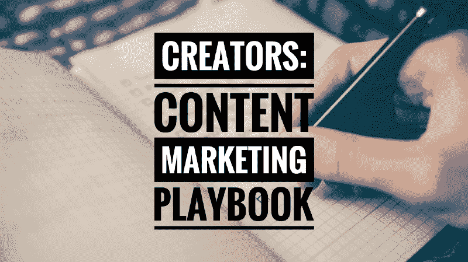
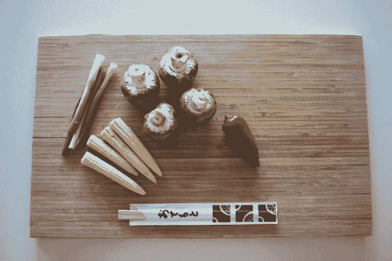
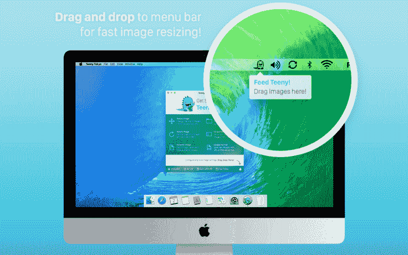
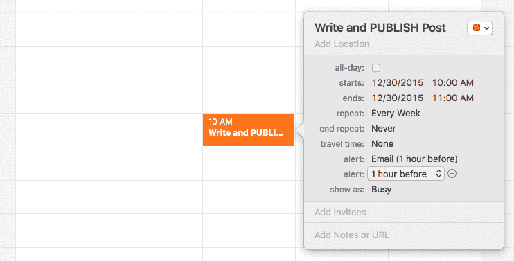

# 面向软件开发者和创作者的简单内容营销手册

> 原文：<https://www.freecodecamp.org/news/a-simple-content-marketing-playbook-for-software-developers-and-creators-937f86d6dd90/>

约翰·萨丁顿

# 面向软件开发者和创作者的简单内容营销手册



Image via [Pinpoint](https://blog.pinpt.co/content-marketing-startups/)

建筑材料可能很难。但是作为设计师、开发者和商业建设者，这是我们最满意的事情之一。当我们与他人分享这些创造时，我们就能一起分享我们的快乐。这增强了我们个人的快乐。因此，它成为一个良性循环，为每个人创造价值。

但对我们许多人来说，挑战不在于建筑，而在于我们最纠结的共享部分。因为，不管出于什么原因，我们觉得自己是一个伟大的产品，一件伟大的作品应该是不言自明的。

不幸的是，这不是它的工作方式，尤其是如果你正在建立一些数字化的东西。

我们都必须花同样多的时间和精力来推销我们的努力，就像我们把它们放在一起一样。无论是个人的副业项目，独立的应用程序，甚至是早期的初创公司，都是如此，

如果这冒犯了你的良心，我能理解。我已经建立了一些个人兼职项目，并且我已经知道分享我的工作和开发它们一样重要。结果，其中一些项目在[做得很好。](https://john.do/desk-best-app/)

当我开始组织一个更大的项目，一个创业公司时，我知道我必须做同样的事情。我知道我需要遵循我在小型独立项目中使用的技术和策略。

我必须发展一个平台和一个社区，就像第一天的[营销中讨论的那样:不要让任何东西碰运气](https://blog.pinpt.co/marketing-day-one/)。我必须致力于产品营销。

前几天，当我读到[大卫·贝利](https://www.freecodecamp.org/news/a-simple-content-marketing-playbook-for-software-developers-and-creators-937f86d6dd90/undefined)写的[为什么创始人不能推销他们的产品](https://medium.dave-bailey.com/why-founders-fail-to-market-their-products-f7c15935c81)时，我想起了这一点。我们可能会梦想不用销售就能制造东西。但是大卫，一个成功的连续企业家，在这篇文章中阐述了我们被误导的观念。他指出，现实是，你需要营销就像你需要产品一样多:

> “从创业的第一天起，就需要有人在你的公司做营销活动。发射后没有。不是在一些公关活动中。每天都是。打造一个伟大的产品是很难的。伟大的营销也很难。要想赢，你绝对需要这两样东西。”

大卫特别提到了创业公司。但他的建议适用于数字产品的创造者和建设者。无论产品范围和规模如何，它都不会改变。我们都知道，我们需要营销我们已经建立的东西，以最大限度地实现我们都希望实现的良性循环！

换句话说，当涉及到我们的产品时，我们都需要像花粉一样。但是当你有这么多*和其他*事情要做的时候，这很难。尤其是在打造一款人们想要并喜爱的产品时。然而，压力和竞争持续增加！

最近看了一篇[托马斯·东古兹](http://tomtunguz.com/best-content-marketers/)的文章。Tomasz 是一位 VC @ Redpoint，他的文章总是受到我们团队的青睐。他的帖子是战略性的和数据驱动的，而不是[的高调](https://www.merriam-webster.com/dictionary/highfalutin)或充斥着“创业话语”。

他最近的一篇名为 [*世界上最好的内容营销人员*](http://tomtunguz.com/best-content-marketers/) 的文章，讲述了最好的内容营销人员如何做到以下几点:

*   将人物角色与内容、节奏、长度等相匹配。
*   通过日历和日程安排使工作机械化。
*   允许企业引导潜在客户踏上一段旅程，最终实现转变。
*   在执行时要有明确的纪律。

结果呢？您可以降低获取客户的成本以及潜在的客户流失和收入损失。

所有这些都很有意义，但看起来还是有点令人畏惧。对于有经验的人来说仍然如此。即使对于一个早期的公司或有经验的项目建设者和创造者。

我们做什么呢当我们扣动扳机的资源有限时，我们能做什么？


Keep it simple. Single lane. Focused. Image via [BOSSFIGHT](http://bossfight.co).

我们可以先保持事情超级简单。当我说“简单”时，我指的是简单。

有大量更广泛、更全面的“营销剧本”。但是挑战在于它们更加广泛和全面。您可能需要比目前更多的资源来满足要求。

换句话说，大多数行动手册对任何人来说都太复杂了，尤其是在开始阶段。这是我的经验之谈。当只有我和一个小的独立应用程序时，使用那些更大的剧本是不可能的！

> 记住，你总是可以把事情变得更复杂。但是把复杂的事情变简单总是比较困难的！

所以这里有一个简单的小备选剧本供你回顾。我希望它会有用得多。我希望它能帮助你为你的产品设定一个合适的目标，以及你能把它带到哪里。

#### 一个小而简单的内容营销剧本

让我们先从基础开始，这也是 Tomasz 链接到的:[购买者的旅程](https://blog.hubspot.com/sales/what-is-the-buyers-journey)，这是一个 3 阶段的过程:

*   意识阶段:买家意识到他们遇到了问题。
*   **考虑阶段:**买方确定他们的问题，并研究解决问题的方案。
*   **决策阶段:**买家选择一个方案。

我喜欢这种分解的原因是它清晰简洁，执行起来也很简单。同样精彩的是，它帮助你把注意力集中在此时最重要的阶段:意识。

这对于早期创业或较小的数字项目尤为重要。

这意味着你所有的努力都将围绕这个过程的第一部分。

记住这一点，你的内容营销努力的唯一目标将是知名度。你可以以后再担心剩下的阶段。你可以找到更多的可用时间，制定出你的流程，甚至组建一个更大的团队。在适当的时候！



The obligatory “ingredients” image. Image via [BOSSFIGHT](http://bossfight.co).

本行动手册的要素简单明了:

1.  确认你的唯一目标是创造意识。
2.  选择 1 个(是的，只有 1 个)工具开始创造这种认知。
3.  安排您计划的更新。
4.  根据您的日历执行。
5.  冲洗并重复。

就是这样。这是战术手册。简单吧？你从心理上同意开始，你围绕一个工具或技术做出决定，你花一些时间在你的日历上添加一个重复的事件，然后你执行它。

想要个例子吗？当然，为什么不呢！事实上，我会给你确切的内容营销攻击计划，这是我去年为一个小型独立项目制定的。

我为 macOS 构建了一个小的图像大小调整应用程序。顺便说一下，这是一次(财务)失败。



I built a small image resizing app for macOS. It was ultimately a (financial) **failure**, btw.

所以，让我们从一些背景开始，从那里开始。

我正在开发一个小的图像编辑 macOS 应用程序，我想让人们知道它。但是，这是一个副业，我的时间非常有限。

我在 Mac App Store 中销售这款应用，所以我需要在应用的认知度上投入大量资金，才能取得成功。这包括产品、工程和建筑意识。

我承诺每周写一次博客。话题并不重要，重要的是我分享了一些我正在做的事情。我写的博客包括

*   设计(用户界面/UX)
*   产品和工程考虑
*   激发我灵感的随机截图。

所以，我在日历上放了一个提醒，看起来完全是这样的:



Every Wednesday @ 10:00am

我的承诺很简单，我选择了一种工具/技术:每周一篇博文。我会从头到尾花一个小时，然后发表一些东西。

在上午 10:00 左右，我不止一次地在内心呻吟。我有一百万件我觉得更紧迫的事情。但是，如果人们打算购买这个应用程序，我需要尽自己的一份力量。

我需要始终如一地执行购买者旅程的第一部分:认知。

为此，我需要兑现我的承诺。

从上午 10:00 开始，我会一直坐着，直到一个小时后我发表了什么，我才会起来。然后，如果我记得，我会更进一步，在我的个人 [Twitter](http://twitter.com/8bit) 上公开分享这篇文章。但仅此而已。

没什么，对吧？

嗯，我曾为许多初创公司提供咨询和指导，我知道这种斗争(这是真实的)。最常遇到挑战是压力。他们相信他们需要一个全面的战略计划和大量的数字空中掩护。

意图和动机是好的。我知道他们想展示他们自己和他们项目的最佳照片。我明白了，真的！但是十次有九次这种良好的意图会阻碍重要的事情:执行。

他们的期望太高，他们变得气馁。

沮丧会堆积在他们身上，直到他们意识到他们没有提升任何产品知名度。一周可以变成两周，两周变成一个月，一年。


Build a strong base, expand from there slowly, wisely. Image via [BOSSFIGHT](http://bossfight.co).

然后他们准备发布，他们的第一篇(也是唯一一篇)博客帖子是他们的“Hello World”公告帖子，本质上是关于他们的 1.0 版发布的！我的意思是，让我们诚实一会儿——你见过多少次这样的事情发生？

到那时，已经太晚了，他们已经损失了几个月，甚至几年的时间。是时候创造意识，围绕产品建立社区了。他们本可以将其中一些人转化为付费客户。当只有几个人出现并且他们没有改变信仰时，这是令人沮丧的。

这不是你的创意项目或早期公司想要的故事。你想要的正好相反。当你的产品第一次出现在数字货架上时，你希望成百上千的人排队购买。更多的人为你欢呼！

想象一下那会是什么感觉，结果会有多么不同。

但要做到这一点，你必须遵循**简单的内容营销剧本**。你需要致力于通过一个渠道建立意识，把它添加到你的日程表上，然后去做。不要放弃。

你可能想给这个简单的内容营销剧本增加复杂性。你可能会受到你以前遇到的许多“最佳实践”策略的影响。

但是请记住:

```
execution > strategy 100% of the time
```

如果你在战略上超越了你的执行能力，那么你就落后了。

好吧。前进，营销内容，建立意识，并获利。

### 太容易了？好吧。这里有一些给勇敢者的奖励材料…

好吧，你已经做完了。太好了。你已经领先竞争对手一百万光年了。许多人不会做内容营销剧本的战略建设，更不用说执行它了！

但是你想要更多。太好了。

我也为你准备了一点，这个系统就像基础一样简单。要扩展基本原理，您只需做以下事情之一:

*   要么增加一个沟通渠道(即工具、平台、技术),要么…
*   将执行的次数加一。

就是这样。

所以，如果你在写博客，那就把 Twitter 加入进来。或者，如果你已经开始使用 Twitter，那就添加一个博客。或者为你的公司或 Google+或脸书创建一个 LinkedIn 页面。

或者你对你的单一频道很满意。但是你觉得你现在要每周发布一次，而不是每隔一周。太好了。一个月四篇博文而不是两篇？你能做到的！

所以选择**要么**增加一个频道**要么**增加你在博客上发表文章的次数。就是这样。

在某种程度上，只要你一次添加一个新的东西，这几乎没有关系。别在这里发疯。

你可以无限延续这种稳步递增的增长策略。随着你越来越适应，自动化你的系统，甚至雇佣员工。

同样，这增加了更多的复杂性，所以要明智地做。确保你已经锁定了一个为你和你的团队工作的工作流程。

如果你想知道更多的想法，这里有一些我已经添加到我的博客中的内容营销渠道。我是在写了 6 个月博客后这样做的(没有增加复杂性)。

我不是从一个渠道开始的，但是，我已经这样做了几次，我已经自动化了一些任务。


Need more? Sure… Image via [BOSSFIGHT](http://bossfight.co).

最后，如果我要再补充一条忠告，那就是:

> 不要害怕尝试。不要害怕犯错。

考虑到我正在和企业家们交谈，这个建议可能看起来有点不切实际。你已经在测试边界并突破它们。你已经在不顾一切地执行了。

> 但并不是所有的企业家和建设者都是了不起的内容营销者。

事实上，大多数都不是。这是一项需要时间培养的技能，你需要不断努力，就像其他事情一样。你不必成为大师或任何接近专家级的地位，但是，你必须尝试。

而且，好的是不一定要有绝地技能！即使是最少量的内容营销努力也能产生真正的影响。

有一千种东西可能会扼杀你的创业。

我希望缺乏内容营销不会成为其中之一。

我希望你能抽出时间，为购买者的旅程搭建第一块基石:认知。

我希望你会非常成功！

如果您有任何进一步的问题，或者甚至想让我查看您整理的内容，请联系我。如果你想听我在一个视频博客上对此大声疾呼，[我会为你报道](https://www.youtube.com/watch?v=6Ezu_guIWhE)。

底线是:我愿意帮忙！所以告诉我。你可以在 [#EngOps](https://blog.pinpt.co/content-marketing-startups/) 上阅读更多我的文章。