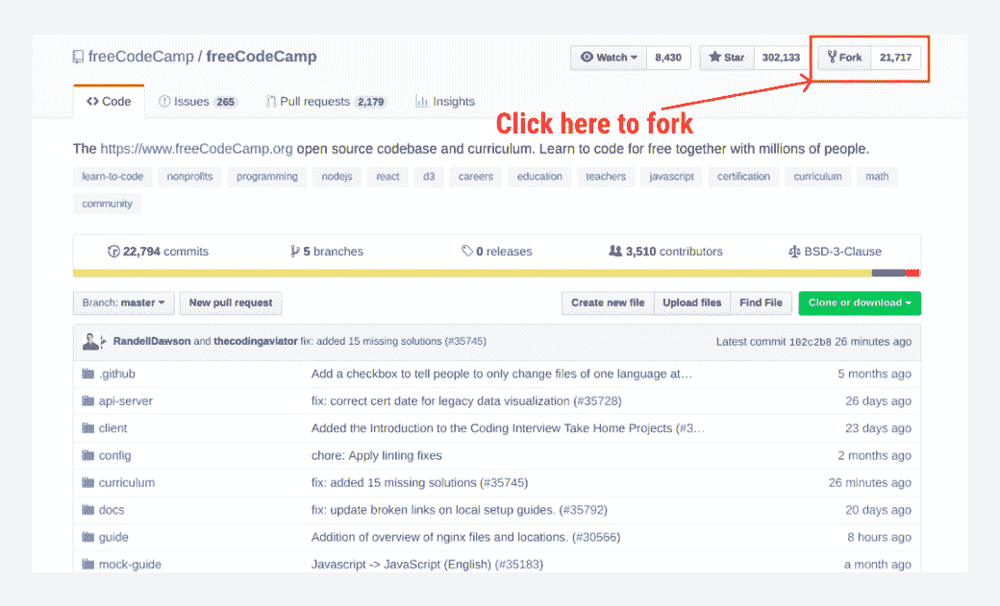
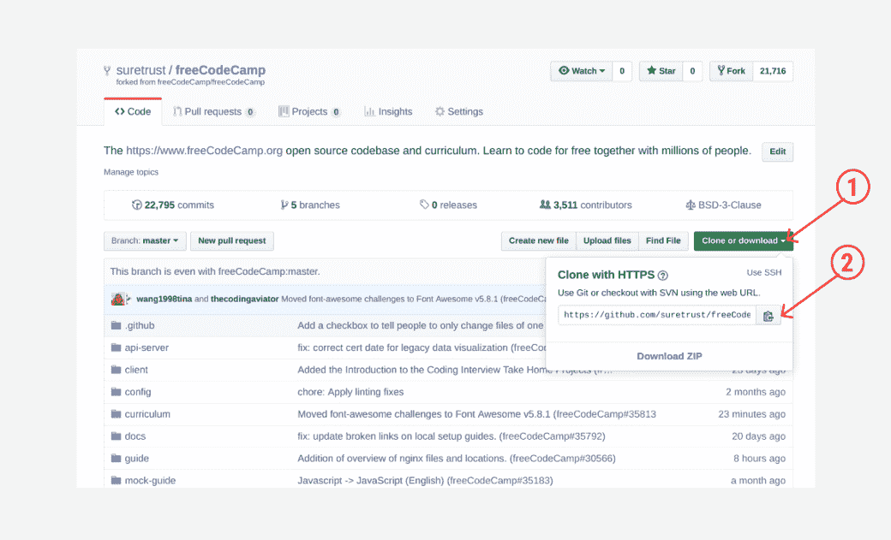
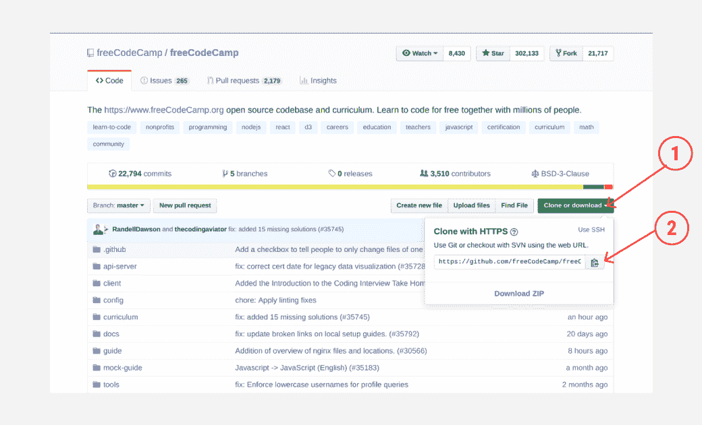
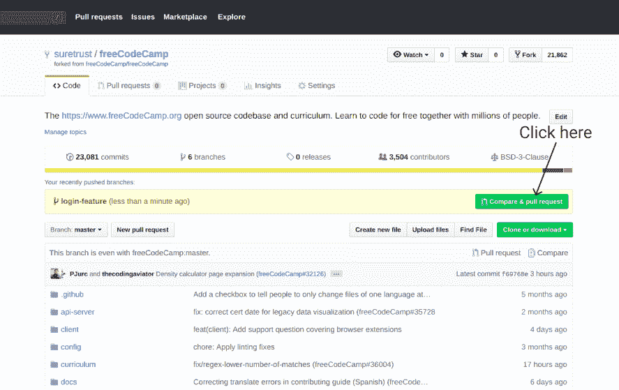
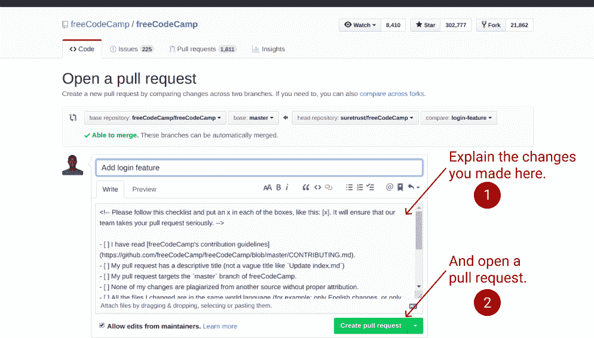
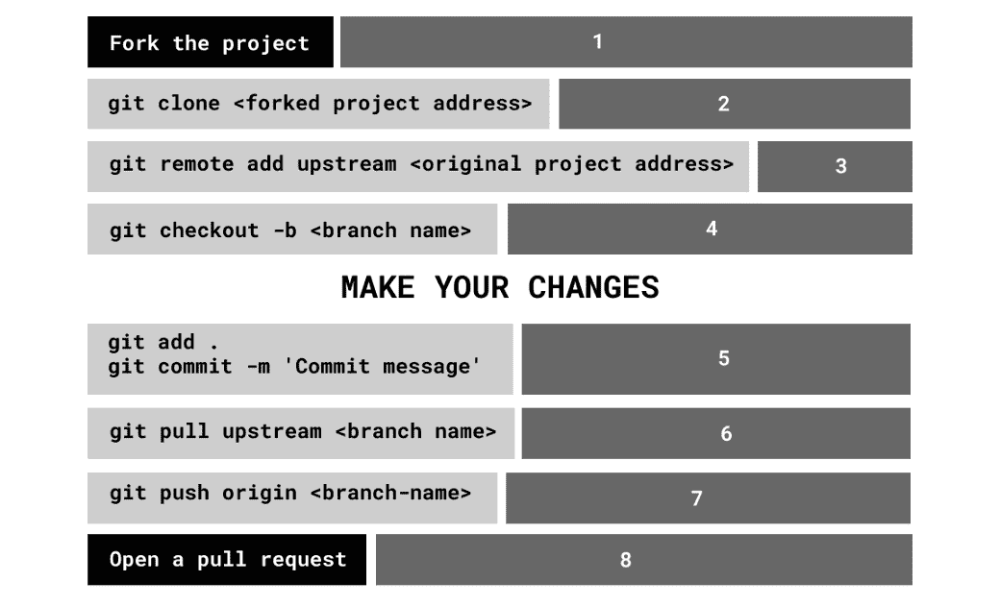

# 面向开源贡献者的简单 Git 指南和备忘单

> 原文：<https://www.freecodecamp.org/news/a-simple-git-guide-and-cheat-sheet-for-open-source-contributors/>

为您的开源贡献提供一个 git 备忘单。

如果你正在阅读这篇文章，你已经知道开源贡献的好处比比皆是。如果你是来看备忘单的，你可以跳过这篇文章，直接跳到最后。

有抱负的开源贡献者面临的共同问题是如何从 fork 到 pull request 迈出第一步*。阅读完本文后，您应该已经准备好了进行第一次开源拉取请求所需的一切。*

除了让这个过程对你来说更容易，这篇文章中定义的 git 工作流也让你的贡献看起来更专业。如果您想将您的开源贡献添加到您的投资组合中，这尤其有用。

### 先决条件

Photo by [Randy Fath](https://unsplash.com/@randyfath?utm_source=ghost&utm_medium=referral&utm_campaign=api-credit) / [Unsplash](https://unsplash.com/?utm_source=ghost&utm_medium=referral&utm_campaign=api-credit)

本文假设您已经知道为开源做贡献的步骤。不知道的话，不妨看看[玛丽娜](https://rubygarage.org/blog/how-contribute-to-open-source-projects)写的这篇文章。这篇文章还假设您已经在 PC 上安装了 Git。如果您还没有，您可能想先查看一下本文的[设置 Git 部分。](https://help.github.com/en/articles/set-up-git)

### 步骤 1:分叉项目

这就像在 GitHub 上点击一个按钮一样简单。导航到您想要参与的项目的存储库，然后单击右上角的 fork 按钮，如下图所示。

使用 fork 按钮后，您现在已经在您的 GitHub 帐户上拥有了存储库。

### 步骤 2:将项目克隆到您的本地机器上

这是 Git 最简单的部分。导航到您的分叉存储库(该存储库现在是您的 GitHub 存储库之一)。如下图所示，按照步骤 1 和 2 复制克隆地址。这个地址应该是这样的:`https:[github.com/suretrust.com/freeCodeCamp.git](http://github.com/suretrust.com/freeCodeCamp.git)`

然后，通过在命令终端中键入`git clone <the copied address>`来克隆项目，如下所示:

`git clone [https://github.com/suretrust/freeCodeCamp.git](https://github.com/suretrust/freeCodeCamp.git)`

### 步骤 3:创建上游

上游对于跟踪 Git 帐户上的分叉存储库和原始存储库之间的差异是必要的。如果您想为一个流行的存储库做贡献，这是非常有用的。

一些存储库每小时或更短时间合并一次拉请求，所以为了安全起见，假设您拥有的分叉存储库将在原始存储库之后。

**注意，上游是在 freeCodeCamp 存储库中，而不是你的分叉存储库中。**按照如下所示的步骤 1 和 2 复制上游地址:

要创建到原始存储库的链接，请将以下命令复制并粘贴到您的终端中:

`git remote add upstream <upstream address>`

您可以使用`git pull upstream master`来确认此刻(从您分叉存储库到现在)是否有任何变化。

### 步骤 4:创建您想要处理的分支

Photo by [Zach Reiner](https://unsplash.com/@_zachreiner_?utm_source=ghost&utm_medium=referral&utm_campaign=api-credit) / [Unsplash](https://unsplash.com/?utm_source=ghost&utm_medium=referral&utm_campaign=api-credit)

每当你想做贡献的时候，创建一个新的分支是很好的。这说明分行只为你即将做出的贡献服务。它可以小到修复一个打字错误，也可以大到实现一个新功能。无论哪种方式，创建一个分支都是很好的实践。

分支创建的另一个重要部分是命名。使用一个对存储库一无所知的陌生人能够容易理解的名称是令人愉快的。例如，如果您想添加一个登录特性，您可以创建一个名为`add-login-feature`或`login-feature`的分支。

要创建分支，请在终端中键入以下命令:

`git checkout -b <your branch name>`

该命令将创建分支并导航到其中。如果您的分支名称是 login-feature，那么您可以使用以下命令:

`git checkout -b login-feature`

***然后添加你的贡献。添加您的贡献后，继续第 5 步。***

### 步骤 5: Git 添加并提交您的贡献

这也很简单。通过在您的终端中键入以下内容，准备并提交您的更改。

`git add .`

`git commit -m 'Commit message'`

现在，您已经准备并提交了变更。接下来呢？

### 第六步:从上游拉到分支

正如我在步骤 4 中解释的，这一步是将上游中的任何差异合并到分支中，以防止冲突。

`git pull upstream <branch name>`

这将上游的变更合并到您当前的分支中。

### 第七步:推进你正在处理的分支

现在，你就快到了。将您的更改推送到您正在处理的分支，如下所示:

`git push origin <branch-name>`

### 步骤 8:打开一个拉取请求

这是任何开源贡献的最后一步，你只需说‘我做了一些修改，你介意把它添加到项目中吗？’。

您打开一个拉请求，如果存储库所有者或成员喜欢他们所看到的，他们将合并它。否则，他们可以进行更改，然后合并或请求更改。

要打开一个拉请求，导航到如下所示的分叉存储库。你会看到你最后的推送分支`‘login-feature’`，然后点击`‘compare and pull request’`。

清楚地解释您所做的更改，然后打开一个拉动式请求，如下所示:

仅此而已。:)现在，您可以像专业人士一样做出贡献了！

## 面向开源贡献者的 Git 备忘单

平安无事，快乐贡献！