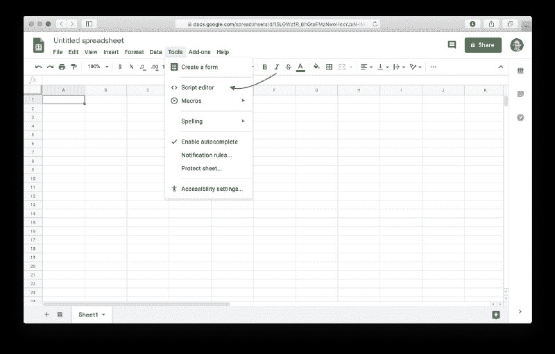
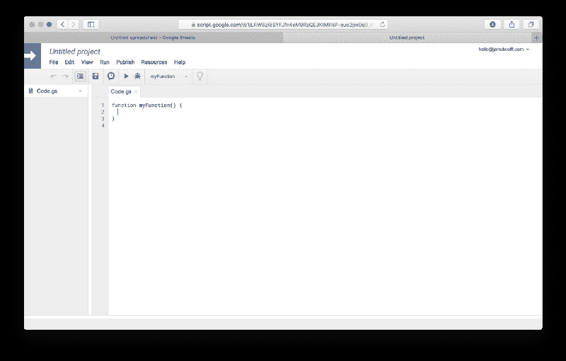
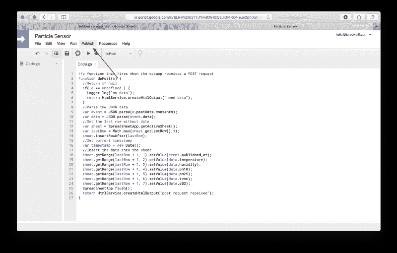
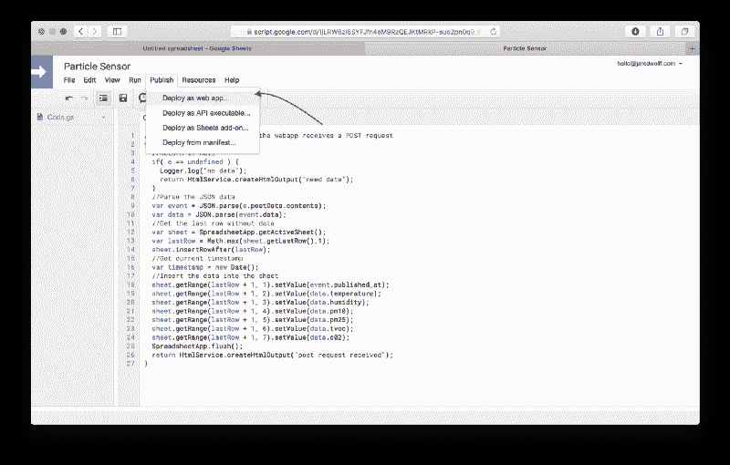
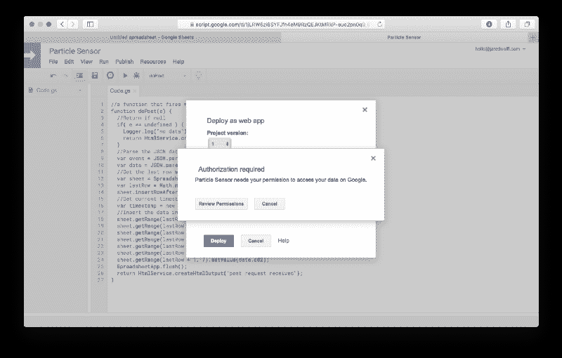
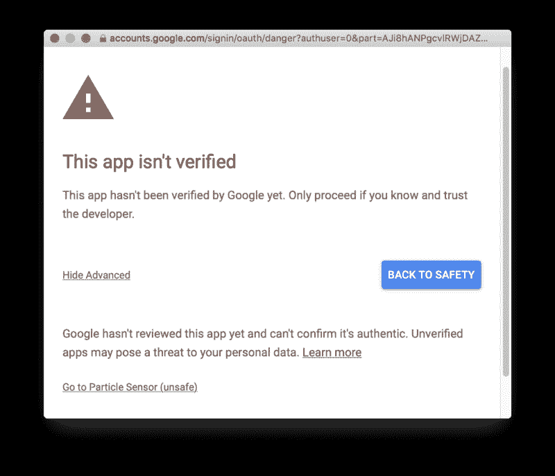
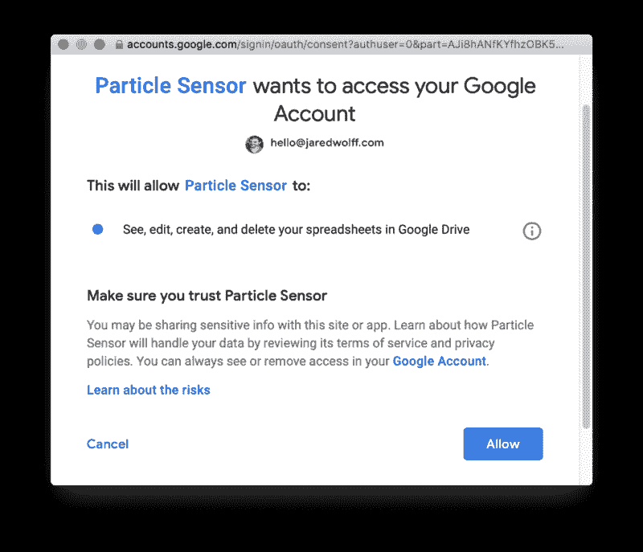
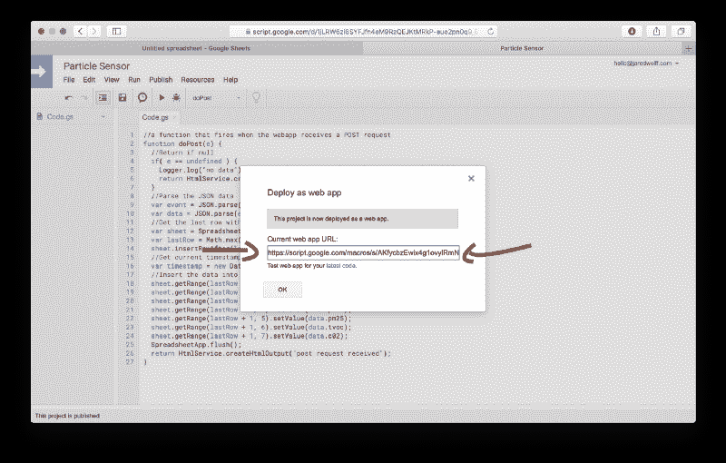
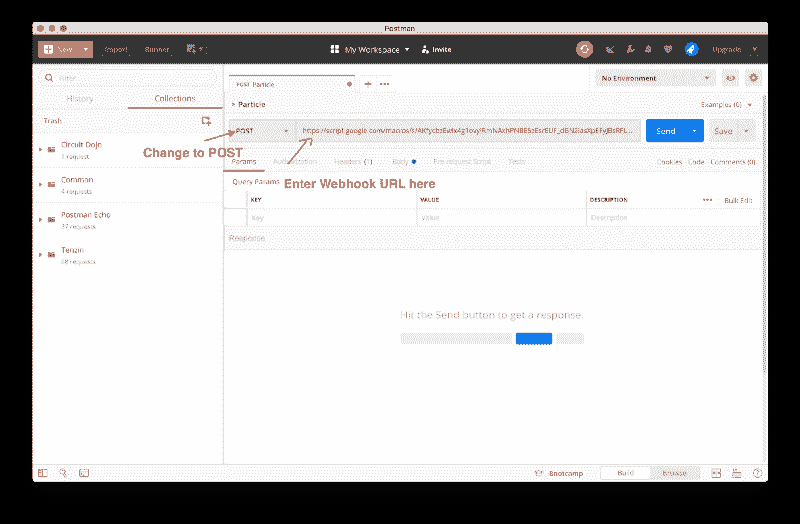
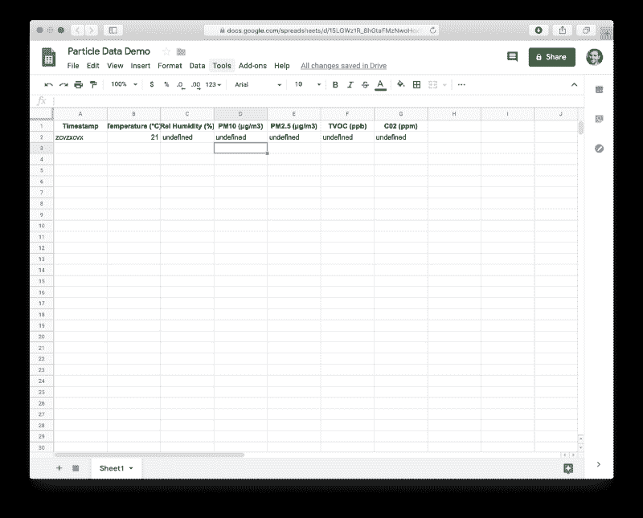

# 一个简单的方法:恐吓现在停止

> 原文：<https://www.freecodecamp.org/news/a-simple-how-to-on-webhooks-the-intimidation-stops-now-9671e8c94c76/>

Webhook。

这听起来就像当你把蜘蛛和海盗杂交时会发生什么。然而在互联网的世界里，网页挂钩是完全不同的东西。Webhooks 帮助将服务连接在一起。

让我解释一下。

假设我们有两个假设的服务。一个是生成数据的服务，另一个是收集和组织数据的服务。

第一个服务的开发者想，“伙计，我们的平台就这么有用。让我们让用户能够将实时数据转发给其他服务。”

第二种服务的开发者认为。“哎呀，如果我们的用户能够更容易地导入数据，那就太好了。”因此，他们添加了 webhooks，以便从第一个服务这样的服务中实时接收数据。

现在作为用户，你碰巧使用这两种服务。你现在有能力将它们连接在一起。

最好的解释方式是用一个真实的例子。


Are you ready?

### 真实世界的例子

在最近的一个项目中，我将一个物联网传感器连接到了谷歌文档表上。我只花了大约 10 分钟。我现在要给你看同样的东西。

#### 让我们首先从设置 Google Sheet 开始。

*   创建新工作表


Create a new sheet.

*   一旦你在那里，去**工具**和点击**脚本编辑器**



Create a new script based on the sheet.

*   它应该会打开一个新窗口，如下所示:



New script screen.

*   复制并粘贴这段代码。做完后我会解释的。

```
//this is a function that fires when the webapp receives a POST requestfunction doPost(e) {    //Return if null  if( e == undefined ) {    console.log("no data");    return HtmlService.createHtmlOutput("need data");   }    //Parse the JSON data  var event = JSON.parse(e.postData.contents);  var data = event.data;
```

```
//Get the last row without data  var sheet = SpreadsheetApp.getActiveSheet();  var lastRow = Math.max(sheet.getLastRow(),1);  sheet.insertRowAfter(lastRow);    //Get current timestamp  var timestamp = new Date();    //Insert the data into the sheet  sheet.getRange(lastRow + 1, 1).setValue(event.published_at);  sheet.getRange(lastRow + 1, 2).setValue(data.temperature);  sheet.getRange(lastRow + 1, 3).setValue(data.humidity);  sheet.getRange(lastRow + 1, 4).setValue(data.pm10);  sheet.getRange(lastRow + 1, 5).setValue(data.pm25);  sheet.getRange(lastRow + 1, 6).setValue(data.tvoc);  sheet.getRange(lastRow + 1, 7).setValue(data.c02);    SpreadsheetApp.flush();  return HtmlService.createHtmlOutput("post request received");}
```

现在，让我们明白一切。

```
function doPost(e) {
```

是在 POST 事件中被调用的函数。把这个脚本看作一个 web 服务器。我们将数据发送到一个特定的地址(我们很快就会知道)

**e** 是 HTTP 调用的对象。它会有我们发送的数据。所以最好检查一下它是否为 **NULL。**如果是，那么没有必要运行脚本。

如果我们有有效的数据，让我们把它从字符串转换成可用的 JSON。你可以使用每个人都喜欢的功能`JSON.parse`来这样做。

```
var event = JSON.parse(e.postData.contents);
```

记住，数据的结构将决定你如何处理它！根据数据的嵌套程度和格式，你可能需要运行几次`JSON.parse`。

有了数据之后，就该把它放到正确的地方了！

```
//Get the last row without datavar sheet = SpreadsheetApp.getActiveSheet();var lastRow = Math.max(sheet.getLastRow(),1);sheet.insertRowAfter(lastRow);
```

这三个调用将使您到达从第 1 行开始的第一个可用行(将第 0 行留给列标签)。

最后，我们将数据放在它所属的行中:

```
sheet.getRange(lastRow + 1, 1).setValue(event.published_at);
```

其中`sheet.getRange`的第一个参数是行，第二个是列。您可以使用`setValue`功能在特定单元格中设置您想要的内容。

顺便说一下，这段代码的灵感来自于[这篇文章](https://blog.runscope.com/posts/tutorial-capturing-webhooks-with-google-sheets)。

酷毙了。所以我们有一个剧本。我们怎么称呼它？


Why can’t I do annything riiiiiighhhhttt.

*   点击**发布**按钮



Click the “Publish” button.

*   点击`Deploy as a web app`



Click that “Deploy as web app” link!

*   更改设置以匹配下面的截图。然后点击`Deploy`


Anyone can have access for simplicity. For other use cases, logins are recommended.

*   您可能会看到一个屏幕，要求您更新您的权限。点击`Review Permissions`



You’ll need to authorize the app to use your account to modify the Google Sheet.

*   点击`Advanced`，然后点击左下角的`Go to <Your File Na` me >。



Security warning. No worries.

*   最后，点击`Allow`



This is a security mechanism for Google. Since it’s your app, it's ok!

*   在最后一个屏幕中，复制你的 Webhook URL！



This URL does not change, even when you release a “new version.”

### 测试一下

现在我们可以通过使用 Postman 来测试一切是否正常。如果你还没有玩过 Postman，它是一个非常棒的`curl`图形用户界面。

*   [安装邮递员。](https://www.getpostman.com/downloads/)您可能需要一个帐户才能继续。
*   进入后，创建一个新的请求。给它起个名字，这样你就知道它属于这个谷歌文档网页挂钩



Two very important steps. If either of these is wrong, you won’t be getting any entries.

*   点击`body`并输入以下测试代码:

```
{    "event": "gdxg",    "data": {        "temperature": 21    },    "coreid": "zczxvz",    "published_at": "zcvzxcvx"}
```

*   最后，点击蓝色`Send`按钮。


This is bogus data for testing only.

*   回到你的 excel 表格，看看它的神奇之处！



Note that the headings are added so we know what the data is!

现在我们用煤气做饭了！


Mr. Scary Gas Bunny Man

### 结论

我希望你已经得到了上述例子的工作。幸运的是，一旦你把这部分启动并运行起来，你就不用担心那么多了！

概括地说，我们已经讨论了 webhooks 以及为什么使用它们。在这一点上，你应该有信心去建立自己的网站。如果你仍然感到害怕，我推荐使用 Zapier 或 IFTTT 这样的服务。(它们是已经可用的 API 和 Webhooks 的闪亮前端。)

最后但同样重要的是[查看完整的帖子](https://www.jaredwolff.com/homemade-indoor-air-quality-sensor/)，在那里我将硬件和网络整合到一个令人敬畏的项目中。

快乐的网络钓鱼！