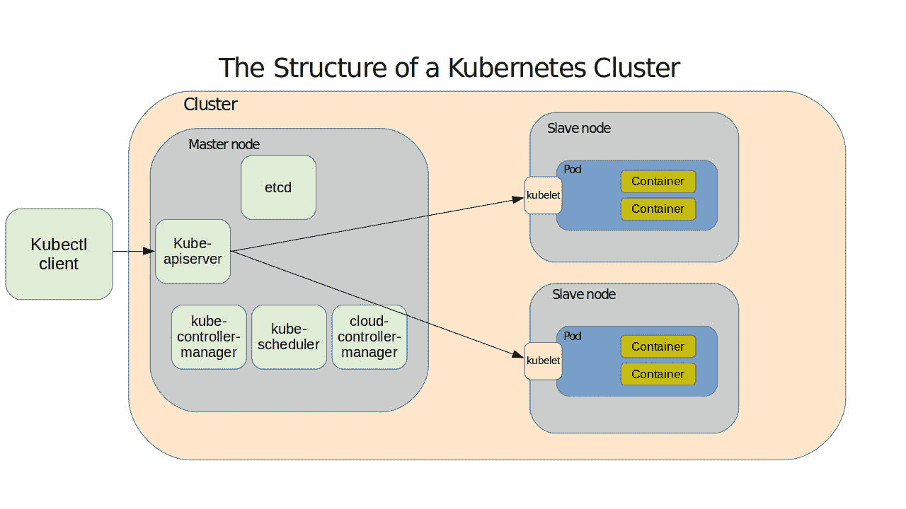

# Kubernetes 容器编排的简单介绍

> 原文：<https://www.freecodecamp.org/news/a-simple-introduction-to-kubernetes-container-orchestration/>

一开始是 FreeBSD——后来是 Linux——chroot 监狱。Chroot 是一种让卸载的文件系统复活的方法，这样您就可以执行命令，就好像它实际上是在自己的主机上运行一样。然后是 Linux 容器项目(LXC 和 LXD ),它增加了网络和存储配置，以便在适当隔离和优化的环境中运行 jails(现在更普遍地称为容器)。

然后是 Docker。Docker containers 简化了容器操作，因此多个容器使用的软件资源可以有效地共享。他们还增加了由大量软件工具组成的在线公共知识库。但是 Docker 的真正价值在于它使部署可靠可预测的应用程序环境变得多么容易。

### Kubernetes 带来了什么

然后，在时间的迷雾中出现了库伯内特。虽然最初是在谷歌内部开发的，但 Kubernetes 已经在云计算原生计算基金会的控制下作为开源软件发布。

其核心是，Kubernetes 像 Docker 一样管理容器。但是 Kubernetes 添加了一个庞大的生态系统，包括伸缩、负载平衡、网络代理和多节点管理工具。Docker 自己的 Swarm 也有一套类似的工具，但至少到目前为止，Kubernetes 更受欢迎。

Kubernetes 比 Docker Swarm 更像是一个原生的企业级工具。并不是说 Docker Swarm 不能在企业中使用——它当然可以——而是 Kubernetes 不一定非常适合快速而肮脏的本地开发环境。主要原因是，在这一点上，无论如何，您需要一个现有的集群，然后才能让任何事情发生，并且创建一个本地集群需要一个正在运行的管理程序。因此，拥有一个像 AWS 这样的公共云，你可以自由地供应进入集群的所有零碎东西，而不必担心基础设施，这对 Kubernetes 来说比对 Docker 来说更重要。

Kubernetes 更大的资源占用和更陡峭的学习曲线可以通过一些令人印象深刻的集成来抵消:使用持久存储卷非常简单。强大的部署监控解决方案很容易获得。

### 快速浏览一下 Kubernetes 星团

这里——基于我的 Pluralsight 课程“在 AWS 上使用 Docker”的内容——是 Kubernetes 的工作方式。集群由您的工作负载将使用的网络、存储和计算资源组成。群集的物理或虚拟计算机(称为节点)充当主计算机或副本计算机。主服务器运行管理所有群集操作的服务。主服务器本身是通过 kube-apiserver 服务来管理的，该服务会响应您使用 kubectl 客户机软件发送给它的指令。主服务器还承载:

> 称为 etcd
> 的集群配置数据库 kube-controller-manager，根据集群的期望状态
> 衡量集群的当前状态
> kube-scheduler，根据可用资源
> 平衡配置规格
> 云控制器-manager，提供与 AWS 等公共
> 云提供商的关键集成

节点由称为 kubelets 的软件代理控制，并通过 kube-proxy 服务保持可靠和安全的网络连接。重要的事情——您的实际应用程序工作负载——发生在 pods 内的节点上，这些节点是应用程序容器本身运行的组织结构。一个 pod 上可以运行多个容器，所有容器都共享一个 IP 地址和计算资源—提供应用程序的单个实例。



The components of a typical Kubernetes environment

好消息是，kubectl 软件足够智能，可以简单地读取您的 YAML 配置文档，并在没有您帮助的情况下使用它来实现所有细节。如果你想成为一名成功的 Kubernetes 管理员，你真的应该了解所有这些细节。但是在此期间，您对这一切有点放松也是情有可原的:大部分操作都是不可见的，被我们很快就会看到的相对简单的命令集所隐藏。

### 快速库伯安装

这样你就不会说我在这里没有向你展示任何实用的东西，让我们在一台 Linux 机器上安装轻量级的 Kubernetes 版本，MicroK8s。在这个进出练习中，您需要的只是快照包管理器的一个工作副本。这条命令将安装小型概念验证演示所需的所有核心服务、库和二进制文件。

```
snap install microk8s --classic
```

为了证明安装成功，请求服务列出当前正在运行的所有节点
。当然，现在还没有。

```
$ sudo microk8s.kubectl get nodes
No resources found.
```

但是，将会有一个单独的服务，其私有 IP 地址与其相关联:

```
$ sudo microk8s.kubectl get services
NAME         TYPE        CLUSTER-IP     EXTERNAL-IP   PORT(S)   AGE
kubernetes   ClusterIP   10.152.183.1   <none>        443/TCP   80s
```

最后，您可以使用这个 microk8s.enable 命令启用基于浏览器的 Kubernetes 管理仪表板。您将获得的输出将包括显示和使用您将需要连接的身份验证令牌的额外说明。

```
$ sudo microk8s.enable dns dashboard
Enabling DNS
Applying manifest
serviceaccount/coredns created
configmap/coredns created
[...]
If RBAC is not enabled access the dashboard using the default token retrieved with:

token=$(microk8s.kubectl -n kube-system get secret | grep default-token | cut -d " " -f1)
microk8s.kubectl -n kube-system describe secret $token
```

在启用 RBAC 的设置中(microk8s.enable RBAC)，您需要创建一个具有受限权限的用户，如[https://github . com/kubernetes/dashboard/wiki/Creating-sample-user](https://github.com/kubernetes/dashboard/wiki/Creating-sample-user)所示

*本文基于[我的 Pluralsight 课程“在 AWS 上使用 Docker”中的内容](https://pluralsight.pxf.io/nZgKx)在[bootstrap-it.com](https://bootstrap-it.com)有更多管理方面的书籍、课程和文章。*