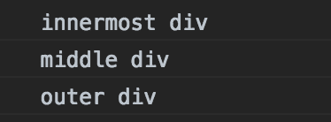

# JavaScript 中事件传播的简单解释。

> 原文：<https://www.freecodecamp.org/news/a-simplified-explanation-of-event-propagation-in-javascript-f9de7961a06e/>

想象一下这个场景:
你正在建立一个用户列表。您正在显示他们的姓名、最喜欢的颜色和电子邮件。当您单击一个用户(表中的一行)时，您希望它将您带到用户记录。除了当你点击电子邮件，然后它应该弹出一个电子邮件对话框。

您可能会编写类似这样的代码(我们在这里使用一个表格，因为它很容易理解——当然，我们可能会在项目中使用更复杂的代码):

```
<Table>
  <thead>
  <tr>
    <th>Name</th>
    <th>Colors</th>
    <th>Email</th>
  </tr>
  </thead>
  <tbody>
  <tr>
    <td>Susie</td>
    <td>Blue, Red</td>
    <td>susie@hello.com</td>
  </tr>
  </tbody>
</Table>
```

如果您想点击其中的一行，您可能需要向该行添加一个`onClick`函数。这样，如果他们单击行中的任何位置，就可以直接进入用户记录。


为了处理邮件，我们将在文本上做一个`<a hr` ef >标签。

但是等等！弹出电子邮件对话框，但是**我们也导航到用户记录**。这不是我们想要的！我们该如何处理？进入事件传播。

### 简而言之，事件传播。

事件传播是描述在 web 浏览器中触发的事件“堆栈”的一种方式。在上面的表格示例中，单击`a`标签是我们将触发的第一个事件，但是还有其他事件。

要理解这个概念，您必须理解 web 浏览器上的元素是嵌套的。他们不互相掩盖。因此，点击`a`标签也会点击行、表格、嵌套表格的`div`以及一直到`document`的任何东西，这个完整的容器包含了浏览器中的所有东西。

如果我们在这些其他元素中放入了任何其他的`onClick`事件，当我们单击表中的`a`链接时，它们也会被触发。这就是为什么当我们单击电子邮件链接时，会被定向到用户记录。它将为`a`链接执行`onClick`功能，并为行执行`onClick`功能。

#### 气泡

事件从嵌套最多的元素(`a`)向嵌套最少的元素(`document`)的“向上”移动被称为“冒泡”如果事件从“最外面”的元素开始，并“向下”移动，这被称为“涓滴”您可能只关心默认行为:冒泡。

### 如何利用事件传播为您带来优势

老实说，直到本周，当我需要构建一个带有复选框的表时，我才遇到任何关于事件传播的用例。不幸的是，当我试图设置检查功能时，它把我带到了记录。幸运的是，我早些时候做了一些培训(见下面的参考资料),这给了我一个确切的线索，我必须谷歌。

您可能已经知道，当您创建一个`onClick`事件时，它会被传递给您调用的任何函数。

所以在这里，我可以写:

```
handleCheck = e => {
  e.stopPropagation()
  // talk to my API, set the record as "done" or not
}
<span onClick={this.handleCheck}>[]</span>
```

这就阻止了事件在 DOM 中“向上”流动。我们停止堆栈中的所有其他事件。厉害！

所以我的整行都有了它应有的行为，这个小复选框有一个特殊的功能。

#### `preventDefault`对`stopPropagation`

你可能在想:为什么不直接用`e.preventDefault()`？这确实是我尝试的第一件事，但是 span 没有默认行为(不像表单，表单的默认提交行为会刷新页面)。

### 剪切和粘贴示例

我写了很多 React，所以在 React 里举个例子。但是这在普通的 HTML 和 JavaScript 中是一样的，使用任何方法来添加事件侦听器:

```
<div onClick={() => console.log('outer div')}>
  <div onClick={() => console.log('middle div')}>
    <div onClick={() => console.log('innermost div')}>
      Click me!
    </div>
  </div>
</div>
```

事件传播:没有香槟的泡沫。



Console log for event propagation example

### 参考

*   大呼小叫韦斯·博斯，他在他的#Javascript30 [课程](http://javascript30.com)中首次向我介绍了这个概念。如果不是在课程中第一次看到，当我遇到上面表格中的问题时，我可能不知道该用谷歌搜索什么。
*   [这个堆栈溢出回答](https://stackoverflow.com/questions/4616694/what-is-event-bubbling-and-capturing)，它很好地总结了事件捕获和传播的一些更细微的细节。