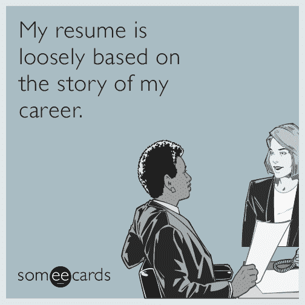
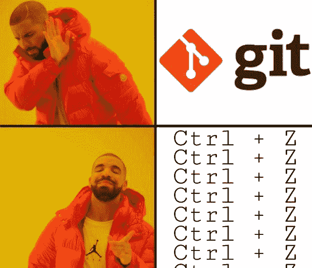
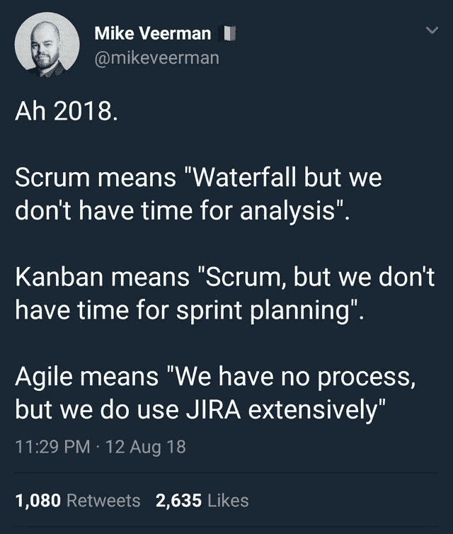
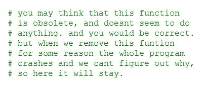
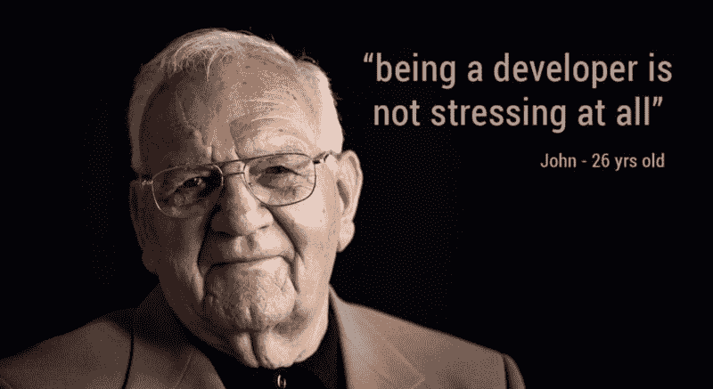
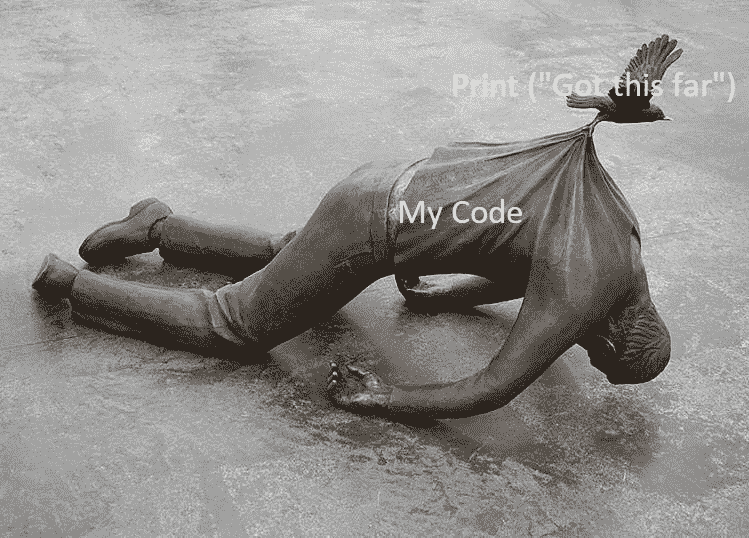

# 软件工程生存指南

> 原文：<https://www.freecodecamp.org/news/a-software-engineering-survival-guide-fe3eafb47166/>

瓦列里·阿列克谢夫

# 软件工程生存指南

#### 在你职业生涯开始时对你有帮助的资源

“turned on laptop computer” by [Fabian Grohs](https://unsplash.com/@grohsfabian?utm_source=medium&utm_medium=referral) on [Unsplash](https://unsplash.com?utm_source=medium&utm_medium=referral)

我职业生涯的最初几年是紧张学习的时期。

我遇到了成为一名软件工程师的现实，不得不获得许多我不知道自己需要的技能。回想起来，知道我现在知道的事情肯定会很好。

因此，我写了这个指南来帮助其他人，这是基于我作为专业人员最初几年指导的开发人员的经验，以及我自己和我的一些同事的经验。

我将介绍:

*   如何充分利用面试，
*   如何在软件工程师的工作中生存(并茁壮成长)，
*   以及在考虑持续改进时应该关注哪些资源。

### 面谈

当你开始你的软件工程生涯时，你将不得不面对一个不争的事实。面试糟透了。

它们对每个相关的人来说都是可怕的。我既是面试官也是被面试者，我可以证明面试是一个很大的时间浪费，压力非常大，是未来工作表现的一个非常糟糕的指标。然而，它们是一种必要的邪恶，你和你的简历最好做好准备。

#### 准备战斗

如果你正在考虑从事软件工程，一定要学会一些最常见的编程面试问题，比如“FizzBuzz”:

> 写一个程序，打印从 1 到 100 的数字。但是对于三的倍数打印‘嘶嘶’而不是数字，对于五的倍数打印‘嗡嗡’。对于同时是 3 和 5 的倍数的数字，打印‘FizzBuzz’。”

> ([编码恐怖](https://blog.codinghorror.com/why-cant-programmers-program/))

听起来很简单，对吧？

嗯，绝大多数受访者都通不过这个简单的测试，更不用说更复杂的测试了。

我亲眼看到许多高级职位的候选人在拥有完全互联网接入的情况下却没有通过这项测试。因此，确保如果你的简历上列出了一门编程语言，你至少知道如何使用它。否则，你只是在浪费每个人的时间，包括你的。

当然，你需要知道的不仅仅是 FizzBuzz 才能在面试中生存下来。你还需要确保你知道:

*   基本的数据结构和算法:如链表、数组、树和排序。
*   你所选择的语言中常见的“陷阱”,比如字符串是否是不可变的，以及如何管理内存。
*   面向对象的编程概念，如类对对象和继承。

在你职业生涯的开始，你需要在这类问题上表现出色，因为你没有经验证明你能胜任这份工作。在准备面试时，我总是推荐两种资源:

*   [《破解编码面试](http://www.crackingthecodinginterview.com)》，这是一本很棒的书，包括很多编码问题及其解决方案，以及你需要知道的解决问题的摘要
*   CodeWars 是一个网站，它收集了大量的编码问题，你可以在浏览器中使用多种语言解决这些问题。最有用的部分是看到其他用户如何解决同样的问题。您将看到解决同一问题的不同方法，并学习您选择的语言中的新工具。

#### 给自己额外的优势

你可以做几件事来给你带来额外的收获。

首先，**学会交流你的经历**。你应该有一个电梯式的推销，把你的简历总结成一个连贯的、吸引人的叙述。

另外，了解自己的简历！这听起来很傻，但我见过很多面试者努力解释他们简历中的某一项。你应该能够回答简历上列出的任何经历的问题，并解释这些经历如何让你成为这份工作的更好候选人。

接下来，**要在 [GitHub](https://github.com)** (或者另一个公共存储库)上展示代码样本。

眼见为实，面试官能够看到你的代码将会创造奇迹。另外，这表明你对版本控制系统有所了解。

代码样本不需要太复杂，但是它们需要干净，并展示良好的编码实践。这是你展示如何在没有编码面试时间压力的情况下编码的机会。

一旦你做了以上所有的事情，是时候**考虑参与一个开源项目**了。这将表明你可以在现有的代码基础上工作，并与其他程序员合作。

这将是你在没有真正置身于行业环境中的情况下，最接近于在行业环境中编程的方式。到目前为止，这是最难也是最费时的一项，所以把它保留到你完成了我上面讨论的挂在下面的水果之后。

#### 采访你的面试官

在求职的匆忙和压力中，许多求职者忘记了面试是双向的。当公司正在试图弄清楚你是否是这份工作的合适人选时，你也应该弄清楚这家公司是否适合你。

确保你能问一些下面的问题，即使是在后续的电子邮件中。要知道，很多时候，公司可能会试图把不遵循最佳工程实践作为额外津贴，所以要领会言外之意。

以下是一些你可以问的问题示例:

“对我来说，典型的工作日是什么样的？”

因为软件工程工作变化很大，所以知道从一个特定的职位期望什么是很重要的。例如，你可能需要维护服务器或直接与客户对话。

**红旗:***我不确定。”→* 意味着面试你的人不在你的团队里，或者他们不清楚为什么要雇佣你。

“你如何测试你的软件？”

理想情况下，应该使用单元测试、手动测试和自动化测试的组合来验证代码的质量。

**红旗:**“*我们就是不写 bug，哈哈。”* →那些人正是写 bug 的人。

**“你用的是什么版本控制系统？”**

版本控制系统对于协作非常有用，没有理由不在专业环境中使用。

**红旗#1:** *“呃，版本控制系统？”* →跑得远远的，远远的。

Always use version control.

**红旗# 2:***<插入隐晦或自定义的 VCS &* gt→表明他们很可能跟不上时代，并且很长时间没有更新他们的基础设施。

“你做同行评议吗？”

同行评审，或者让其他人在你的代码进入代码库之前看一看你的代码，是发现愚蠢错误的极好方法，也是你开始职业生涯时一个重要的培训机会。

**红旗:** *“我们就是互相信任！”→* 很可能高级开发人员非常保护他们的代码，不善于接受反馈。

“你们有什么继续教育计划？”

作为一名软件工程师，意味着随着技术以令人眩晕的速度出现、成熟和过时，不断地学习。因此，许多公司都有培训预算，用于支付大学和在线课程、会议或内部会谈的费用。

**红旗:** *“你是说在空闲时间上网看东西？”* →该公司要么资金紧张，要么认为开发人员是可替代的，而不是长期投资。

**“你使用的软件开发流程是怎样的？”**

不管实际细节如何，过程对于软件工程来说是至关重要的。关于什么是最佳流程的细节还存在激烈的争论，但是仅仅存在一个达成一致的项目工作方式就可以最大限度地减少混乱，并确保每个人都在同一页上。

**红旗:** *“我们的过程受到自由形式爵士乐的启发。”* →很可能整个部门都处于救火模式，从一个紧急情况跳到另一个紧急情况，没有任何明确的目标。

**“你如何解决技术债务？”**

技术债务是过时技术和快速但肮脏的解决方案在代码库中的积累。解决这个问题对代码的长期健康非常重要，应该持续进行。

**红旗:** *“我们专注于新功能。”* →他们的代码库很乱或者很快就乱了。

“你的公司文化是什么样的？”

公司文化可能是一个非常模糊的概念，但即使是像开放式办公室和小隔间这样的小事也会在很大程度上改变你与同事的日常互动。没有普遍的危险信号，但要确保他们的答案是你能忍受多年每周 40 小时以上的事情。

### 作为一名软件工程师

在这个阶段，如果你在面试中表现出色，并且喜欢面试官回答你的问题，你就有可能被录用。

#### 恭喜，你正式成为工程师了！

现在怎么办？好了，是时候重新学习很多关于编码和工作的东西了。既然我们是程序员，让我们从讨论代码开始。

#### 良好的行业规范

好的行业代码依次具有以下属性:

*   **可读**，因为代码被读取和维护的次数比它被编写的次数还要多。代码的意图必须在您编写代码多年后对其他开发人员来说是清楚的。
*   **防御性，**遵循防御性编码的最佳实践。防御性编码本身就是一个话题，但它的要点是:你必须确保你所写的类和方法的不当使用不会导致你的代码使软件崩溃。
*   **优化的**，它在这个列表中是最后一个，因为大多数时候，你真的不需要担心它。这并不意味着当线性解存在时，您应该编写在 O(n)中执行某些操作的糟糕代码。但是开发人员通常渴望在没有必要的时候进行尝试和过度优化，这通常会损害代码的可读性和可维护性。您应该始终能够证明牺牲这些属性的某种优化是实际需要的。

既然您已经知道如何编写优秀的行业代码:

#### 你不用做太多的编码工作

这可能令人惊讶，但大多数时候你不会编写新代码，相反，你会:

*   排除故障
*   读取现有代码
*   在会议或写电子邮件时
*   研究做什么，这样你就不用写代码了

因此，编码以外的技能对你的职业生涯同样重要。

#### 调试和读取代码

*   除了使用 print 语句进行调试，您还需要更多的东西。所有广泛使用的语言和技术都有各种强大的工具。学会使用它们，因为它们将使调试变得轻而易举，并为您节省无数时间。
*   **了解代码库。大多数技术栈都有一些代码图生成工具，可以帮助你理解代码库的结构。企业 ide 通常具有内置的功能。你也可以使用诸如 [ReSharper](https://www.jetbrains.com/resharper/) 、 [grep](https://en.wikipedia.org/wiki/Grep) 或 [Sourcegraph](https://about.sourcegraph.com) 之类的工具来探索代码。**
*   **了解产品。Y** 你会惊讶地发现，有多少开发人员在试图“修复”软件之前，并不知道软件应该如何工作。只需阅读文档。

#### 整理你的思绪

由于你的大量时间将花在沟通、研究和多任务处理上，你需要一些工具来帮助保持一切有序。

*   你的公司应该已经有了某种任务软件，但是拥有一个个人系统也是有帮助的。使用便利贴或软件如[特雷罗](https://trello.com)或[来戒酒](https://todoist.com)。
*   **笔记:**总是在会议上做笔记，努力改进现有的文档并创建个人知识库。使用 [Evernote](https://evernote.com) 、 [OneNote](https://products.office.com/en-us/onenote/digital-note-taking-app) ，或者笔记本，就像过去一样。这可能看起来有点过了，但是一年后当你再次回顾第一次花了你 3 天时间才弄明白的那个模糊的构建过程时，你会感谢自己的。我从未见过一个不做大量笔记的优秀软件工程师。
*   图表/可视化:人类是视觉动物，创建流程和架构的图表将帮助你和其他人理解复杂的主题。当与非技术同事交流时，图表特别有用。使用 [Lucidchart](https://www.lucidchart.com) 、 [Visio](https://products.office.com/en-us/visio/flowchart-software) 或普通白板。

#### 知道何时使用图书馆

简而言之:几乎所有的时间。

长回答:99%的时候，你不应该多此一举。在大多数软件工程职位中，实现某种特定的排序完全是浪费时间。这并不意味着你不应该知道你使用的算法和数据结构是如何工作的，因为这将帮助你决定什么时候使用什么。

为了成为一名高效的软件工程师，你需要了解你所拥有的库。大多数流行语言的标准库都非常有用，而且比你想象的要大。此外，代码库还可能利用额外的专用库。阅读他们的文档并知道何时使用它们。

如果额外的库可以节省时间，你也不应该害怕建议额外的库。但是，您需要确保选择一个好的库用于行业。一个好的图书馆是:

*   **开源**，这样你就可以自己验证代码的质量，并潜在地修复对你的应用至关重要的 bug。
*   **在 MIT 和 BSD** 等许可协议下授权，因此您的公司不会因为使用它而遇到任何问题。使用 GPL 时要小心，以免不小心开源了整个代码库。
*   **成熟**，也就是说，它已经问世一段时间，并且具有丰富的功能。
*   **维持**，经常有新的发布。
*   **由其他公司或项目**使用，作为批准的标志，确保其拥有持续维护的行业支持。

### 持续改进

除了学习能让你在日常工作中做得更好的技能，你还需要不断提高自己的技能并学习新的技能，以便为自己创造新的职业机会。

学习的机会很多，而且很多都很实惠:

*   在线课程:以灵活的形式向该领域最优秀的教授学习的机会不容错过。查看 [Coursera](https://www.coursera.org) 、 [Udacity](https://www.udacity.com) 和 [edX](https://www.edx.org) (在众多课程中)可以补充你现有的技能。
*   在线硕士学位:在线硕士学位是顶尖大学中的一种新趋势，是你继续正规教育的一种灵活方式。由于校内学位，它们通常也不太贵，大多数项目的整个学位费用在 1 万美元左右。[佐治亚理工学院](http://www.omscs.gatech.edu)、[德克萨斯大学](https://www.edx.org/masters)和[加州大学圣地亚哥分校](https://www.edx.org/masters)是提供此类学位的一些大学。我个人推荐我今年毕业的乔治亚理工的在线硕士。
*   博客:博客是开发者社区的重要组成部分(这并不奇怪，因为你现在正在阅读一个博客)。像[编码恐怖](https://blog.codinghorror.com)、[乔尔谈软件](https://www.joelonsoftware.com)这样的博客，或者更幽默的网站比如[每日 WTF](https://thedailywtf.com) 可以给你一个好主意，作为一个软件工程师，什么该做，什么不该做。浏览媒体、r/programming、HackerNews 或其他 feeds 也会引导你找到好的文章和博客。
*   **会议:**最后，但同样重要的是，会议是一个绝佳的学习机会，你绝对应该利用公司的培训预算去参加。一个非常不完整的好会议列表(和他们的主题一起):[GOTO；](https://blog.gotocon.com)(通用)(通用)[PyCon](https://us.pycon.org/2019/)(Python)[CPPCon](https://cppcon.org)(c++)[DEF CON](https://www.defcon.org)(安全) [Fluent](https://conferences.oreilly.com/fluent/fl-ca) (Web dev)。所有这些都在 YouTube 上有(大多数)演讲的视频，所以即使你不能参加，你也能学到一些东西！

希望这篇文章已经武装了你的知识，让你知道作为一个软件工程师，你的职业生涯的开始会是什么样子，并且给你工具，让你在这个激动人心的旅程中表现出色！感谢阅读！如有任何问题或建议，欢迎留言或推文 [@AlexievValeri](https://twitter.com/AlexievValeri) 。