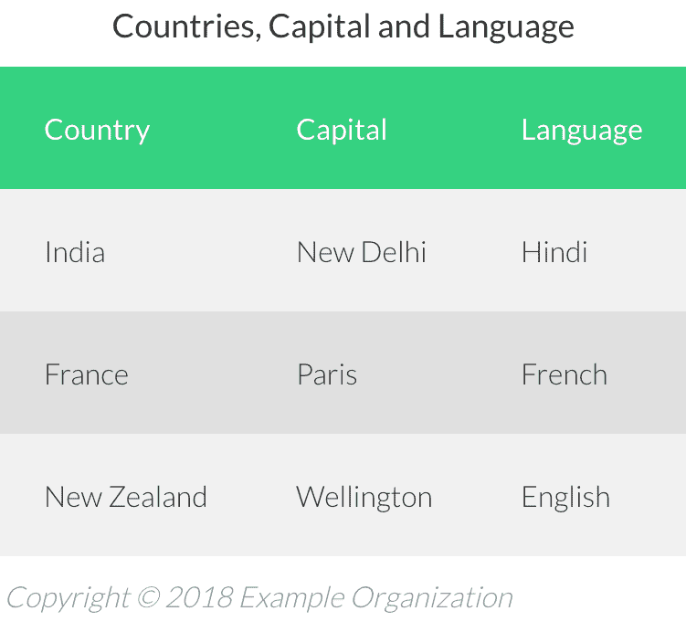
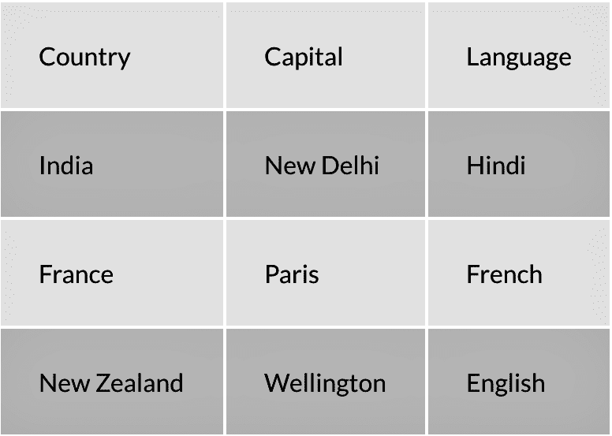
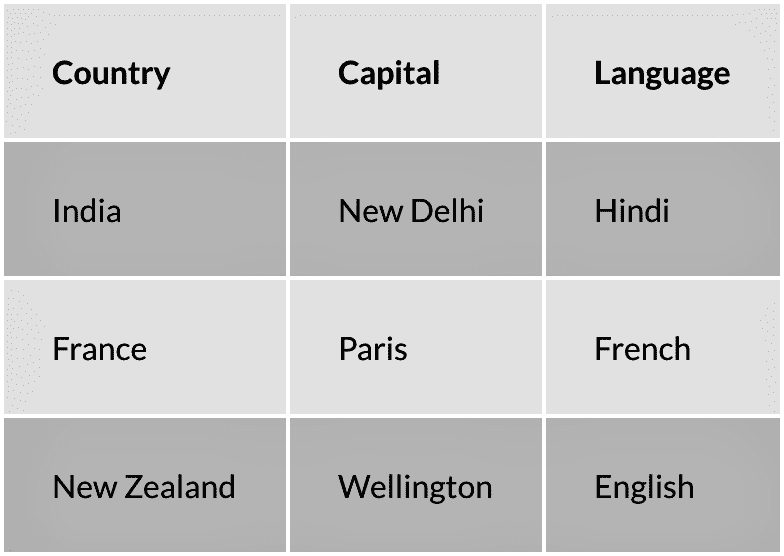
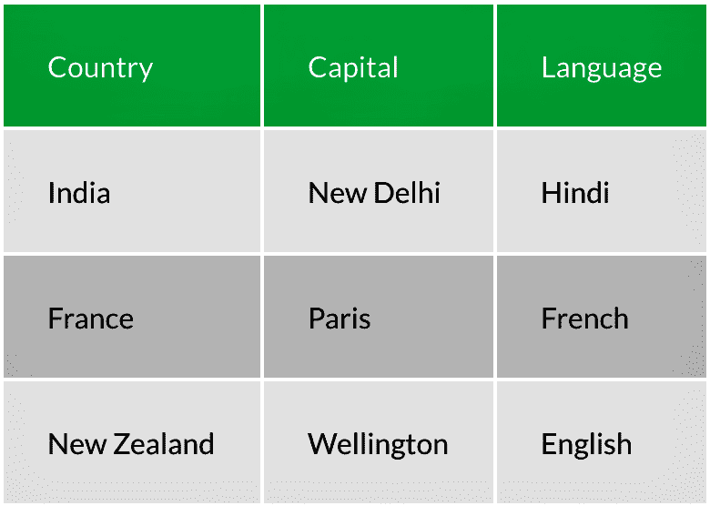
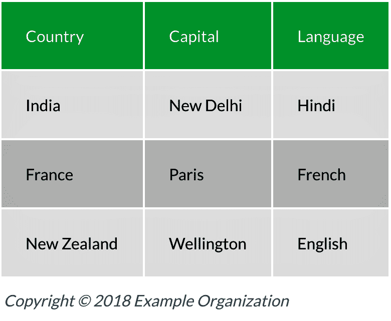
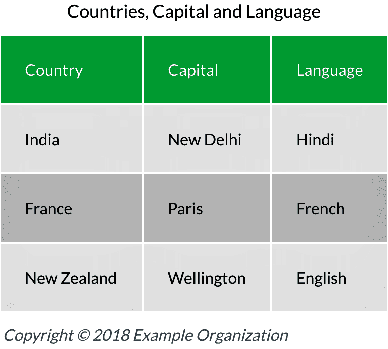

# HTML 表格入门分步指南

> 原文：<https://www.freecodecamp.org/news/a-step-by-step-guide-to-getting-started-with-html-tables-7f43b18f962b/>

Abhishek Jakhar

# HTML 表格入门分步指南



HTML Table

#### 概观

网络上充斥着足球比分、板球比分、员工名单和电子邮件地址等信息。HTML 表格使您能够显示通常称为**表格数据**的信息。

> **注意:**我已经使用 CSS 添加了样式，所以我的元素看起来会有所不同。但是它们将以完全相同的方式工作。
> 如果你想让你的元素看起来像我的，你可以在下面的链接中找到我的 CSS 文件:
> **CSS:**[https://gist . github . com/abhishekjakhar/2 ea 51 DFC 0 DCF 6 f 6 ed 0d 44 AC 0 e 72 f 9 c 54](https://gist.github.com/abhishekjakhar/2ea51dfc0dcf6f6ed0d44ac0e72f9c54)

#### 基本表格

我们可以使用 table 元素创建一个 HTML 表格。它有一个开始和结束标签，它将所有的**表格行**和**表格单元格**包装在其中。

```
<table></table>
```

现在，让我们键入一个表格行。表格由页面上的信息行组成。一个 **<** tr >元素用于创建一个表格行。

但是，没有表列的元素。**表格列**取决于每行内有多少**表格单元格**是**。一个 **<** td >元素用于创建一个表格单元格。因此，基本上，您将在< tr >元素中添加**in**元素的数量与您将在表格行中获得的列数完全相同。**

概括一下:

*   **<表格** >:表格元素表示一系列行和列中的数据。表格应该只用于显示表格数据，而不应该用于页面布局。
*   **< tr** >:表格行元素定义了表格中的一行单元格。表格行可以用表格单元格和表格标题单元格填充。
*   **< td** >:表格单元元素包含数据，表示单个表格单元。每个表格单元格都应该在表格行内。



**table row (<t**r>**) and tabl**e **cell (**<td>) elements together to form a table

> **注意:** <表>元素没有属性。如果您以前使用过表格，您可能在过去使用过一些属性。但是，它们现在都被弃用了。

#### 表格标题元素

我们已经创建了一个基本的表，但是不清楚我们在表中的第一行实际上是尝试标记我们的每一列。现在，第一行看起来就像我们表中的另一行。

我们可以在这三列中的每一列上使用一个**表格标题元素**来告诉浏览器、搜索引擎爬虫和屏幕阅读器这些实际上是标题，而不仅仅是常规数据。

现在，我们将把第一行中的表格单元格改为表格标题单元格。为此，我们将替换**<**TD&g**t；b** y < th >。



The text in the first row is bolder than the other rows because of the **<**th> element used inside the **firs**t <tr>

#### 表头和表体

Similar to the structure of our HTML document, where we have a head and a body, we can also add a head and a body to our table. We will definitely not use the same HTML elements because then the syntax will become invalid. For the table, we have **< the** ad > fo **r th** e hea **d and & l** t;tbody & **gt;** for the body.

*   **<**ad>—表格标题元素(不要与表格标题单元格元素混淆)定义了构成表格标题的一组行。
*   **< tbo** dy > —表体元素定义了构成表格主要内容(或“表体”)的一行或多行。



**table head (<thea**d>**) and table body (&l**t;tbody>) elements

#### 桌脚元素

我们有一个**表头**和一个**表体**元素。当然，还有一个**桌脚**元素。但问题是，当我们已经有了标记列的表头时，表尾元素还有什么意义呢？

一般来说，表尾元素应该**包含表的摘要。**这可能是一些最终单元格，包含每列的总和、合计和平均值。它还可能包含一些元信息，如版权信息或表中的数据源。

现在，您可能会认为表尾应该在表的底部。然而，它实际上应该紧接着的**表头**元素和**的**之后，紧接着**的**表体**元素之前。**

*   **<tfoot&**gt；—表尾元素定义一组汇总表格列的行。



**table foot (<tfoo**t>) element

#### 标题元素

这个元素基本上是表格的标题，它应该紧跟在开始的表格标签之后。添加这个很好，因为它快速总结了一个表可能包含的内容。



现在我们已经介绍了 HTML 中表格元素的基本要素。

您可以在下面给出的**链接**中了解更多关于**表**的信息。

[**HTML 表格基础知识**](https://developer.mozilla.org/en-US/docs/Learn/HTML/Tables/Basics)
[*以上就是 HTML 表格的基础知识。*developer.mozilla.org](https://developer.mozilla.org/en-US/docs/Learn/HTML/Tables/Basics)[**HTML 表格高级**](https://developer.mozilla.org/en-US/docs/Learn/HTML/Tables/Advanced)
[*关于 HTML 表格，你还可以学习一些其他的东西。*developer.mozilla.org](https://developer.mozilla.org/en-US/docs/Learn/HTML/Tables/Advanced)

我希望这篇文章对你有所帮助。我希望听到您的反馈！

**感谢您的阅读！**