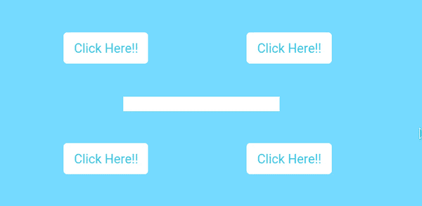
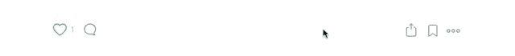

# 制作纯 CSS 工具提示的分步指南

> 原文：<https://www.freecodecamp.org/news/a-step-by-step-guide-to-making-pure-css-tooltips-3d5a3e237346/>

优素福·埃尔·阿齐齐

# 制作纯 CSS 工具提示的分步指南



我最近完成了一个关于使用纯 CSS(没有额外的 HTML 元素或 JavaScript)创建简单工具提示的简短教程。后来，我在自己的项目中使用了这种技术，并找到了一些改进它的技巧。

本文是一个循序渐进的教程，将帮助您理解这些 CSS 技巧，这样您也可以制作纯 CSS 工具提示。

在这篇文章结束时，你将知道如何通过添加一个简单的属性来为任何元素添加工具提示。

### 问题是

我需要为我的项目创建一个自定义工具提示。

我从谷歌搜索“CSS 工具提示生成器”开始我发现了不少发电机。他们的方法是在需要工具提示的元素中添加一个带有绝对位置的 span。

但是我已经有了一个完整的项目。我不想回头在我的项目中添加所有这些跨度元素。这需要时间，并且会使我的 HTML 变得复杂。一定有更好的方法。

最后，我在 YouTube 上找到了一个关于工具提示的惊人教程。它使用的聪明技巧是使用`:: before`和`:: after` CSS 选择器创建一个工具提示。你可以在这里看视频[。](https://www.youtube.com/watch?v=M4lQwiUvGlY&t=157s)

这个技巧是聪明和干净的，但它不够通用。

### 改进解决方案

在这一部分，我将使这个技巧更加通用，我们将发现更多关于一些 CSS 属性。以下是我们最终希望能够做到的:

```
<button tooltip=”tooltip content here”> click here !! </button>
```

不仅如此，我们还希望能够轻松地指定工具提示的位置:

```
<button tooltip=”tooltip content here” tooltip-position=”left” > click here !! </button>
```

首先——正如视频中提到的——我们将向按钮添加一个`before`和一个`after`伪元素。

`::after`和`::before`是伪元素，它们允许你在元素内容之前或之后从 CSS 插入内容到页面上。它们是这样工作的:

```
div::after { content: “after”;}div::before { content: “before”;}
```

结果看起来像这样:

```
<div> before <!-- div content here --> after</div>
```

### 让我们一步一步来

第一步:我们将添加一个工具提示属性，如下所示:

```
<button tooltip=”simple tooltip here”> click Me !! </button> 
```

我们需要`::after`和`::before`伪元素。这将是一个带有工具提示内容的简单矩形。我们用 CSS 创建一个简单的矩形，在用`content`属性创建的空元素周围添加一个边框。

`::before`伪元素用于显示工具提示内容。我们用属性`content`添加它，并提取工具提示属性值。内容的值可以是一个字符串，一个元素的属性值，就像我们的例子一样，或者甚至是一个带有`url(path/image.png)`的图像。

要实现这一点，按钮元素的位置必须是相对的。换句话说，按钮内部所有元素的位置都是相对于按钮元素本身的位置。

我们还添加了一些位置技巧，使工具提示位于带有 transform 属性的中心，这就是结果。

这是我们的 CSS:

**第二步:**我们只是使用`::before`和`::after`伪元素来创建一个工具提示位置。我们的按钮 HTML 将如下所示:

```
<button tooltip=”tooltip here” tooltip-position=”left”> click here !! </button>
```

工具提示位置可以是:右、左、上或下。

第三步:在最后一步，我们将在工具提示中添加一个简单的悬停动画。

此代码笔显示了最终结果(您可以点击查看最终代码):

### 如果你熟悉 React，请查看我的帖子:

[**介绍 reactjs-popup？——模态、工具提示和菜单——都在一个**](https://hackernoon.com/introducing-reactjs-popup-modals-tooltips-and-menus-all-in-one-227de37766fa)
[T *他的文章是关于给你一个简单的概述，你可以用 reactjs-popup 做什么，以及如何有效地使用它。ackernoon.com*](https://hackernoon.com/introducing-reactjs-popup-modals-tooltips-and-menus-all-in-one-227de37766fa)

感谢阅读！如果您认为其他人应该阅读此内容，请按？按钮，发推特，分享帖子。记得在 Medium 上关注我，这样你就可以得到关于我未来帖子的通知。

> **阅读更多故事[https://elazizi.com/](https://elazizi.com/)**

