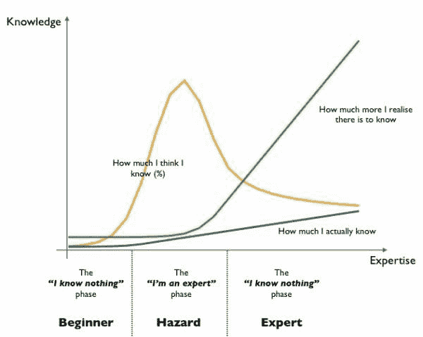
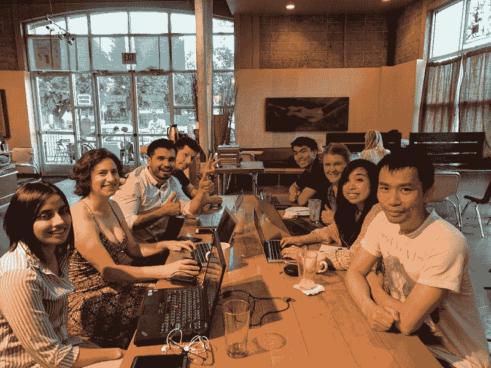

# 一个股票市场游戏，你投资了别人现实生活中的 50，000 美元

> 原文：<https://www.freecodecamp.org/news/a-stock-market-game-where-you-invest-50-000-of-someone-elses-real-life-money-4dd98482651b/>

一名亚马逊工程师开发了一款名为 [StockStream](https://fcc.im/2tpeJus) 的实时多人游戏，陌生人将他现实生活中的 50000 美元投资到股票市场。

它是这样工作的:

*   任何人都可以加入 Twitch 频道，通过在聊天室输入类似`!buy APPL`的命令来投票买卖股票
*   每五分钟，游戏将执行一次在此期间最多玩家投票的交易
*   该游戏跟踪哪些玩家对哪些交易进行了投票，并使用短期资本收益来计算高分。

迄今为止，这个投资组合一直在最初的 50，000 美元上下波动。一些运动员通过捐钱来补足基金。

这款游戏还有一个股票行情自动收报机、股票市场新闻更新和大量的统计数据——全部以 8 位颜色和字体呈现。

像这样的社会实验直到最近才成为可能，这要归功于两项关键技术:

1.  像 Twitch 这样的直播+聊天平台，玩家可以通过投票来进行合作(这个概念首先通过 Twitch 玩神奇宝贝得到证实)
2.  像 Robinhood 这样零交易成本的股票交易平台

Robinhood 不同于传统的股票交易工具，它不收取任何交易费用。传统上，如果你想买或卖一只股票，你需要支付 5-30 美元的经纪费来完成交易。

在每天 90 笔交易的情况下，StockStream 基金仅交易成本一项就将每天损失至少 450 美元。

但由于 Robinhood 是从你未投资的现金余额的利息中赚钱的，他们不收取任何交易费用。这意味着你可以想交易多频繁就交易多频繁，而不会破坏你的平衡。

StockStream 在整个纽约证券交易所交易时间(东部时间上午 9:30 到下午 4:00)都是实时的。

可以看流，在这里投票决定买卖哪些股票[。它也有一个很好的编码音轨。](https://fcc.im/2tybyyW)

### 以下是其他三个值得你花时间去做的链接:

1.  什么时候应该忽略批评？( [4 分钟读数](https://fcc.im/2uyoLaZ))
2.  在办公室的一天:Reji 向我们展示了他如何与开发人员和设计师合作，为孩子们开发金融教育应用程序( [12 分钟观察](https://fcc.im/2sUEWxg)
3.  如何使用 async/await 和 Firebase 数据库编写漂亮的 Node.js APIs 分钟读取)

### 想到这一天:

> “我们只能看到前面不远的地方，但我们可以看到那里有许多需要做的事情。”—艾伦·图灵

### 每日一图:

图表作者[斯沃德利](https://www.freecodecamp.org/news/a-stock-market-game-where-you-invest-50-000-of-someone-elses-real-life-money-4dd98482651b/undefined)

### 今日学习小组:

萨克拉门托自由代码营

编码快乐！

–昆西·拉森，自由代码营的老师

如果你从这些邮件中获得了价值，请考虑[支持我们的非营利组织](http://bit.ly/donate-to-fcc)。