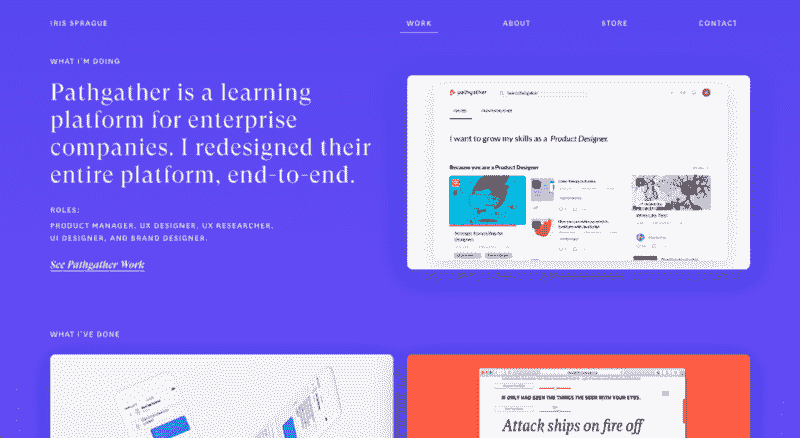
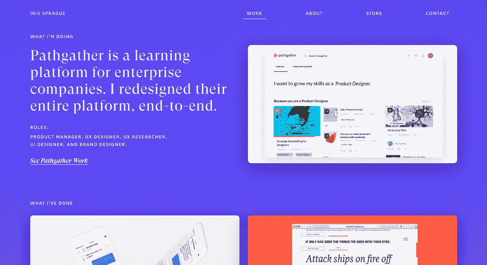
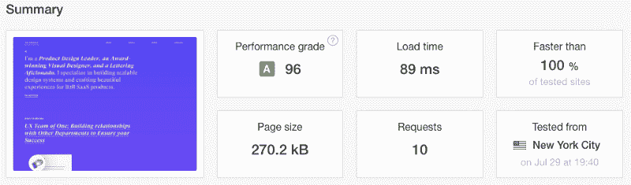

# 两个网站的故事

> 原文：<https://www.freecodecamp.org/news/a-tale-of-two-websites-the-importance-of-slow-progress-and-self-reflection-4a09ffcbd059/>

作者:孙李贝蒂

# 两个网站的故事

#### 缓慢进步和自我反省的重要性

Photo by [Tanya Nevidoma](https://unsplash.com/photos/2bFB0Er064Q?utm_source=unsplash&utm_medium=referral&utm_content=creditCopyText) on [Unsplash](https://unsplash.com/search/photos/two?utm_source=unsplash&utm_medium=referral&utm_content=creditCopyText)

"嘿，既然你在学编程，你能给我做个网站吗？"

我相信我们都听过这个问题。作为一名 web 开发人员，这是理所当然的。第一次听说是在 2016 年 3 月。我的妻子是一名平面设计师，希望进入 UI/UX 领域。她想在网上作品集里展示自己的技能。

那时我只学了 3 个月的 web 开发(我开始的时候是新年决心)。我已经完成了几门 HTML、CSS 和 JavaScript 课程，并急于投身于一个利润丰厚的项目。

“好啊我可以帮你。应该不会太久。”

花了三个月。

我很快意识到我做得太多了。然而，虽然我很天真，但我也很坚定。我把所有的东西都放在了那个网站上。当我不工作的时候，我不是编码就是搜索堆栈溢出。

主要是搜索堆栈溢出，很多。

尽管这个项目给我带来了压力和紧张，但当我第一次在浏览器上看到它时，我感到无比自豪。

那是我的工作。我已经做到了。

通过她的新网站，我妻子在纽约找到了一份 UX 设计师的工作。我们都辞掉了工作，离开了西雅图。这标志着我第一次一头扎进编程的开始。

### 两年后

“嘿，你认为你能更新我的网站吗？”

这是 2018 年 6 月，相当多的事情发生了变化。在这短短的两年里，我妻子从 UX 设计师，到产品设计师，再到一家初创公司的设计主管。她希望有一个新的更新来反映这种增长。

“是的，我能做到。”

我试图让自己听起来尽可能的自信，但是我很犹豫。我记得第一次建立她的网站花了多长时间。我不确定自己是否有耐力和精神上的毅力再打一场。这让我筋疲力尽。

当我开始挖掘旧代码时，我的自信心进一步动摇了。我已经两年没看过它了。它没有很好地老化。虽然用户界面仍然工作，看起来很好，但前端却一团糟。好像是用胶带粘在一起的。

就“代码气味”而言，它闻起来像垃圾箱里的火。

虽然我的妻子只想要一个更新，但浏览代码库是很费力的。从头开始会更容易。我对重新开始的想法并不感到兴奋。但是，虽然我的妻子在过去几年里成长了很多，我也是。我把它当作一个反思我学到了多少东西的机会。

### 重新开始

第一天我开始建设我妻子的新网站，我知道这不会花 3 个月。我在第一天做的事情比之前一周做的都多。最终，只花了大约一周的时间就完成了更新。

你可以在这里看到现场直播:[irissprague.co](http://irissprague.co/)

[irissprague.co](http://irissprague.co)

虽然我对自己构建它的速度印象深刻，但我不确定为什么它会快这么多。当然，我还有两年的时间，但是在这两年里我到底学到了什么？

#### 利用工具

我注意到的第一件事是我利用工具的能力。你看，两年前，我对开源工具知之甚少。我妻子的第一个网站是用原始的 HTML、CSS、JavaScript 和一点 PHP 创建的。虽然这本身并不坏，但我对视图模板没有概念。

我从头开始编写每个 HTML 文件。为了保持一致性，我复制了所有重复的元素。不幸的是，这意味着改变一个页面意味着改变几个页面。

在我的第二次尝试中，我通过使用 [HAML 模板](https://github.com/sunny-b/updated-iris-portfolio/tree/master/app/views/layouts)和 [Flexbox](https://github.com/sunny-b/updated-iris-portfolio/blob/master/app/assets/stylesheets/application.css.scss.erb#L105) 避免了所有这些复制和调试的时间。

Thanks Flexbox

#### 自动化构建过程

第一个网站花了这么长时间建立的另一个原因是因为我对建立过程没有概念。整整 3 个月，我都在我的机器上做我妻子的第一个投资组合网站。

每当我做了一个大的改动，我都会缠着我的妻子来仔细检查我笔记本电脑上的改动。如果这还不够糟糕的话，当需要将我的更改推送到生产服务器时，我不知道从哪里开始。

我太专注于让网站运行起来，以至于我甚至没有考虑如何把它放到互联网上。我从来没有听说过数字海洋，码头，或 Heroku。

我当时唯一知道的托管服务是 Godaddy。Godaddy 使用 cPanel 将文件上传到服务器本身。不幸的是，cPanel 只允许一次上传一个文件。

花了几个小时。每当我需要更改任何资产时，我都必须手动重新上传那些编辑过的文件。

带着这些记忆中的错误，我投资于改进我的构建过程。我使用 Docker Compose 实现了 CI/CD 工作流的自动化。通过一个`docker-compose up -d`命令，我可以将整个站点部署到生产环境中。

我甚至创建了一个小的 bash 脚本来将我的 Git 和 Docker 命令批处理在一起。

我所做的任何更改都可能在一分钟内生效。cPanel 已经是过去式了。

我还使用了数字海洋液滴，这样我的妻子就可以看到我所做的任何改变。她可以通过访问 Droplet 的 IP 地址，在自己的机器上查看编辑内容。不再有地方性的发展。

我和妻子还改进了我们从设计到开发的流程。2016 年设计主要通过 Photoshop 和口头提示完成。

“你能改变这个吗？你能补充一下吗？”

我们俩都不喜欢。

这一次，我的妻子和我使用[视觉](https://www.invisionapp.com/)来合作。我可以实时看到她的设计变化，并在几分钟内实现它们。

最佳动力耦合。

#### 提高问题解决能力

这并不令人惊讶，但是在过去的两年里，我已经成为一个更好更快的程序员。但是最重要的进步是我解决问题的能力。

我不需要查找如何在 CSS 中创建网格或在 JavaScript 中构建图像轮播。我拥有自己解决这些问题所需的工具和基础。我可以花更多的时间在心流上，而不是花更少的时间去搜索我遇到的每一个问题。

我也知道如何少花钱多办事。我的第一个网站有数百行 JavaScript 代码来制作最简单的动画。[新站点只有 70 行](https://github.com/sunny-b/updated-iris-portfolio/blob/master/app/assets/javascripts/carousel.js)。CSS 过渡和关键帧处理其余的。

让 CSS 优先于 JavaScript 可以减少 DOM 绘制，从而提高每个页面的性能。不过，这并不是我唯一的优化。

#### 最佳化

两年前，我不知道如何创建一个表演网站，我也不在乎。我只是想让这该死的东西工作。既然我理解了基本原理，并在更高的抽象层次上思考，我就可以专注于解决更大的问题。即性能和用户体验。

通过编译静态文件，通过数字海洋 CDN 提供服务，并在浏览器中缓存它们，更新后的网站能够以闪电般的速度加载。

Performance rating from [Pingdom](https://tools.pingdom.com)

在 2016 年，这句话在我看来就像是胡言乱语。哦，时代变了。

#### 花点时间欣赏你学到的东西

那么，我为什么要说这些呢？自吹自擂？可能有一点。

真正的原因是，我想强调自我反省的重要性。我对更新我妻子的网站犹豫不决，因为我还没有意识到我已经成长了多少。很难看到你每天的进步量。

知识是一点点积累起来的。但是回顾过去很长一段时间，这些英寸会变得越来越大。在日本文化中，这种微小的日常改善被称为“改善”。

对我来说，记住我在职业生涯开始时的位置是很重要的。当我遇到瓶颈时，想象我的进化会让我保持动力。潮起潮落不可避免。致力于一步一步的进步是我实现目标的方式。

因此，作为对精通和记住我的根的一种致敬，我妻子的第一个网站将作为我个人网站的一个子域而存在。你可以在 kaizen.sunli.co 亲自看到。

我想特别感谢 [Launch School](https://medium.com/launch-school) 教会了我通往精通之路的重要性。这是我将继续追求的目标。

还有对我妻子 Iris Sprague 的另一次大喊，因为她太棒了。

因此，无论你已经编程 10 个月、10 年或更长时间，都要花时间反思你学到了多少。当时间过得很慢时，用它作为燃料。在通往精通的缓慢道路上投资会产生复合结果。一开始是渐进的，但是随着时间的推移，你会像火箭一样翱翔。

如果这篇文章引起了你的共鸣，请留下一些掌声？让我知道你在自己的职业生涯中是如何成长的。我很想听听这件事！

一如既往，编码快乐！