# 体验 ES10 的新功能

> 原文：<https://www.freecodecamp.org/news/a-taste-of-whats-new-in-es10-68d28ba22f92/>

作者阿莎·曼德瓦娅？️?？

# 体验 ES10 的新功能

Photo by [Alex Knight](https://unsplash.com/@agkdesign?utm_source=medium&utm_medium=referral) on [Unsplash](https://unsplash.com?utm_source=medium&utm_medium=referral)

每年，ECMAScript 都会发布一个新版本，其中包含正式发布给开发者和用户的提案。本文将讨论该语言的最新版本，以及它带来了哪些新特性。

**ES10/ES2019** 在本次更新中有了很大的改进。它引入了一些函数和方法，使开发人员能够编写更少的代码，做更多的工作。

让我们直接开始吧。

### 扁平()

flat()是一种用于展平数组的方法。在某些情况下，数组的元素是一个数组。这些类型的数组称为嵌套数组。

通常要取消嵌套(展平)它们，我们必须使用递归。现在随着 flat()的引入，它可以在一行中完成。仅供参考—展平数组是深度为 0 的数组。flat()接受一个参数，一个表示深度的数字。深度是数组内部嵌套的数量。让我们看一个解释嵌套和深度的例子。

An array of depth 3

上面是一个深度为 3 的数组。它是一个数组中的数组，数组中的数组，数组中的数组？？？。一般来说，在 JavaScript 中，数组的深度可以是无穷大，或者直到内存耗尽。假设一个数组的嵌套深度为 3，我们只展平到深度 2，那么在主数组中仍然会有一个嵌套数组。

#### **语法**

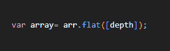

#### **返回**

它返回一个扁平数组。

#### 例子

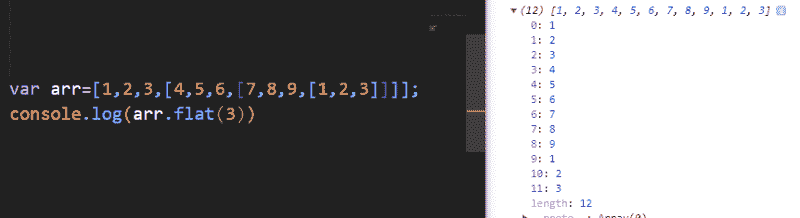

深度为 3 的嵌套数组使用 flat 对深度为 3 的数组进行展平。

如果我们把深度设为 2，我们得到这个:

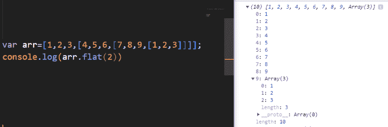

在输出中，我们可以看到仍有一个未展平的数组。

### **平面地图()**

flatMap()用于展平嵌套数组，并根据函数(如 Map()函数)更改值。这个函数作用于一个数组，并接受一个回调作为参数。回调决定了如何展平数组。它的作用就像一张地图，但除此之外，它还会使地图变平。如果你想了解更多关于地图的知识，请查看这篇文章。

flatMap()只能用于展平深度为 1 的数组，因为它在内部调用深度为 1 的 Map 函数和 flat 函数。

#### **语法**

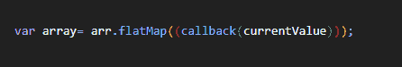

#### **返回**

一个扁平的数组，其值由提供给它的回调函数处理。就像地图一样。

**地图()** + **平()**=&**gt；flatma** p()

#### 例子

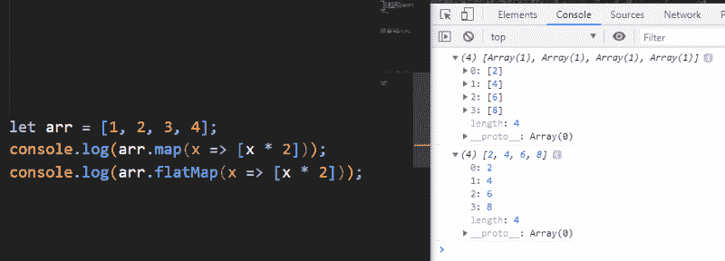

在这个例子中，map 和 flatMap 被逐一显示，以显示两个函数之间的差异。Map()返回包含值的数组的数组，而 flatMap()的输出与 map 相同，除了数组的展平。

### Object.fromEntries()

另一个非常有用的功能。Object.fromEntries 用于根据提供的键值对形成对象。它接受一个键值对列表，并返回一个对象，该对象的属性由条目给出。它的作用与 **Object.entries()** 相反。

#### **参数**

它接受任何可迭代的对象，例如一个数组。

#### **返回**

它返回一个具有给定键值对的对象。

#### **例子**

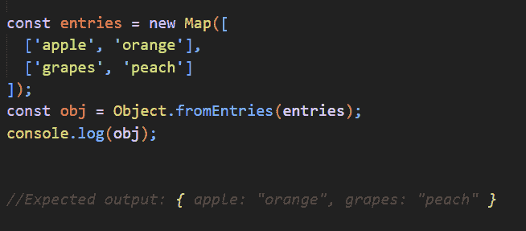

我们可以看到，当我们向 fromEntries()函数提供一个映射(成对存储值)时，我们得到了一个具有各自的键值对的对象，就像在映射中一样。

### trimStart()

trimStart()方法删除字符串开头的空格。trimLeft()是此方法的别名。

#### **语法**

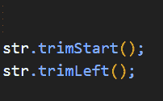

#### **返回**

它返回前面的空格被删除的字符串。

#### **例子**

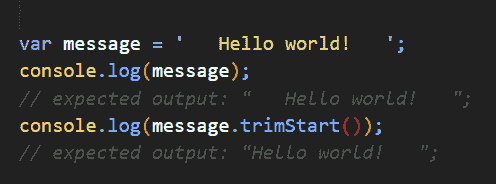

我们可以清楚地看到输出中删除的空白。

### 特里蒙德()

方法的作用是:删除字符串末尾的空格。trimRight()是该方法的别名。

#### **语法**

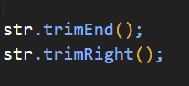

#### **返回**

它返回一个字符串，所有空格都从末尾开始修剪。

#### **例子**

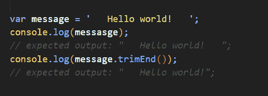

我们可以清楚地看到，从结束的空间被修剪。

### **捕捉绑定的变化**

直到 ES10，我们被语法强迫为 catch 子句绑定一个异常变量，不管它是否必要。很多时候可以注意到 catch 块只是多余的。ES10 提案使我们能够简单地完全省略变量，让我们少了一件需要关心的事情。

#### **例子**

在上面的例子中，我们可以看到没有为 catch 运行提供变量。

### 符号描述

当我们在 JS 中创建一个符号时，可以指定一个描述，用于以后的调试。取回这个描述的过程有点繁琐。我们必须再次重新构造符号，并借助 toString()方法来访问描述。

ES10 添加了一个名为 description 的新只读属性，该属性返回符号的描述。

#### **例子**

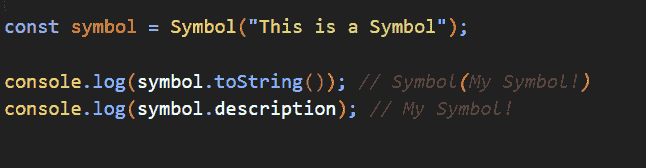

我们可以看到我们直接用。符号的描述属性。

### 包裹

这些是将在当前 ES10 标准中引入的一些功能。我希望你喜欢这篇文章！感谢阅读。

Google