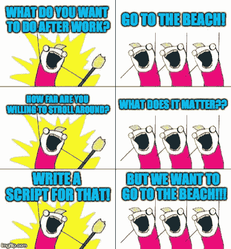
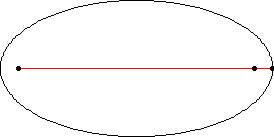
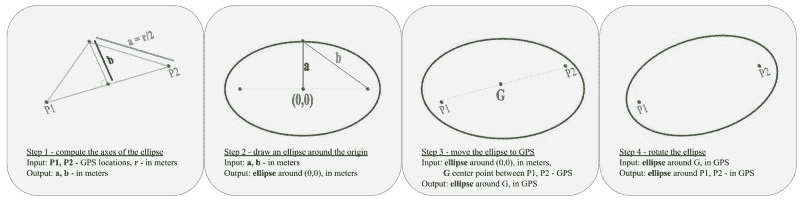
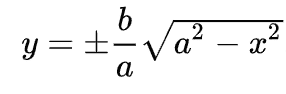
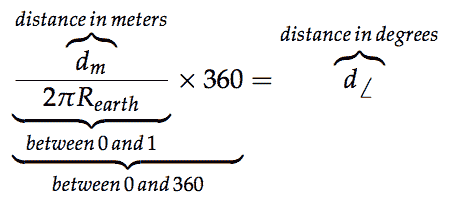
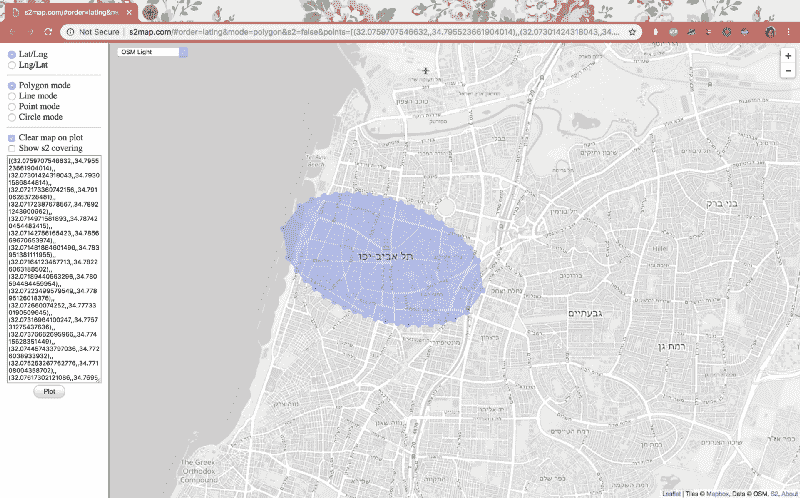

# 地图上的全椭圆

> 原文：<https://www.freecodecamp.org/news/a-total-ellipse-on-the-map-9e30d5235078/>

#### 或者，如何选择下班后去海边散步的最佳方式

那是一个凉爽的秋夜，希拉·克洛珀和我正打算下班后去海滩。海滩离办公室大约 2.5 公里。

我们甚至在考虑漫步在特拉维夫的街道上，愿意将我们的道路延伸到 3 公里，并对自己说“嗯，我们想知道这一段路能带我们走多远？”

好吧，长话短说，我们没去海滩。相反，我们写了一个脚本，在办公室和海滩周围画了一个椭圆。如果我们决定下班后去海滩，椭圆覆盖了我们可能经过的城市区域。



When developers want to do something fun outside and they end up writing a script about it instead.

### 这是生命的椭圆

或者——我们为什么要关心省略号？

在某种程度上，圆是围绕一点的“自然”区域。椭圆是围绕两点或一条线的“自然”区域。举几个例子，[质量体在椭圆轨道](https://en.wikipedia.org/wiki/Elliptic_orbit)上运动，椭圆代表在 2D 上投影 3D 地图导致的[失真，椭圆也是绘制有噪声的 GPS 数据](https://en.wikipedia.org/wiki/Tissot%27s_indicatrix)的[置信度的准确方式(以及 2D 数据](https://anitagraser.com/2018/09/04/plotting-gps-trajectories-with-error-ellipses-using-time-manager/)的[置信度区域)。](https://www.xarg.org/2018/04/how-to-plot-a-covariance-error-ellipse/)

在我们的例子中，我们想要围绕从我们的办公室开始到海滩结束的线画一个区域。我们为[绘制椭圆](https://gis.stackexchange.com/questions/243459/drawing-ellipse-with-shapely)找到的最简单的解决方案涉及[匀称的](https://pypi.org/project/Shapely/)和 [pyplot。](https://matplotlib.org/)由于我们的 GPS 和地图限制，它仍然需要一些修改。

所以，如果你在这里是因为你正在寻找一个简单的可以复制粘贴的代码，在地图上画一个椭圆——你可以去[我们做的这个库](https://github.com/DalyaG/CodeSnippetsForPosterity/tree/master/PlotEllipse)。如果你也有兴趣了解**我们如何**找到我们问题的完整解决方案，欢迎你加入我们的旅程。我们重新发现初等几何，学习坐标系统，玩一些数学代码。

### 女孩们只是想要省略号

> **美国:**“哦，某处一定有一个可以在地图上画椭圆的包！”
> **互联网:**“没有没有。”
> **美国:**“但是一定有一个简单的可复制粘贴的代码！”
> **Stackoverflow:** “你要的话我有不可理解的。”
> **美国:**“好吧，好吧，我们花一个小时自己做一个！”
> **现实:**“…”

弄清楚椭圆到底是什么是第一个挑战。Wolfram Alpha 告诉我们，椭圆是距离两个共同中心的距离和相同的点的集合。或者类似的东西。Wolfram Alpha 有时相当神秘。但是他们有一个 gif，所以这很好。



Ah… now that’s clear.

所以我们要做的就是确保我们有这些输入:

*   `p1, p2` - GPS 坐标。
*   `r` -实际上是从椭圆上的一点到两个中心的距离之和的半径。

然后按照这个计划:

1.  找到椭圆的轴`a`和`b`。
2.  围绕原点`(0,0)`画一个椭圆，单位为米。
3.  将椭圆移动到输入 GPS 位置之间的中心。
4.  根据输入 GPS 位置之间的角度进行旋转。



仅此而已。

听起来很简单，对吧？

### 漫长而曲折的道路(通向椭圆)

#### 第一步。找到斧子。

这里我们需要做一些基本的毕达哥拉斯代数。这张来自维基百科的图片有些帮助:


多亏了[哈弗辛](https://pypi.org/project/haversine/)软件包，从 GPS 坐标计算`c`变得很容易。

```
def GetEllipseAxisLengths(p1_lat, p1_lng, p2_lat, p2_lng,
                          radius_in_meters):
    c2 = haversine((p1_lat, p1_lng), (p2_lat, p2_lng)) * 1000.0
    if radius_in_meters < c2:
        raise ValueError("Please specify radius larger than the               
                          distance between the two input points.")
    a = radius_in_meters / 2.0
    b = sqrt(pow(a, 2) - pow(c2 / 2.0, 2))
    return a, b
```

#### 第二步。围绕原点画一个椭圆。

我们在这里所做的是，我们在`x`轴上取均匀间隔的点，并为每个点找到椭圆上投影到它的两个点:



Luckily we found this lovely equation on Wikipedia.

```
def GetEllipsePointInMeters(a, b, num_points):
    """
    :param a: length of "horizontal" axis in meters
    :param b: length of "vertical" axis in meters
    :param num_points: (half the) number of points to draw
    :return: List of tuples of perimeter points on the ellipse, 
             centered around (0,0), in m.
    """
    x_points = list(np.linspace(-a, a, num_points))[1:-1]
    y_points_pos = [sqrt(pow(a, 2) - pow(x, 2)) * 
                    (float(b) / float(a))
                    for x in x_points]
    y_points_neg = [-y for y in y_points_pos]

    perimeter_points_in_meters = 
        [tuple([-a, 0])] + \
        [tuple([x, y]) for x, y in zip(x_points, y_points_pos)] + \
        [tuple([a, 0])] + \
        list(reversed([tuple([x, y]) 
                       for x, y in zip(x_points, y_points_neg)]))
    return perimeter_points_in_meters
```

#### 第三步。怎么连 GPS 都加米了？

这是一个棘手的问题，答案在于理解这一点



Unleashing the secrets of elementary geometry.

> 有趣的事实:地球的半径平均在 6371000 米左右！

```
def AddMetersToPoint(center_lng, center_lat, dx, dy):
    """
    :param center_lng, center_lat: GPS coordinates of the center  
           between the two input points.
    :param dx: distance to add to x-axis (lng) in meters
    :param dy: distance to add to y-axis (lat) in meters
    """
    new_x = (center_lng + (dx / R_EARTH) * (180 / pi) /   
             np.cos(center_lat * pi/180))
    new_y = center_lat + (dy / R_EARTH) * (180 / pi)
    return tuple([new_x, new_y])
```

#### 第四步。旋转。

这一次，互联网的奇迹没有让我们失望(就像在我们主要的椭圆绘制任务中一样)。我们找到了身材匀称的包裹来替我们做轮换。这里要记住的一个技巧是，你不能一个一个地旋转这些点。相反你应该*先形成一个形状*，然后*旋转整个形状*。

```
def GetEllipsePoints(p1_lat, p1_lng, p2_lat, p2_lng, 
                     perimeter_points_in_meters):
    """
    Enter ellipse centers in lat-lng and ellipse perimeter points    
    around the origin (0,0), and get points on the perimeter of the 
    ellipse around the centers in lat-lng.
    :param p1_lat: lat coordinates of center point 1
    :param p1_lng: lng coordinates of center point 1
    :param p2_lat: lat coordinates of center point 2
    :param p2_lng: lng coordinates of center point 2
    :param perimeter_points_in_meters: List of tuples of perimeter 
           points on the ellipse, centered around (0,0), in m.
    :return: List of the points we really want, tuples of (lat,lng)
    """
    center_lng = (p1_lng + p2_lng) / 2.0
    center_lat = (p1_lat + p2_lat) / 2.0
    perimeter_points_in_lng_lat = \
        [AddMetersToPoint(center_lng, center_lat, p[0], p[1])
         for p in perimeter_points_in_meters]
    ellipse = LineString(perimeter_points_in_lng_lat)

    angle = degrees(atan2(p2_lat - p1_lat, p2_lng - p1_lng))
    ellipse_rotated = affinity.rotate(ellipse, angle)

    ellipse_points_lng_lat = list(ellipse_rotated.coords)
    ellipse_points = [tuple([p[1], p[0]]) 
                      for p in ellipse_points_lng_lat]
    return ellipse_points
```

#### 惊喜！第五步。在 s2 地图上画！

我们想在一张 [s2map](http://s2map.com) 上很好地呈现椭圆。显然你可以通过在你的脚本中打开 URL 来做到这一点。我们使用[子流程](https://docs.python.org/2/library/subprocess.html)来完成这项工作。

```
def OpenS2Map(points):
    url = \
      "http://s2map.com/#order=latlng&mode=polygon&s2=false" \
      "&points={}".format(str(points).replace(" ", ","))
    cmd = ["python", "-m", "webbrowser", "-t", url]
    subprocess.Popen(cmd, stdout=subprocess.PIPE, 
                     stderr=subprocess.STDOUT).communicate()
```



OK. can we go the beach now?

### 邻居的椭圆更圆

你可能会注意到我们的椭圆并不完美。这些点在中心之间的轴上均匀分布，但在椭圆的周长上不均匀分布。`GPS->meters->GPS`转换可能会导致各处仪表的损耗。但是，嘿，完成总比完美好，我们必须为下次想去海滩的时候留些事情做，对吗？