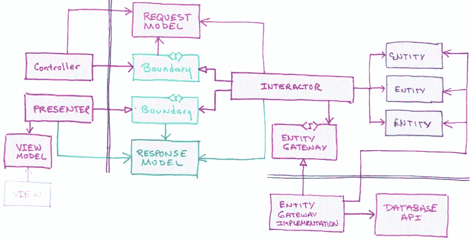
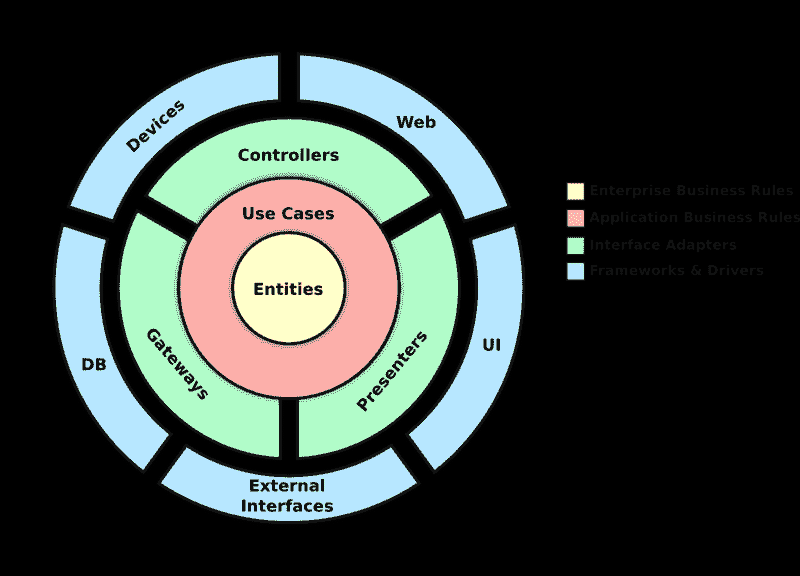
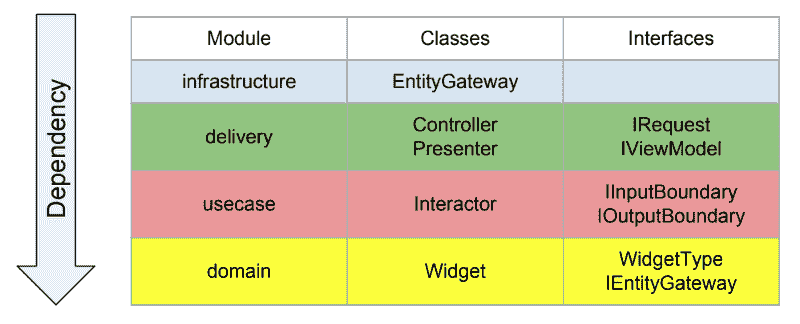
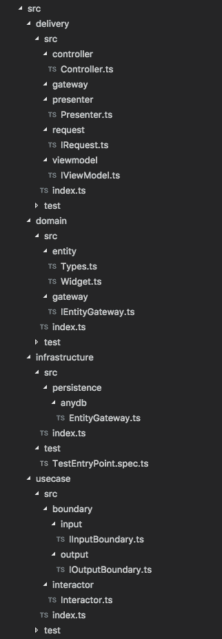
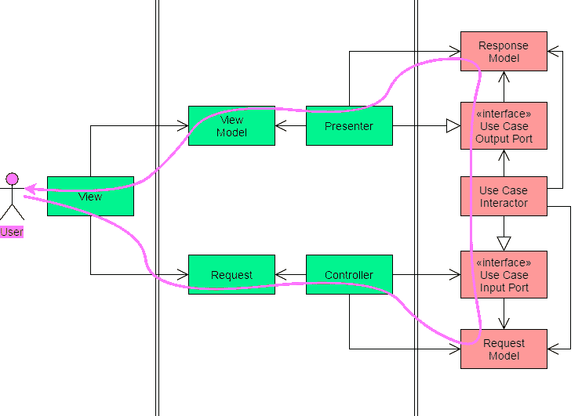

# 尝试干净架构的打字稿

> 原文：<https://www.freecodecamp.org/news/a-typescript-stab-at-clean-architecture-b51fbb16a304/>

沃伦·贝尔

# 尝试干净架构的打字稿

#### 剥洋葱皮的方法不止一种。

[Image Credit](https://www.shutterstock.com/image-photo/business-team-drawing-new-complex-project-215549044)

### 干净的建筑

有许多视频和文章解释了干净的架构。其中大部分都是从 20000 英尺的高度来审视这些概念。我不知道你怎么想，但是在那个高度我学东西不太好。那里氧气不多。我通过头先跳和编码来学习。这篇文章和附带的代码是我在这样一个飞跃之后最终得到的。

### 鲍勃是你的叔叔

术语“干净的架构”是由罗伯特·马丁(鲍勃叔叔)和他的书“干净的架构:软件结构和设计的工匠指南”而流行起来的。现在我并不宣称自己是这一领域的专家，我也没有读过他的书，尽管我打算这么做。但我可以完全理解它试图解决的问题。

如何编写一个除了主要语言之外不依赖任何东西的软件系统？在过去，我们得到了关于接口和其他面向对象原则的承诺，但是我从来没有见过一个关于如何在整个系统中做到这一点的“干净”的、双关语的解释。是的，我参加这个聚会有点晚了，因为鲍勃叔叔在 2012 年开始谈论这些概念，这是一个世纪前的软件时代。

### 令我困惑的图表

这是 Bob 叔叔和其他人在解释清洁建筑时使用的原始图表。这个简单的小图表成为我的一个困扰。我很久以前就已经清除了所有与 UML 相关的记忆，并且还在纠结由打开和关闭箭头指示的 has-a 和 uses-a 关系。我解决这个问题的唯一方法是写一些代码。

Image Credit: Uncle Bob

### 了解你的洋葱

看待干净的架构的一种方式是把它看成一个有层次的洋葱。所有层只能依赖于更靠近中心的层。也就是说，所有的依赖都指向内部，而不是外部。

[Image Credit](https://android.jlelse.eu/thoughts-on-clean-architecture-b8449d9d02df)

### 总有一天，我会变得有条理

在我们的例子中，有 4 个模块对应于洋葱的每一层。最终，这些可能成为独立的国家预防机制模块。出于可读性的考虑，我试着根据本文顶部 Bob 叔叔最初的干净架构图来命名。在现实世界中，你可能会在所有名字的前面加上它们所代表的用例。

Image Credit: Myself

基础设施(蓝色)层是我们所有外部可插拔系统的所在。洋葱图中显示的这些外部系统，如设备、web 和 ui，将使用我们的 IRequest 和 IViewModel 接口与我们的控制器和 Presenter 通信，而洋葱图中显示的 db 和外部接口将使用 IEntityGateway 接口与我们的 Interactor 通信。

我们的示例将有一个名为小部件的实体，它有三个属性。它还使用了一个用例“create widget ”,该用例从 UI 中取出一个小部件，将该小部件保存到某种存储中，并向 UI 返回一个新创建的带有 id 和修订号的小部件。

### 更多视觉教具

这是目录结构。在每个模块的 index.ts 文件中，所有内容都连接在一起。位于 infra structure/test/test entry point . spec . ts 中的测试演示了入口点。

Image Credit: Shift Command 4

### 他往哪边走了？

我最初的一个难题是最外层如何与内层沟通。我认为你所要做的就是调用一些 createWidget()函数，例如，在一个控制器上，你会得到一个漂亮闪亮的新部件返回给你。不对。

您想要做的是在某个路径上将要创建的小部件发送到用例(交互器),并让用例(交互器)在不同的路径上将新的小部件发送回给您。这类似于回调函数或承诺。我在一篇名为“实现干净的架构——控制器和演示者”的文章中发现了一个很好的图表。在我们的例子中，我没有实现 RequestModel 或 ResponseModel。

[Image Credit](https://plainionist.github.io/Implementing-Clean-Architecture-Controller-Presenter/)

### 步入，跨过，走出，面向对象的方式

所以让我们首先创建一个带有类和接口的小部件。

### 面向对象第一步

这是切入点。该代码将位于基础设施(蓝色)层。这一层是你的手机 app，web app，API，CLI 等。生命。此外，所有外部系统，如外部 API、框架、库和数据库也在这里。这一层的所有东西都是可插拔的，并通过我们提供的接口与我们的系统通信。

首先创建 IViewModel 接口的 ViewModel 实现，其中将出现一个新的小部件，您可以在实现的函数 presentWidget(小部件)中更新您的 UI。

然后，通过将上面创建的 EntityGateway 和 ViewModel 传递给构造函数，创建一个实现 IRequest 接口的控制器。最后，您的 UI 在控制器上调用 createWidget(widget ),在这里您的新小部件开始了它到交互器的旅程。

#### 什么是 EntityGateway？

EntityGateway 实现了 IEntityGateway 接口，并且是您实现持久化小部件的特定代码的地方。它位于基础设施(蓝色)层。这可以是任何类型的现有或未来的外部 API 或持久性系统，如数据库。

要切换到不同的系统，只需将新的 EntityGateway 实现与 IEntityGateway 接口连接在一起。在这个例子中，我使用一个承诺来模拟某种持久化操作。

#### 装上什么？

在 infrastructure 模块中的文件 infrastructure/src/index.ts 中，您可以连接 IEntityGateway 接口的不同实现。import 语句的“from”路径指向正确的实现。在这种情况下，它是一个名为 AnyDB 的持久性系统。

Bob 叔叔还谈到了一个主类的使用，在这个主类中，你可以做这种类型的连接或者做其他初始化代码。主类也将位于基础设施模块中，并且是可插拔的。它还将以与基础设施模块中的其他系统相同的方式进行通信。例如，您可以在 UI 的初始化代码中初始化这个类，并通过某种配置接口将它传递到更内部的层中。

我们的示例没有使用主类，而是通过 createWidget()函数将持久性系统传递给交互器。这可能不是这样做的“纯”方式，但这样做是为了让我们的例子更容易阅读。

### 面向对象第二步

控制器是一个非常繁忙的地方。首先，EntityGateway 原封不动地传递给我们的 Interactor 构造函数。然后，我们的 ViewModel 被传递给我们的 Presenter 的构造函数，它又被传递给我们的 Interactor 构造函数。这都发生在控制器的 createWidget(widget)函数中，该函数由我们的 UI 在步骤 1 中通过 IRequest 接口调用。当新创建的小部件返回到 UI 时，我们将在步骤 4 中讨论我们的演示者。

### OO 步骤 3

最后，我们处于旅程的最内层，交互者所在的用例层。或者更好地称为我们所有应用程序用例逻辑的家。还有一个内层，域。这是我们所有业务实体和业务特定逻辑的所在地。在这个例子中，除了借用 WidgetType 和 IEntityGateway 接口，我们真的没有任何必要去那里。

#### 继续前进

这里，在我们的交互器中，我们获取从控制器传递过来的 EntityGateway，并通过 IEntityGateway 接口调用它的 saveWidget(widget)函数。此函数从 EntityGateway 返回一个承诺，该承诺在。然后()使用新创建的小部件。然后，我们通过 IOutputBoundary 接口调用 Presenter 的 presentWidget(widget)函数，该函数将新创建的小部件启动回 UI。这一切都发生在交互器的 createWidget(widget)函数中，该函数由我们的控制器在步骤 2 中通过 IInputBoundary 接口调用。

### 面向对象第 4 步

在我们的 Presenter 中，我们只需将小部件传递给我们在 UI 中创建的 ViewModel 的 presentWidget(小部件)函数。这一切都是通过 IOutputBoundary 接口在 Presenter 的 presentWidget(widget)函数中发生的，该接口在步骤 3 中的 Interactor 的 createWidget(widget)函数中被调用。这里可以发生更多的情况，但不是在我们的例子中。

### 面向对象第五步

最后，我们新创建的小部件已经准备好显示在我们的 UI 中了。这是我们在步骤 1 中开始的确切位置(代码)。通过 IViewModel 接口在 ViewModel 的 presentWidget(widget)函数中更新 UI，该接口在步骤 4 中的 Presenter 的 presentWidget(widget)函数中调用。

#### OO 支持演职人员

下面是所有剩余的接口和类型定义，它们都聚集在一个文件中。

#### 两个人进来，一个人离开

我先写了这个项目的类和接口版本。我想尽可能使它与鲍勃叔叔的原始图表相匹配。当我完成那个项目时，我意识到我可以用函数和类型定义做同样的事情。所以我创建了一个相同的项目，用函数替换了类，用类型定义替换了接口。

这就是控制器类和控制器函数之间的区别。

### 步入、跨过和步出，函数方式

现在让我们尝试用函数和类型定义来创建小部件。

#### 一般差异

WidgetType 与上面的 OO 版本相同，IEntityGateway、IRequest、IViewModel、IInputBoundary 和 IOutputBoundary 现在是类型定义，而不是接口。

### 功能步骤 1

除了我们现在导入一个名为“controllerConstructor”的函数而不是一个名为“Controller”的类之外，所有的事情都与上面的 OO 步骤 1 相同。并导入名为“entityGateway”的函数，而不是名为 EntityGateway 的类。最后但同样重要的是，我们创建的 ViewModel 现在是一个具有 presentWidget()函数的对象，而不是一个具有 presentWidget()函数的类。

#### 又是 EntityGateway？

EntityGateway 执行与上面的 OO 版本相同的任务。它现在是一个函数而不是一个类。它返回一个包装在对象中的 saveWidget()函数。

#### 更多布线

与上面的 OO 版本相同，只是我们现在导出的是一个函数而不是一个类。

### 功能步骤 2

我们的控制器仍然是一个繁忙的地方，执行与 OO 版本相同的任务。我们现在导入一个名为 interactorConstructor 的函数，而不是一个名为 Interactor 的类。我们正在导出名为“controllerConstructor”的函数，而不是名为“Controller”的类它返回一个名为“createWidget”的包装在对象中的函数。

### 功能步骤 3

回到用例模块的 Iteractor 中，我们正在执行与上面的 OO 版本相同的任务。我们现在导出一个名为“interactorConstructor”的函数，而不是一个名为“Interactor”的类它返回一个名为“createWidget”的包装在对象中的函数。

### 功能步骤 4

我们现在把新创建的小部件传回到我们的演示器中，在这里我们执行与上面的 OO 版本相同的任务。我们导出一个名为“presenterConstructor”的函数，而不是名为“Presenter”的类它返回一个名为“包装在对象中的 presentWidget”的函数。

### 功能步骤 5

我们又兜了一圈，回到了我们在第一步开始的地方(代码)。我们的 UI 用 ViewModel 的 presentWidget()函数中新创建的小部件进行更新。

#### 职能支持演职人员

这里是所有剩余的类型定义聚集在一个文件中。这些是我们的界面。

### 就为了一个该死的配件？

是的，但是您还可以获得一个完全解耦的系统，在这个系统中，您可以插入外部(基础设施蓝色层)系统的不同实现，包括不同类型的 ui、外部 API、数据库、库、框架等等。

### 我们不需要讨厌的侧写员

我最初的预感是类和接口版本会比函数版本慢。所以我用我的高级分析工具运行了这两个项目，输入“npm test ”,然后按回车键，直到我的手指抽筋。

我的第一个观察是函数版快了一倍左右，哇。然后我决定重构函数版本，返回所有包装在对象中的重要函数，这样我就可以强制使用函数名。然后我用我的高级分析器运行两个版本，它们的速度差不多。

我不知道为什么把一个函数包装在一个对象中会让它慢那么多。也许我实际上没有从我的笔记本电脑上完全卸载 Adobe Flash，它决定干涉。无论如何，使用正确的工具对编译后的 JavaScript 进行更精确的速度测量会很有趣。

### 外卖

面向对象版本有更多的代码，但是可能更容易阅读和理解。函数版本的代码更少，但可能更难阅读和理解。

就我个人而言，我喜欢函数版本，因为我已经用 Java 做了很多编程，我已经厌倦了写这么多类。我最喜欢 TypeScript/JavaScript 的一点是使用对象文字的能力。有了 TypeScript 类型定义，您现在可以对使用对象文本应用一些安全性。

另一点是，您不需要严格遵循如上图所示的干净架构来实现一个解耦的系统。例如，如果不需要的话，你可以让你的 UI 直接与你的用例层通信，绕过交付层。所有这些层可能在物理上位于不同的位置，并且具有不同的相互通信方式。

### 试一试

以下是我打算在下一个项目中实施的一些事情。

1.  依赖应该总是单向的。
2.  依赖关系应该总是指向外部系统(UI、db 等)。)到您的业务实体和业务逻辑。
3.  您的内部层(交付、用例以及业务实体)需要公开接口，以供更多的外部层使用。
4.  你应该总是从最内层开始发展。首先从业务实体和逻辑开始，然后进行测试。创建将要使用的接口，然后测试这些接口。我犯了反过来工作的错误。我想我们都喜欢从 UI 开始，因为它能让我们直观地看到我们的系统对用户来说是什么样子。此外，UI 是许多“酷”技术存在的地方。
5.  使用 TDD(测试驱动开发)。干净的架构让你更容易做到这一点。一切都更加条块化，更容易被嘲笑。上面的 IEntityGateway 的实现基本上是一个数据库的模拟。
6.  最后但同样重要的是，要灵活。当您想要使用的库或框架不能与之一起工作时，不要试图坚持干净的架构。但是要注意的是，这可能是一个好的迹象，表明你最终会遇到一些关于这个库或框架的问题，特别是当它希望你扩展它们的类的时候。脱钩应该是你的目标。

### 但是，但是，关于…

请提问并给予反馈，没有比从你的同龄人那里得到建设性的批评更好的学习方法了。我很有可能遗漏了什么。

### 资源:

#### 面向对象版本的代码位于:

[https://github.com/warrenbell/cleanarch-tsoo](https://github.com/warrenbell/cleanarch-tsoo)

#### 功能版本的代码位于:

[https://github.com/warrenbell/cleanarch-ts](https://github.com/warrenbell/cleanarch-tsoo)好玩

#### ts 节点

方便的小型打字工具。

[https://github.com/TypeStrong/ts-node](https://github.com/TypeStrong/ts-node)

#### 鲍勃叔叔的干净建筑

[https://8 thlight . com/blog/uncle-bob/2012/08/13/the-clean-architecture . html](https://8thlight.com/blog/uncle-bob/2012/08/13/the-clean-architecture.html)

#### 这本书

[https://www . Amazon . com/Clean-Architecture-Craftsmans-Software-Structure/DP/0134494164](https://www.amazon.com/Clean-Architecture-Craftsmans-Software-Structure/dp/0134494164)

#### 众多视频之一

它们基本上都是一样的，除了前 5 分钟，Bob 叔叔喜欢思考一些松散相关的东西，然后艰难地进入干净的架构。

[https://www.youtube.com/watch?v=Nltqi7ODZTM](https://www.youtube.com/watch?v=Nltqi7ODZTM)

#### 实施干净的控制器和演示者架构

[https://plain ist . github . io/Implementing-Clean-Architecture-Controller-Presenter/](https://plainionist.github.io/Implementing-Clean-Architecture-Controller-Presenter/)

#### 清洁建筑:站在巨人的肩膀上

[https://herbertograca . com/2017/09/28/clean-architecture-站在巨人的肩膀上/](https://herbertograca.com/2017/09/28/clean-architecture-standing-on-the-shoulders-of-giants/)

#### 干净的架构:包含提交者或返回数据的用例？

[https://software engineering . stack exchange . com/questions/357052/clean-architecture-use-case-containing-the-presenter-or-returning-data](https://softwareengineering.stackexchange.com/questions/357052/clean-architecture-use-case-containing-the-presenter-or-returning-data)

#### 干净的建筑。主持人的工作是什么？

[https://stack overflow . com/questions/46510550/clean-architecture-the-jobs-of-the-presenter](https://stackoverflow.com/questions/46510550/clean-architecture-what-are-the-jobs-of-presenter)