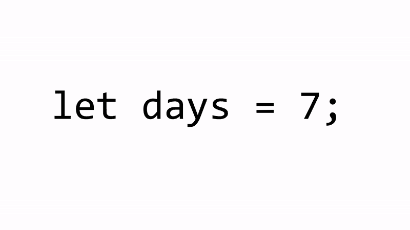
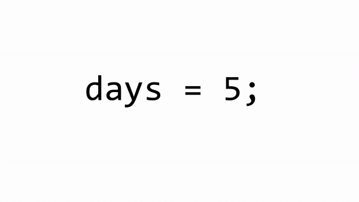
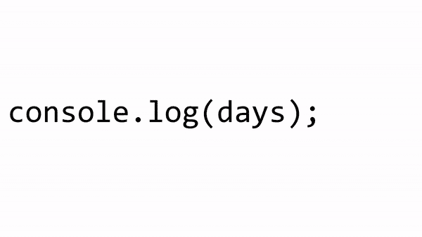
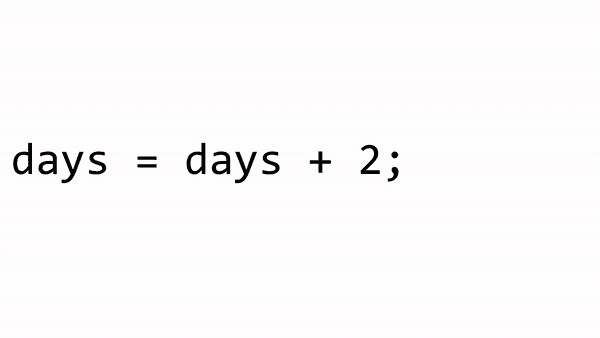
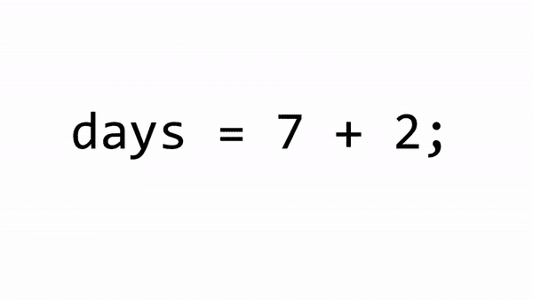

# 理解 JavaScript 中“=”符号的可视化指南

> 原文：<https://www.freecodecamp.org/news/a-visual-guide-to-understanding-the-sign-in-javascript-3de8495ab3f/>

凯文·科诺年科


# 理解 JavaScript 中“=”符号的可视化指南

#### 赋值操作符，或者“=”符号，对于第一次学习编码的人来说，实际上是非常容易误导的。

你在数学课上学到了等号的概念。

2 x 3 = 6

*x²-4 = 0*

等式左边的东西和等式右边的东西价值相等。他们可以在任何时候被翻转，并且声明仍然是正确的。

然后 JavaScript 就像 Kool-Aid 的人一样进来，完全破坏了这种理解。


哦，不要让我从变量的概念开始。在代数课上，我们被教导变量只能等于满足方程的数。举个例子，

*x²-4x+3 = 0*

上式中， *x* 只能是 1 或 3。但是在 JavaScript 中，变量的概念实际上和你在代数课上学到的完全不同。

这是一个**巨大的**问题！这意味着每当一个新手在学习变量时看到一个“=”符号，他们就需要在头脑中一遍又一遍地重复:

不是你想的那样。

不是你想的那样。

不是你想的那样。

我想创造一种更容易记忆的方法来解释变量，而不是重新教授“=”符号的意思。到本教程结束时，你会明白为什么变量赋值中的“=”更像是**一个装载卡车的斜坡**。



这应该为变量的用途以及如何在整个脚本中使用它们提供了一个清晰的指南。

### 变量的名称和值

变量是脚本中承载值的容器。在某些方面，它们是来自代数的变量的对立面。

*   你总是可以给他们一个新的值，然后重启你的脚本。没有满足某种条件的“永久”平等。
*   **语句的左侧**与右侧语句的目的完全不同。

这里有一个例子:

```
let days = 7;
```


这叫做**声明**变量。它创建了一辆名为 *days* 的新卡车，可以绕着你的脚本行驶，传递它的**值**或获取一个新的**值**。

*   *让* **关键字**宣布你正在创建一个新变量。或者，在我们即将使用的类比中，创建一辆新卡车。
*   变量需要一个唯一的**名**，这里是*天*。这是这辆卡车与所有其他卡车的区别。
*   **赋值操作符**或“=”符号将**值** 7 载入卡车。

这是很难打破的习惯，看起来就像这是数学课了，所以我要解释多一点关于可变卡车的不同部分。


这是变量**语句**的左侧。这不是一个等式！我们正在创建一辆具有特定名称的卡车，我们可以反复使用它。每当我们查看语句的左侧时，我们都会调用一辆具有特定名称的卡车。


**赋值操作符**就像卡车的坡道。它会加载一个新值。你几乎可以随时用***关键字**加载一个新值。*

*作为一名程序员，我们不断地创造新的变量，加载值，观察脚本的变化。*

### *将值重新分配给变量*

*到目前为止，我们可以创建一辆卡车，它可以绕着脚本行驶并传递它的价值。但是如何改变卡车所承载的价值呢？*

**let* **关键字**允许我们创建值可以改变的**可变**变量。如果我们使用 const 关键字，这意味着值是不可变的。*

*在 JavaScript 中，不像 math，你可以简单地给变量赋值。我们的 days 变量目前代表一周中的 7 天。但是如果我们想让它代表 5 个工作日呢？这是我们可以使用的代码。*

1.  *在第 2 行，我们创建了值为 7 的 *days* 变量。*
2.  *在第 4 行，我们**重新给**赋值。现在是 5 点。*
3.  *在第 6 行，days 卡车到达，价值为 5。*

**

*在上面的 GIF 中，第 4 行将一个新值放入卡车中，稍后在第 6 行中使用。*

*下面是第 6 行中发生的情况。*

**

*可变天数不等于任何东西！它只是传递你赋予它的价值。这比你在数学课上有更多的控制，在数学课上，你必须发现满足方程的变量的值。现在，你在控制！*

### *为什么需要变量？*

*想象一下，你正在开发一个告诉病人什么时候服药的应用程序。您需要根据药物改变每周的天数。这是一个简短的片段。*

1.  *在第 2 行中，days 的值为 7。*
2.  *在第 4 行，值 5 被加载。*

*在第 4 行和第 6 行，您使用 days 变量的值。你能简单地把数字 7 放在第 4 行，数字 5 放在第 6 行来硬编码吗？你当然可以！*

*但是，随着应用程序的增长，您会发现变量是有帮助的，原因有二:*

1.  ***立刻改变所有合适的值。**假设您有三种需要每周服用 7 天的药物，以及三种需要每周服用 5 天的药物。你不要不停的来回改变*天*的**值**！你应该使用两个独立的变量。这就给了你两辆独立的卡车来驱动你剧本的价值。*
2.  *记住一个价值代表什么。如果你硬编码了一个值，你可能会回过头来说，为什么是 7？但是，如果你创建了一个变量，你会记得它代表一周的 7 天，这样你就可以在需要的时候快速改变它。*

### *赋值运算符右侧的变量名*

*到目前为止，我们有一个非常严格的规则。变量名在**赋值运算符**的左边，而值在右边。*

*但是如果我们遇到这样的情况呢？*

*第 4 行，变量名在赋值操作符的两边！这也是为什么它不是等号的另一个原因！事实上，陈述双方的关系保持不变。*

*在第 4 行中，我们将一个新值加载到 *days* 变量中。这是它的样子。*

**

*注意我们如何从**赋值操作符**开始，首先计算语句的右边？这是因为我们**在这里给**的天数赋予了新的值。我们不能触及声明的左边。接下来会发生什么。*

**

*在这种情况下，白天的卡车停了两次。第一次是在等式的右边，传递旧值。第二次是在等式的左侧，为*天*选择新值。*

*我们的*天数*变量的新**值**是 9。在第 6 行的日志语句中，控制台将记录 9。*

#### *行动呼吁*

*你喜欢这个吗？为它鼓掌，这样其他人也能发现它。如果你想在我发布使用类比的教程时得到通知，请在这里注册:*