# D3 的视觉参考

> 原文：<https://www.freecodecamp.org/news/a-visual-reference-for-d3/>

我最近一直在使用 D3 来构建一个分析仪表板。我使用 D3 的主要原因是，我厌倦了处理各种图表库的局限性，并试图理解它们的文档。

我发现自己处于这样一种情况，我花了更多的时间试图弄清楚我正在使用的库是否能做我想做的事情，而不是真正试图弄清楚如何做我想做的事情。

有了 D3，几乎不存在能不能做什么的情况。它总是关于你如何能做某事。

诚然，掌握 D3 的 API 是一个巨大的挑战，但这是值得的。

在这篇文章中，我将试着给你一个我在使用 D3 一段时间后对它的理解的可视化表示。

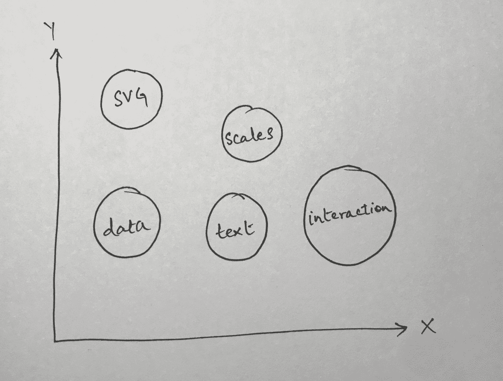

Main Ideas Behind D3

### D3 的起伏

我喜欢 D3 的一点是，它建立在最小的原语之上，你可以访问所有这些原语。

如果您要为 React 使用一个典型的图表库，您可能会这样做

```
import { BarChart } from 'generic-charting-library'

export default class Chart() {
  render() {
    return (
      <BarChart data={data} /
    )
  }
}
```

以上内容对于大多数用例来说都是完美的。然而，当你想做一些稍微复杂一点的事情时，比如以独特的方式与条形图交互(不仅仅是显示一个工具提示)，我个人的经验是，这会变成一场与库文档的战争。

首先，你必须弄清楚这个库是否有可能做到这一点，然后你必须弄清楚如何去做。

根据我的经验，第一部分是最难的。寻找你不确定存在的东西是非常令人沮丧的。然而，对于 D3，情况并非如此。几乎任何你想做的事情都可以用 D3 来完成。这只是一个弄清楚如何去做的问题。

当然，不利的一面是 D3 的 API 和文档如此庞大，以至于你最终会对事物如何工作有不同的认识。这也是我选择学习 D3 的结果，也就是用它来构建一些东西。当你选择用某项技术来构建某个东西时，你只需要查找与你当前正在构建的东西相关的部分。

比方说，你想建立一个条形图。嗯，你可能会去查找一些东西，比如如何在网页上定义和放置轴。然后，您可能会查找如何定义图表中的实际条形。这些都是定义明确的问题，有简单明了的解决方案。

我走了几乎相同的路线，并在一个令人沮丧的地方结束，在那里我可以让事情工作，但我不太明白这一切是如何走到一起的。

我将解释我是如何把所有不同的片段组合在一起的思考过程。

### 大局

下图是一个简单的条形图(这是我们在这篇文章中试图重现的)

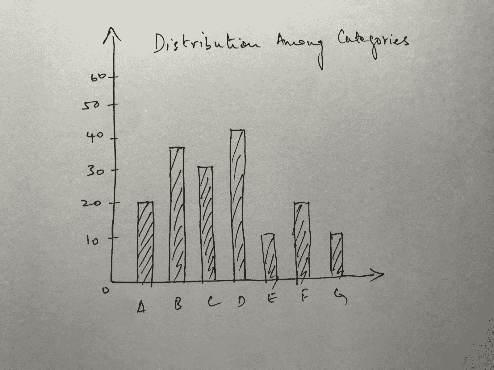

Typical Bar Chart

现在，这是同样的条形图，不同的部分被标记出来。对于组件，我指的是使用 D3 创建条形图时我们需要担心的不同事情。

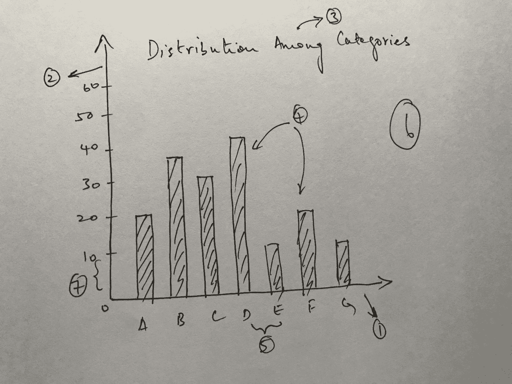

Labelled Bar Chart

1.  X 轴
2.  Y 轴
3.  标题
4.  酒吧(我把它们都算作一个)
5.  X 轴上刻度之间的间距
6.  实际的图表区本身
7.  Y 轴上刻度之间的间距

我们将详细探讨除了记号之间的间距之外的所有内容。在弄清楚如何构造轴时，记号之间的间距会自行决定。

### 组成大局的小事情

在我们开始组合组成大画面的小片段之前，我们需要理解上图中每个组件的一部分:SVG 元素。

### SVG 元素

D3 图表主要由 SVG 元素组成。在上面的条形图中，x 轴、y 轴和每个单独的条形都是 SVG 元素的实例。

我推荐阅读[这一页](https://developer.mozilla.org/en-US/docs/Web/SVG)来更好地理解什么是 SVG。SVG 本质上就是你在网页上描述 2D 图形的方式。

SVG 元素最基本的例子是 circle 元素。

参见[码笔](https://codepen.io)上扎伊德·胡马云( [@redixhumayun](https://codepen.io/redixhumayun) )的笔 [qGMxzO](https://codepen.io/redixhumayun/pen/qGMxzO/) 。

看一下上面的 codepen，您应该可以在 HTML 文件中看到 circle SVG 的定义。

我建议浏览 MDN 上的 SVG 文档(上面有链接),并熟悉它。D3 大量使用了 SVG。

#### SVG 中的 G

有一种特殊的 SVG 元素叫做 G 元素。类似于我们上面定义 circle 元素的方式，我们用

```
<svg viewBox="0 0 100 100" >
  <!-- Using g to inherit presentation attributes -->
  <g fill="white" stroke="green" stroke-width="5">
    <circle cx="40" cy="40" r="25" />
    <circle cx="60" cy="60" r="25" /> </g>
</svg>
```

将`g`元素想象成类似于在 HTML 中用作容器的`div`元素。它们都用于对某些元素进行分组。

点击阅读`g`和[的 MDN 文档](https://developer.mozilla.org/en-US/docs/Web/SVG/Element/g)

如果你想了解为什么人们会使用`g`元素，请阅读[这个](http://tutorials.jenkov.com/svg/g-element.html)

### 我们需要的数据

在我们继续之前，让我们快速创建我们将使用的数据。这是一个样本 JSON 文件，我们可以用它来创建一个条形图。

```
[
  {
    "key": "A",
    "value": 20
  },
  {
    "key": "B",
    "value": 40
  },
  {
    "key": "C",
    "value": 80
  },
  {
    "key": "D",
    "value": 55
  },
  {
    "key": "E",
    "value": 70
  }
]
```

### 图表区

让我们首先创建一个简单的图表区。创建图表区的方法是设置一个基本的 SVG 元素，然后给它分配一个 viewBox 属性。

暂时忽略 viewBox 属性是什么。这与本文的讨论无关。

```
<svg class="chart" viewBox="0 0 800 600">
```

您在屏幕上还看不到任何东西，因为此时图表是透明的。但是，如果您使用浏览器检查器，您将会看到 SVG 元素。

我们还将为图表区定义一些尺寸，如高度、宽度和边距。

```
const height = 600
const width = 800
const margin = { top: 15, right: 30, bottom: 15, left: 30 }
```

现在我们已经定义了维度，我们需要在 DOM 中实际创建图表区域。为此，我们需要使用一个叫做`d3.select`的东西

可以认为这与 DOM 本身提供的一组`document.getElementBy[X]`命令完全相同。

当您使用类似于`d3.select('.chart')`的东西时，您是在要求 D3 选择一个具有名为 chart 的类的元素。

注意，我们将选择保存在一个变量中。这一点以后会很重要。

当你用`d3.select`选择某个东西时，D3 允许你使用方法链接来改变属性，比如宽度和高度，就像我在这里做的那样。

```
const chart = d3.select(".chart")  
				.attr("width", width)  
                .attr("height", height)
```

我们最终会得到类似下图的东西

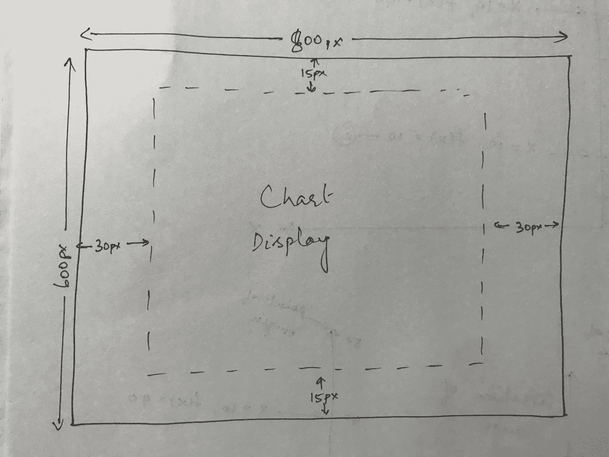

Chart Display With Margins

现在不要担心利润。我们以后会处理的。

### 定义轴

现在，我们从 D3 的实质性部分开始:创建和放置我们的轴。

在我们开始之前，我们需要了解一些关于 D3 轴工作方式的基本知识:它们本质上是从一组值到另一组值的映射。

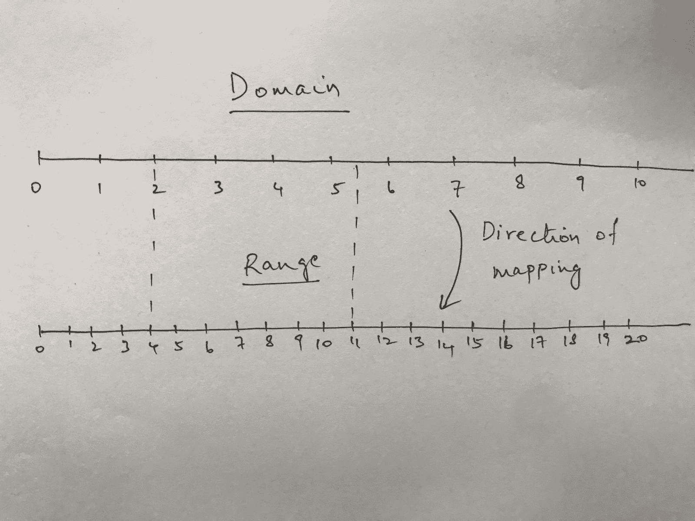

这两组值称为域和范围。D3 的映射从域工作到范围。

我定义了两条非常简单的数字线来说明定义域和范围。范围与标记数量加倍的域完全相同。

在这个例子中，很容易看出域是如何映射到范围的。您只需要将该值乘以 2，因为该范围具有两倍的刻度数，并且具有相同的起始刻度值 0。

我画了两条虚线来显示下面的映射

```
2 -> 4
5.5 -> 11
```

现在，D3 不仅仅局限于用实数(或者仅仅是数字)来定义标度。你甚至可以用字符来定义你的尺度。

#### Y 刻度

我们从 Y 刻度开始。

D3 有不同种类的秤，但我们将使用的秤称为线性秤。

为了定义规模，我们需要两样东西:领域和范围。

我们将使用一个简单、愚蠢的规则来定义我们的领域。我们假设其中一个类别的最小值是 0，最大值是 100。没有负数。然后，该域变为`[0, 100]`

```
const y = d3.scaleLinear()            
			.domain([0, 100])            
            .range([height - margin.bottom, margin.top])
```

这里我们需要检查的一件事是范围。我花了一点时间才明白为什么这个范围似乎是“反向”的。我最初的想法是范围应该是`[margin.top, height - margin.bottom]`。但是，我们希望图表的 Y 轴从底部开始，垂直向上移动。

我们将在随后的图表中考虑以下两个场景来检验这一点。

```
1\. .range([height - margin.bottom, margin.top])
2\. .range([margin.top, height - margin.bottom])
```

这两个场景的重要区别在于，在第一个场景中，我们将高度值视为“零”值。在第二个场景中，我们将`margin.top`值视为‘零’值。

> 在我们继续之前，需要记住一件事:每个 SVG 坐标系的原点都在左上角。

换句话说，Y 轴的底部是我们在第一种情况下的“零”值，Y 轴的顶部是我们在第二种情况下的“零”值。

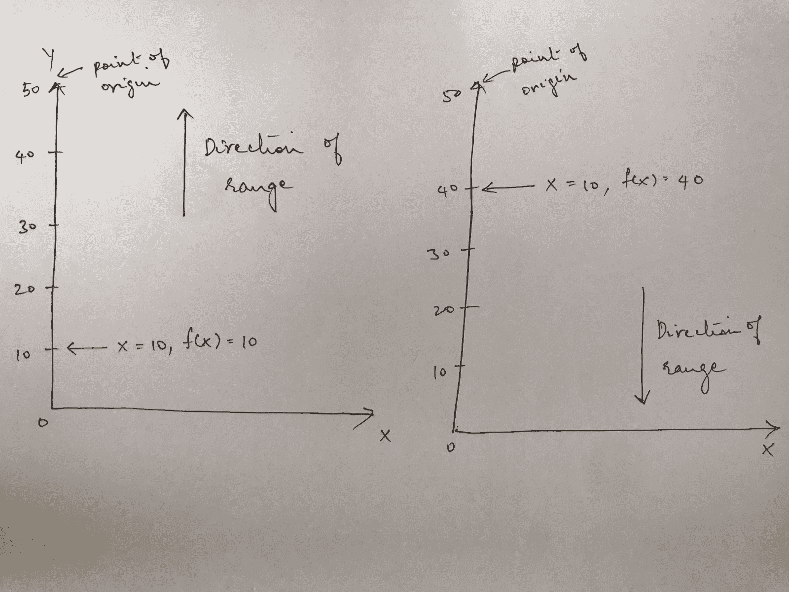

The Two Scenarios Represented Visually

在上图中，场景 1 在左边，场景 2 在右边。您可以在每个图像中看到磁畴的移动方向。

在场景 1 中，域从底部向上增长，这正是我们想要的。在场景 2 中，域从顶部向下增长，这是我们不想要的。

我承认我可能让那些凭直觉理解以上内容的人感到更加困惑，但这是我花了一段时间才弄明白的事情。如果凭直觉理解，就不用担心上面的问题。如果你仍然不明白，在这篇文章的结尾你会明白的。

#### X 刻度

X 刻度比较容易算出来。我们需要 X 刻度从左到右增长，记住我们的图表区域的宽度以及左右两边的边距。

这个规模的领域有点令人困惑，因为我们不再和数字打交道了。我们正在处理我们类别的字母。

为了弄清楚如何构建这个尺度，我们首先需要了解一个叫做序数尺度的东西。理解序数标度的最快方法是考虑线性标度和序数标度之间的差异。

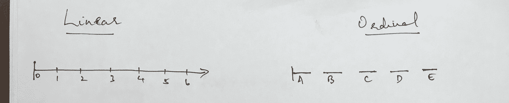

The Linear And Ordinal Scale

在上面的图像中，你可以看到两个秤的拙劣绘图。需要注意的重要区别是，线性标度是一个 ****连续**** 标度，而顺序标度是一个 ****离散**** 标度。

在线性标尺的示例中，如果您提供值 5.5，它将被映射到 5 和 6 之间的中间点。然而，如果您要提供一个介于 C 和 D 之间的字母值(这并不存在)，D3 将不知道如何映射它。就 D3 而言，没有办法映射该值，因为您已经声明所有这些值都是离散的。也就是说，两者之间没有连接值。

现在，让我们构造 X 轴。

```
function getKeys(array) {
  return array.map(arrObj = {
    return arrObj.category;
  });
}
const keys = getKeys(data)

const x = d3.scaleOrdinal()
            .domain([...keys])
            .range([margin.left, width - margin.right])
```

如果你想知道这里的函数和变量键，那就提取数据中的所有类别，并以数组的形式提供给域函数。

我可以很容易地编写`.domain(['A', 'B', 'C', 'D', 'E'])`,但是每次我的数据改变时，我都必须手动更新。

正如我已经提到的，范围需要从左到右增长。所以，我们在左边留出空白，移动宽度的长度，在右边留出空白。

#### 创建实际的轴

现在，我们已经定义了图表区域和刻度，我们需要设置轴本身。这是我们如何做到这一点。

```
const xAxis = d3.axisBottom(x)
```

这里，我们创建了一个名为 xAxis 的 ****函数**** ，它使用了`d3.axisBottom`函数，并将我们的 x 刻度作为参数提供。

为了在图表上实际显示 X 轴，我们需要执行以下操作

```
chart.append('g')
      .attr('transform', `translate(0, ${height})`)
      .call(xAxis)
```

这里要检查两件事。

我们在图表中添加了一个`g`元素。我们在前面的章节中讨论了`g`元素。然后我们对我们的`g`元素应用一个转换。这种转换在 D3 中经常出现。

SVG 有所谓的变换函数。变换函数有很多种，但这里我们关心的是`translate`。`Translate`接受两个参数和一个`x`和`y`坐标。这表示在 X 或 Y 方向移动`g`元素的像素单位。

你可以在这里阅读更多关于转换的内容。

我们提供给`translate`函数的两个参数是 0 和`height`。请记住，我们的 SVG 图表的原点在左上角。因为，我们已经知道这是一个从原点开始的水平轴，我们需要把它垂直向下移动`height`个单位。

如果不提供 transform 属性，X 轴将位于图表的顶部。

方法链的最后一部分是一个`call`函数，其中 xAxis 作为参数提供。由于术语选择不当，这可能是迄今为止最令人困惑的方面。

我们将首先检查这两行。

```
.append('g')
.attr('transform', `translate(0, ${height})`)
```

你需要明白的是，当你做类似于`chart.append('g')`的事情时，这将在图表元素上附加一个`g`元素，选择`g`元素，然后返回它。您可以通过执行以下操作对此进行测试

```
const test = chart.append('g')      
			.attr('transform', `translate(0, ${height})`)      	
            .call(xAxis)console.log(test)
```

当日志的结果显示出来时，您会在一个`Selection`对象下看到一个`g`元素。这实际上使我们能够在`append`方法上做方法链接。由于它返回了`g`元素，我们可以将它作为同一个方法链的一部分进行转换。

让我们现在去最后一行

```
.call(xAxis)
```

以下是 D3 的文档对`call`的描述

> **调用指定的函数一次，并传递这个选择和可选参数。返回所选内容。**

所以，我们知道我们利用 call 作为函数，我们必须把函数作为参数传递给它。我们知道这一点，因为文档上说，它只调用特定的函数一次。现在，要意识到的另一件事是 xAxis 也是一个函数。您可以通过记录 xAxis 来再次验证这一点。

但是，如果 xAxis 也是一个函数，那么也需要传递一个参数给它。再次阅读`call`的文档，你会注意到它说“在这个选择中通过……”。这意味着 xAxis 函数正在被从调用`chart.append('g')`返回的`g`选择隐式 调用

不得不解释`call`是如何工作的，这正是我不喜欢它的原因。有太多隐性的事情发生，看起来就像是黑魔法。

如果你仍然对`call`的工作原理感到困惑，希望下面的图片能帮你理清思路。

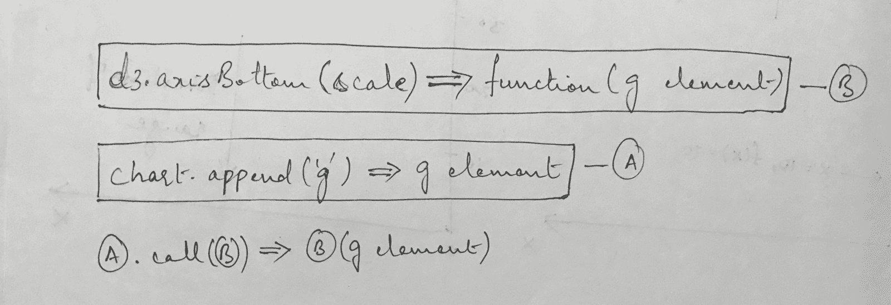

How Call Works

既然我们知道了 X 轴是如何工作的，那么创建 Y 轴就简单多了。我们使用相同的原理，但是把`axisBottom`换成了`axisLeft`，并且稍微改变了翻译功能。

```
const yAxis = d3.axisLeft(y);

chart
  .append("g")
  .attr("transform", `translate(${margin.left}, ${margin.bottom})`)
  .call(yAxis);
```

您会注意到`transform`属性有一个`translate`函数，其中`y`属性被设置为`margin.bottom`。如果你回到我们为 y 刻度设置的范围，你会注意到我们把它设置为`height - margin.bottom`。

当我们调用 D3 的`axisBottom`函数时，D3 会把它放在`height - margin.bottom`处，但是图表的底部实际上是在`height`，所以我们加上了`margin.bottom`偏移量。

### 放置钢筋

这是图表中视觉上最重要的部分，因为这是用户实际看到数据的地方。

首先，让我向您展示将为我们创建条形的代码，然后逐步完成它。

```
chart.selectAll('rect')
    .data(data)
    .join('rect')
    .attr('x', d => x(d.category))
    .attr('y', d => y(d.value))
    .attr('width', x.bandwidth())
    .attr('height', height - y(d.value))
    .style('fill', 'steelblue')
```

前两行很简单。`selectAll`的工作方式与`select`相同，只是它返回特定 elemenet 的所有可能选择。

调用`.data`允许您定义想要与 DOM 元素关联的数据。

现在，`.join`就是 D3 的症结所在。这使得 D3 难以置信地强大，可以用来创建可视化效果。

如果你想了解 Mike Bostock(D3 的创造者)对数据连接的看法，你可以在这里找到。

接下来是我试图解释`.join`函数在条形图中的作用。

所以，如果你回头看看我们在这篇文章前面定义的数据，你会注意到它是一个数组。原因是因为这是 D3 期望的数据结构。

然后，`.join`函数获取数组的每个元素， ****构造一个对应的 DOM 元素，并附上这个数据点**** 。

*注:* `*.join*` *函数以前是单独的函数，叫做* `*.enter*` *和* `*.append*` *。然而，这种语法要干净得多。* [*这里的*](https://github.com/d3/d3-selection/issues/194) *是 Mike Bostock 第一次提出的 GitHub 问题。*

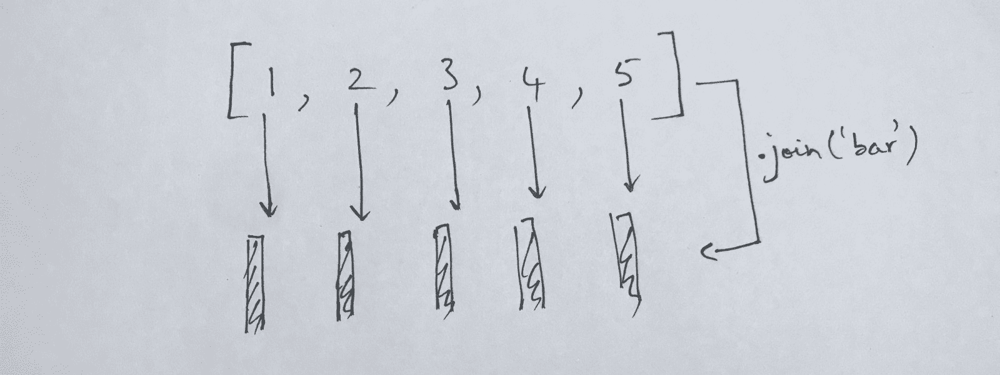

How .join() works visually

*注:上图中应该是* `*.join('rect')*` *而不是* `*.join('bar')*`

上图说明了进行数据连接时的情况。如果您获取一个包含 5 个元素的数组，并对其执行一个`.join('rect')`操作，那么 D3 将为每个元素创建一个 rect SVG 元素。

D3 要做的另一件事是将数组中的每个数据点关联到各自的`rect`元素。

```
const data = [1, 2, 3, 4, 5]

const selection = d3.selectAll('rect')
                    .data(data)
                    .join('rect)

selection.each(function(d, i) {
  console.log(d)
})

//1, 2, 3, 4, 5
```

上面的代码片段向您展示了如何记录每个单独的数据点，以满足您自己的好奇心。

当然，您可以用任何其他 SVG 元素替换上面的`rect`,您会得到相同的结果。

太好了，现在我们知道如何创建我们的酒吧，但我们仍然需要找出如何放置它们。在继续之前，我建议您阅读[这篇关于 rects 的 MDN 文章](https://developer.mozilla.org/en-US/docs/Web/SVG/Element/rect)。

最初在使用 D3 的时候，有一件事让我犯了很多错误，那就是试图弄清楚 SVG 坐标系是如何工作的。

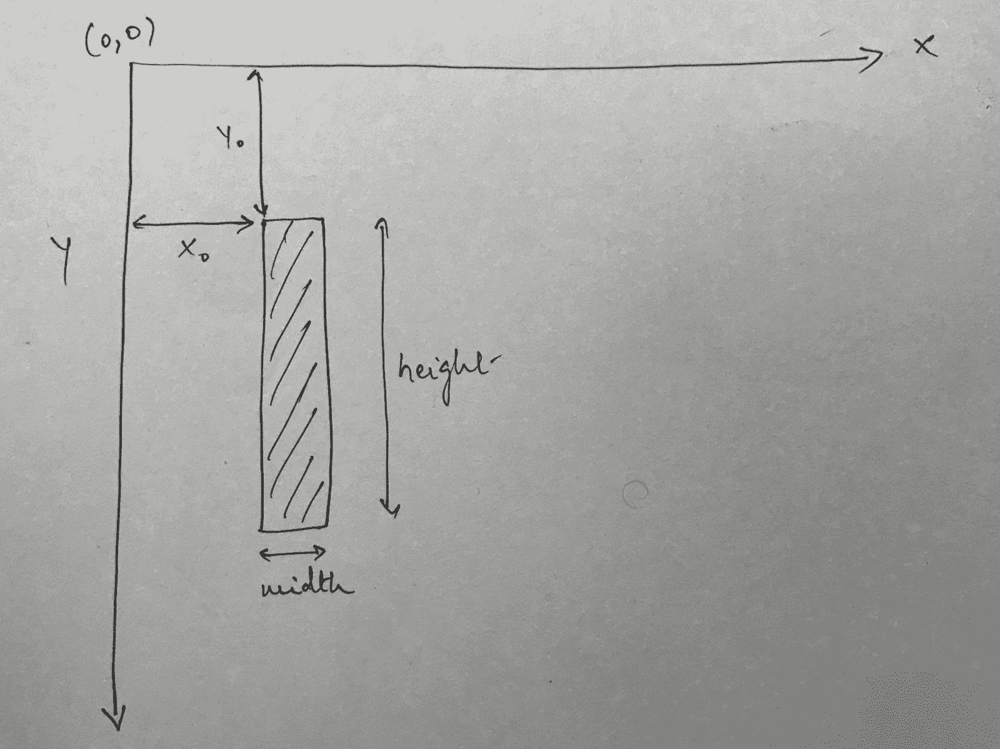

*如果你想更深入地了解 SVG 坐标系是如何工作的，请查看*[](https://www.sarasoueidan.com/blog/svg-coordinate-systems/)**文章**

*上图向您展示了不同的测量如何影响矩形在 SVG 坐标空间中的放置。*

*rect SVG 元素有四个主要的属性:x，y，宽度和高度。*

*您可以在图像中看到它们与 SVG 坐标空间的关系。*

*让我们把上面的翻译成代码。*

```
*`chart
  .selectAll("rect")
  .data(data)
  .join("rect")
  .attr("x", d => return x(d.category))
  .attr("y", d => return y(d.value))
  .attr("width", x.bandwidth())
  .attr("height", d => height - y(d.value))
  .style("fill", "steelblue");`*
```

*让我们在调用`.join`之后一步一步地检查代码。*

*当我们设置`x`和`y`属性时，我们调用了之前定义的各自的刻度。还记得当我们定义标度时，我们说过它们中的每一个都是函数，可以用一个值来调用，以将其从定义域映射到值域。这正是我们正在做的。*

*现在，为了理解宽度属性，我们首先需要回到我们定义的`ordinalScale`。D3 有一个与每个刻度相关联的函数，称为`bandwidth`函数。这将返回定义的每个波段的宽度。D3 在内部通过在域的每个元素之间平均划分范围来做到这一点。*

*因此，我们提供了一个由 5 个字符组成的数组作为 x 轴的定义域，并将范围设置为`[margin.left, width - margin.right]`，其中`width = 800`和`margin = { left: 60, right: 60 }`*

*所以，我们有*

```
*`(800 - 60 - 60) / 5 = 136
All units are in pixels.`*
```

*现在，height 属性是另一件困扰我很长时间的事情，因为我不太明白为什么我们要用`height - y(d.value)`来表示 rect 的高度。当然，它应该只是`y(d.value)`？*

*记住 SVG 坐标的原点在左上角，+ve Y 轴向下，就可以再次回答这个问题。*

*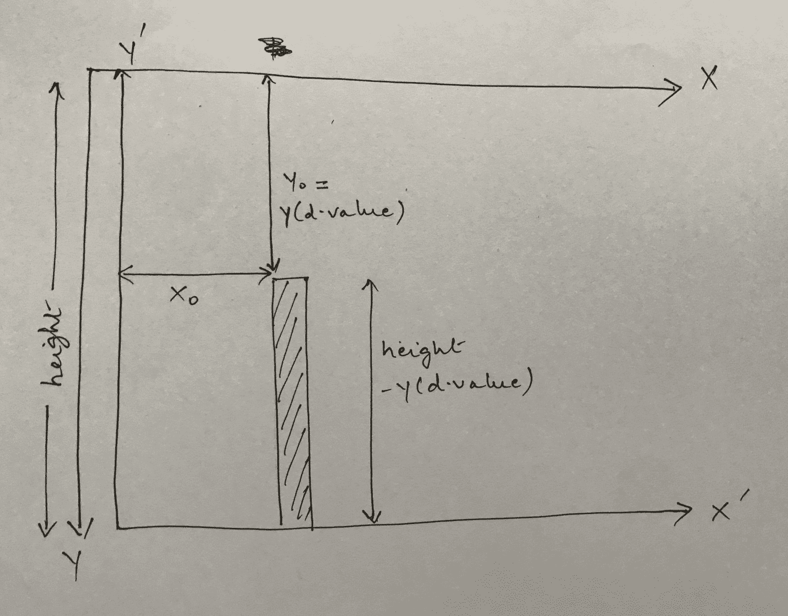

Measurements For A Bar in SVG Coordinate System* 

*在上图中，我展示了我对条形高度计算方式的理解。同样，如果计算酒吧的高度对你来说有直观的意义，可以跳过这一步。*

*在视觉效果中需要注意的主要事情是，SVG 坐标系的轴和我们的图表的轴之间存在差异。SVG 坐标系的 Y 轴向下为正，但我们图表的 Y 轴向上为正。*

*这就是我为 X 轴和 Y 轴分别画了两组轴的原因。从技术上来说，这两个 Y 轴应该重叠在一起，但是这样很难看到。但是，你可以假设它们是相互重叠的。*

*当我们用`y(d.value)`调用 y scale 函数时，我们得到一个值，*从顶部开始向下计数*SVG 坐标系的+ve Y 轴。高度显示在 Y 轴全长的一侧，然后剩下的是`height - y(d.value)`，这是我们分配给条形的高度。*

### *添加标题和标签*

*现在，我们开始简单的部分。这很简单，因为到目前为止我们已经介绍了所有内容！*

*类似于我们到目前为止将`rects`附加到 SVG 的方式，我们也可以将`text`作为 SVG 元素附加，如下所示:*

```
*`chart.append('text')
      .attr('x', width / 2)
      .attr('y', margin.top)
      .style('font-size', 32px)
      .style('text-anchor', 'middle')
      .text('Distribution Among Categories')`*
```

*文本 SVG 元素也有一个`x`和`y`属性，其工作方式与`rect`的`x`和`y`属性非常相似。*

*您可以为文本元素设置不同的样式属性，并使用`.text`属性设置文本本身。*

*现在，让我们放置 Y 轴标签*

```
*`chart
  .append("text")
  .attr("transform", "rotate(-90)")
  .attr("x", -height / 2)
  .attr("y", margin.left / 4)
  .text("Values")`*
```

*好吧，这个有点混乱，让我们开始吧。*

*首先，我们对元素应用一个`transform`，并将该值设置为`rotate(-90)`。这是将 *SVG 坐标系本身*旋转-90 度。*

**注意:接下来的一切都是我试图对旋转功能的工作原理进行逆向工程。如果结果证明我错了，请原谅我。**

*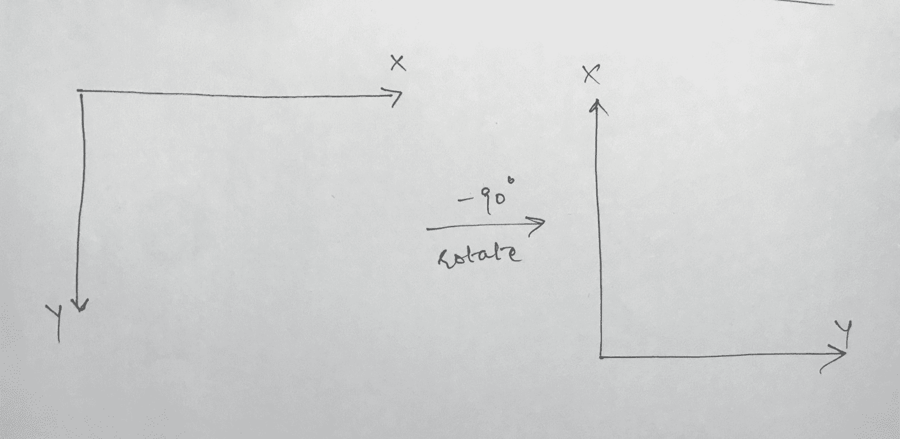

Axis Rotation* 

*上图显示了应用`rotate(-90)`时坐标系的变化。现在，你可能更困惑了，因为负旋转通常意味着顺时针旋转。然而，看起来我已经逆时针旋转了。*

*记住，典型的坐标系，Y 轴指向正上方。我们让它指向正下方。因此，我们的旋转是相反的。*

*现在，我们的新 X 轴指向旧 Y 轴的相反方向，我们的新 Y 轴指向旧 X 轴的方向。*

*现在，在这个新信息的上下文中，查看`x`和`y`属性的值更有意义。因为我们的新 X 指向旧 Y 的相反方向，所以我们给`x`属性设置了一个负值。*

### *结论*

*好吧，那是相当的帖子。我没想到它会变得如此庞大，但我们确实涵盖了很多细节。我希望你喜欢阅读这篇文章，更重要的是，我希望你能更好地理解 D3 是如何工作的。这是一个非常棒的库，为您提供了一套非常强大的工具。*

*我在这里用这篇文章中的代码创建了一个[代码 Sanbox。请随意叉它，玩它！](https://codesandbox.io/s/blazing-pine-9vjw1)*

* * *

**如果你想关注我，你可以在* [*GitHub*](https://github.com/) *或*[*Twitter*](https://twitter.com/zz_humayun)*上这样做。如果你有任何问题，请不要犹豫地问。**