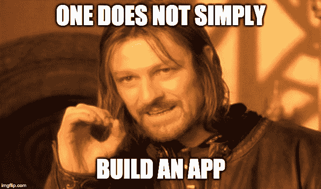
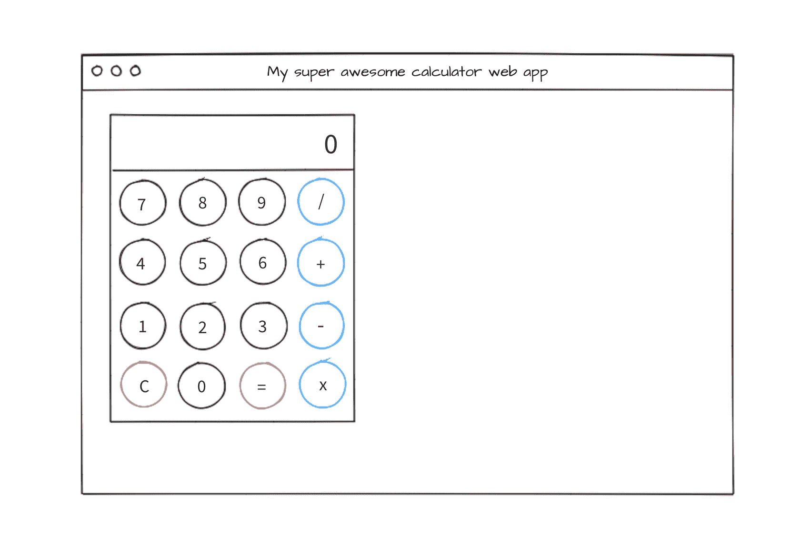

# 开发人员如何思考:简单 Web 应用背后的规划和设计演练

> 原文：<https://www.freecodecamp.org/news/a-walk-through-the-developer-thought-process/>

我喜欢那些关于如何制作不同的网络应用程序的很棒的教程。尽管这些都很棒，但是当我开始使用自己的网络应用程序时，我经常感到停滞不前。

所以我写了这篇文章，带你了解我的思考过程。这就是我如何计划和开发我自己的项目。

在我们开始之前有一个提示:这篇文章并不是关于如何创建任何项目的“银弹”指南。这就是我个人处理项目的方式。可能对你有用，也可能没用。

创建任何应用程序都没有“正确”的方法。记住:有很多路可以让你到达旅程的终点。(除非，你带着闪亮的戒指去魔多，不幸的是，只有一条路可走)。

我将使用 React.js 来编写示例应用程序。在本文的最后，我在完成的应用程序中包含了一个代码沙箱。

因此，您还需要对设置 React 项目有基本的了解。不过不要担心，不管你用什么语言编写应用程序，本文中的原则仍然适用。

好的，我们开始吧。今天我们要设计一个...待办事项列表！

只是开玩笑。我们要做一个简单的计算器。

## “它是做什么的？”

这是我在开始任何副业之前问自己的第一个问题。我希望我的计算器能够:

*   数字的加、减、除和乘
*   显示计算结果
*   重置显示器

这应该足够了。以这种方式规划功能会让你对你的应用程序有所了解，并开始让你进入状态。

这种方法也给你一个坚实的工作目标。一旦你实现了所有的特性，你就完成了，你可以开始考虑你的下一个副业了——Huzzah！

否则，你可能会尝试添加太多的功能，并在睡梦中看到计算器。当然，如果你愿意，你可以继续添加功能。但是一定要有一个努力的最终目标。

在现实世界中——取决于您的角色——可能会有一个客户或产品所有者为您定义“它做什么”部分。作为开发人员，您的工作是将这些需求分解成更详细的任务，我们将在后面讨论。

## “长什么样？”

现在我对这些特性有了一个概念，我将开始考虑它会是什么样子。

如果你正在努力设计，有很多方法可以做到:

*   看看类似应用的例子
*   浏览 CSS 框架，寻找可以使用的元素
*   或者发挥你的想象力。(并不是你做的每一个副业都必须看起来“不可思议”。)

我今天特别有艺术感，所以我要用我想要的计算器做一个快速的线框:

啊！太棒了。我应该成为一名艺术家。

所以我有我的特征，我有我的素描，梵高自己也会为之骄傲。

在现实世界中，当你作为团队的一员工作时，设计师可能会为你设计出这样的东西。或者，更好的是，你可能会得到一个工作原型，你可以玩。

## "我如何定位和设计元素的样式？"

我开始对我的应用程序应该做什么，以及它看起来像什么有了很好的感觉。现在是时候来点更专业的了。

在这一点上，我在想，“好吧，我有一些按钮，和一个大的旧显示器。我将如何定位一切？"

我喜欢认为实现一个设计有点像盖房子。打好基础(**布局**，搭建外部结构(**按钮，输入**，后期添加收尾工作(**颜色，图标，样式**)。

说到布局，首先想到的是 **CSS Grid，Flexbox** ，或者一个框架(比如 **Bootstrap** )。我将使用 Flexbox，因为它反应灵敏，可以非常容易地在一行中排列项目，而且，因为我喜欢它。这让我不必安装我们不需要的额外依赖项。

## “它表现如何？”

现在是时候考虑应用程序将如何运行了。这基本上是将我们的功能分解成更多的细节，以帮助 ***设计代码*** 。

当我问自己这个问题时，我会想到这样的事情:

*   app 加载时是什么样子的？
*   当用户点击一个按钮时会发生什么？风格变了吗？
*   UI 如何对各种用户动作做出反应？

回答这个问题的另一种方法是玩一个现有的例子。

给你一个小任务:试着打开你电脑上的计算器，开始做一些事情。加法，乘法，等等。

当你执行一个动作时，看看你**是否能尽可能详细地捕捉到**发生了什么。

以下是我的发现:

*   当应用程序加载时，显示屏设置为“0 ”,所有按钮都处于“非活动”状态
*   当用户单击一个数字时，显示将会用新值更新。被点击的按钮将改变样式以向用户指示点击成功。
*   当用户点击一个操作符时，被选中的操作符将以某种方式表明它已被选中。
*   如果点击了一个操作按钮，然后用户点击了一个数字按钮，在显示用户点击的下一个数字之前，显示器将首先重置为零。
*   单击“等于”按钮时，将使用初始数字、选定的运算符和输入的下一个数字执行计算。
*   当用户点击清除按钮时，显示屏将重置为零，应用程序也将重置。

在现实世界中，我们不会总是有一个奢侈的例子或原型来玩。但是随着你经验的增长，基于一个线框或模型来做这件事会变得更容易。这就是为什么我喜欢建议初学者**复制现有的应用**，因为这给了你一个练习批判性思维和分析的例子。

但是为什么我们要深入到如此本质的细节呢？好问题。答案是因为计算机非常聪明，但也非常笨。(不信我？试着从你的代码中去掉一个随机的花括号，你会发现一切都乱套了。)

我们给计算机的指令必须非常具体。 例如，回头看看我们上面的行为，点击一个数字会根据操作符是否被点击而有不同的行为。

我们人类知道计算器是如何工作的，但是计算机不知道，直到我们告诉它如何工作。

## “我的代码会是什么样子？”

就像我花了一些时间设计 UI 一样，我也喜欢对代码做同样的事情。这有很多好处:

*   让我仔细思考我需要什么组件
*   让我思考工作流程
*   这意味着编写代码会更容易/更快，因为我有一个计划
*   尽早发现问题和问题领域

我前面提到过，对于这个项目，我的目标是保持事情简单，所以我将坚持这种方法。开始的时候，我会把所有东西都放在一个组件中。但是，我将在以下情况下开始重构和拆分组件:

*   代码增长到难以管理或推理的程度
*   有许多重复的代码
*   页面上的单个元素需要它自己的功能和状态

你有没有在一个项目快结束的时候想“嘘！我忘了一些东西，现在我必须重新设计所有这些东西？”通过提前计划，你可以避免这个陷阱。记住这一点，以下是我认为我需要的东西。不要一整天都在想，在计划和刚开始之间找到一个平衡点。让我们将我们的 UI 模型分解成各个部分，并考虑需要哪些代码。

### 该显示器

我的显示器向用户显示了当前的数字，所以我需要某种类型的**状态值**来显示。当我点击它的时候没有任何反应，所以我不需要任何东西。

### 数字按钮

因为数字按钮会影响显示屏上显示的数字，所以我需要一个由 **onClick** 事件调用的**函数**来管理它。现在不需要在状态中存储选择的号码。

### 操作员按钮

操作按钮是一个有趣的按钮——当不同的事情发生时(还记得我们的“它是如何表现的？”上面的注释？).由于*我需要知道当前选择的操作符*，我也将把它存储为一个**状态值**。

### 等于按钮

等号按钮应该接受显示值、运算符、先前输入的值并计算结果。轻松点。

不完全是，我们碰到了第一个问题！让我们回顾一下我们的行为

> 如果点击了操作按钮，然后用户点击了数字按钮，则在显示用户点击的数字之前，显示器将首先复位

当用户点击一个操作符并开始输入下一个数字时，用户输入到显示屏中的第一个数字会被重置，这意味着我们的应用程序不知道当用户点击等于时第一个数字是什么(我告诉过你计算机是愚蠢的)！让我们思考一下这个问题:

当点击 operator 按钮时，这是显示器复位的点，并且用用户输入的下一个数字更新。逻辑上，当点击一个操作符时，存储以前的显示值是有意义的。为此，我需要一个**函数**和一个**状态值**，当点击一个操作符时，它存储显示值。

### 清除按钮

这很简单——将我们的**状态值重置为零**，允许用户重新开始。我需要一个简单的 **onClick** 函数来处理这个按钮。

## “我需要测试什么？又能出什么差错呢？”

根据谈话对象的不同，可以有不同的方式来对待测试。一些人喜欢进行 TDD(首先编写测试),另一些人在最后编写测试。我根据项目两者都做。但是最重要的是你在某个时候写下它们。

当我考虑我的测试时，我会查看需求。第一个要求(或特性)是:

*   数字的加、减、除和乘

所以我需要测试这个应用程序是否能做这些事情。我不会详细讨论如何编写测试，但是一个好的测试套件应该包括:

*   需求和常见用例
*   边缘情况(例如，用户输入 999999999999999999999999+999999999999999999)
*   错误案例和可能出错的地方(例如，用户试图除以零)

“我应该写多少测试？”，很可能是你的下一个问题。不幸的是，这方面没有确切的数字。你可以有无穷无尽的输入。如果你遵循以上几点，你将拥有一个适用于任何项目的可靠的测试套件。

尽早考虑您的测试将有助于您思考代码中哪里会出现错误，并允许您在设计中尽早处理它。

## 让我们看看代码

这不是一个编码教程，所以我不打算深入本文中的每一步。参见最后的代码沙箱，查看一个工作示例，包括下面概述的每个步骤的代码/演练。随意分叉代码，随心所欲地玩、破坏和实验！

编写代码时，我们将坚持计划:

*   首先，使用我们的线框作为参考，专注于获取 UI 布局和元素
*   实现逻辑(JS、事件处理程序等)
*   最终修饰
*   记住做最简单的事情来让一切正常工作——不需要一开始就担心重构和性能！

### 步骤 1 -布局和基本 UI 元素

(在下面链接的代码沙盒中，点击`Step 1`按钮查看工作示例，查看代码见`app-step-1.js`！)

请记住，我们将从布局开始，一起搭建应用程序的“脚手架”。这将包括添加 HTML 和使用 Flexbox，以定位我们的显示和按钮。他们还不会做任何事情，但他们会看起来很好。算是吧。

### 步骤 2 -添加逻辑

(在下面链接的代码沙盒中，点击`Step 2`按钮查看工作示例，查看代码见`app-step-2.js`！)

我们已经为这部分做了计划，所以让我们回头参考一下。在我们的“我的代码看起来像什么”笔记中，我们必须创建一堆不同的状态对象和函数来处理事件。

为此，我从我们的“我的代码看起来会是什么样的？”一次列出一个清单，并参考回“它是如何表现的？”笔记拼凑一切。我实现功能，并测试它的工作情况(通常是自动的，但手动也可以)。示例:

列表中的第一个元素是**显示。因此，我将添加状态变量和逻辑。测试它是否工作，然后移动到**数字按钮**，并重复。这就是尽早编写测试有所帮助的地方——您可以经常运行该套件，以确保没有任何问题发生。**

### 步骤 3 -添加铃铛和哨子

(在下面链接的代码沙盒中，点击`Step 3`按钮查看工作示例，查看代码见`app-step-3.js`！)

太棒了，我们快完成了！现在，逻辑工作了，我们现在将去添加一些更好的触摸(圆形按钮，边框，更大的显示屏等)到应用程序中，我们完成了！我们最基本的计算器现在开始运算了！

### 第 4 步-交给你了！

我特意留下了一些东西，如果你喜欢，你可以继续尝试。使用我们到目前为止学到的方法——思考行为，你将需要什么功能/状态对象等等。

*   我们的计算器和线框不太匹配——你能给按钮加点颜色吗？点击时改变选中按钮的颜色怎么样？
*   没有测试！哦亲爱的！看看能不能加点
*   存在一些重复的代码——你能找到一种方法来呈现按钮，这样我们就不需要硬编码 16 个`button`元素了吗？
*   错误处理-没有！这很糟糕。如果你试图除以零会发生什么？或者你有一个比显示屏宽的数字？
*   当用户开始输入数字时，任何前面的零都会被添加到显示屏上，例如`000003`这不是好的 UX，你能修复它吗？

* * *

### 感谢阅读！想要更多这样的文章？

希望这能让你深入了解编写应用程序的一种方法。如果你想在我发布更多这样的文章时得到更新，请随时加入邮件列表，地址是 [chrisblakely.dev](https://www.chrisblakely.dev#sign-up) ！如果你想聊天，也可以通过[推特](https://twitter.com/chrisblakely01)联系我:)

* * *

## CodeSandbox -完成的示例

[https://codesandbox.io/embed/code-thought-process-2imft](https://codesandbox.io/embed/code-thought-process-2imft)