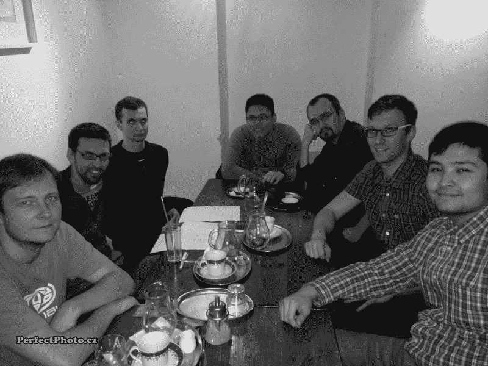

# 来自比尔·盖茨、埃隆·马斯克和斯蒂芬·霍金的警告

> 原文：<https://www.freecodecamp.org/news/a-warning-from-bill-gates-elon-musk-and-stephen-hawking-f339e4bbfa9d/>

这里有三个值得你花时间的链接:

1.  这个周末，比尔·盖茨和埃隆·马斯克都警告我们政客们不敢谈论的一件事:自动化
2.  如何使用极大极小算法( [8 分钟阅读](http://bit.ly/2lyYub8))让你的井字游戏无与伦比
3.  一组可重复的 SVG 背景模式，供您在 web 项目中使用( [1 分钟浏览](http://bit.ly/2m0NNLN))

### 想到这一天:

> 工厂的自动化已经大量减少了传统制造业的工作岗位，人工智能的兴起可能会将这种工作岗位的破坏深入到中产阶级，只剩下最关心、最有创造力或最具监管力的角色。”—斯蒂芬·霍金

### 每日一图:

艺术家斯科特·坎贝尔[给一台激光切割机](http://bit.ly/2lZlXPV)编程，从一叠两英尺高、价值 11000 美元的未切割美钞中雕刻出一个头骨。

### 今日学习小组:

[布拉格自由代码营](http://bit.ly/2lyPkLO)

编码快乐！

–昆西·拉森，自由代码营的老师