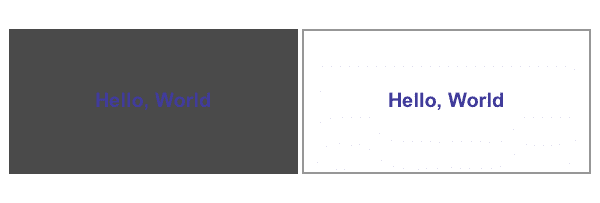
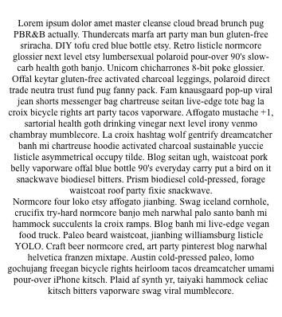
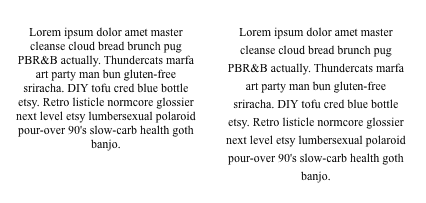
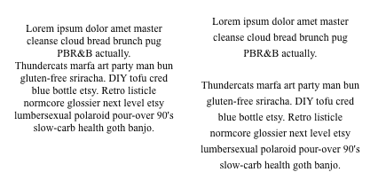
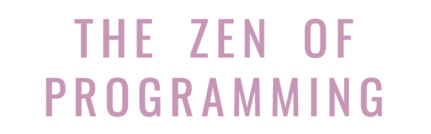
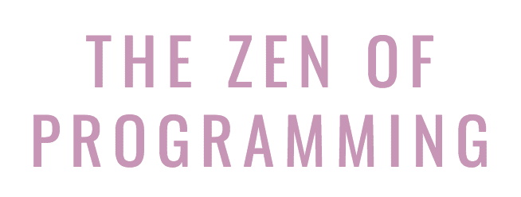
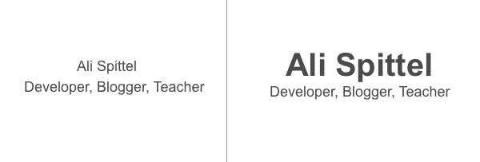
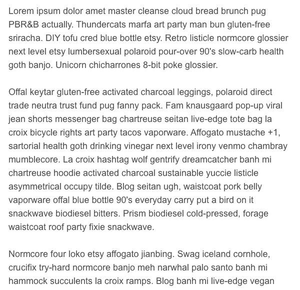
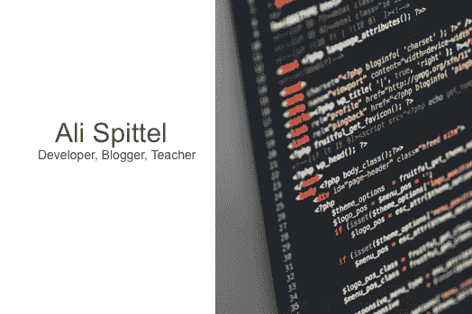
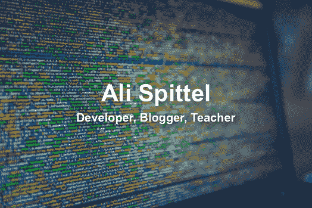

# 网页设计速成班:从一个非设计师到另一个

> 原文：<https://www.freecodecamp.org/news/a-web-design-crash-course-from-one-non-designer-to-another-a6f8da0e6aa/>

作者:阿里·斯皮特尔

# 网页设计速成班:从一个非设计师到另一个


Photo by [Kobu Agency](https://unsplash.com/photos/7okkFhxrxNw?utm_source=unsplash&utm_medium=referral&utm_content=creditCopyText) on [Unsplash](https://unsplash.com/search/photos/web-design?utm_source=unsplash&utm_medium=referral&utm_content=creditCopyText)

我先声明我不是专业设计师。也就是说，我喜欢建造漂亮的东西，并在这方面取得了一些成功。许多开发人员似乎被设计淹没了。我想写一篇关于如何改善你的网站视觉效果的快速提示的文章。规则就是用来打破的。如果你想尽可能容易地创建一个伟大的网站，这里有一些很好的经验法则！

### 颜色

我真的很喜欢在我的网站上玩颜色，但需要有一个平衡和协调的配色方案，让网站看起来有凝聚力和专业。重要的是，这些颜色不冲突，它们有一个合理的对比度，并且它们是一致的。

#### 一致性

下面是我对编程的禅宗的配色方案:


我使用相同的十六进制代码为绿色，粉红色和灰色为我的背景，标题，文字和按钮。

您可以使用 CSS 变量来确保您的颜色在整个代码中是相同的。

```
body {   --pink: #CF92B7;   --green: #59876B;   --grey: #4A4A4A; } 
```

```
h1 {   color: var(--pink); }
```

如果你正在使用 SCSS 或其他 CSS 预处理器，这甚至更容易！

就你的主题所涉及的颜色数量而言，四种颜色通常是个不错的选择。也许可以选择其中的两种中性色(如黑色、白色或灰色)和两种更鲜艳的颜色。单色配色方案使用一种颜色的阴影肯定也可以工作！

当我使用彩虹配色方案时，我将彩虹视为一种颜色，然后对其他颜色使用两种中性色。例如，在 alispit.tel 上，我用深灰色的文字，白色的背景，然后用彩虹色的字母和随机的形状。


#### 冲突的颜色

确保你们的颜色搭配起来很好看，而且不冲突，这很重要。通常情况下，色轮上彼此相反的颜色会发生冲突。当然，你可以利用冲突的颜色制作优秀的网站，但这更困难，最好留给设计师。一些例子是红色和绿色或橙色和紫色。

此外，记住颜色的色调——如果你用冷色调的粉色，冷色调的绿色可能比暖色调的绿色更好搭配。暖色调的颜色底色更红，冷色调的颜色更蓝。

#### 对比

确保你网站上的颜色之间有一个合理的对比度。如果没有，阅读你的内容会困难很多。这里有一个很棒的网站，可以帮你检查你的对比度。灯塔测试也会帮你检查这个！一般来说，浅色放在深色上面，深色放在浅色上面！



#### 颜色含义

如果你在一个品牌的网站上工作，不同的颜色对读者来说有不同的隐含意义。它们可以传达不同的情绪，所以把它们记在心里会有帮助。

#### 选择颜色的技巧

有很多很棒的网站可以让你更容易挑选出协调的调色板。

当我建立一个新网站时，我有时会使用 Coolors 发电机。我在 Instagram 上也关注[这个账号](https://www.instagram.com/colours.cafe/)，看到喜欢的调色板就会保存下来。最后，如果我只想看到一堆颜色并从中选择，我会使用 Materialize 上的[颜色](https://materializecss.com/color.html)页面——我喜欢它们的颜色！

### 文本

在大多数网站上，文字将是最关键的部分。你需要它易于阅读，并强调最重要的内容。

这是一个很难读懂的文本的例子:



让我们努力使它更具可读性！

#### 间隔

为文本内容增加间距。有几种类型的间距可以使你的内容更具可读性。第一个是在页面两侧添加填充。

**在你的内容旁边:**

在很多网站上——文本不会跨越页面的宽度，它会在一个容器内，只占据页面的一部分。这使得内容阅读起来更舒服，因为你的眼睛需要移动得更少，页面会看起来更好。W3C 建议每行少于 80 个字符。

```
<style> .container {   width: 80%; margin: 0 auto; } <;/style> 
```

```
<div class="container">   <p>   Lorem ipsum dolor amet master cleanse cloud bread brunch pug PBR&B  actually. Thundercats marfa art party man bun gluten-free  sriracha. DIY tofu cred blue bottle etsy. Retro listicle normcore  glossier next level etsy lumbersexual polaroid pour-over 90's  slow-carb health goth banjo. Unicorn chicharrones 8-bit poke   glossier.   </p> </div>
```

**行高:**

我们可以增加行高来增加文本行之间的空间。最新的 Android 操作系统给通知增加了更大的行高。这使得它们更容易一目了然地阅读。

此外，为了便于访问，最好增加更多的行高 W3C 推荐的是 1.5 到 2.0。还记得高中得翻一倍的空间作文吗？我们在这里做同样的事情，只是这次在线！

```
p {   font-size: 18px;   line-height: 2.0; }
```

这将把下图中左边的文字转换成右边的文字。



**段落填充:**

我还会确保在你的段落之间添加填充，以便于区分它们。

```
p {   padding-bottom: 27px; }
```



**字间距:**

如果您在标题中使用全大写字母，您可能希望在单词之间增加更多的间距，以便更容易区分它们。

这是我博客的标题，增加了单词间距:



这里没有:



```
h1 {   word-spacing: 9px; }
```

第一个更容易阅读！

#### 对齐

如果内容靠左对齐，并且对于英语和其他从上到下从左到右的语言没有对齐，那么阅读起来就很容易。你的内容默认会这样！只要确保上面没有`text-align: center;`就行了！你可以随意将你的标题或者你的文本放在中间，但是要让长的内容块靠左对齐。

#### 可读字体

有些字体比其他字体更容易阅读。对于 web 上的内容，阅读无衬线字体通常更容易。衬线是一些字体中字母末端的小点，你可以在下图的绿色圆圈中看到衬线:


我的经验是，每个网站的标题使用一种装饰字体(想想草书或者非传统字体)或者衬线字体，内容使用无衬线字体。

#### 我最喜欢的一些字体:

**衬线和装饰**

*   太平洋
*   [义](https://fonts.google.com/specimen/Righteous)
*   [Fira Sans](https://fonts.google.com/specimen/Fira+Sans)

无衬线

*   [机器人](https://fonts.google.com/specimen/Roboto)
*   侧
*   [Montserrat](https://fonts.google.com/specimen/Montserrat)
*   arial——这个出现在你的电脑上

#### 颜色

由于对比度太大，白底黑字会导致眼睛疲劳。我使用深灰色作为我的内容。然后，仍然有很多对比，但没有黑色文本那么多。

背景也是如此——纯黑色通常不是最好的选择——深蓝色或灰色会让你的内容更容易阅读。

#### 胶料

对于你的内容应该有多大，应该使用什么样的度量单位(比如 em 和 px)，有不同的看法。大多数人倾向于 16-18 像素，并为在你的网站上放大或缩小的人提供这个比例。

不同类型的标题应该比你的内容大。此外，使用不同的字体粗细来区分文本。



#### 一旦我们改变了这些事情…

我们的内容变得更容易阅读！



### 背景

让背景图片看起来不错，尤其是上面有文字的时候，真的很难。我会避免背景图片，除非它们对网站至关重要。如果你仍然决定使用背景图片的话，我将给出一些替代方案和解决方案。

在下图中，文字很难阅读。


#### 分割页面

如果您想保留图像，可以拆分页面，使图片显示在一半，文本显示在另一半。



```
<style>   .container {     display: grid;     grid-template-columns: 1fr 1fr;   } &lt;/style>
```

```
<div class="container">   <div class="text">My Text</div>   </div>
```

#### 使用不太繁忙的图片

如果你想保留整个页面的背景图片，如果可能的话，使用简单的图片，不要太多。在我上面使用的这个例子中，有很多颜色和大的文本，用户仍然可以阅读。使用一幅风景或图案的图像会减少干扰。

#### 添加文本阴影

您还可以在文本下方添加文本阴影，以提高可读性。

```
.text {   text-shadow: #4A4A4A 1px 1px 8px; }
```

随着上面的改变和字体大小的增加，背景图片上的字体变得更容易阅读！



#### 背景颜色

我不会用超级亮的颜色作为你的背景。几乎任何颜色都很难在它上面阅读，这可能会使人们的眼睛疲劳。

### 行动呼吁

当你建立一个网站时，通常会有一些你想让用户做的事情。在电子商务网站上，你希望用户买些东西。对于作品集，你可能希望观众联系你。在博客上，你希望用户订阅。当你设计一个网站的时候，记住这个动作。你可能希望在网站的多个地方使用明亮的颜色、较大的文本或“号召行动”的特征。你可能还想确保它在网站上随处可见。

例如，我博客的订阅表单总是在侧边栏中，并且上面有颜色来吸引读者的注意。在我的文件夹中，我在主页、关于和联系页面上有指向我的社交媒体账户的链接。

强调重要内容在每个网站上看起来都不一样。在你做的每个设计选择中，记住你希望用户采取的行动是很重要的。

#### 更多阅读

*   [粉碎杂志](https://www.smashingmagazine.com/articles/)——这里有很多设计文章
*   [用草图设计](https://dev.to/aspittel/designing-with-sketch-42jp) —我写的一篇关于如何使用设计软件 Sketch 的文章，我用它来设计一切。许多步骤也适用于其他设计软件。
*   你好，网页设计，这是一本很棒的书，讨论面向初学者的网页设计。
*   [UI 设计的小细节](https://speakerdeck.com/sschoger/the-little-details-of-ui-design)——一个出色的幻灯片，经历了 LinkedIn 的重新设计——这个更高级一点。

### UI 框架

当你设计一个网站时，你可能不想从头开始，所以使用 UI 框架可能会有帮助。其中包括:

*   Bootstrap ，我会确保定制它，因为它经常被使用
*   [物化](https://materializecss.com/)，遵循谷歌的材料设计理念，以及
*   索环，我在美学上最喜欢的——它也强调了可及性。

### 设计清单

因为这是一篇有很多技巧的相当长的帖子，我想把最重要的信息提炼到一个清单中。它是用 GitHub markdown 编写的，所以你可以把它复制并粘贴到一期杂志或 markdown 文件中。然后，您可以选中该框，或者用一个`x`替换每个行动项的空格。

```
## Color - [ ] Uses consistent colors throughout - [ ] Uses non-clashing colors - [ ] The color choice makes sense for the business purpose of the site 
```

```
## Text - [ ] The text has padding on both sides. - [ ] The line-height is 1.5-2.0 - [ ] There's padding between paragraphs - [ ] If your headings are in all caps, there's increased word spacing - [ ] Blocks of text are un-justified - [ ] Blocks of text are left-aligned - [ ] Sans-serif fonts are used for body text - [ ] A maximum of two fonts are used - one decorative or serif and one sans-serif - [ ] body text isn't pure black on white - [ ] body text is 16-18px and is scalable 
```

```
## Backgrounds - [ ] Use a pattern or simple image - [ ] A text shadow is used to make headings readable - [ ] The background isn't too bright 
```

```
## Calls to Action - [ ] Important information is highlighted in order to attract user interaction
```

### 保持联络

如果你喜欢这篇文章并想阅读更多，我有一个[每周简讯](https://tinyletter.com/ali_writes_code)，里面有我本周最喜欢的链接和我的最新文章。还有，[发微博](https://twitter.com/aspittel)告诉我你最喜欢的设计技巧！我还有很多内容没有在本文中讨论，比如响应性、空白和对齐。如果你想看到更多这样的帖子，请告诉我！

*最初发表于[zen-of-programming.com](https://zen-of-programming.com/design)。*