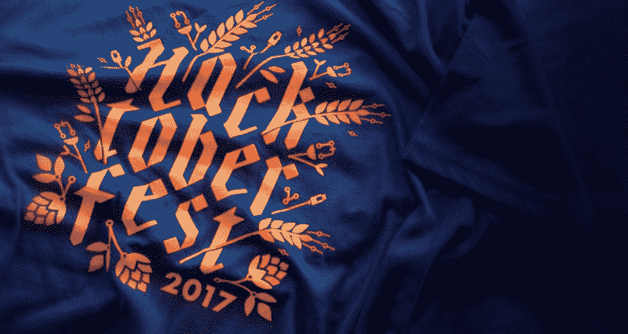
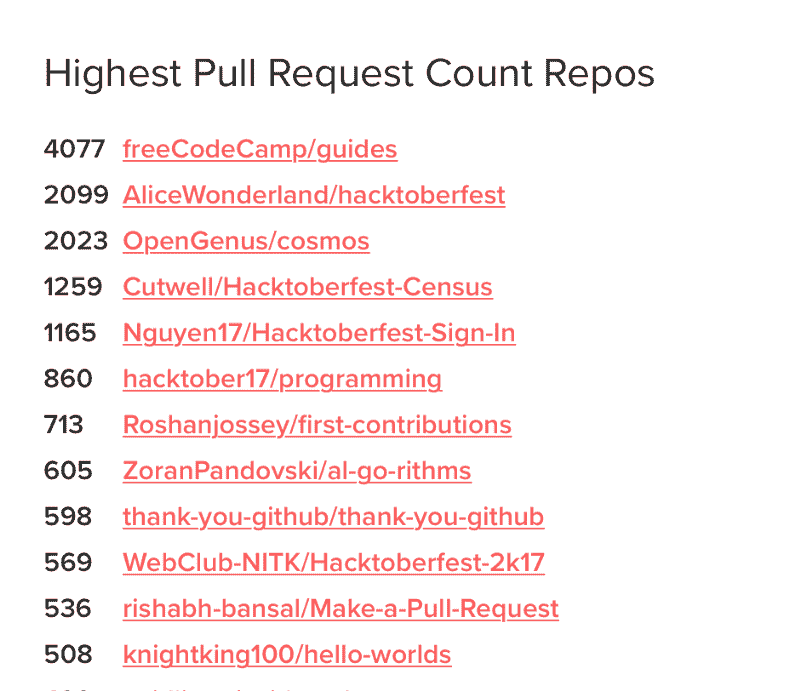
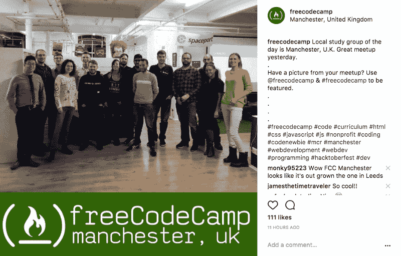
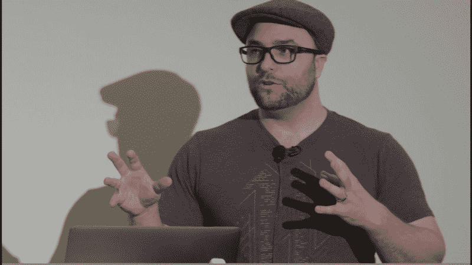

# Hacktoberfest 和其他有趣的事情将于本周末在 freeCodeCamp 举行

> 原文：<https://www.freecodecamp.org/news/a-weekend-update-from-the-freecodecamp-community-38b4dd0dc8d3/>

本月早些时候，freeCodeCamp 社区迎来了 3 岁生日。在这么短的时间内，我们已经从一个小网站成长为一个全球学习社区。

2017 年到目前为止，数百万人已经使用了[freeCodeCamp.org](https://fcc.im/2yWAUeL)，其中数千人现在已经获得了他们作为开发者的第一份工作。

这里有一些社区正在做的有趣的事情。

### Hacktoberfest 和大量的开源贡献

成千上万的露营者正在参加一年一度的黑客啤酒节。这是一个为开源项目贡献代码的机会，并在此过程中获得免费的衬衫和贴纸。

到目前为止，Hacktoberfest 的参与者已经通过开放 GitHub pull 请求为开源项目贡献了 18 万个代码。其中超过 4000 人去过 freeCodeCamp 的新[指南项目](https://fcc.im/2yPFRUg)。

These numbers come from [the official Hacktoberfest statistics website](https://hacktoberfest.digitalocean.com/stats).

还有时间加入 Hacktoberfest 的乐趣。我已经写了[这篇 5 分钟的指南](https://fcc.im/2hZSuEz)，告诉你如何参与，如何为开源做贡献，如何赢得你的衬衫。

### freeCodeCamp 现已登陆 Instagram

如果你的手机上有 Instagram，[关注那里的 freeCodeCamp 社区](https://fcc.im/2heLvrz)。

我们发布的照片来自:

*   世界各地的自由代码营学习小组
*   黑客马拉松
*   黑客空间
*   营员建造的令人印象深刻的项目截图
*   和精致的工作站

来自利兹 freeCodeCamp 的 Richard Middleton 正在运营社区 Instagram 账户。他是一个充满激情的开发者，有着摄影的眼光。

如果你或你的朋友拍了一张很酷的照片，一定要:

1.  发布在 Instagram 上
2.  在你的照片描述中提及 [@freeCodeCamp](https://www.instagram.com/freecodecamp/)
3.  并使用 [#freecodecamp](https://fcc.im/2y8Ysxw) 标签。

我们甚至可以把它转发给整个社区，把你当作摄影师。

### 新的 freeCodeCamp 社区下拉菜单

我们在 freeCodeCamp.org 的导航菜单中添加了一个社区下拉菜单。现在你可以从平台内的任何地方快速访问[论坛](https://forum.freecodecamp.org)、[指南](https://guide.freecodecamp.org)、 [YouTube](https://youtube.com/freecodecamp) 以及社区的其他部分。

### 野营者成功的产品狩猎活动

freeCodeCamp 贡献者 Michael Deng 想要一种更好的方式来浏览顶级媒体文章，所以他建立了全球媒体排行榜。这在 Product Hunt 上大受欢迎，这是一个发布新项目的流行网站。

你可以阅读围绕他的顶级媒体故事网络应用的讨论，并在这里尝试一下。

### 如何撰写人们会真正阅读的技术博客文章

今年早些时候，我在纽约市的 Codeland 会议上做了一次演讲。几个小时前他们刚刚在 YouTube 上发布了那个演讲。在这篇文章中，我给出了一些建议，告诉你如何写人们会真正阅读的技术博客文章

### 另外三个链接值得您花时间:

1.  如何成为初级网站开发人员——这很难，但你可以做到！( [8 分钟读数](https://fcc.im/2yOd9Wr))
2.  开源许可如何工作以及如何将它们添加到您的项目中( [4 分钟阅读](https://fcc.im/2gHaK5c))
3.  想知道深度学习是如何工作的？这是给每个人的快速指南( [7 分钟阅读](https://fcc.im/2yOv1hj))

编码快乐！