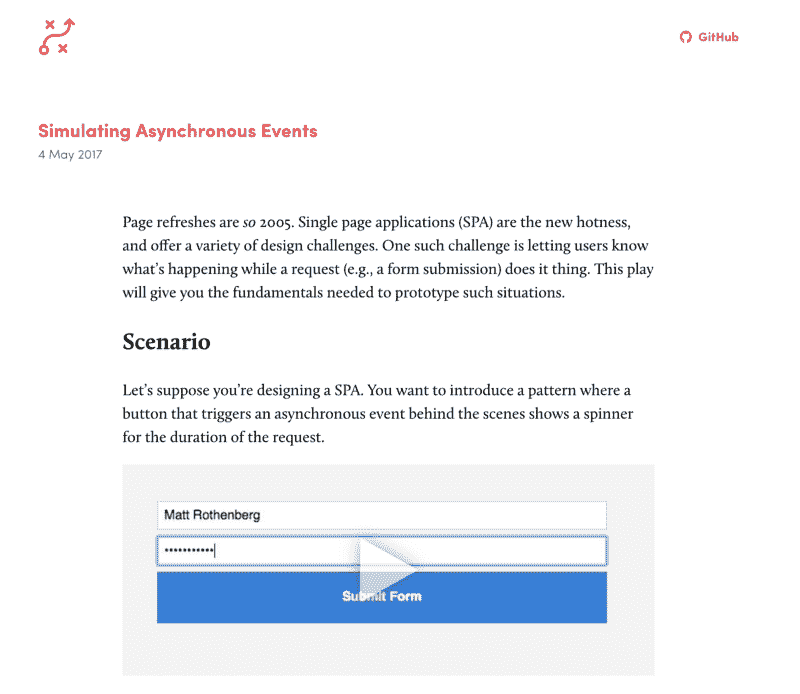

# 我写了一本剧本，帮助设计师使用真实代码构建原型

> 原文：<https://www.freecodecamp.org/news/a-winners-guide-to-prototyping-in-the-browser-95c5a161a67d/>

作者马特·罗森伯格

# 我写了一本剧本，帮助设计师使用真实代码构建原型

我已经建立了一个[原型剧本](https://mattrothenberg.github.io/prototyping-playbook/)——一个简短教程(或“剧本”)的博客，帮助设计师使用浏览器来满足他们的设计和原型需求。

Image from my [Prototyping Playbook](https://mattrothenberg.github.io/prototyping-playbook/)

随着时间的推移，我希望构建一套关于如何实现特定设计的综合文章。设计人员——尤其是前端开发的新手——如果在实现设计决策时遇到困难，可以利用这些模式。

例如:

*   我不知道如何用数据填充这个表
*   我不知道按下这个按钮后如何显示微调按钮
*   我不知道如何将这段标记转换成可以在其他地方使用和重复的“符号”

### 目标

人们通过实践学得最好。所以每个教程的目标是阐明前端开发的基本概念。

例如，当设计人员用数据填充一个表格时，他们会看到**迭代**在起作用。当设计师在按钮被按下后看到一个微调按钮时，他们瞥见了**异步事件**。当设计师将一个定制的标记变成可重用的东西时，他们通过实践学习**组件化**。

更实际的目标是成为一个友好、全面的资源，供设计师在浏览器中试验原型。

我充分意识到设计师可以利用无数的资源来提高他们的前端技能。例如，像 [CSS Tricks](https://css-tricks.com) 这样的网站有大量关于这些主题的好文章。

也就是说，我还没有找到关于这些主题的简短、易懂、实用的教程。这正是原型剧本将提供的。

### 内容模型

对于行动手册中的每个“行动”，我都创建了以下内容模型:

1.  描述要涵盖的概念的**标题**
2.  应用特定前端原型工具的**场景**
3.  预期设计决策的**低保真度模型**
4.  在普通 JavaScript (ES6)、Vue JS 和 React JS 中设计决策的引导式**实现**

### 第一期

第一期涵盖了上述三种场景。

Image from my [Prototyping Playbook](https://mattrothenberg.github.io/prototyping-playbook/)

您可以在此处查看这一期的原型剧本[。](https://mattrothenberg.github.io/prototyping-playbook/)

这仍是一项进行中的工作。我有一些挥之不去的问题:

*   如何改进内容模型？
*   这些场景是现实的、可理解的和适用的吗？
*   我们是否以非常规的方式实现了任何设计决策？

我欢迎您通过 [GitHub 问题或请求](https://github.com/mattrothenberg/prototyping-playbook/)提供反馈。

除了反馈，我还很好奇*你如何*应用这些技巧。请随意分享您目前正在开发的原型，特别是如果您已经实现并改进了行动手册中的一项技术。分享是关怀。

此外，我对剧本未来版本的建议持开放态度。其他主题可能包括:

*   使用虚假/虚拟数据
*   空状态和错误状态

黑客快乐！