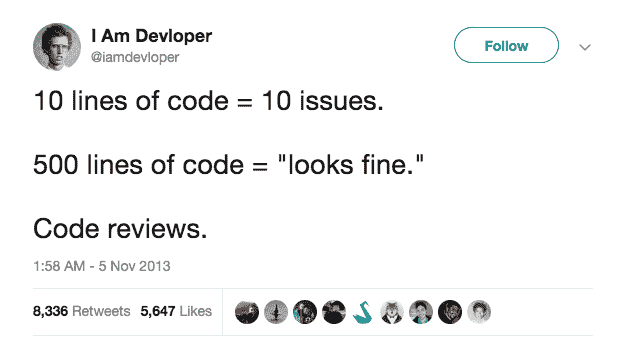
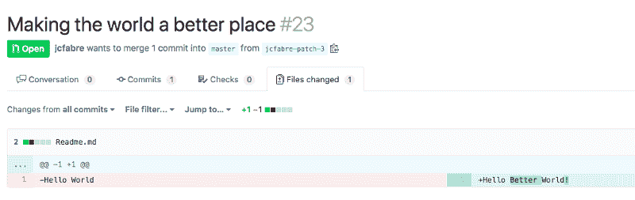
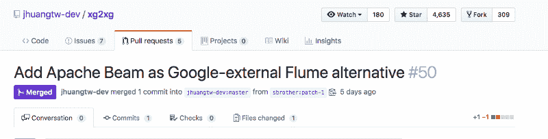
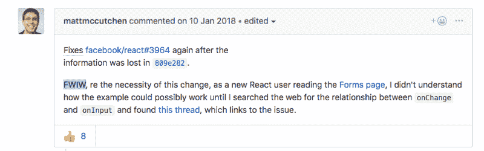
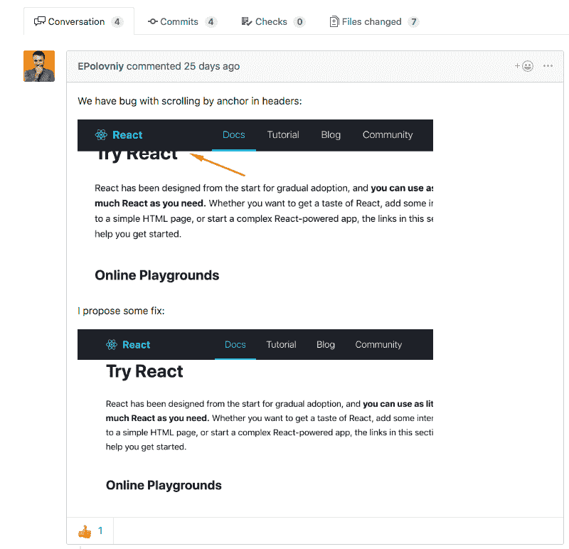
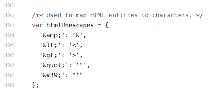
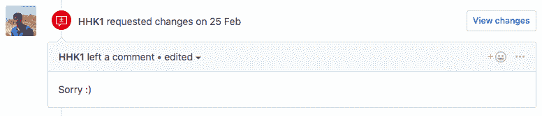
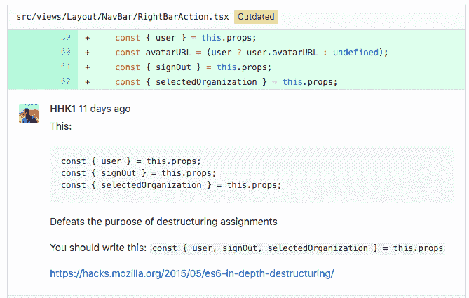
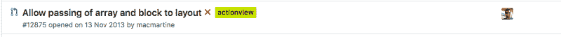
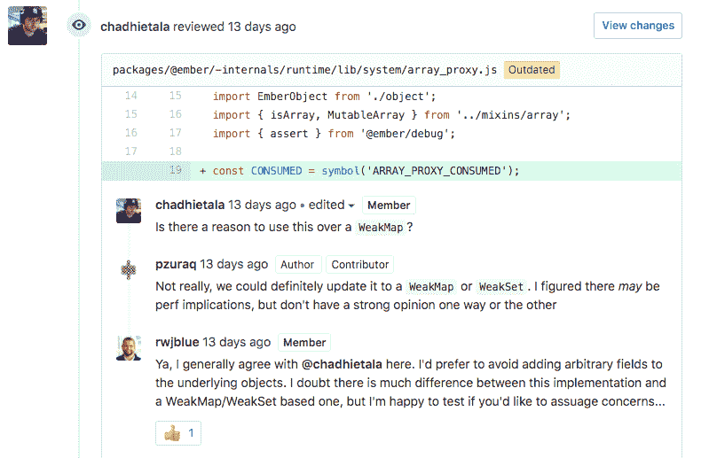

# 有效代码评审的禅宗宣言

> 原文：<https://www.freecodecamp.org/news/a-zen-manifesto-for-effective-code-reviews-e30b5c95204a/>

让-查尔斯·法布尔

# 有效代码评审的禅宗宣言

*Photo by* [@yogimadhav](http://twitter.com/yogimadhav "Twitter profile for @yogimadhav") on [Unsplash](https://unsplash.com/@yogimadhav)

当你编码时，干扰真的很糟糕。

你在状态，飞得很高，杀了它。然后嘭…开会，起立，*插入中断*…太好了！

在这种情况下，代码审查可以被视为生产率的另一个障碍。

坦白地说，我能理解。

#### 代码审查很难。

你不仅需要停止你正在做的事情，你还需要让自己沉浸在别人的代码中。仅仅是转换你的注意力就需要花费大量的精力。

#### 代码审查非常耗时。

根据 [Slack Overflow 的 2019 年调查](https://insights.stackoverflow.com/survey/2019#development-practices)显示，56.4%的开发者每周花费 4 小时或更多时间进行代码评审。它可以代表一个开发人员一周的 20%!

#### 代码审查令人沮丧。

作为一个提交者，如果你的请求被拒绝，等待几个小时甚至几天的审查，这是令人沮丧的。作为一名评审者，代码评审可能会成为一天高效工作的障碍。

是的，代码审查有时会很困难、耗时并且令人沮丧。

但这也是分享知识、防止错误、强化公司文化等的好方法。

接下来是提交者和评审者的宣言，让他们安心地进行代码评审。？

### 提交者的宣言

作为一个提交者，你可以做些什么来增加你的请求被及时批准的机会。

#### 完成后提交。

我知道这听起来很明显。但问题是——大多数情况下，如果机器不工作，不是因为它坏了……而是因为它没有插上电源！

非常小的细节会对你的工作被人如何看待产生很大的影响。并且您不希望您的同事感觉他们正在投入时间和精力来评审工作进展中的代码。

> 我:“只是少了一个！”

> 你:“是啊，我知道，但整个事情并没有工作，我花了 20 分钟才发现。”

所以你可以这么做:

*   自测你的代码。如果您还没有完成，请在标题或标签中包含 WIP。
*   自我检查你的代码。使用代码编辑器或版本控制工具的 diff 报告来捕捉错误。
*   **在指派审核人之前，确保您的配置项的测试是绿色的**，这将节省他们的时间。

*Don’t be this guy, obviously* ? (G[iphy)](https://giphy.com/)

#### 提出较小的拉取请求

我明白，这是一个大的、重要的和复杂的特性，你可能会想提交一个很长的拉取请求。然而，大多数时候，您最好提交较小的拉取请求。

代码审查耗费精力。大代码审查更多。不要在你的团队每次审查你的代码的时候，给他们强加一个**开发者对食物**的挑战。

友好点，把它切成小块。你也在帮自己一个忙:

*   你会得到更多定性的反馈。拉取请求的时间越长，每行代码收到的定性反馈就越少。保持你的拉取请求较小(也不要太小),你将会增加获得大量反馈的机会。
*   你会更快获得批准。这是一个双赢的局面，通过将你的工作分解成更小的拉动式请求，你增加了更快获得批准的机会。

*LGTM* ?

对于那些书呆子来说，这里有一个在思科编程团队中进行的[研究](https://smartbear.com/learn/code-review/best-practices-for-peer-code-review/)。它表明，在 400 LoC 之后，发现缺陷的能力急剧下降。？

下一个原则有助于控制拉取请求的大小。

#### 缩小范围

你的拉取请求的范围应该简单、独特且定义明确。那可能是一个特性，一个用户故事或者一个错误修复。

*Making the world a better place, one LoC at a time* ?

一种思考方式是，评论者的“注意力点数”是有限的(像每个人一样)。他们每关注一件事，就用 1 个积分。当他们还剩 0 的时候会发生什么？

> LGTM？

尽你所能减少你工作周围的噪音。注意评论者的注意力持续时间。

例如，**避免无效变化**(比如跳行)。它们没有增加任何价值，并且使代码审查复杂化。

类似地，如果你的拉请求改变了*行为*，不要包含对*格式*的改变。相反，如果你的拉请求改变了*格式*，不要包含影响*行为*的改变。他们可能会被审查者忽略。

#### 给出上下文

将您的拉动式请求视为新员工的文档。用上下文引导读者。

以一个**不言自明的标题开始。**

*Good title taken from the xg2xg repo* ?

然后**，写一个清晰的描述**，说明你在做什么，为什么要做。这个拉取请求的目的是什么？为什么这种改变是必要的？你是如何解决这个问题的？

*Good example of explaining why the change is necessary taken from react repo*

描述也是指出未解决问题和公开问题的好地方。审阅者可能会建议取消对您的阻止。

你在产品的可见部分工作吗？截图可以帮助你更快地表达你的观点。

*   显示之前/之后的差异。
*   使用彩色箭头。
*   如果您喜欢，可以添加屏幕录像:)

*From react repository*

最后，沿途写下**信息标志**，引导评审者通过你的推理。

保持一个干净的提交历史以使审查者更容易跟随你的步骤。使用注释指出您探索的替代方案。

*Good comment example from Lodash*

#### 欢迎反馈？

拒绝很伤人。

说实话，代码拒绝伤害更大。

I’m seeing this a lot!

没关系。别往心里去。

评论和建议是一个学习和成为更好的软件工程师的机会？

### 评论家的宣言

恭喜你走到这一步！现在让我们来看看一些原则，它们可能会帮助你成为一个更好的评论家？

#### 采取正确的心态

不存在团队可以从刻薄或傲慢的评审者那里获益的情况。**被** **种**。句号。

*What are you trying to say my friend?* ([Giphy](https://giphy.com/))

想让代码评审更精彩？

从这篇评论中寻找你可以**学到**的东西。一个新的库，一个新的方法，一个新概念，一个更简单的做事方式。你会从中提取出什么样的知识？

如果你是更有经验的开发者，你有什么可以分享的吗？您如何利用这一评审向提交者传递知识？你如何帮助他们成为更好的软件工程师？

*Thanks for the tip mate!* ?

### 如何实际进行代码审查

#### **复习什么**

我到底应该找什么？没有关于复习什么和如何复习的明确指导，很容易迷路。这里是你能做的。

首先，**检查目的**。这段代码是否完成了它应该做的事情？你对新代码的某些部分不清楚吗？提出澄清性问题。代码很容易测试吗？测试一下。如果这个方块没有被勾选，就没有必要超越。

好了，现在代码工作了，是时候关注一下**实现**了。

想想你会如何处理这个问题。你会有不同的做法吗？重构或抽象有潜力吗？这是在重新发明轮子吗？这是使用标准代码模式吗？

#### **不复习什么**

因为一段代码有改进的空间，并不总是意味着它需要改进。

在一天结束时，代码审查是质量和速度之间的权衡，根据项目的范围和阶段，让一些事情落后可能是有意义的。

同样，你不应该做可以自动化的事情。让你最喜欢的 linter 寻找丢失的分号和额外的缩进。没有必要对制表符和空格进行无休止的争论。

最后，不要扩大拉取请求的范围。如果您想到需要做的新事情，为此创建一个新的拉动式请求/任务。

#### 及时审查

至少有 3 个很好的理由在**小时内而不是几天内审查拉动式请求。**

*   提交者可以更快地转移到下一个任务
*   它降低了上下文切换成本
*   它降低了分支之间合并冲突的风险。

*Opened 6 years ago. Be right back* ?

**免责声明:**我刚刚发布了 [GitRise](https://www.gitrise.com/) ，一个帮助使用 GitHub & Slack review pull 请求的团队更快的工具。我确实认为它可以帮助解决这个问题:)

### 如何在代码评审中给出反馈？

给出反馈时，形式和内容一样重要。

你知道吗，在书面交流中，中性的内容看起来比实际情况更消极。当心这种偏见，在需要的时候加入表情符号，让你的评论语气正确。

此外，大多数时候，即使你非常确定有更好的方法来做某事，你最好还是问一个问题，而不是要求改变。另外，问题听起来不那么咄咄逼人。

*Example from ember.js repo*

最后，当事情做对时给予奖励。代码评审也是一个表扬同事出色工作的好地方。要有创意和乐趣:)

？祝贺这篇博文结束！

？非常感谢您的阅读，如果您有任何意见，请告诉我！

？我**刚刚发布了 G [itRise，](https://www.gitrise.com/)一款为使用 Slack & GitHub 的团队创建拉取请求提醒的工具。如果你愿意，就试一试。期待您的反馈。**