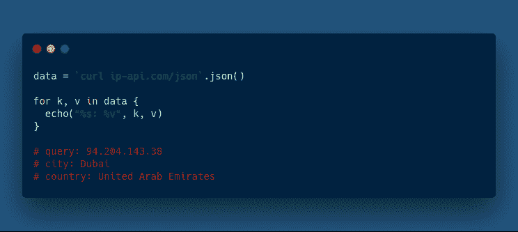

# ABS 1.1.0:为最有趣的编程语言提供更多的 Python 和 Bash

> 原文：<https://www.freecodecamp.org/news/abs-1-1-0-more-python-and-bash-for-the-most-fun-programming-language-out-there-d62806b1cf53/>

亚历克斯·纳达林

# ABS 1.1.0:为最有趣的编程语言提供更多的 Python 和 Bash

> 如果你错过了我上一篇文章中的[，ABS 是一种编程语言，它允许你用现代语法与底层系统进行交互。这是它作为 2019 年构建的 Bash 版本的一个例子。](https://medium.freecodecamp.org/introducing-abs-a-programming-language-for-shell-scripting-dfbd737d621)

在本文中，我将讨论一个全新版本的 [ABS 编程语言](https://www.abs-lang.org/)，它带来了更多您应该熟悉的语法，灵感来自 Bash 和 Python。



这个版本包括 8 个新特性和 2 个错误修复，让我们一起来发现它们吧！

### 更好的会员测试

成员测试操作符`in`现在支持查找对象是否有特定的键，并允许它在字符串中查找子字符串:

```
some in {"some": "thing"} # TRUEsome in {} # FALSE
```

```
"str" in "string" # TRUE"hello" in "string" # FALSE
```

随着对`in`的这些改变，我们现在放弃了`set.includes(member)`函数:

```
"string".contains("str")[1, 2, 3].contains(2)
```

该函数将继续工作，但再次被否决。我们可能不会在未来的版本中删除它(即使是主要版本),但是……我已经警告过你了！

### 1 ~ 1.1

相似性运算符`~`现在支持数字:

```
1 ~ 1.23 # TRUE1 ~ 0.99 # FALSE
```

如果它们的整数转换相同，数字将是相似的。这是对以下内容的简写:

```
1.int() == 1.23.int() # TRUE1.int() ~ 0.99.int() # FALSE
```

### 为..在

我们对`for .. in`做了一些改动，让它更有用，因为你现在可以遍历散列:

```
for k, v in {"some": "thing"} {    # k is some     # v is thing }
```

### 更多的破坏

我们在 ABS 稳定之前引入了析构[，](https://github.com/abs-lang/abs/releases/tag/preview-2)[在 1.0](https://github.com/abs-lang/abs/releases/tag/preview-3) 之前更新了它，现在我们已经扩展到能够析构散列:

```
some, thing = {"some": 1, "thing": 1}some + thing # 2
```

### 反斜杠命令

这个版本中我最喜欢的特性是能够使用反斜杠 shell 语法执行命令:

```
`ls -la`
```

```
# previously you could only do$(ls -la)
```

`$()`语法有一些限制(也就是说，一个命令需要在它自己的行上),这些限制在反斜线中不再存在。现在，您可以执行以下操作:

```
if `somecommand`.ok {    ...do something...}
```

```
# This is not possible, $() needs its own line$(somecommand).ok
```

与`$()`相同的插值风格也适用于反斜线:

```
arg = "-la"`ls $arg`
```

### 睡眠(毫秒)

嗯…每种语言都有一个！

现在，您可以通过休眠一定的毫秒数来暂停脚本的执行:

```
echo("This will be printed immediately")sleep(10000)echo("This will be printed in 10s")
```

### 散列内置函数

在这个版本中，我们为哈希添加了许多新的内置功能:

```
hash = {"a": 1, "b": 2, "c": 3}
```

```
hash.keys() # ["a", "b", "c"]hash.values() # [1, 2, 3]hash.items() # [["a", 1], ["b", 2], ["c", 3]]hash.pop(a) # hash is now {"b": 2, "c": 3}
```

### 零比较

在 ABS 1.0.0 中，我们引入了一个会使空值比较失败的错误:

```
null == null # FALSE
```

在 1.2.0 中我们修复了它(并将其反向移植到 [1.0.2](https://github.com/abs-lang/abs/releases/tag/1.0.2) )。

### 索引分配

分配给散列/数组的索引现在可以工作了:

```
array = []array[0] = 1 # array is now [1]array[5] = 1 # array is now [1, null, null, null, null, 1]
```

```
hash = {}hash.x = 1 # hash is now {"x": 1}
```

### 你还在等什么？

```
bash <(curl https://www.abs-lang.org/installer.sh)
```

…开始编写脚本，就像现在是 2019 年一样！

PS:再次感谢 Erich，他一路上都在帮助我，在过去的几周里，他已经成为团队中至关重要的一员。只是想确保他的名字被提及，因为如果没有他，大多数事情都不可能发生！

PPS: [1.2.0 已经在进行中](https://github.com/abs-lang/abs/milestone/9) —预计在接下来的 2 到 3 周内发布。我们将推出非常有趣的功能，如后台命令和 REPL 历史，所以这将是一个令人兴奋的版本！

*最初发表于[odino.org](https://odino.org/abs-1-dot-1-0-released-a-bit-more-of-python-and-a-bit-more-of-bash-for-the-most-programming-language-out-there/)。*
*你可以在[推特](https://twitter.com/_odino_)上关注我——欢迎吐槽！*？