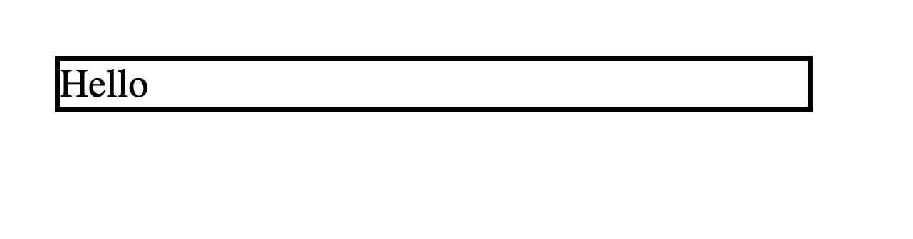
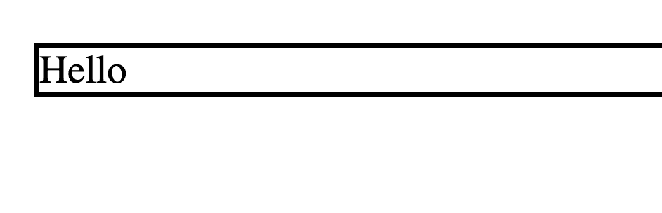
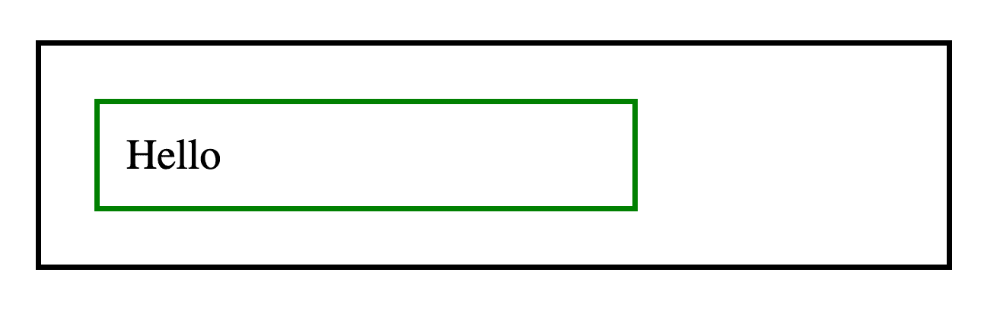
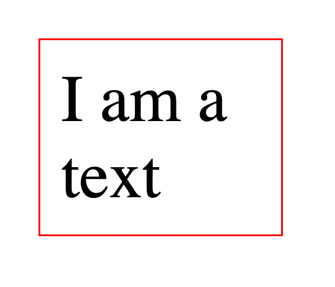
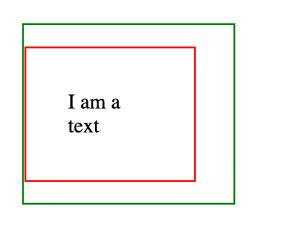

# CSS 中的绝对和相对单位是什么？举例说明

> 原文：<https://www.freecodecamp.org/news/absolute-and-relative-css-units/>

在 CSS 中，我们将度量单位分为绝对单位和相对单位。在本文中，我将解释这些类别是什么，并举例说明每个类别下的单元。

## CSS 测量单位

您可以在 CSS 中使用不同的度量单位。您可以将这些单位与长度或大小值一起使用，并且它们可以与诸如`font-size`、`width`、`border-width`、`padding`等等属性相关联。

使用`font-size`时，指定字体大小的值。

您还可以为元素的`width`指定一个长度。

通过填充，您可以指定长度。

这些值的单位有助于 CSS 理解它们的元素在屏幕上应该有多长或多大。正如我在文章开头提到的，我们可以将这些值分为绝对**单位和相对**单位。****

## 什么是绝对单位？

绝对单位指定固定的长度值。无论屏幕的宽度或高度如何变化，该值都将保持不变。

属于这一类别的单位包括:

`mm`(毫米)
`cm`(厘米):10mm 做 1cm
`in`(英寸):2.54cm 做 1in
`pt`(点):1/72in 做 1pt
`pc`(十二点活字)12pt 做 1pc
`px`(像素)0.75pt 做 1px

对于打印文档等高分辨率介质，建议您使用`cm`、`mm`或`pt`。对于网页，`px`是推荐单位。

这里有一个例子:

```
<div>Hello</div> 
```

和 CSS:

```
div {
  border: 2px solid black;
  width: 300px;
} 
```

全屏显示，结果如下:



当屏幕变小时，`div`仍然保持`300px`的宽度，因为它是一个固定值:



块的宽度与任何东西都没有关系，所以不管其他大小的变化，DOM 仍然会尽可能地保持这个`300px`宽度。

## 什么是相对单位？

与绝对单位不同，相对单位不是固定的。它们的值是相对于另一个值的。这意味着当其他值改变时，相对单位值也会改变。

属于这一类的单位有:
`%`(百分比):相对于父元素
`em`(字体大小):相对于字体
`rem`(根`em`):相对于根元素
`vw`的字体大小(视口宽度):相对于视口宽度
`vh`(视口高度):相对于视口高度

您可以看到这些单位的值与另一个值的关系。这里有一个例子:

```
<div class='container'>
    <div class='card'>
        Hello
    </div>
</div> 
```

和 CSS:

```
.container {
  width: 300px;
  border: 2px solid black;
  padding: 20px;
}

.card {
  width: 60%;
  border: 2px solid green;
  padding: 10px;
} 
```

结果是:



从上面你看到`.container` div 是`300px`(固定)。但是`.card` div 是`60%`宽度，这意味着其父元素宽度的`60%`。所以你有 300px 的 60%的**，这导致`.card` div 的宽度为`180px`。**

 **如果`.container`格的宽度发生变化，`.card`格也会发生变化。

下面是另一个使用`vw`的例子:

```
.container {
  width: 100vw;
  background-color: blue;
  padding: 10px;
}

.card {
  width: 80vw;
  height: 100vh;
  background-color: red;
} 
```

结果如下:


在这里，你可以看到`.container` div 是`100vw`宽度，这意味着 100%的视口宽度。`.card` div 是`80vw`宽度和`90vh`高度，也就是 80%的视口宽度和 90%的视口高度。

当您缩小视窗大小时，这些相对值将会调整:


这里，我减小了视口的宽度和高度，因此应用于`.container`和`.card`的相对值也被调整。

`em`单元有两种含义:在排版的上下文中，它表示相对于父元素字体大小的**，在宽度和高度等大小属性的上下文中，它表示相对于当前元素字体大小**的**。**

让我们看一个例子:

```
<div class='container'>
    <p class='text'>I am a text</p>
</div> 
```

和 CSS:

```
.container {
  font-size: 16px;
}

.text {
  font-size: 2em;
  width: 3em;
  border: 1px solid red;
  padding: 10px;
} 
```

结果如下:



我会解释在上面的结果中发生了什么。

这个`.container` div 有一个`16px`的`font-size`。

这个`.text` p 有一个`2em`的`font-size`。既然这是排版，就表示“**字号是父字号的 2 倍**，所以是`32px`。

p 标签也有一个`3em`的`width`。因为这个属性不属于排版，它意味着“**宽度是元素本身字体大小的 3 倍**”。`font-size`是`32px`，所以`width`会是`96px`。

另一方面，`rem`在这两个上下文中，相对于根元素的字体大小，表示“**”。这里有一个例子:**

```
<div class='container'>
    <p class='text'>I am a text</p>
</div> 
```

和 CSS:

```
html {
  font-size: 20px;
}

.container {
  width: 5rem;
  border: 1px solid green;
}

.text {
  font-size: 0.5rem;
  width: 2rem;
  padding: 1rem;
  border: 1px solid red;
} 
```

结果如下:



根元素有一个`20px`的`font-size`。以下是 CSS 中相对单位的计算:

*   `.container` div 有一个`5rem`的`width`是**的 5 倍 20px** 那就是 **100px**
*   `.text` p 有一个:
    *   `0.5rem`的`font-size`是**20px 的 1/2**那个是 **10px**
    *   `2rem`的`width`是**的 2 倍 20px** 那是**的 40px**
    *   `1rem`的`padding`是**的 1 乘以 20px** 那是**的 20px**

## 包扎

单位是 CSS 中的一个度量值，它帮助 CSS 确定哪些长度/大小值将应用于基于大小的属性。

在这篇文章中，我们看了两类单位，绝对单位**和相对单位**。****

 ****概括地说，**绝对**单位用于固定值。无论周围元素或视口的大小如何变化，这些值都不会改变。

**相对**单位，另一方面，用于相对于或依赖于其他元素(通常是父元素、视口或根元素)值的值。

感谢您的阅读！******