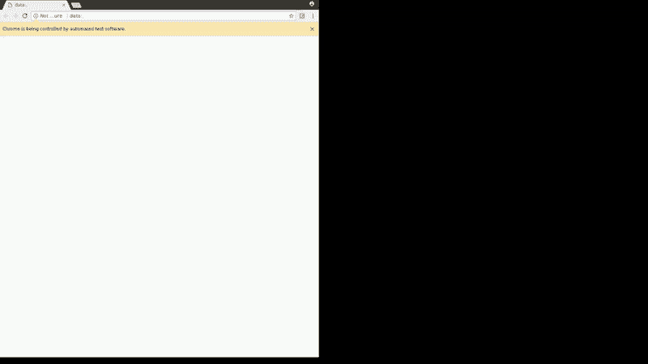

# 验收测试是美丽的魔法。以下是它如何改善你的生活。

> 原文：<https://www.freecodecamp.org/news/acceptance-testing-is-beautiful-magic-heres-how-it-can-improve-your-life-41759775d19d/>

托德·查菲

# 验收测试是美丽的魔法。以下是它如何改善你的生活。


更准确地说，**自动化**浏览器中的验收测试是美丽的魔法。

事实上，我真正想说的是，自动化验收测试可能会导致在晚餐时与你的朋友讨论你最喜欢的黑比诺葡萄酒的完美口感。我保证在这篇短文结束时，这一切都会变得有意义。

回到**美丽魔法**。

### 关于自动化验收测试的一点信息

每个程序员第一次看到自动化浏览器测试时都喜欢它。我见过疲惫的程序员，不容易被打动，他们第一次看到它时会开心地大笑。我承认我第一次笑了。当你开始测试时，你的浏览器会打开，然后，不做任何其他事情，看起来就像有人在点击和做一些事情。



All your browser are belong to us

它是如此令人毛骨悚然或有趣或迷人，以至于 Chrome 觉得有必要在浏览器顶部弹出一个警告:“Chrome 正被自动化测试软件控制。”我想这是为了澄清它不是鬼或机器人？反正就叫机器人吧。但是不管它最初看起来有多酷(即使你对我的动画 GIF 没有印象)，那甚至不是我所说的那种美丽的魔法。

作为一名终身程序员，我最关心的是让我们在工作中做得更好的美丽魔法。在我试图向你推销自动化**验收**测试的好处之前，让我们快速地把它放在上下文中。当涉及到软件时，有许多类型的测试。对测试进行分类的一个经典方法是根据测试覆盖了多少软件:

**单元测试** —测试源代码的最小可能单元，通常是函数或方法

集成测试(Integration testing)——通过检查单元在相互调用时的协同工作情况来构建单元测试

**验收测试** —从用户的角度测试一切正常

你可以用困难的方式进行验收测试。首先，程序员点击整个网站，进行数十次或数百次人工测试。然后客户——付钱给你的人——经历同样痛苦和耗时的工作(当然会错过一些事情)。这将我们从美丽的魔法引向一个谜:

为什么那些拿着自动化工作报酬的人会一遍又一遍地手工做一些机器人能做得更快的事情？

我不想试图解开这个谜。相反，我想告诉你一个小故事，关于自动化验收测试可以给你的编程生活带来的各种美丽的魔法。

### 通过自动化验收测试让 freeCodeCamp 变得更好

freeCodeCamp 的测试版对学习如何编码的人有一些令人印象深刻的改进。一个是允许学生点击一个按钮，并验证他们的项目作业的功能。你在上面的动画 GIF 中看到一个机器人点击了那个按钮。一旦学生项目中的所有功能都正常工作，按钮就会变成绿色。它为学生提供了价值，因为当他们点击然后看到绿灯时，他们可以确信他们完成了项目。

感谢[彼得·温伯格](https://github.com/no-stack-dub-sack)、[阿尼斯·努伊拉](https://github.com/Weezlo)、[特蕾西·布什曼](https://github.com/tbushman)、[克里斯蒂安·保罗](https://github.com/Christian-Paul)、[肖恩·史密斯](https://github.com/bonham000)、[安德烈·阿隆佐](https://github.com/paycoguy)和[其他](https://github.com/freeCodeCamp/testable-projects-fcc/graphs/contributors)的辛勤工作，我们为 freeCodeCamp[beta 版](http://beta.freecodecamp.com/en/)的 15 个项目任务提供了这个功能。你可以在 CodePen 看到每个项目的例子，甚至可以自己手动运行测试。

这个特性是一种测试，但不是我们所说的那种测试。所以为了避免混淆，我们还是继续称之为特性吧。该功能有一个 web 用户界面，学生可以像使用任何其他网站上的任何功能一样使用它。必须有人编写 UI 代码。对于每个指定的学生项目，有人必须编写一套单独的代码来描述该项目的独特功能。你可以在 GitHub repo 上看到所有的代码[(如果你想帮助我们改进这个特性，请考虑志愿服务)。](https://github.com/freeCodeCamp/testable-projects-fcc)

每个贡献者也有责任确保这个特性对成千上万最终将使用它的自由代码营学生有用。它是一个制作功能，像其他网站功能一样存在于网络上。

精明的程序员应该已经明白了我的方向:为这个特性编写自动化的验收测试。是的，这个特性是一个测试，所以我们正在测试测试。这听起来是不是像**过度测试**？不是的。只要某个地方的最终用户将在 web 上使用您的功能，就有很好的理由自动化该功能的测试。即使特性本身是一种测试。够了 meta，我们继续。

当我加入提供这个特性的项目时，我和其他志愿者被要求修复学生发现的一些 bug。

我愉快地转载了第一期，开始编码。我很快修复了第一个 bug，然后就到了测试我的解决方案的时候了。啊，痛啊！沮丧中被扯下的头发！我花了太多的时间！这是我的过程:

1.  为我刚刚修复的测试派生示例 CodePen 项目。
2.  更改 Javascript 设置，使用我的本地包，而不是 CDN。
3.  这里省略了一些其他手动步骤，如更改 CodePen 视图和刷新项目…你在这个故事开头的 GIF 里看到的都是。
4.  单击“运行测试”按钮。
5.  等待测试完成，并检查测试是否成功。
6.  这是最糟糕的部分:**回到第 2 步，对其他 14 个 CodePen 示例项目重复这个步骤！**

如果在任何时候，您发现并修复了代码中的另一个问题，您需要重复整个过程。

我花了大约十分钟来复制和修复我的第一个问题。还有近一个小时无聊的点击测试我的修改，确保我的修复没有破坏其他东西。我知道这不能再继续下去了。我不想让它继续下去。

它是不可扩展的，我们希望添加更多的 camper 项目，并最终支持更多像 Angular 这样的框架。我们还想确保该功能能在所有现代浏览器和操作系统上运行——我只在装有 Chrome 的 Linux 上测试过。我是否需要招募另一名志愿者花一个小时的时间在 Mac 上进行测试？Windows 呢？

感觉测试过程会让项目成为志愿者的一次糟糕经历。对我来说这已经是一次糟糕的经历了。几乎没有时间花在真正有趣的部分:编程上。所以我回到了有趣的部分，编写了一个程序来使用 Selenium 自动化验收测试。

下面是我们用 Selenium 实现自动化后的测试流程:

```
npm test
```

就是这样。您可以立即返回编程(或者您喜欢的任何东西，而不是手工测试的繁重工作)，并在四分钟后回来查看是否所有的测试都通过了。长达一小时的手动流程缩短至四分钟。机器人可以很快。

### 美丽的魔法

我从自动化验收测试中得到的第一件事是有更多的时间去做我真正喜欢的事情 *。*由于从我的故事中可能看不出来，这里列出了一些你可以从自动化你的验收测试中得到的其他美丽的魔法。


Ensure every PR passes all tests

1.  它是可重复的。一个机器人**永远不会** 忘记任何一项测试。
2.  如果你做对了，应该会比手工测试快很多。关于这一点的更多信息，请点击本文末尾的链接。
3.  GitHub 允许您在创建 pull 请求时，在持续集成服务器上自动运行测试。你可以确保每个 PR 在合并前都通过测试。[这里有一个链接，链接到我们的一个 PRs 的 Travis CI 测试的输出](https://travis-ci.org/freeCodeCamp/testable-projects-fcc/builds/258281930?utm_source=github_status&utm_medium=notification)。
4.  它是可扩展的。随着项目越做越大，测试的时间也越来越多。你能想象手动测试亚马逊网站的所有功能吗？
5.  这是免费的文档。您的源代码是应该执行的每个测试的列表。测试套件的输出还提供了一个人类可读的列表，列出了执行了哪些测试(参见上面第 3 点的 Travis CI 输出)。
6.  您可以涵盖更多的配置。一个测试人员通常可以访问一两个操作系统和几个浏览器(最多)。也许是几部不同的手机。有了自动化测试，你可以在数百种操作系统、手机和浏览器版本的组合上运行测试。

最后一个好处。让我们想象一下，一个客户在周五晚上**打电话给你，你正准备坐下来和朋友**一起吃饭。你接电话是个错误，因为那是你更好的客户之一。他们迫切需要修改一行代码来修复周末大拍卖中的一些小问题。这很容易修理，所以你五分钟就能搞定。现在您有两个选择(我不包括不测试您的更改的不明智的“选择”):

1.  你是否经历过**至少一个小时的**过程，手动测试网站上的每个功能，以确保你的修复没有破坏任何东西？为了不让你的朋友等你，你会错过哪些考试？
2.  或者你输入`npm test`然后让一个机器人接管，这样你就可以回到你朋友的公司，他们刚刚开了一瓶你最喜欢的黑皮诺？百分百确信你没有弄坏任何东西，你的周末就可以开始了(同时你的客户的大买卖让他们赚了一大笔钱)。

如果这不是美丽的魔法——我确实承诺并提供了葡萄酒——那么您可能永远不会被说服去尝试自动化验收测试。

如果您想了解更多关于如何使您的自动化测试可靠而快速的信息，请查看我关于[可靠的 Selenium NodeJS 测试](https://medium.com/@tchaffee/reliable-selenium-nodejs-tests-c3fdafdca2a9)的文章。不包括葡萄酒。

你喜欢这篇文章吗？如果是这样，给我一些掌声，让更多的人看到它。谢谢！