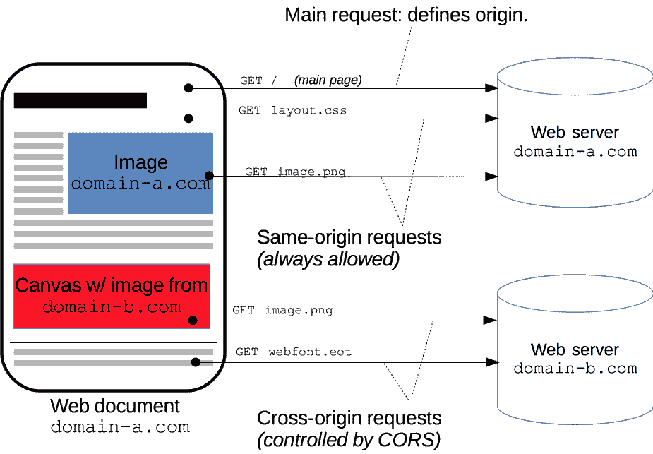
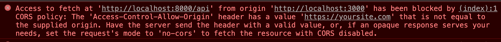

# 用 CORS 的例子解释了访问控制允许起源报头

> 原文：<https://www.freecodecamp.org/news/access-control-allow-origin-header-explained/>

调用 API 时，您经常会在控制台中看到如下所示的错误:

```
 Access to fetch at 'http://somesite.com' from origin 'http://yoursite.com' has been blocked by CORS policy: The 'Access-Control-Allow-Origin' header has a value that is not equal to the supplied origin 
```

在这篇文章中，我们将学习为什么会出现这个错误，以及如何修复它。

## 什么是`Access-Control-Allow-Origin`头？

`Access-Control-Allow-Origin`是一个 CORS 头球。CORS，或跨源资源共享，是浏览器允许在源 A 运行的站点向源 b 请求资源的一种机制

Origin 不仅仅是主机名，而是端口、主机名和方案的组合，比如- `http://mysite.example.com:8080/`

这里有一个例子来说明这一点

1.  我有一个原点 A: `http://mysite.com`，我想从原点 B: `http://yoursite.com`获取资源。
2.  为了保护您的安全，浏览器将不允许我访问 yoursite.com 的资源，并将阻止我的请求。
3.  为了允许 origin A 访问您的资源，您的 origin B 需要让浏览器知道我可以从您的 origin 获取资源。

下面是 Mozilla Developer Network 的一个例子，很好地解释了这一点:



在 CORS 的帮助下，浏览器允许 origins 互相共享资源。

有几个[头](https://developer.mozilla.org/en-US/docs/Web/HTTP/CORS#The_HTTP_response_headers)允许跨源共享资源，但最主要的是`Access-Control-Allow-Origin`。这告诉浏览器什么来源被允许从这个服务器接收请求。

## 谁需要设置`Access-Control-Allow-Origin`？

为了理解谁需要设置这个头，考虑这样一个场景:您正在浏览一个用于查看和收听歌曲的网站。该网站试图在后台恶意连接到您的银行。

那么最终谁有能力阻止这个恶意网站从银行窃取你的数据呢？银行！因此，银行需要通过设置`Access-Control-Allow-Origin`头作为响应的一部分来保护其资源。

请记住:负责提供资源的源需要设置这个头。

## 如何使用以及何时传递该标头

以下是您可以设置的值的示例:

1.  `Access-Control-Allow-Origin : *`:允许任意原点。
2.  仅允许来自 mysite.com 的请求。

## 看看它的实际效果

让我们看一个例子。你可以在我的 GitHub repo 上查看这个代码[。](https://github.com/shrutikapoor08/blogs/tree/master/code-examples/CORS)

我们将在原点 A `http://localhost:8000`上构建一个服务器，它将发送一串`Hello`到一个`api`端点。我们将通过在源 B `http://localhost:3000`上创建一个客户机来调用这个端点，然后使用 fetch 来请求资源。我们期望在原点 b 的浏览器控制台中看到由原点 A 传递的字符串`Hello`

假设我们在`http://localhost:8000`上有一个起点，它在`/api`端点上提供这个资源。服务器发送一个带有标题`Access-Control-Allow-Origin`的响应。

```
const express = require("express");

const app = express();
const port = process.env.SERVER_PORT || 8000;

// Add Access Control Allow Origin headers
app.use((req, res, next) => {
  res.setHeader("Access-Control-Allow-Origin", "https://yoursite.com");
  res.header(
    "Access-Control-Allow-Headers",
    "Origin, X-Requested-With, Content-Type, Accept"
  );
  next();
});

app.get("/api", (req, res) => {
  res.json("Hello");
});

app.listen(port, () => console.log(`Listening on port ${port}`)); 
```

在客户端，您可以像这样通过调用`fetch`来调用这个端点:

```
fetch('http://localhost:8000/api')
.then(res => res.json())
.then(res => console.log(res)); 
```

现在打开你的浏览器控制台看看结果。
由于标题当前设置为仅允许来自`https://yoursite.com`的访问，浏览器将阻止对资源的访问，您将在控制台中看到一个错误。



现在，要解决这个问题，请将标题更改为:

```
 res.setHeader("Access-Control-Allow-Origin", "*"); 
```

检查您的浏览器控制台，现在您将能够看到字符串`Hello`。

### 对我的更多教程和 JSBytes 感兴趣？。