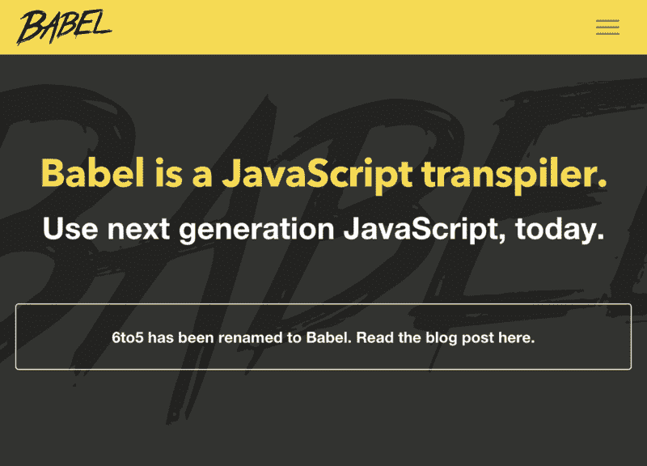
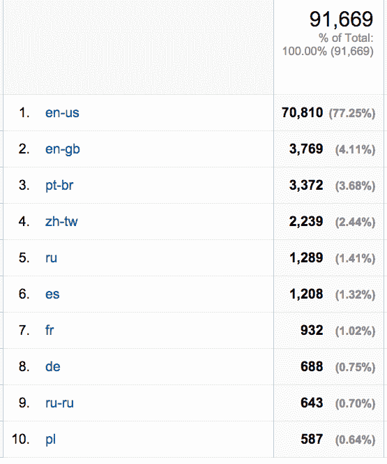
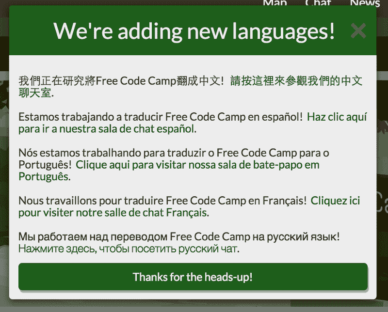
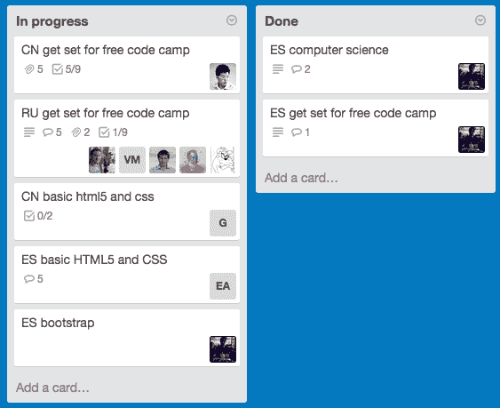
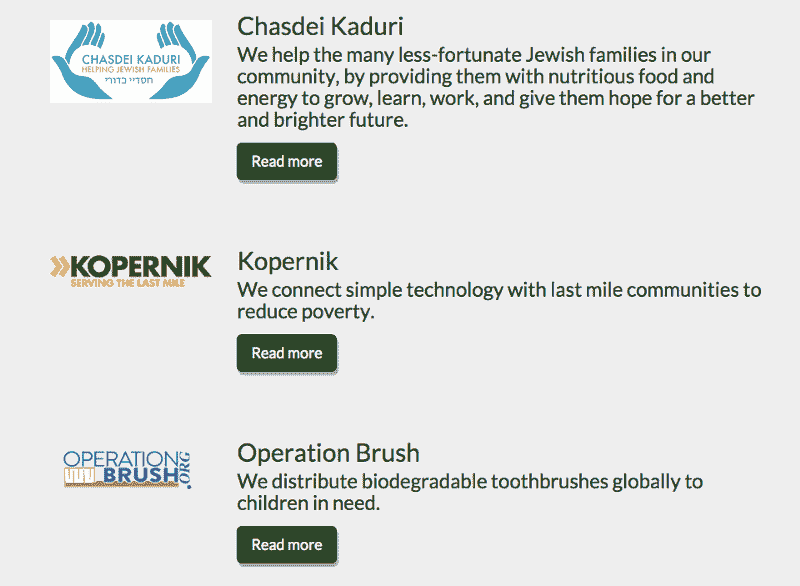

# 承认巴别塔

> 原文：<https://www.freecodecamp.org/news/acknowledging-the-tower-of-babel-3ed6328675b/>

由免费代码营

# 承认巴别塔

*注:这篇文章最初发表在 2015 年 5 月我们现已停刊的博客上。*

本文不是关于 Babel，ECMAscript 6 transpiler(我们对此也很兴奋)。

是关于这个巴别塔，以及它对全球社区的影响:

Marten van Valckenborch’s Tower of Babel

当我们七个月前开始我们的开源社区时，几乎每个人都来自英语国家。这种情况正在改变:

Native Languages of visitors to Free Code Camp over the past 30 days.

即使非英语母语者继续坚持我们的课程，他们在我们的 Slack 和 Twitch.tv 频道中的代表性不足。这让我们思考我们是否应该保持只使用英语的自由代码营，或者打开世界上所有语言的闸门。

#### 支持只说英语的一些理由:

*   英语是国际商业语言。如果不懂一点英语，作为一名软件工程师是很难成功的。
*   每个人都在中学学英语。有些国家甚至要求在小学就进行英语教育。
*   通过强迫我们的营员用英语交流，我们给了他们练习英语的机会和提高英语的动力。

#### 纯英语不是最佳选择的一些实际原因

*   我们营员大部分都是 25+岁，英语可能在他们上中学的时候还没有强制要求。
*   学习用外语编写代码有点像学习射箭，同时你也在学习骑马。有些东西串行学习比并行学习更好——比如英语和编码。
*   人们放弃学习编码的最大原因是缺乏信心。人们放弃学习语言的最大原因是缺乏信心。当你把这两种令人羞愧的努力的压力加在一起时，流失率就会飙升。

在学习英语的同时学习编码有点像在学习骑马的同时学习射箭:令人沮丧且不必要的困难。

#### 我们的社区以无障碍为荣

*   我们是自定步调的，这样忙碌的父母可以在生活碍事时暂停一下。
*   我们是基于浏览器的，所以我们的露营者在 200 美元的 Chrome 书籍或公共图书馆电脑上工作仍然可以获得完整的体验。
*   我们努力让我们的聋人营员能够接触到我们。甚至我们的盲人露营者。

#### 是时候解决最大的无障碍问题了:语言

口头上说说语言的可及性是很容易的。任何社区都可以加入一个国际化包并访问谷歌翻译。但这还不够。我们太关心我们的营员在自由代码营的体验，以至于让他们对计算机翻译挠头。因此，今天，我们宣布由我们社区的志愿者在全球范围内将我们的课程翻译成几种主要的世界语言。

Our multilingual announcement.

我们的志愿者社区正在努力将我们的开源课程翻译成中文、西班牙文、葡萄牙文、俄文和法文。我们还创建了特定语言的松弛频道。

We’re using Trello boards and GitHub Pull Requests to coordinate the translation effort.

我们的目标是让营员更容易专注于学习编码，并以他们自己母语的亲密度与他人联系。

#### 跨国非营利项目将如何运作？

我们很高兴地报告，我们的几个非营利项目已经有了非英语母语的参与者。即使开发人员、项目经理或非营利利益相关者后来学习了英语，我们仍然能够完全用英语进行会议和结对编程。

这些项目将继续只提供英文版本。

Some of our international Nonprofit Projects.

不可否认英语的重要性。但是将自由代码营作为一个纯英语社区是错误的。对于露营者来说，开始学习用他们自己的语言编写代码，然后逐渐进入我们更大的英语社区，这要有效得多。如果你有兴趣帮助我们完成这项巨大的翻译任务，来[和我们一起学习编码](http://freecodecamp.com/)。